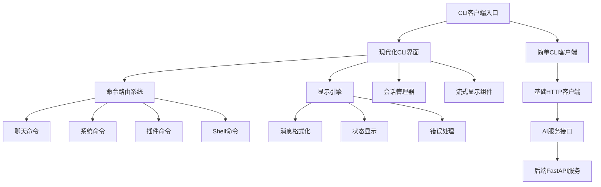
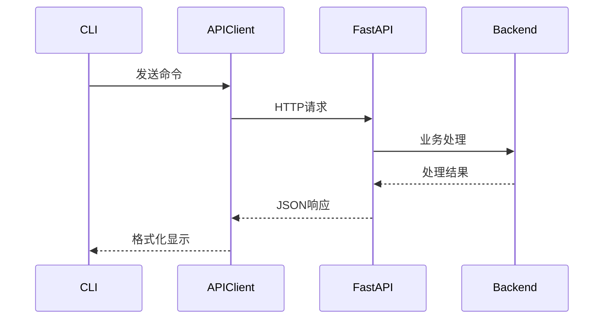
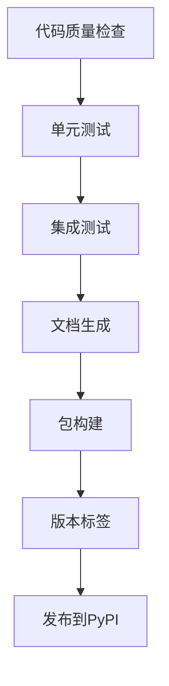
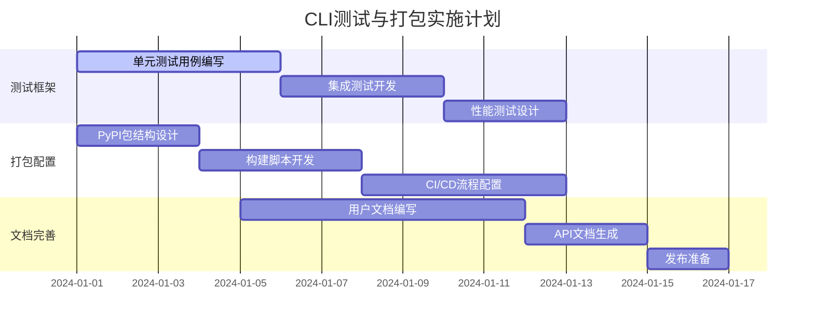

# CLI测试与打包设计文档

## 概述

AI Assistant项目需要完善CLI功能的测试机制和打包分发方案。本设计文档涵盖CLI客户端的功能测试、自动化测试套件、打包配置和使用文档完善等方面。

## 技术架构

### CLI模块架构



### CLI客户端类型

| 客户端类型 | 功能特点 | 适用场景 |
|------------|----------|----------|
| 现代化CLI (`ui/cli/modern_cli.py`) | Rich/Textual界面，流式显示，会话管理 | 日常交互使用 |
| 简单CLI (`cli_client.py`) | 基础功能，轻量级 | 脚本集成，测试 |
| 启动器 (`start_cli.py`) | 最小化实现，快速启动 | 演示，调试 |

## CLI测试策略

### 单元测试

#### 命令路由测试


**测试用例设计：**
- 聊天命令测试：验证消息发送和响应处理
- 系统命令测试：验证状态查询、插件列表等
- Shell命令测试：验证bash/zsh/fish命令执行
- 元命令测试：验证help、exit、clear等功能
- 错误处理测试：验证无效命令、网络错误等场景

#### 显示引擎测试

**测试范围：**
- 消息格式化：用户消息、AI响应、系统状态
- 流式显示：实时进度指示、token统计
- 表格显示：插件列表、系统状态表格
- 错误展示：错误消息格式化和样式

#### 会话管理测试

**测试内容：**
- 会话创建和销毁
- 会话状态持久化
- 多会话管理
- 会话清理机制

### 集成测试

#### API交互测试



**测试场景：**
- 聊天API调用：普通聊天、流式聊天
- 系统API调用：状态查询、健康检查
- 插件API调用：插件列表、能力查询
- 错误场景：网络异常、服务不可用
- 超时处理：长时间响应、连接超时

#### 端到端测试

**完整流程验证：**
1. CLI启动和初始化
2. 服务连接和健康检查
3. 用户交互流程
4. 会话状态管理
5. 优雅退出流程

### 性能测试

#### 响应时间测试

**指标要求：**
- 命令响应时间 < 100ms
- 简单聊天响应 < 2s
- 复杂查询响应 < 10s
- 流式显示延迟 < 50ms

#### 并发测试

**测试方案：**
- 多CLI实例并发连接
- 高频命令执行压力测试
- 会话并发管理验证

### 兼容性测试

#### 终端兼容性

**测试环境：**
- Linux: bash, zsh, fish
- macOS: Terminal, iTerm2
- Windows: Command Prompt, PowerShell, WSL

#### Python版本兼容性

**支持版本：**
- Python 3.9+
- 关键依赖版本兼容性验证

## 打包方案设计

### PyPI包结构

```
ai-assistant-cli/
├── pyproject.toml
├── setup.py
├── README.md
├── LICENSE
├── CHANGELOG.md
├── ai_assistant_cli/
│   ├── __init__.py
│   ├── main.py
│   ├── client.py
│   ├── display.py
│   ├── config.py
│   └── commands/
│       ├── __init__.py
│       ├── chat.py
│       ├── system.py
│       └── plugins.py
├── tests/
│   ├── __init__.py
│   ├── test_client.py
│   ├── test_commands.py
│   └── test_display.py
└── scripts/
    ├── build.sh
    └── release.sh
```

### 包配置文件

#### pyproject.toml

**基本信息：**
- 包名：`ai-assistant-cli`
- 版本管理：语义化版本控制
- 依赖管理：精确版本锁定
- 入口点：命令行工具注册

**依赖分层：**
- 核心依赖：aiohttp, rich, textual
- 开发依赖：pytest, black, mypy
- 可选依赖：websockets (流式功能)

#### 入口点配置

```toml
[project.scripts]
ai-cli = "ai_assistant_cli.main:main"
ai-assistant = "ai_assistant_cli.main:main"
aia = "ai_assistant_cli.main:main"
```

### 构建脚本

#### 自动化构建流程



**构建步骤：**
1. **代码检查**：black格式化、mypy类型检查、flake8代码风格
2. **测试验证**：pytest单元测试、覆盖率报告
3. **文档生成**：API文档、使用手册
4. **包构建**：wheel和源码包生成
5. **版本管理**：Git标签、CHANGELOG更新
6. **发布准备**：PyPI测试环境验证

### 分发策略

#### 多渠道分发

| 分发渠道 | 目标用户 | 安装方式 |
|----------|----------|----------|
| PyPI | Python开发者 | `pip install ai-assistant-cli` |
| GitHub Releases | 源码用户 | 下载压缩包 |
| Docker Hub | 容器用户 | `docker pull ai-assistant:cli` |
| Homebrew | macOS用户 | `brew install ai-assistant-cli` |

#### 版本策略

**版本规范：**
- 主版本：不兼容的API修改
- 次版本：向后兼容的功能性新增
- 修订版本：向后兼容的问题修正

**发布类型：**
- Alpha版本：内部测试
- Beta版本：公开测试
- RC版本：发布候选
- Stable版本：稳定发布

### 容器化打包

#### Dockerfile设计

```dockerfile
# 多阶段构建
FROM python:3.11-slim as builder
# 依赖安装和构建

FROM python:3.11-slim as runtime
# 运行时环境
```

**镜像特点：**
- 最小化基础镜像
- 多架构支持 (amd64, arm64)
- 安全扫描通过
- 体积优化 < 100MB

## 文档完善方案

### 用户文档结构

```
docs/
├── user-guide/
│   ├── installation.md
│   ├── quick-start.md
│   ├── commands-reference.md
│   ├── configuration.md
│   └── troubleshooting.md
├── developer-guide/
│   ├── contributing.md
│   ├── testing.md
│   ├── packaging.md
│   └── release-process.md
└── api-reference/
    ├── client-api.md
    ├── commands-api.md
    └── display-api.md
```

### 安装指南

#### 快速安装

```bash
# PyPI安装
pip install ai-assistant-cli

# 验证安装
ai-cli --version

# 快速体验
ai-cli --help
```

#### 开发环境安装

```bash
# 克隆仓库
git clone https://github.com/your-repo/ai-assistant.git
cd ai-assistant

# 安装开发依赖
pip install -e ".[dev]"

# 运行测试
pytest tests/
```

### 命令参考手册

#### 基础命令

| 命令 | 功能 | 示例 |
|------|------|------|
| `ai-cli` | 启动交互模式 | `ai-cli` |
| `ai-cli chat <message>` | 单次对话 | `ai-cli chat "你好"` |
| `ai-cli status` | 查看状态 | `ai-cli status` |
| `ai-cli health` | 健康检查 | `ai-cli health` |

#### 高级选项

```bash
# 指定服务地址
ai-cli --url http://remote-server:8000

# 调试模式
ai-cli --debug

# 配置文件
ai-cli --config ~/.ai-assistant/config.json
```

### 配置文档

#### 配置文件格式

```json
{
  "server": {
    "url": "http://localhost:8000",
    "timeout": 30
  },
  "display": {
    "theme": "dark",
    "show_timestamps": true,
    "max_width": 120
  },
  "behavior": {
    "auto_save_history": true,
    "stream_by_default": true
  }
}
```

#### 环境变量

| 变量名 | 默认值 | 说明 |
|--------|--------|------|
| `AI_CLI_URL` | http://localhost:8000 | 服务地址 |
| `AI_CLI_TIMEOUT` | 30 | 请求超时 |
| `AI_CLI_DEBUG` | false | 调试模式 |
| `AI_CLI_CONFIG` | ~/.ai-assistant/config.json | 配置文件 |

### 故障排查指南

#### 常见问题

**连接问题：**
```bash
# 检查服务状态
curl http://localhost:8000/health

# 检查网络连接
telnet localhost 8000
```

**安装问题：**
```bash
# 清理缓存重装
pip cache purge
pip install --no-cache-dir ai-assistant-cli

# 检查Python版本
python --version
```

**权限问题：**
```bash
# 用户安装
pip install --user ai-assistant-cli

# 虚拟环境安装
python -m venv venv
source venv/bin/activate
pip install ai-assistant-cli
```

## 质量保证

### 测试覆盖率

**目标指标：**
- 代码覆盖率 > 85%
- 分支覆盖率 > 80%
- 关键路径覆盖率 = 100%

### 性能基准

**响应时间要求：**
- CLI启动时间 < 1s
- 命令响应时间 < 100ms
- 简单查询响应 < 2s
- 复杂任务响应 < 10s
- 内存使用 < 100MB

### 代码质量标准

**代码规范：**
- PEP 8 代码风格
- Type hints 覆盖率 > 90%
- Docstring 完整性 > 95%
- 圈复杂度 < 10

**安全要求：**
- 输入验证和清理
- 敏感信息脱敏
- 错误信息安全处理
- 依赖安全扫描

## 实施计划

### 第一阶段：测试框架完善 (1-2周)



**任务清单：**
1. ✅ 分析现有CLI代码结构
2. 🔄 设计单元测试用例
3. 📋 开发集成测试框架
4. 📋 创建性能测试基准
5. 📋 配置测试自动化流程

### 第二阶段：打包系统建设 (1-2周)

**任务清单：**
1. 📋 创建PyPI包结构
2. 📋 编写setup.py和pyproject.toml
3. 📋 配置构建和发布脚本
4. 📋 设置版本管理机制
5. 📋 建立多渠道分发流程

### 第三阶段：文档与发布 (1周)

**任务清单：**
1. 📋 完善安装指南
2. 📋 编写命令参考手册
3. 📋 创建故障排查指南
4. 📋 准备发布说明
5. 📋 执行发布流程

## 自动化测试执行

### 本地测试执行

```bash
# 完整测试套件
python tests/test_runner.py --suites cli

# 单独CLI测试
python -m pytest tests/cli/ -v

# 性能测试
python tests/performance/test_cli_performance.py

# 覆盖率报告
pytest --cov=ui/cli --cov-report=html
```

### CI/CD集成

**GitHub Actions工作流：**
```yaml
name: CLI Testing and Packaging
on:
  push:
    branches: [ main, develop ]
  pull_request:
    branches: [ main ]

jobs:
  test:
    runs-on: ubuntu-latest
    strategy:
      matrix:
        python-version: [3.9, 3.10, 3.11]
    
    steps:
    - uses: actions/checkout@v3
    - name: Set up Python
      uses: actions/setup-python@v3
      with:
        python-version: ${{ matrix.python-version }}
    
    - name: Install dependencies
      run: |
        pip install -r requirements.txt
        pip install -e ".[dev]"
    
    - name: Run CLI tests
      run: |
        pytest tests/cli/ -v --cov=ui/cli
    
    - name: Upload coverage
      uses: codecov/codecov-action@v3

  package:
    needs: test
    runs-on: ubuntu-latest
    if: github.event_name == 'push' && github.ref == 'refs/heads/main'
    
    steps:
    - uses: actions/checkout@v3
    - name: Set up Python
      uses: actions/setup-python@v3
      with:
        python-version: '3.10'
    
    - name: Build package
      run: |
        pip install build
        python -m build
    
    - name: Publish to PyPI
      uses: pypa/gh-action-pypi-publish@v1.5.0
      with:
        password: ${{ secrets.PYPI_API_TOKEN }}
```

### 测试数据管理

**测试配置：**
```json
{
  "test_server": {
    "url": "http://localhost:8000",
    "mock_responses": true,
    "timeout": 5
  },
  "test_cases": {
    "chat_commands": [
      {"input": "hello", "expected_type": "greeting"},
      {"input": "complex question", "expected_model": "cloud"}
    ],
    "system_commands": [
      {"command": "status", "expected_fields": ["cpu_usage", "memory_usage"]},
      {"command": "plugins", "expected_format": "table"}
    ]
  }
}
```

## 监控与维护

### 发布后监控

**监控指标：**
- PyPI下载量统计
- 用户反馈和Issue追踪
- 性能指标监控
- 兼容性问题报告

**监控工具：**
- PyPI Statistics API
- GitHub Issues/Discussions
- 用户使用情况分析
- 错误日志收集

### 持续维护策略

**版本维护：**
- 定期安全更新
- 依赖版本升级
- 兼容性测试
- 性能优化

**用户支持：**
- 文档持续更新
- 社区问题响应
- 功能改进建议处理
- 最佳实践分享

## 风险评估与应对

### 技术风险

| 风险项 | 影响度 | 概率 | 应对措施 |
|--------|--------|------|----------|
| 依赖版本冲突 | 高 | 中 | 版本锁定、兼容性测试 |
| 平台兼容性问题 | 中 | 中 | 多平台测试矩阵 |
| 性能回归 | 中 | 低 | 性能基准测试 |
| 安全漏洞 | 高 | 低 | 安全扫描、及时更新 |

### 运营风险

| 风险项 | 影响度 | 概率 | 应对措施 |
|--------|--------|------|----------|
| 用户采用率低 | 中 | 中 | 用户体验优化、文档完善 |
| 维护负担重 | 中 | 中 | 自动化测试、社区参与 |
| 竞品替代 | 低 | 低 | 持续创新、差异化功能 |

## 成功指标

### 短期目标 (1个月)

- ✅ 完成CLI测试框架建设
- ✅ 发布首个PyPI包版本
- 📊 达到80%代码测试覆盖率
- 📚 完成核心文档编写

### 中期目标 (3个月)

- 📈 PyPI包月下载量 > 100
- 🐛 关键Bug修复率 > 95%
- ⭐ GitHub Stars > 50
- 📖 文档完善度 > 90%

### 长期目标 (6个月)

- 🚀 成为项目核心组件
- 🌍 多平台稳定运行
- 👥 建立活跃用户社区
- 🔄 持续集成流程成熟

通过以上设计方案，我们将建立完整的CLI测试和打包体系，确保AI Assistant CLI客户端的质量、可靠性和用户体验，为项目的长期发展奠定坚实基础。