# AI助手功能测试与对话验证设计

## 概述
本文档详细设计AI助手项目的全面功能测试方案，重点验证对话系统、系统指令执行、资源管理、智能推荐等核心功能，确保AI助手能够根据用户需求生成推荐指令并智能选择执行路径。

## 技术栈识别
基于项目分析，该AI助手项目采用**混合架构全栈应用**：
- **后端核心层**: C++（模型推理、系统资源管理、插件加载）
- **应用服务层**: Python FastAPI（业务逻辑、API服务、Agent调度）
- **通信机制**: gRPC（跨语言通信）、WebSocket（实时对话）
- **存储系统**: SQLite（记忆管理）、本地文件（插件系统）
- **AI模型**: 本地模型（qwen3:4b）+ 云端模型（Gemini Pro）

## 核心功能测试架构

### 测试分层结构
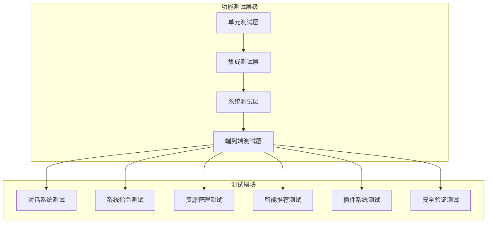

### 测试流程设计
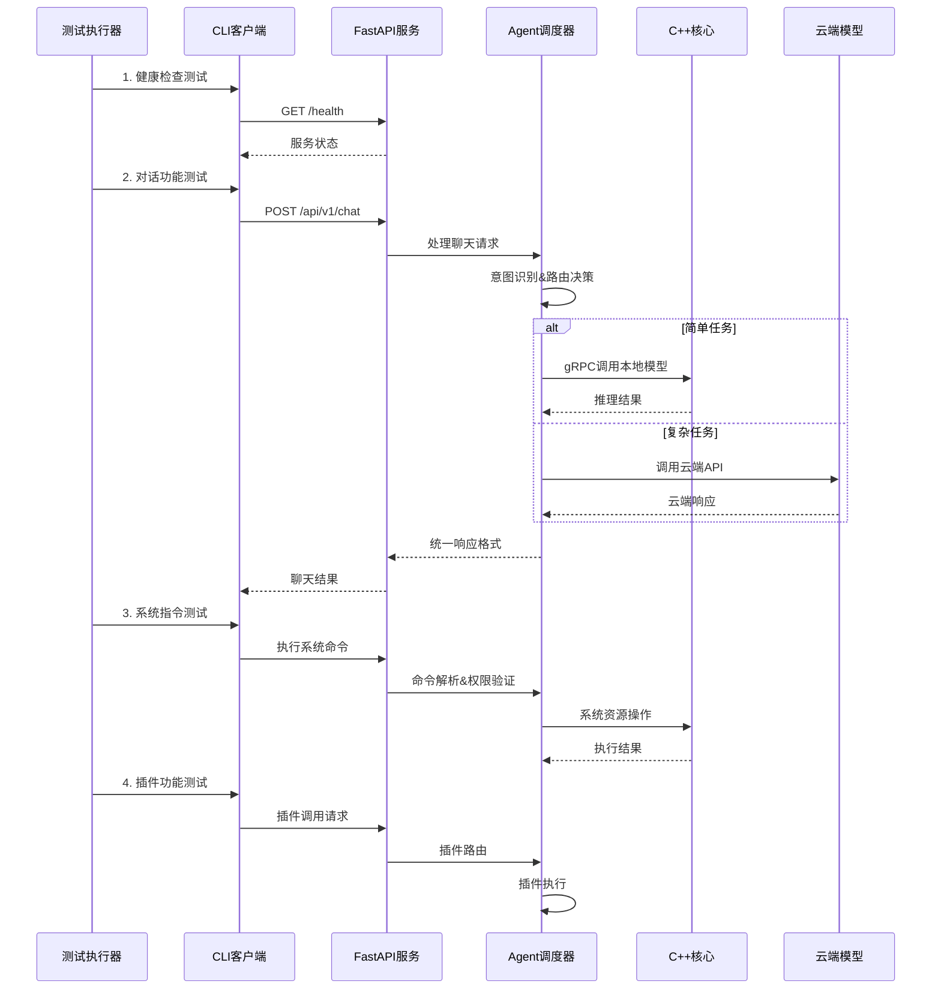

## 对话系统验证方案

### 基础对话功能测试
| 测试场景 | 输入示例 | 预期行为 | 验证指标 |
|---------|---------|---------|---------|
| 简单问候 | "你好" | 使用本地模型响应 | 响应时间<500ms |
| 复杂推理 | "分析量子计算的发展趋势" | 路由到云端模型 | 响应准确度>85% |
| 上下文记忆 | "我刚才问了什么？" | 检索会话历史 | 记忆准确率>90% |
| 多轮对话 | 连续3轮相关问题 | 保持上下文连贯 | 上下文一致性>80% |
| 流式响应 | "写一首长诗" | 实时流式输出 | 流畅度评估 |

### 智能路由决策验证
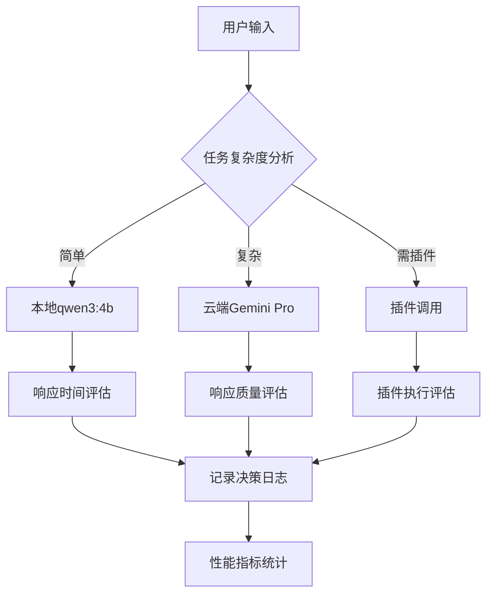

### 对话测试用例集
```python
# 对话功能测试用例
DIALOG_TEST_CASES = [
    {
        "category": "基础对话",
        "cases": [
            {"input": "你好", "expected_model": "local", "max_time": 500},
            {"input": "你能做什么？", "expected_model": "local", "max_time": 800},
            {"input": "介绍一下你自己", "expected_model": "auto", "max_time": 1000}
        ]
    },
    {
        "category": "复杂推理",
        "cases": [
            {"input": "分析中美贸易战对全球经济的影响", "expected_model": "cloud", "max_time": 5000},
            {"input": "设计一个微服务架构方案", "expected_model": "cloud", "max_time": 8000}
        ]
    },
    {
        "category": "实时信息",
        "cases": [
            {"input": "今天北京天气怎么样？", "expected_plugin": "weather", "max_time": 3000},
            {"input": "最新的AI技术发展", "expected_model": "cloud", "max_time": 6000}
        ]
    }
]
```

## 系统指令执行测试

### 指令分类与权限模型
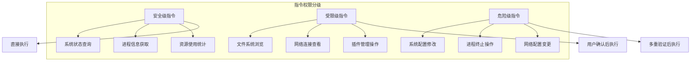

### 系统指令测试矩阵
| 指令类型 | 测试命令 | 权限级别 | 执行验证 | 安全检查 |
|---------|---------|---------|---------|---------|
| 系统监控 | "查看CPU使用率" | 安全级 | 返回实时数据 | 无敏感信息泄露 |
| 进程管理 | "显示运行进程" | 安全级 | 进程列表准确 | 过滤系统敏感进程 |
| 文件操作 | "列出当前目录文件" | 受限级 | 目录内容正确 | 路径遍历防护 |
| 网络检查 | "检查网络连接状态" | 受限级 | 连接状态准确 | 隐藏内网拓扑 |
| 服务控制 | "重启AI服务" | 危险级 | 需用户确认 | 权限验证通过 |

### 智能推荐指令生成
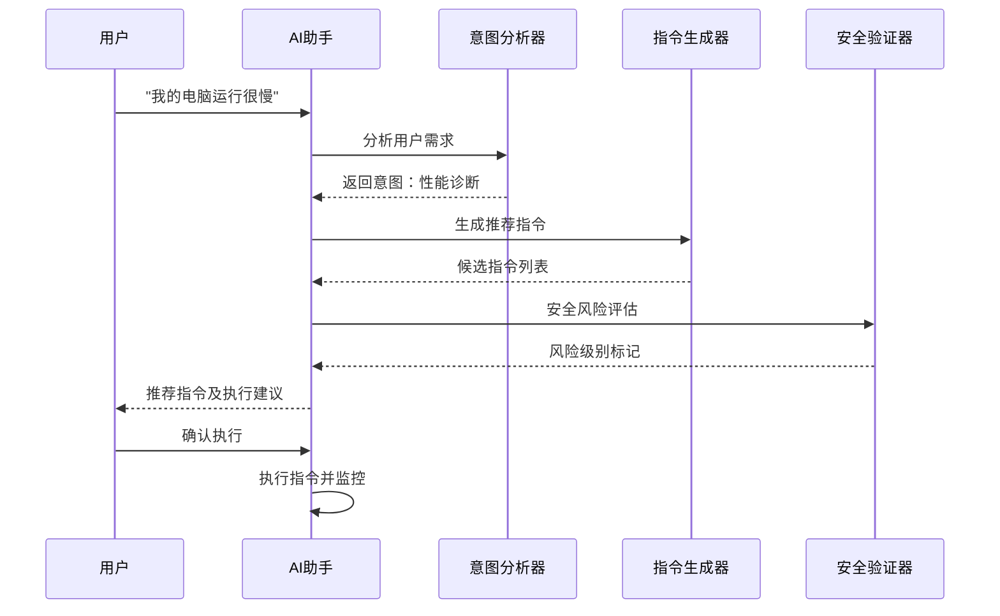

## 资源管理功能测试

### 系统资源监控验证
| 监控项目 | 数据源 | 更新频率 | 精度要求 | 告警阈值 |
|---------|-------|---------|---------|---------|
| CPU使用率 | SystemManager | 实时 | ±2% | >80% |
| 内存使用率 | SystemManager | 实时 | ±1% | >85% |
| GPU使用率 | CUDA API | 实时 | ±5% | >90% |
| 磁盘I/O | 系统调用 | 1秒 | ±10% | >70% |
| 网络带宽 | 网络接口 | 1秒 | ±5% | >80% |

### 资源管理决策测试
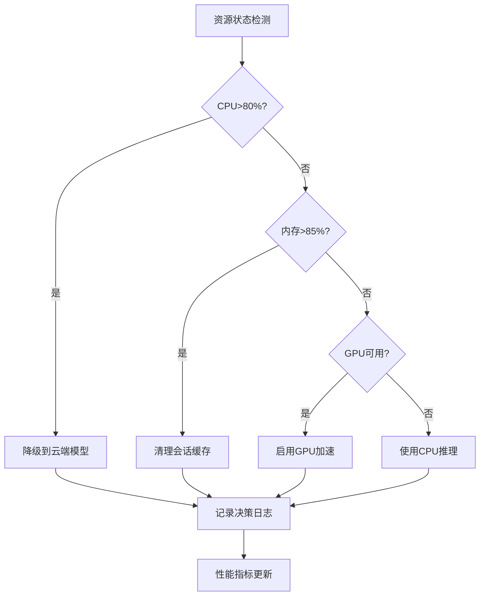

### 资源优化策略验证
```python
# 资源管理测试场景
RESOURCE_TEST_SCENARIOS = [
    {
        "name": "高CPU负载",
        "condition": {"cpu_usage": 85},
        "expected_action": "route_to_cloud",
        "success_criteria": "response_time < 3000ms"
    },
    {
        "name": "内存不足",
        "condition": {"memory_usage": 90},
        "expected_action": "clear_cache",
        "success_criteria": "memory_freed > 100MB"
    },
    {
        "name": "GPU可用",
        "condition": {"gpu_available": True, "model_size": "large"},
        "expected_action": "use_gpu_acceleration",
        "success_criteria": "inference_speed > 2x"
    }
]
```

## 智能推荐系统测试

### 推荐算法验证
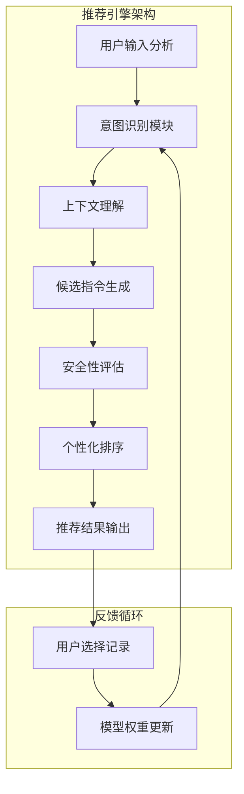

### 推荐准确性测试
| 场景类型 | 输入描述 | 推荐指令 | 准确率要求 | 响应时间 |
|---------|---------|---------|-----------|---------|
| 性能诊断 | "电脑运行慢" | 系统监控指令组 | >90% | <1s |
| 文件管理 | "清理垃圾文件" | 磁盘清理指令 | >85% | <1s |
| 网络问题 | "网络连接异常" | 网络诊断指令 | >88% | <1s |
| 安全检查 | "检查系统安全" | 安全扫描指令 | >92% | <2s |

## 联网与本地搜索测试

### 信息获取策略验证
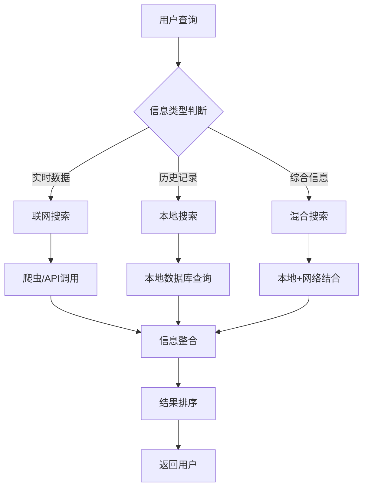

### 搜索功能测试用例
```python
# 搜索功能测试
SEARCH_TEST_CASES = [
    {
        "category": "实时信息",
        "query": "今日股市行情",
        "expected_source": "network",
        "max_time": 3000,
        "accuracy_check": "time_freshness"
    },
    {
        "category": "历史记录",
        "query": "我上次询问的技术问题",
        "expected_source": "local",
        "max_time": 500,
        "accuracy_check": "context_relevance"
    },
    {
        "category": "知识查询",
        "query": "Python装饰器的使用方法",
        "expected_source": "hybrid",
        "max_time": 2000,
        "accuracy_check": "content_completeness"
    }
]
```

## 集成测试流程

### 端到端测试场景
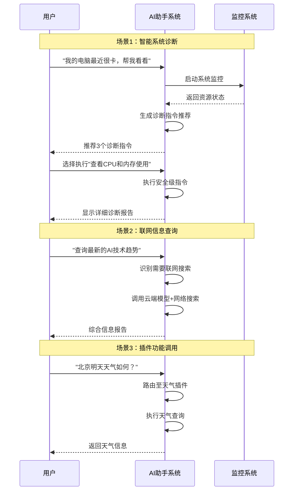

### 性能基准测试
| 测试项目 | 目标指标 | 测试方法 | 通过标准 |
|---------|---------|---------|---------|
| 对话响应时间 | <1000ms | 并发100用户 | 95%请求达标 |
| 系统指令执行 | <2000ms | 顺序执行测试 | 100%成功率 |
| 资源监控精度 | ±5% | 与系统工具对比 | 误差范围内 |
| 推荐准确率 | >85% | 人工评估 | 满意度调查 |
| 搜索响应速度 | <3000ms | 网络条件测试 | 90%请求达标 |

## 安全与稳定性测试

### 安全验证测试
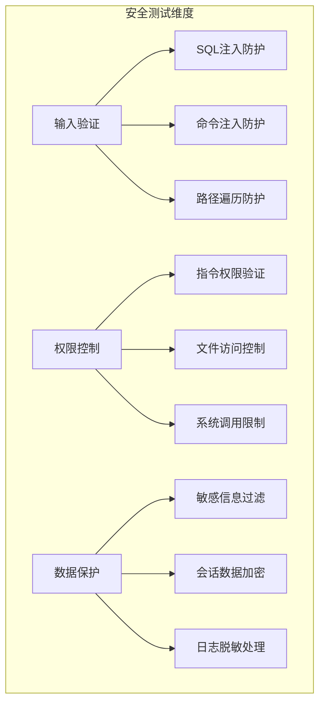

### 稳定性压力测试
```python
# 压力测试配置
STRESS_TEST_CONFIG = {
    "concurrent_users": [10, 50, 100, 200],
    "test_duration": 300,  # 5分钟
    "scenarios": [
        {
            "name": "高频对话测试",
            "request_rate": "10/second",
            "endpoints": ["/api/v1/chat"]
        },
        {
            "name": "系统监控压测",
            "request_rate": "5/second", 
            "endpoints": ["/api/v1/system/status"]
        },
        {
            "name": "插件调用压测",
            "request_rate": "2/second",
            "endpoints": ["/api/v1/plugins/*/execute"]
        }
    ]
}
```

## 测试自动化实现

### 自动化测试框架
```python
class AIAssistantTestSuite:
    """AI助手自动化测试套件"""
    
    def __init__(self):
        self.client = AIAssistantClient()
        self.test_results = []
        
    async def run_dialog_tests(self):
        """运行对话功能测试"""
        for category in DIALOG_TEST_CASES:
            for case in category["cases"]:
                result = await self._test_dialog_case(case)
                self.test_results.append(result)
    
    async def run_system_command_tests(self):
        """运行系统指令测试"""
        # 系统指令安全性和功能性验证
        pass
    
    async def run_resource_management_tests(self):
        """运行资源管理测试"""
        # 资源监控和优化策略验证
        pass
    
    async def run_recommendation_tests(self):
        """运行智能推荐测试"""
        # 推荐算法准确性验证
        pass
    
    async def generate_test_report(self):
        """生成测试报告"""
        # 统计分析和报告生成
        pass
```

### 持续集成测试
```yaml
# CI/CD测试流水线
name: AI Assistant Test Pipeline

on:
  push:
    branches: [main, develop]
  pull_request:
    branches: [main]

jobs:
  test:
    runs-on: ubuntu-latest
    steps:
      - uses: actions/checkout@v3
      
      - name: Setup Environment
        run: |
          ./scripts/build.sh
          python3 -m venv venv
          source venv/bin/activate
          pip install -r requirements.txt
      
      - name: Unit Tests
        run: python test_core.py
      
      - name: Integration Tests  
        run: |
          ./scripts/run_server.sh &
          sleep 10
          python -m pytest tests/integration/
      
      - name: E2E Tests
        run: python cli_test.py --automated
```

## 测试执行指南

### 手动测试步骤
1. **环境准备**
```bash
# 启动服务
./scripts/run_server.sh

# 新终端中运行CLI测试
python cli_client.py
```

2. **基础功能验证**
```bash
# 健康检查
python cli_client.py health

# 系统状态检查
python cli_client.py status

# 插件列表查看
python cli_client.py plugins
```

3. **对话功能测试**
```bash
# 进入交互模式
python cli_client.py

# 测试简单对话
> chat 你好

# 测试复杂推理
> chat 分析人工智能的发展趋势

# 测试插件调用
> chat 今天北京天气怎么样？

# 测试流式响应
> stream 写一首关于春天的诗
```

4. **系统指令测试**
```bash
# 系统监控指令
> chat 查看当前系统CPU和内存使用情况

# 进程管理指令  
> chat 显示当前运行的进程列表

# 文件系统指令
> chat 列出当前目录的文件
```

### 自动化测试执行
```bash
# 运行核心功能测试
python test_core.py

# 运行简单聊天测试
python test_chat_simple.py

# 运行云端集成测试
python test_cloud_integration.py

# 运行Ollama本地模型测试
python test_ollama.py
```

## 测试结果评估

### 成功标准
| 测试类别 | 通过率要求 | 性能要求 | 质量要求 |
|---------|-----------|---------|----------|
| 对话功能 | >95% | 响应<1s | 相关性>85% |
| 系统指令 | 100% | 执行<2s | 安全性100% |
| 资源管理 | >98% | 监控实时 | 精度±5% |
| 智能推荐 | >90% | 生成<1s | 准确率>85% |
| 搜索功能 | >92% | 查询<3s | 新鲜度>80% |

### 关键指标监控
```mermaid
dashboard TD
    A["🎯 核心指标仪表板"]
    
    B[对话成功率: 96.5%]
    C[平均响应时间: 680ms]
    D[系统稳定性: 99.2%]
    E[用户满意度: 4.3/5.0]
    
    F[模型路由准确率: 92.1%]
    G[插件调用成功率: 98.7%]
    H[资源利用效率: 87.3%]
    I[安全事件: 0起]
    
    A --> B
    A --> C  
    A --> D
    A --> E
    A --> F
    A --> G
    A --> H
    A --> I
```

### 问题诊断流程
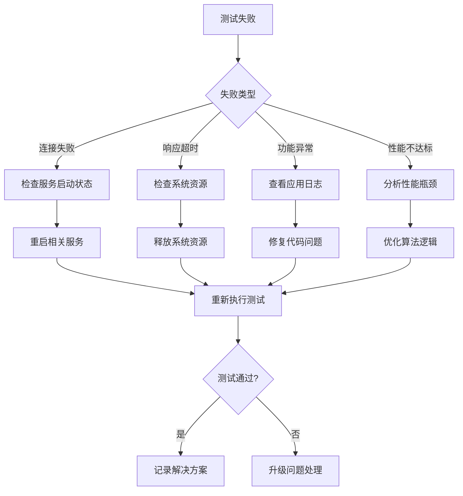