# CLI测试环境配置与构建部署设计

## 概述

本设计文档针对nex AI助手项目的CLI模式测试、环境配置、构建流程和GitHub部署进行全面规划。项目采用C++与Python混合架构，提供现代化CLI界面和Web GUI两种交互模式。

### 目标
- 建立完整的CLI测试环境配置流程
- 优化构建系统和部署流程
- 完善文档体系并准备GitHub发布
- 确保跨平台兼容性和稳定性

## 技术栈

### 核心技术栈
- **CLI框架**: Rich 13.7.0 + Textual 0.45.1
- **后端**: FastAPI 0.104.1 + Python 3.9+
- **C++核心**: C++20 + gRPC + Protobuf
- **AI模型**: qwen3:4b(本地) + Gemini Pro(云端)
- **构建工具**: CMake 3.20+ + 自定义shell脚本

### 依赖管理
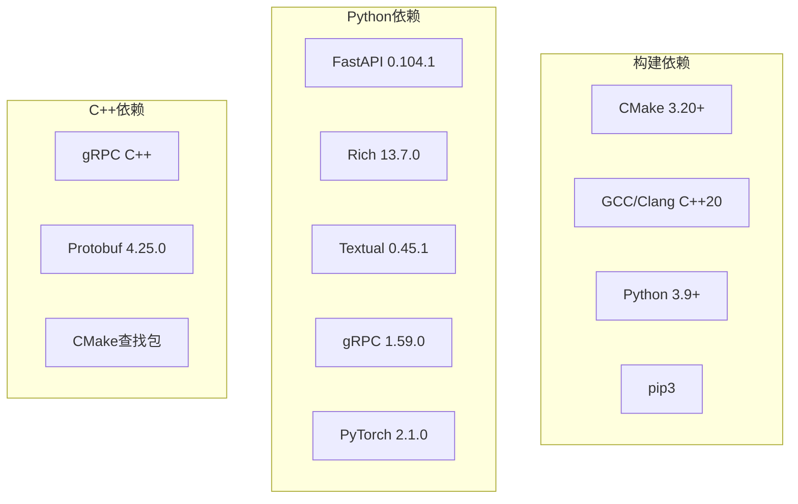

## CLI架构设计

### 组件架构
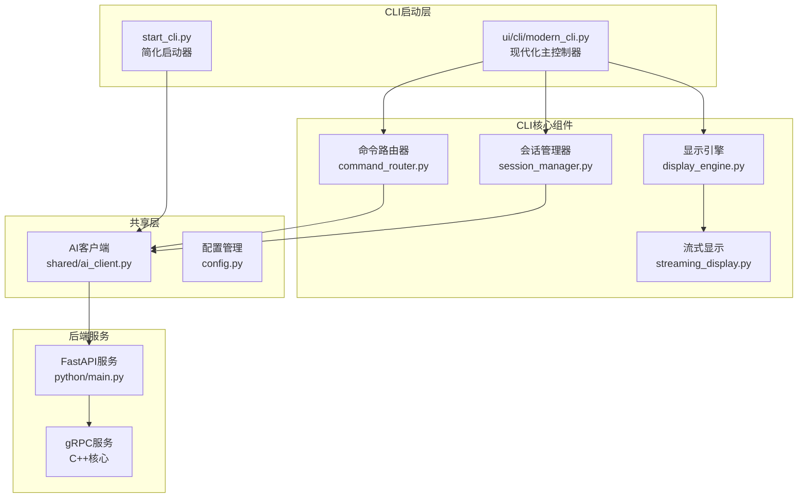

### CLI启动模式对比
| 特性 | start_cli.py | ui/cli/modern_cli.py |
|------|-------------|---------------------|
| 复杂度 | 简化版本 | 完整版本 |
| 界面 | 基础命令行 | Rich现代化界面 |
| 功能 | 基本聊天 | 完整命令系统 |
| 适用场景 | 快速测试 | 生产使用 |

## 环境配置架构

### 配置层次结构
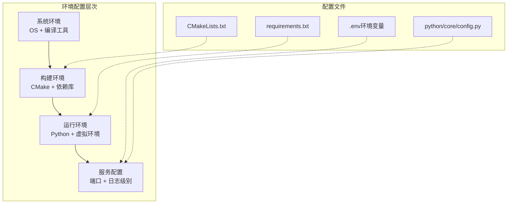

### 环境变量管理
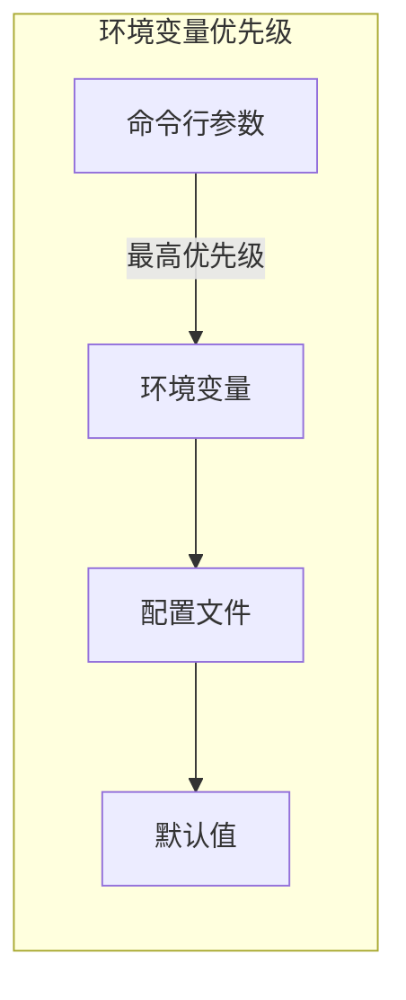

## 构建系统架构

### 构建流程设计
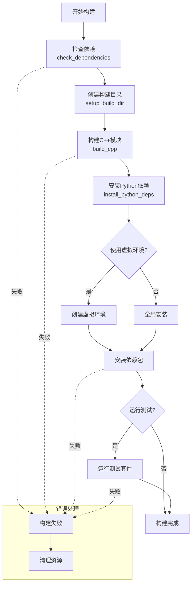

### 构建脚本参数设计
```bash
# scripts/build.sh 支持的参数
./scripts/build.sh [OPTIONS]

选项:
  --skip-tests     跳过测试阶段，加快构建速度
  --venv          启用Python虚拟环境
  --debug         启用调试模式构建
  --clean         清理旧的构建文件
  --parallel N    指定并行编译线程数
  --help          显示帮助信息
```

## 测试策略设计

### 测试层次架构
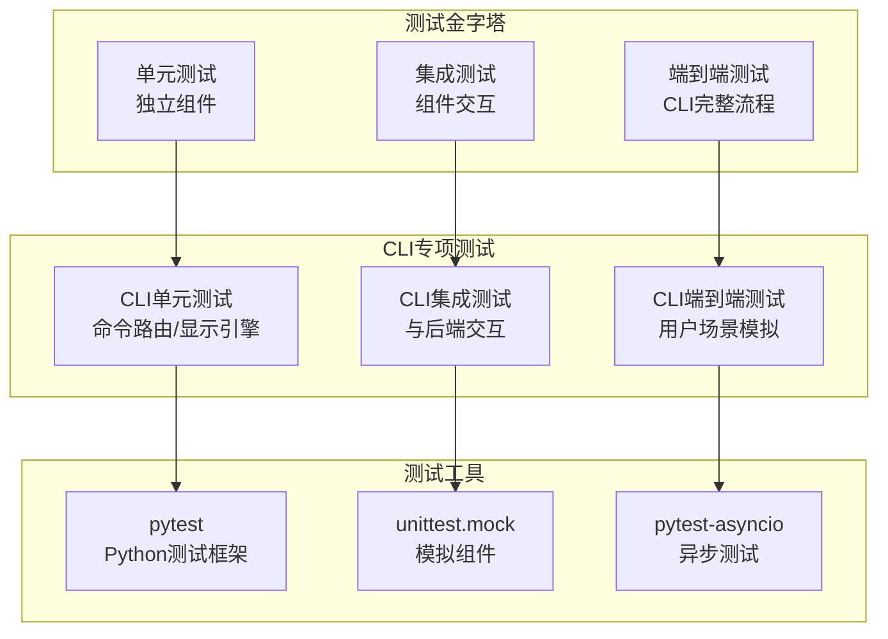

### CLI测试用例设计
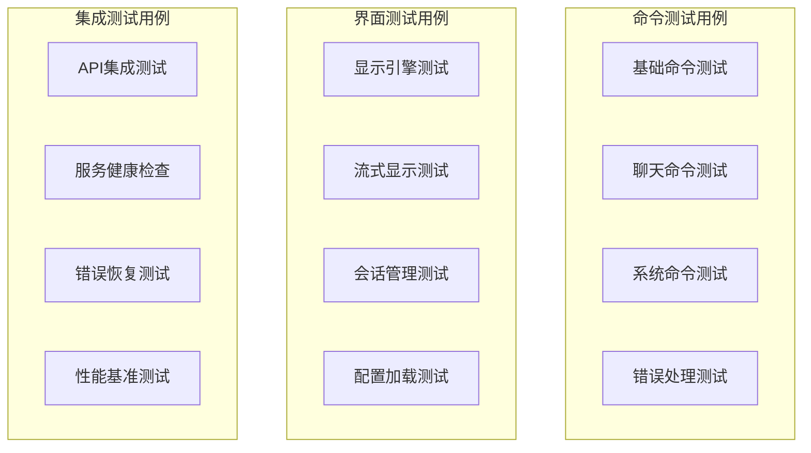

## 服务启动架构

### 服务启动流程
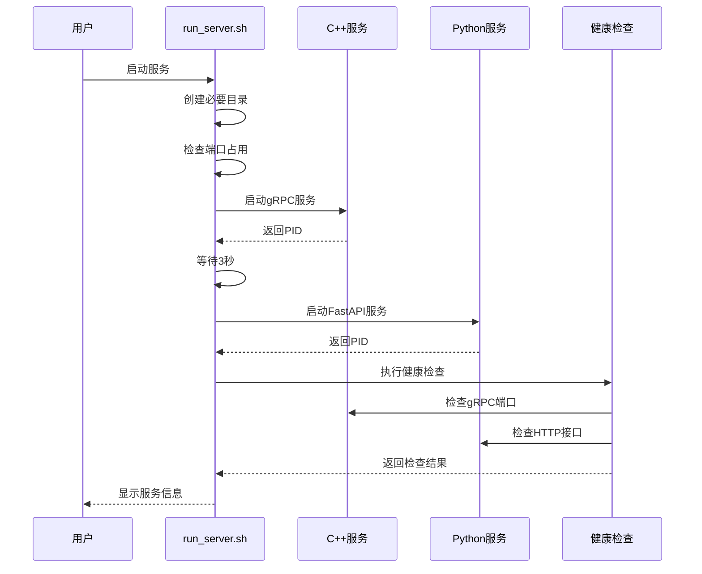

### 服务配置管理
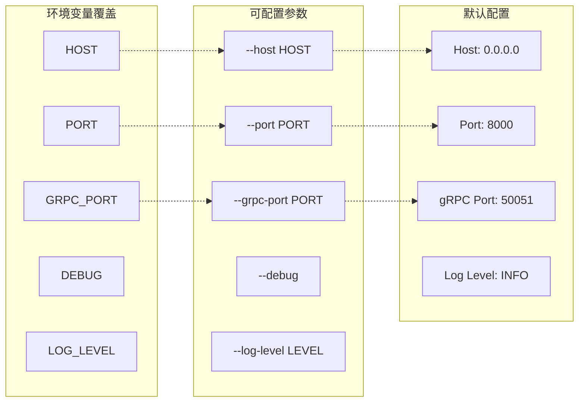

## 文档体系设计

### 文档架构规划
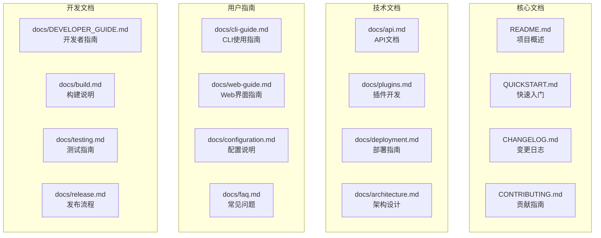

### 文档内容规范
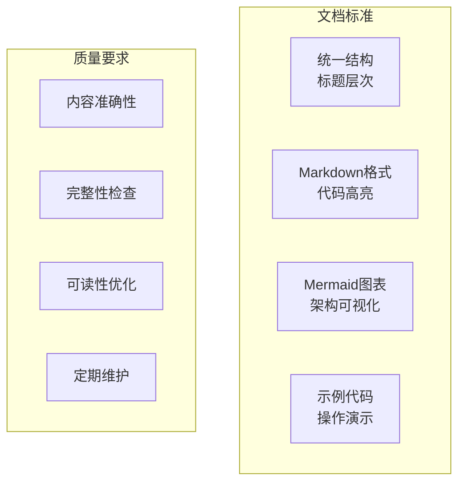

## GitHub部署策略

### 仓库组织结构
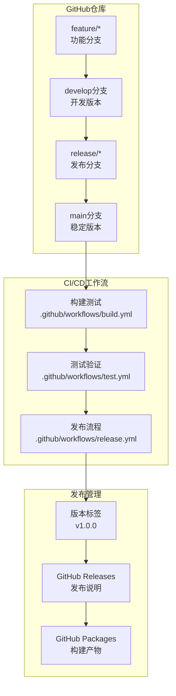

### GitHub Actions工作流
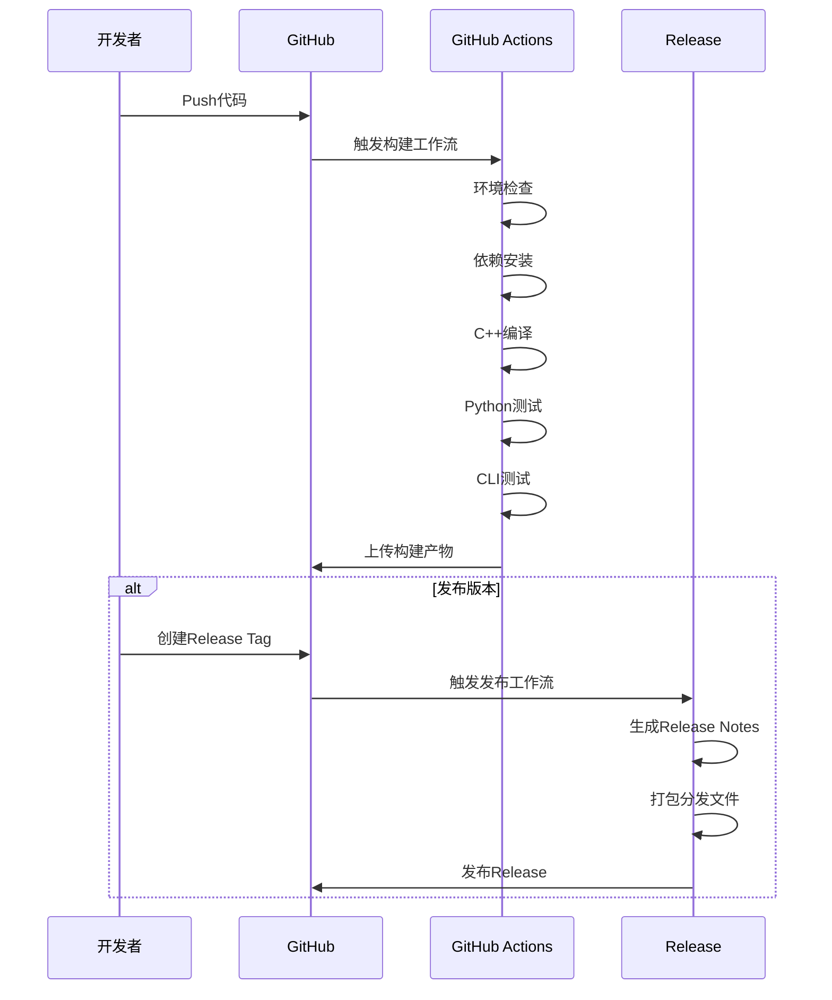

## 部署配置设计

### 容器化部署
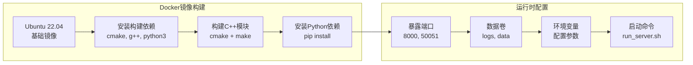

### Kubernetes部署架构
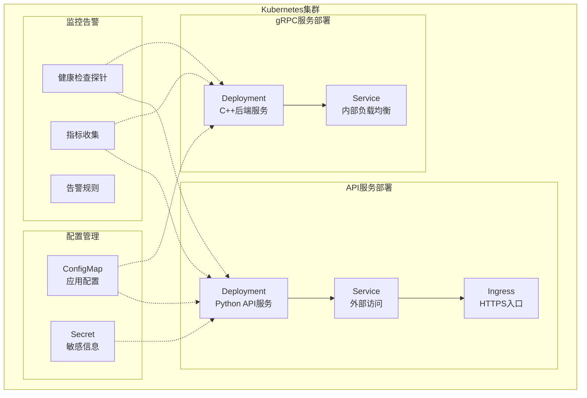

## 性能优化设计

### CLI性能优化策略
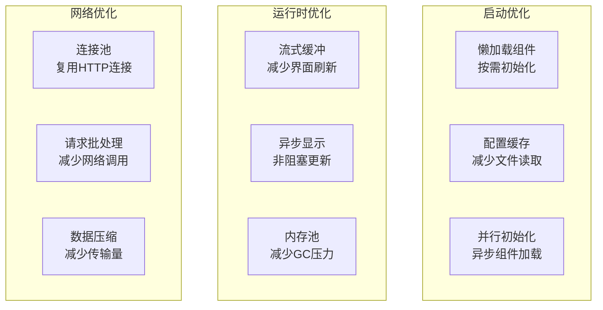

### 构建性能优化
```mermaid
graph LR
    subgraph "并行构建"
        MAKE_J[make -j$(nproc)<br/>多线程编译]
        CCACHE[ccache<br/>编译缓存]
        NINJA[Ninja构建<br/>增量构建]
    end
    
    subgraph "依赖优化"
        PIP_CACHE[pip缓存<br/>避免重复下载]
        VENV_REUSE[虚拟环境复用<br/>开发环境]
        DOCKER_CACHE[Docker层缓存<br/>镜像构建]
    end
```

## 监控告警设计

### 系统监控架构
```mermaid
flowchart TD
    subgraph "监控指标"
        SYSTEM[系统指标<br/>CPU/内存/磁盘]
        SERVICE[服务指标<br/>响应时间/错误率]
        BUSINESS[业务指标<br/>会话数/请求量]
    end
    
    subgraph "数据收集"
        METRICS_API[/metrics接口<br/>Prometheus格式]
        LOG_COLLECT[日志收集<br/>结构化日志]
        HEALTH_CHECK[健康检查<br/>/health接口]
    end
    
    subgraph "告警策略"
        THRESHOLD[阈值告警<br/>CPU>80%]
        TREND[趋势告警<br/>错误率上升]
        AVAILABILITY[可用性告警<br/>服务下线]
    end
    
    SYSTEM --> METRICS_API
    SERVICE --> LOG_COLLECT
    BUSINESS --> HEALTH_CHECK
    
    METRICS_API --> THRESHOLD
    LOG_COLLECT --> TREND
    HEALTH_CHECK --> AVAILABILITY
```

## 错误处理与恢复

### 错误处理流程
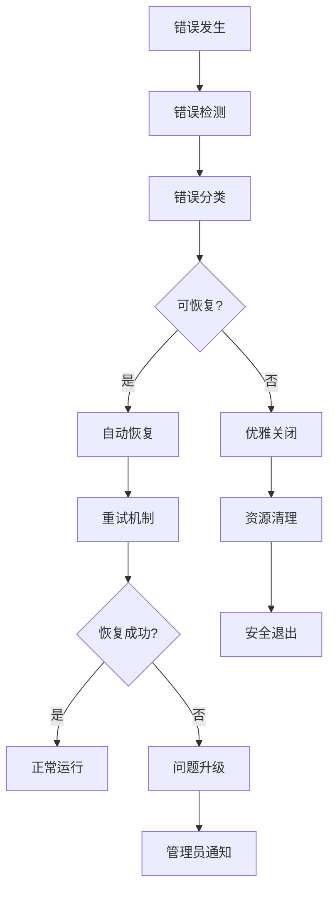

### CLI错误恢复策略


## 实施路线图

### 开发阶段规划
```mermaid
gantt
    title 实施时间线
    dateFormat  YYYY-MM-DD
    section 阶段1: 环境配置
    依赖检查优化           :a1, 2024-01-01, 3d
    构建脚本增强           :a2, after a1, 5d
    虚拟环境管理           :a3, after a2, 3d
    
    section 阶段2: CLI测试
    单元测试编写           :b1, after a3, 7d
    集成测试开发           :b2, after b1, 5d
    端到端测试设计         :b3, after b2, 3d
    
    section 阶段3: 文档完善
    技术文档编写           :c1, after b3, 10d
    用户指南创建           :c2, after c1, 7d
    API文档生成           :c3, after c2, 3d
    
    section 阶段4: GitHub部署
    CI/CD配置             :d1, after c3, 5d
    Release流程           :d2, after d1, 3d
    容器化部署            :d3, after d2, 5d
```

### 验收标准

#### 功能验收
- ✅ CLI启动正常，界面显示完整
- ✅ 所有基础命令响应正确
- ✅ 流式显示功能稳定
- ✅ 错误处理机制有效
- ✅ 会话管理功能正常

#### 性能验收
- ✅ 启动时间 < 3秒
- ✅ 命令响应时间 < 500ms
- ✅ 内存使用 < 200MB
- ✅ CPU使用率 < 50%

#### 稳定性验收
- ✅ 长时间运行无内存泄漏
- ✅ 网络异常自动恢复
- ✅ 服务重启后状态保持
- ✅ 并发测试通过

#### 兼容性验收
- ✅ Linux/macOS/Windows跨平台支持
- ✅ Python 3.9-3.12版本兼容
- ✅ 不同终端环境正常显示
- ✅ Docker容器化运行正常

## 测试用例设计

### CLI功能测试矩阵

| 测试场景 | 测试用例 | 预期结果 | 优先级 |
|---------|---------|---------|--------|
| 基础启动 | 执行start_cli.py | 显示欢迎界面，连接服务 | P0 |
| 现代化CLI | 执行modern_cli.py | Rich界面正常，命令提示符显示 | P0 |
| 健康检查 | 服务未启动时运行CLI | 显示连接异常警告，继续运行 | P1 |
| 基础聊天 | 输入"你好" | AI回复正常，显示模型信息 | P0 |
| 流式显示 | 输入长文本请求 | 实时显示生成内容，进度指示 | P1 |
| 命令路由 | 输入/help命令 | 显示帮助信息，格式正确 | P0 |
| 会话管理 | 多轮对话 | 上下文保持，会话ID不变 | P1 |
| 错误处理 | 输入无效命令 | 友好错误提示，建议帮助 | P1 |
| 退出机制 | 按Ctrl+C或/exit | 优雅退出，资源清理 | P0 |
| 配置加载 | 修改配置文件 | 配置生效，参数正确读取 | P2 |

### 自动化测试脚本设计

```bash
#!/bin/bash
# tests/cli_integration_test.sh

echo "🧪 开始CLI集成测试"

# 1. 环境检查
test_environment() {
    echo "📋 检查测试环境..."
    python3 --version || exit 1
    pip3 show rich || exit 1
    pip3 show fastapi || exit 1
}

# 2. 服务启动测试
test_service_startup() {
    echo "🚀 测试服务启动..."
    timeout 30 ./scripts/run_server.sh --debug &
    SERVER_PID=$!
    sleep 10
    
    # 检查服务是否启动
    curl -s http://localhost:8000/health || {
        echo "❌ 服务启动失败"
        kill $SERVER_PID
        exit 1
    }
    
    echo "✅ 服务启动成功"
}

# 3. CLI启动测试
test_cli_startup() {
    echo "💻 测试CLI启动..."
    
    # 测试简化版CLI
    timeout 10 python3 start_cli.py <<< "quit" || {
        echo "❌ 简化CLI启动失败"
        exit 1
    }
    
    # 测试现代化CLI
    timeout 10 python3 ui/cli/modern_cli.py <<< "/exit" || {
        echo "❌ 现代化CLI启动失败"
        exit 1
    }
    
    echo "✅ CLI启动测试通过"
}

# 4. 功能测试
test_cli_functions() {
    echo "⚙️ 测试CLI功能..."
    
    # 创建测试脚本
    cat > /tmp/cli_test_input.txt << EOF
你好
/help
/status
测试流式响应功能
/exit
EOF
    
    timeout 60 python3 ui/cli/modern_cli.py < /tmp/cli_test_input.txt > /tmp/cli_test_output.log 2>&1
    
    # 检查输出
    grep -q "AI Assistant" /tmp/cli_test_output.log || {
        echo "❌ 欢迎界面未显示"
        exit 1
    }
    
    echo "✅ CLI功能测试通过"
}

# 5. 清理资源
cleanup() {
    echo "🧹 清理测试资源..."
    pkill -f "run_server.sh" || true
    pkill -f "uvicorn" || true
    pkill -f "ai_assistant_server" || true
    rm -f /tmp/cli_test_*
}

# 主测试流程
main() {
    trap cleanup EXIT
    
    test_environment
    test_service_startup
    test_cli_startup
    test_cli_functions
    
    echo "🎉 所有测试通过！"
}

main "$@"
```

## 环境配置实施方案

### 开发环境快速配置

```bash
#!/bin/bash
# scripts/setup_dev_env.sh

echo "🔧 配置开发环境"

# 检查系统类型
detect_os() {
    if [[ "$OSTYPE" == "linux-gnu"* ]]; then
        OS="linux"
    elif [[ "$OSTYPE" == "darwin"* ]]; then
        OS="macos"
    elif [[ "$OSTYPE" == "msys" ]]; then
        OS="windows"
    else
        echo "❌ 不支持的操作系统: $OSTYPE"
        exit 1
    fi
    echo "📱 检测到操作系统: $OS"
}

# 安装系统依赖
install_system_deps() {
    echo "📦 安装系统依赖..."
    
    case $OS in
        "linux")
            sudo apt-get update
            sudo apt-get install -y cmake build-essential python3-dev python3-pip python3-venv
            ;;
        "macos")
            brew install cmake python@3.9
            ;;
        "windows")
            echo "请手动安装: CMake, Visual Studio Build Tools, Python 3.9+"
            ;;
    esac
}

# 创建Python虚拟环境
setup_python_env() {
    echo "🐍 设置Python环境..."
    
    # 创建虚拟环境
    python3 -m venv venv
    
    # 激活虚拟环境
    source venv/bin/activate
    
    # 升级pip
    pip install --upgrade pip
    
    # 安装依赖
    pip install -r requirements.txt
    
    echo "✅ Python环境配置完成"
}

# 验证环境
verify_environment() {
    echo "🔍 验证环境配置..."
    
    # 检查Python环境
    python3 -c "import fastapi, rich, textual" || {
        echo "❌ Python依赖验证失败"
        exit 1
    }
    
    # 检查构建工具
    cmake --version || {
        echo "❌ CMake未正确安装"
        exit 1
    }
    
    echo "✅ 环境验证通过"
}

# 主函数
main() {
    detect_os
    install_system_deps
    setup_python_env
    verify_environment
    
    echo "🎉 开发环境配置完成！"
    echo "📝 下一步:"
    echo "   1. 激活虚拟环境: source venv/bin/activate"
    echo "   2. 构建项目: ./scripts/build.sh --venv"
    echo "   3. 启动服务: ./scripts/run_server.sh"
    echo "   4. 测试CLI: python start_cli.py"
}

main "$@"
```

### 生产环境部署配置

```dockerfile
# Dockerfile.production
FROM ubuntu:22.04

# 设置环境变量
ENV DEBIAN_FRONTEND=noninteractive
ENV PYTHON_VERSION=3.10
ENV APP_HOME=/app

# 安装系统依赖
RUN apt-get update && apt-get install -y \
    build-essential \
    cmake \
    python3.10 \
    python3.10-dev \
    python3.10-venv \
    python3-pip \
    curl \
    wget \
    git \
    && rm -rf /var/lib/apt/lists/*

# 创建应用目录
WORKDIR $APP_HOME

# 复制项目文件
COPY requirements.txt .
COPY CMakeLists.txt .
COPY cpp/ ./cpp/
COPY python/ ./python/
COPY scripts/ ./scripts/
COPY ui/ ./ui/
COPY protos/ ./protos/

# 构建应用
RUN pip3 install --no-cache-dir -r requirements.txt
RUN mkdir build && cd build && \
    cmake .. -DCMAKE_BUILD_TYPE=Release && \
    make -j$(nproc) && \
    make install

# 创建非root用户
RUN useradd -m -u 1000 appuser && \
    chown -R appuser:appuser $APP_HOME
USER appuser

# 创建必要目录
RUN mkdir -p logs data python/plugins

# 暴露端口
EXPOSE 8000 50051

# 健康检查
HEALTHCHECK --interval=30s --timeout=10s --start-period=60s --retries=3 \
    CMD curl -f http://localhost:8000/health || exit 1

# 启动命令
CMD ["./scripts/run_server.sh"]
```

## GitHub Actions工作流配置

### 构建测试工作流

```yaml
# .github/workflows/ci.yml
name: 构建测试

on:
  push:
    branches: [ main, develop ]
  pull_request:
    branches: [ main ]

jobs:
  test:
    runs-on: ${{ matrix.os }}
    strategy:
      matrix:
        os: [ubuntu-22.04, macos-latest]
        python-version: ["3.9", "3.10", "3.11"]
    
    steps:
    - uses: actions/checkout@v4
    
    - name: 设置Python环境
      uses: actions/setup-python@v4
      with:
        python-version: ${{ matrix.python-version }}
    
    - name: 安装系统依赖
      run: |
        if [ "$RUNNER_OS" == "Linux" ]; then
          sudo apt-get update
          sudo apt-get install -y cmake build-essential
        elif [ "$RUNNER_OS" == "macOS" ]; then
          brew install cmake
        fi
    
    - name: 缓存Python依赖
      uses: actions/cache@v3
      with:
        path: ~/.cache/pip
        key: ${{ runner.os }}-pip-${{ hashFiles('requirements.txt') }}
    
    - name: 安装Python依赖
      run: |
        python -m pip install --upgrade pip
        pip install -r requirements.txt
        pip install pytest pytest-asyncio pytest-cov
    
    - name: 构建C++模块
      run: |
        mkdir build
        cd build
        cmake .. -DCMAKE_BUILD_TYPE=Release
        make -j$(nproc 2>/dev/null || echo 2)
    
    - name: 运行Python测试
      run: |
        pytest tests/ -v --cov=python --cov-report=xml
    
    - name: 运行CLI集成测试
      run: |
        chmod +x tests/cli_integration_test.sh
        ./tests/cli_integration_test.sh
    
    - name: 上传覆盖率报告
      uses: codecov/codecov-action@v3
      with:
        file: ./coverage.xml
        flags: unittests
        name: codecov-umbrella

  docker-build:
    runs-on: ubuntu-latest
    needs: test
    
    steps:
    - uses: actions/checkout@v4
    
    - name: 构建Docker镜像
      run: |
        docker build -f Dockerfile.production -t ai-assistant:latest .
    
    - name: 测试Docker镜像
      run: |
        docker run --rm -d --name test-container -p 8000:8000 ai-assistant:latest
        sleep 30
        curl -f http://localhost:8000/health
        docker stop test-container
```

### 发布工作流

```yaml
# .github/workflows/release.yml
name: 发布版本

on:
  push:
    tags:
      - 'v*'

jobs:
  release:
    runs-on: ubuntu-latest
    
    steps:
    - uses: actions/checkout@v4
      with:
        fetch-depth: 0
    
    - name: 设置Python环境
      uses: actions/setup-python@v4
      with:
        python-version: '3.10'
    
    - name: 构建项目
      run: |
        ./scripts/build.sh --skip-tests
    
    - name: 生成变更日志
      id: changelog
      run: |
        echo "## 更新内容" > RELEASE_NOTES.md
        git log $(git describe --tags --abbrev=0 HEAD^)..HEAD --pretty=format:"- %s" >> RELEASE_NOTES.md
    
    - name: 创建发布包
      run: |
        tar -czf ai-assistant-${{ github.ref_name }}.tar.gz \
          --exclude='.git*' \
          --exclude='venv' \
          --exclude='build' \
          --exclude='__pycache__' \
          .
    
    - name: 构建Docker镜像
      run: |
        docker build -f Dockerfile.production -t ai-assistant:${{ github.ref_name }} .
        docker save ai-assistant:${{ github.ref_name }} | gzip > ai-assistant-docker-${{ github.ref_name }}.tar.gz
    
    - name: 创建GitHub Release
      uses: softprops/action-gh-release@v1
      with:
        body_path: RELEASE_NOTES.md
        files: |
          ai-assistant-${{ github.ref_name }}.tar.gz
          ai-assistant-docker-${{ github.ref_name }}.tar.gz
        draft: false
        prerelease: false
      env:
        GITHUB_TOKEN: ${{ secrets.GITHUB_TOKEN }}
```

## 性能基准测试

### CLI性能测试

```python
# tests/performance/cli_benchmark.py
import asyncio
import time
import psutil
import pytest
from ui.cli.modern_cli import ModernCLI
from ui.shared.ai_client import EnhancedAIClient

class CLIPerformanceBenchmark:
    def __init__(self):
        self.cli = None
        self.process = psutil.Process()
    
    async def setup(self):
        """初始化测试环境"""
        self.cli = ModernCLI("http://localhost:8000")
        # 预热
        await self.cli.client.health_check()
    
    @pytest.mark.asyncio
    async def test_startup_time(self):
        """测试启动时间"""
        start_time = time.time()
        
        cli = ModernCLI("http://localhost:8000")
        await cli._initialize_session()
        
        startup_time = time.time() - start_time
        
        assert startup_time < 3.0, f"启动时间过长: {startup_time:.2f}s"
        print(f"✅ 启动时间: {startup_time:.2f}s")
    
    @pytest.mark.asyncio
    async def test_memory_usage(self):
        """测试内存使用"""
        initial_memory = self.process.memory_info().rss / 1024 / 1024  # MB
        
        # 执行100次聊天命令
        for i in range(100):
            await self.cli.process_user_input(f"测试消息 {i}")
        
        final_memory = self.process.memory_info().rss / 1024 / 1024  # MB
        memory_increase = final_memory - initial_memory
        
        assert memory_increase < 50, f"内存增长过多: {memory_increase:.2f}MB"
        print(f"✅ 内存增长: {memory_increase:.2f}MB")
    
    @pytest.mark.asyncio
    async def test_command_response_time(self):
        """测试命令响应时间"""
        response_times = []
        
        for i in range(50):
            start_time = time.time()
            await self.cli.process_user_input("/status")
            response_time = time.time() - start_time
            response_times.append(response_time)
        
        avg_response_time = sum(response_times) / len(response_times)
        max_response_time = max(response_times)
        
        assert avg_response_time < 0.5, f"平均响应时间过长: {avg_response_time:.3f}s"
        assert max_response_time < 1.0, f"最大响应时间过长: {max_response_time:.3f}s"
        
        print(f"✅ 平均响应时间: {avg_response_time:.3f}s")
        print(f"✅ 最大响应时间: {max_response_time:.3f}s")
    
    @pytest.mark.asyncio
    async def test_concurrent_requests(self):
        """测试并发请求处理"""
        async def send_request(i):
            start_time = time.time()
            await self.cli.process_user_input(f"并发测试 {i}")
            return time.time() - start_time
        
        # 并发发送10个请求
        tasks = [send_request(i) for i in range(10)]
        response_times = await asyncio.gather(*tasks)
        
        avg_concurrent_time = sum(response_times) / len(response_times)
        
        assert avg_concurrent_time < 2.0, f"并发响应时间过长: {avg_concurrent_time:.3f}s"
        print(f"✅ 并发平均响应时间: {avg_concurrent_time:.3f}s")

if __name__ == "__main__":
    async def main():
        benchmark = CLIPerformanceBenchmark()
        await benchmark.setup()
        
        await benchmark.test_startup_time()
        await benchmark.test_memory_usage()
        await benchmark.test_command_response_time()
        await benchmark.test_concurrent_requests()
        
        print("🎉 性能测试完成")
    
    asyncio.run(main())
```