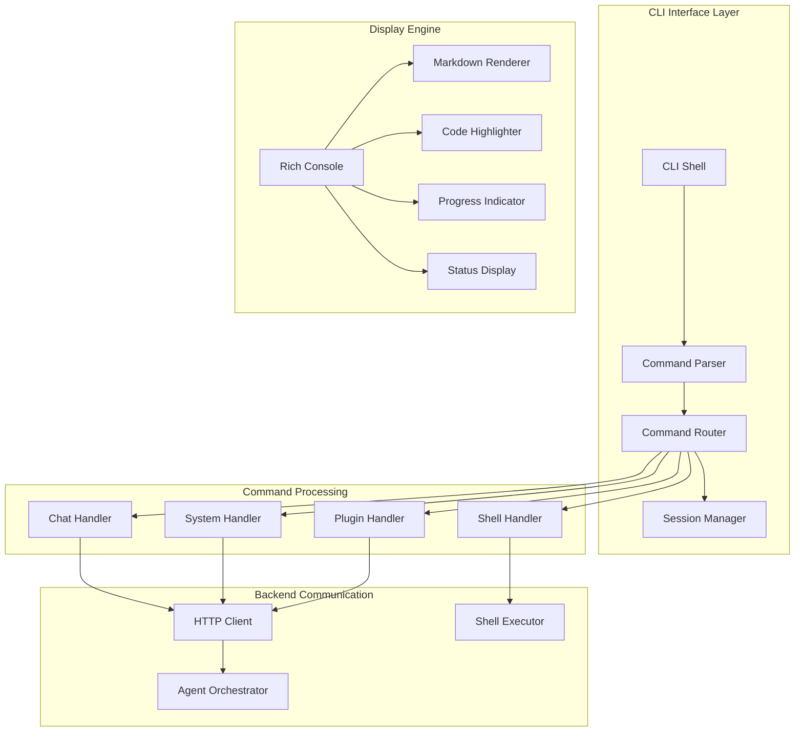
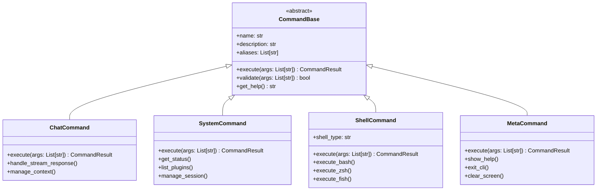
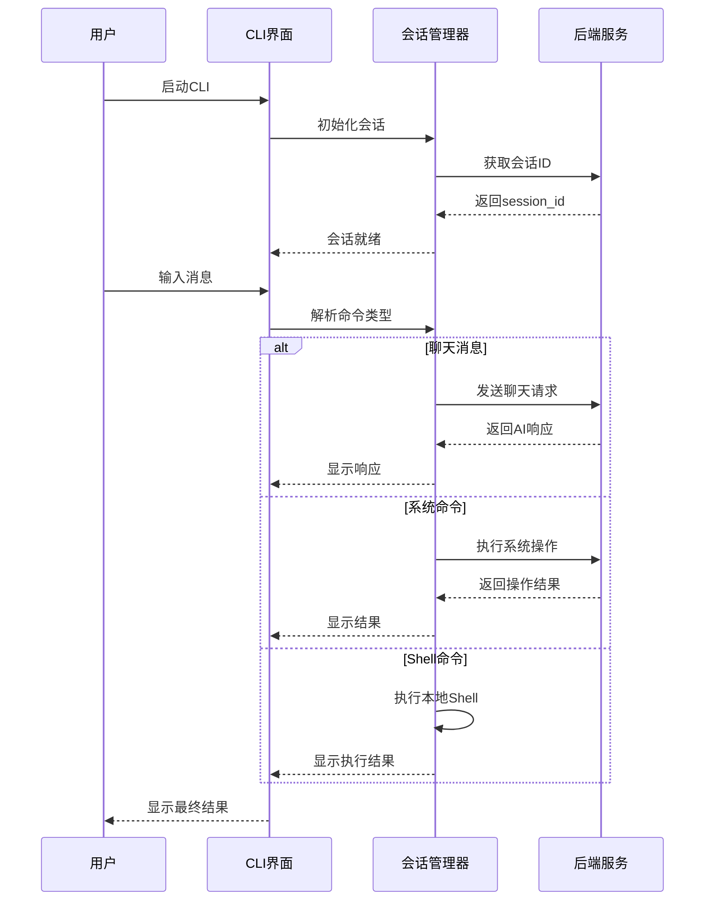
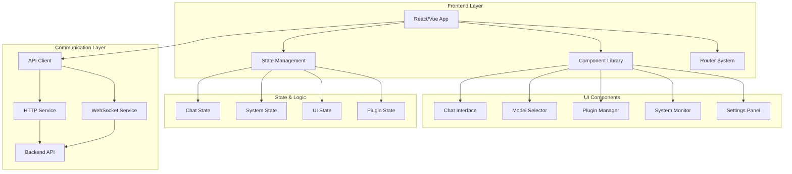
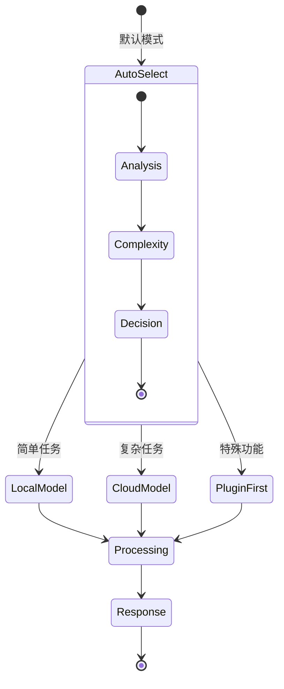

# AI Assistant 现代化UI设计文档

## 概述

本文档描述AI Assistant项目的现代化用户界面设计，包含CLI模式和GUI模式两种交互形式。CLI模式采用类似Claude Code的终端界面设计，支持智能命令解析和多模型路由；GUI模式采用类似LM Studio的桌面应用界面，提供直观的图形化交互体验。

## 技术栈与依赖

### CLI模式技术栈
- **核心框架**: Python 3.9+ 配合 asyncio 异步处理
- **终端UI**: Rich/Textual 提供现代化终端界面
- **命令解析**: argparse + 自定义命令路由
- **HTTP客户端**: aiohttp 异步HTTP客户端
- **WebSocket**: websockets 实时通信
- **Shell集成**: subprocess 调用系统Shell

### GUI模式技术栈
- **桌面框架**: Tauri + React/Vue 或 Electron + React
- **UI组件库**: Ant Design/Material-UI 或 Tailwind CSS
- **状态管理**: Zustand/Redux Toolkit
- **图表可视化**: Recharts/Chart.js
- **主题系统**: CSS变量 + 动态主题切换

## CLI模式架构设计

### 整体架构概览



### 命令系统设计

#### 命令分类架构



#### 命令路由表

| 命令前缀 | 命令类型 | 处理器 | 示例 |
|---------|---------|--------|------|
| `/help` | Meta | MetaCommand | `/help`, `/help chat` |
| `/exit` | Meta | MetaCommand | `/exit`, `/quit` |
| `/clear` | Meta | MetaCommand | `/clear` |
| `/status` | System | SystemCommand | `/status`, `/health` |
| `/plugins` | System | SystemCommand | `/plugins list` |
| `/session` | System | SystemCommand | `/session new`, `/session list` |
| `/bash` | Shell | ShellCommand | `/bash ls -la` |
| `/zsh` | Shell | ShellCommand | `/zsh echo $ZSH_VERSION` |
| `/fish` | Shell | ShellCommand | `/fish echo $FISH_VERSION` |
| `/model` | System | SystemCommand | `/model local`, `/model cloud` |
| 无前缀 | Chat | ChatCommand | 直接对话消息 |

### 会话管理系统



### 终端界面设计

#### 主界面布局

```
╭─────────────────── AI Assistant CLI v2.0.0 ────────────────────╮
│                                                                │
│  🤖 AI Assistant - 智能助手终端界面                              │
│  📍 会话: [abc12345] | 🔗 状态: 已连接 | ⚡ 模型: 自动选择          │
│                                                                │
├────────────────────────────────────────────────────────────────┤
│                                                                │
│  [用户] 今天天气怎么样？                                          │
│                                                                │
│  [AI] 🌤️ 根据当前位置信息，今天是多云天气，温度约22°C...           │
│      └─ 使用: 天气插件 + 本地模型 | ⏱️ 响应时间: 1.2s             │
│                                                                │
│  [用户] /help                                                  │
│                                                                │
│  [系统] 📋 可用命令:                                             │
│        /help     - 显示帮助信息                                 │
│        /exit     - 退出程序                                    │  
│        /status   - 查看系统状态                                 │
│        /bash     - 执行Bash命令                                │
│        直接输入  - 开始对话                                      │
│                                                                │
├────────────────────────────────────────────────────────────────┤
│                                                                │
│  [abc12345] > █                                               │
│                                                                │
╰────────────────────────────────────────────────────────────────╯
```

#### 流式响应显示

```
╭─────────────────── 实时响应 ────────────────────╮
│                                                │
│  [用户] 写一首关于春天的诗                        │
│                                                │
│  [AI] 🎭 正在创作中...                           │
│                                                │
│  春风轻抚大地绿，                                │
│  花开满树香满园，█                               │
│                                                │
│  ┌─ 响应状态 ─────────────────────┐              │
│  │ 📊 进度: ████████░░ 80%        │              │
│  │ 🔄 模型: Gemini Pro (云端)      │              │
│  │ ⏱️ 已用时: 3.2s                │              │
│  │ 🔢 Token: 145/2048             │              │
│  └───────────────────────────────┘              │
│                                                │
╰────────────────────────────────────────────────╯
```

### 核心组件设计

#### CLI主控制器

```python
class ModernCLI:
    """现代化CLI主控制器"""
    
    def __init__(self):
        self.console = Console()
        self.client = EnhancedAIClient()
        self.session_manager = SessionManager()
        self.command_router = CommandRouter()
        self.display_engine = DisplayEngine()
        self.config = CLIConfig()
    
    async def start_interactive_mode(self):
        """启动交互模式"""
        # 显示欢迎界面
        # 初始化会话
        # 进入主循环
        
    async def process_user_input(self, input_text: str):
        """处理用户输入"""
        # 解析命令类型
        # 路由到对应处理器
        # 显示处理结果
```

#### 命令处理器架构

```python
class CommandProcessor:
    """命令处理器基类"""
    
    def __init__(self, cli_controller):
        self.cli = cli_controller
        self.client = cli_controller.client
    
    async def process(self, command: str, args: List[str]) -> CommandResult:
        """处理命令的抽象方法"""
        pass

class ChatProcessor(CommandProcessor):
    """聊天处理器"""
    
    async def process_chat(self, message: str) -> None:
        """处理聊天消息"""
        # 显示用户消息
        # 发送到后端
        # 实时显示AI响应
        
    async def handle_stream_response(self, message: str) -> None:
        """处理流式响应"""
        # 创建进度显示
        # 逐块接收响应
        # 实时更新界面

class ShellProcessor(CommandProcessor):
    """Shell命令处理器"""
    
    async def execute_shell_command(self, shell_type: str, command: str) -> None:
        """执行Shell命令"""
        # 验证Shell类型
        # 执行命令
        # 显示结果
```

## GUI模式架构设计

### 整体架构概览



### 主界面设计布局

#### LM Studio风格界面结构

```
┌─────────────────────────────────────────────────────────────────┐
│ AI Assistant                                    ⚙️ 🔔 👤 - □ ×  │
├─────────────────────┬───────────────────────────────────────────┤
│                     │  📊 系统状态                               │
│  🏠 对话             │  ├─ CPU: ████████░░ 75%                   │
│  📚 模型管理          │  ├─ 内存: █████░░░░░ 45%                  │
│  🔌 插件中心          │  ├─ GPU: ██████████ 95%                   │
│  📈 系统监控          │  └─ 网络: 🟢 已连接                        │
│  ⚙️ 设置             │                                           │
│                     │  🤖 当前模型: qwen3:4b (本地)               │
│                     │  💬 活跃会话: 3                            │
│                     │  📊 今日请求: 127                          │
│                     │                                           │
│                     ├───────────────────────────────────────────┤
│                     │                                           │
│                     │  💬 新建对话                               │
│                     │  ┌─────────────────────────────────────┐ │
│                     │  │ 你好，有什么可以帮助你的吗？           │ │
│                     │  └─────────────────────────────────────┘ │
│                     │                                           │
│                     │  🎯 快速开始:                              │
│                     │  • 📝 写作辅助  • 💻 代码生成              │
│                     │  • 🔍 知识问答  • 🛠️ 工具使用              │
│                     │                                           │
└─────────────────────┴───────────────────────────────────────────┘
```

### 对话界面设计

#### 聊天窗口布局

```
┌─────────────────────────────────────────────────────────────────┐
│ 💬 对话 - 会话001                           🔄 重新生成 ⚙️ 设置    │
├─────────────────────────────────────────────────────────────────┤
│                                                                 │
│  👤 用户 (14:23)                                                │
│  今天天气怎么样？                                                │
│                                                                 │
│  🤖 AI助手 (14:23) ⚡本地模型 + 天气插件                          │
│  ┌─────────────────────────────────────────────────────────┐   │
│  │ 🌤️ 根据当前位置，今天北京天气多云，温度18-25°C，             │
│  │ 有轻微的东南风，湿度65%，紫外线指数中等。                   │
│  │                                                         │
│  │ 建议：                                                   │
│  │ • 可以穿轻薄外套出门                                     │
│  │ • 适合户外活动                                          │
│  │ • 注意防晒                                              │
│  └─────────────────────────────────────────────────────────┘   │
│  📊 响应时间: 1.2s | 💰 成本: 免费 | 🔧 天气插件                  │
│                                                                 │
│  👤 用户 (14:25)                                                │
│  能推荐几个适合今天天气的户外活动吗？                             │
│                                                                 │
│  🤖 AI助手 (14:25) ☁️ 云端模型(复杂推理)                         │
│  ┌─────────────────────────────────────────────────────────┐   │
│  │ 🏃‍♂️ 基于今天的天气条件，推荐以下户外活动：                   │
│  │                                                         │
│  │ 1. 🚴‍♀️ 骑行 (推荐度: ⭐⭐⭐⭐⭐)                            │
│  │    - 温度适宜，微风习习                                  │
│  │    - 建议路线: 奥林匹克公园环线                           │
│  │                                                         │
│  │ 2. 🧗‍♂️ 户外攀岩 (推荐度: ⭐⭐⭐⭐)                           │
│  │    - 多云天气避免强烈日晒                                │
│  │    - 推荐地点: 怀北国际攀岩公园                           │
│  │                                                         │
│  │ 3. 🥾 徒步登山 (推荐度: ⭐⭐⭐⭐)                            │
│  │    - 能见度良好，适合拍照                                │
│  │    - 推荐路线: 香山→植物园环线                           │
│  └─────────────────────────────────────────────────────────┘   │
│  📊 响应时间: 2.8s | 💰 成本: ¥0.05 | ☁️ Gemini Pro             │
│                                                                 │
├─────────────────────────────────────────────────────────────────┤
│  📝 输入消息...                                    🎤 🔗 📎 ➤    │
└─────────────────────────────────────────────────────────────────┘
```

### 模型选择器设计



### 系统状态面板

#### 实时监控界面

```
┌─────────────────── 系统监控 ──────────────────────┐
│                                                  │
│  📊 性能指标                      🔄 自动刷新(5s)  │
│  ┌────────────────┬────────────────────────────┐  │
│  │ CPU使用率      │ ████████░░ 75% (8核)       │  │
│  │ 内存使用率     │ █████░░░░░ 45% (16GB)      │  │
│  │ GPU使用率      │ ██████████ 95% (RTX4090)   │  │
│  │ 磁盘I/O       │ ███░░░░░░░ 25% (SSD)       │  │
│  └────────────────┴────────────────────────────┘  │
│                                                  │
│  🌐 网络状态                                      │
│  ├─ 本地服务: 🟢 正常 (http://localhost:8000)     │
│  ├─ gRPC连接: 🟢 已连接 (延迟: 2ms)              │
│  ├─ 云端API: 🟢 正常 (Gemini Pro)                │
│  └─ WebSocket: 🟢 3个活跃连接                    │
│                                                  │
│  🤖 模型状态                                      │
│  ├─ 本地模型: 🟢 qwen3:4b (已加载)               │
│  ├─ 推理速度: 45 tokens/s                       │
│  ├─ 显存占用: 6.2GB / 24GB                      │
│  └─ 今日调用: 127次                             │
│                                                  │
│  📈 统计数据                                      │
│  ├─ 总对话数: 1,234                             │
│  ├─ 成功率: 99.2%                               │
│  ├─ 平均响应: 1.8s                              │
│  └─ 插件调用: 89次                               │
│                                                  │
└──────────────────────────────────────────────────┘
```

## 核心功能实现设计

### CLI模式核心实现

#### 增强型CLI客户端

```python
class EnhancedCLIClient:
    """增强型CLI客户端，支持现代化终端交互"""
    
    def __init__(self):
        self.console = Console(theme="monokai")
        self.client = AIAssistantClient()
        self.session_manager = SessionManager()
        self.command_parser = CommandParser()
        self.display_engine = RichDisplayEngine()
        self.config = CLIConfig()
        
    async def start(self):
        """启动CLI界面"""
        await self._show_welcome()
        await self._initialize_session()
        await self._main_loop()
        
    async def _main_loop(self):
        """主交互循环"""
        while True:
            try:
                user_input = await self._get_user_input()
                await self._process_input(user_input)
            except KeyboardInterrupt:
                await self._handle_interrupt()
            except Exception as e:
                await self._handle_error(e)
```

#### 智能命令解析器

```python
class CommandParser:
    """智能命令解析器"""
    
    def __init__(self):
        self.commands = {
            '/help': HelpCommand(),
            '/exit': ExitCommand(),
            '/status': StatusCommand(),
            '/plugins': PluginCommand(),
            '/bash': ShellCommand('bash'),
            '/zsh': ShellCommand('zsh'),
            '/fish': ShellCommand('fish'),
            '/model': ModelCommand(),
            '/session': SessionCommand(),
        }
    
    def parse(self, input_text: str) -> Tuple[str, List[str]]:
        """解析用户输入"""
        if input_text.startswith('/'):
            return self._parse_command(input_text)
        else:
            return ('chat', [input_text])
    
    def _parse_command(self, command_text: str) -> Tuple[str, List[str]]:
        """解析/开头的命令"""
        parts = shlex.split(command_text)
        command = parts[0]
        args = parts[1:] if len(parts) > 1 else []
        return (command, args)
```

#### Rich显示引擎

```python
class RichDisplayEngine:
    """基于Rich的现代化显示引擎"""
    
    def __init__(self):
        self.console = Console()
        self.live = None
        
    def display_welcome(self):
        """显示欢迎界面"""
        welcome_panel = Panel(
            "🤖 AI Assistant CLI v2.0.0\n" +
            "现代化智能助手终端界面\n" +
            "输入 '/help' 查看帮助",
            title="欢迎",
            border_style="blue"
        )
        self.console.print(welcome_panel)
        
    def display_chat_message(self, sender: str, message: str, metadata: dict = None):
        """显示聊天消息"""
        timestamp = datetime.now().strftime("%H:%M")
        
        if sender == "user":
            self.console.print(f"[blue]👤 用户[/blue] ({timestamp})")
            self.console.print(f"  {message}\n")
        else:
            model_info = metadata.get('model_used', '未知')
            self.console.print(f"[green]🤖 AI助手[/green] ({timestamp}) ⚡{model_info}")
            
            # 使用面板显示AI响应
            response_panel = Panel(
                Markdown(message),
                border_style="green"
            )
            self.console.print(response_panel)
            
            # 显示元信息
            if metadata:
                meta_info = self._format_metadata(metadata)
                self.console.print(f"[dim]{meta_info}[/dim]\n")
    
    def display_stream_response(self, message_generator):
        """显示流式响应"""
        with Live("", refresh_per_second=10) as live:
            content = ""
            for chunk in message_generator:
                content += chunk.get('content', '')
                
                # 创建实时显示面板
                progress_bar = Progress(
                    SpinnerColumn(),
                    TextColumn("[progress.description]{task.description}"),
                    BarColumn(),
                    TextColumn("[progress.percentage]{task.percentage:>3.0f}%"),
                )
                
                panel = Panel(
                    content + "█",  # 显示光标
                    title="🤖 AI实时响应",
                    border_style="green"
                )
                
                live.update(panel)
```

### GUI模式核心组件

#### React主应用组件

```typescript
// App.tsx
interface AppState {
  currentView: 'chat' | 'models' | 'plugins' | 'monitor' | 'settings';
  systemStatus: SystemStatus;
  chatSessions: ChatSession[];
}

function App() {
  const [state, setState] = useState<AppState>({
    currentView: 'chat',
    systemStatus: null,
    chatSessions: []
  });
  
  return (
    <div className="app-container">
      <Sidebar 
        currentView={state.currentView}
        onViewChange={(view) => setState({...state, currentView: view})}
      />
      <MainContent view={state.currentView} />
      <StatusBar systemStatus={state.systemStatus} />
    </div>
  );
}
```

#### 聊天界面组件

```typescript
// ChatInterface.tsx
interface ChatInterfaceProps {
  sessionId: string;
}

function ChatInterface({ sessionId }: ChatInterfaceProps) {
  const [messages, setMessages] = useState<Message[]>([]);
  const [inputValue, setInputValue] = useState('');
  const [isStreaming, setIsStreaming] = useState(false);
  
  const handleSendMessage = async (message: string) => {
    setIsStreaming(true);
    
    try {
      const response = await apiClient.sendMessage({
        message,
        sessionId,
        stream: true
      });
      
      // 处理流式响应
      for await (const chunk of response) {
        setMessages(prev => updateLastMessage(prev, chunk));
      }
    } finally {
      setIsStreaming(false);
    }
  };
  
  return (
    <div className="chat-interface">
      <MessageList 
        messages={messages}
        isStreaming={isStreaming}
      />
      <MessageInput 
        value={inputValue}
        onChange={setInputValue}
        onSend={handleSendMessage}
        disabled={isStreaming}
      />
    </div>
  );
}
```

#### 模型选择器组件

```typescript
// ModelSelector.tsx
interface ModelSelectorProps {
  currentModel: ModelType;
  onModelChange: (model: ModelType) => void;
}

function ModelSelector({ currentModel, onModelChange }: ModelSelectorProps) {
  const models = [
    {
      id: 'auto',
      name: '智能选择',
      description: '根据任务复杂度自动选择最佳模型',
      icon: '🧠'
    },
    {
      id: 'local',
      name: '本地模型',
      description: 'qwen3:4b - 快速响应，成本低',
      icon: '🏠'
    },
    {
      id: 'cloud',
      name: '云端模型',
      description: 'Gemini Pro - 强大推理能力',
      icon: '☁️'
    }
  ];
  
  return (
    <div className="model-selector">
      {models.map(model => (
        <ModelCard
          key={model.id}
          model={model}
          selected={currentModel === model.id}
          onClick={() => onModelChange(model.id)}
        />
      ))}
    </div>
  );
}
```

## 技术实现细节

### CLI模式技术实现

#### 依赖包管理

```python
# requirements-cli.txt
rich>=13.0.0              # 现代化终端UI
textual>=0.41.0           # 高级终端应用框架
asyncio-compat>=0.21.0    # 异步兼容性
aiohttp>=3.8.0            # HTTP异步客户端
websockets>=11.0.0        # WebSocket支持
click>=8.0.0              # CLI框架增强
colorama>=0.4.6           # 跨平台颜色支持
psutil>=5.9.0             # 系统信息获取
typer>=0.9.0              # 现代CLI框架
```

#### Shell集成实现

```python
class ShellExecutor:
    """Shell命令执行器"""
    
    SUPPORTED_SHELLS = {
        'bash': '/bin/bash',
        'zsh': '/bin/zsh', 
        'fish': '/usr/bin/fish',
        'powershell': 'powershell.exe',
        'cmd': 'cmd.exe'
    }
    
    def __init__(self):
        self.current_shell = self._detect_shell()
        
    async def execute(self, shell_type: str, command: str) -> ExecutionResult:
        """执行Shell命令"""
        if shell_type not in self.SUPPORTED_SHELLS:
            return ExecutionResult(error=f"不支持的Shell类型: {shell_type}")
        
        shell_path = self.SUPPORTED_SHELLS[shell_type]
        
        try:
            process = await asyncio.create_subprocess_shell(
                f"{shell_path} -c '{command}'",
                stdout=asyncio.subprocess.PIPE,
                stderr=asyncio.subprocess.PIPE
            )
            
            stdout, stderr = await process.communicate()
            
            return ExecutionResult(
                stdout=stdout.decode(),
                stderr=stderr.decode(),
                return_code=process.returncode,
                command=command,
                shell=shell_type
            )
            
        except Exception as e:
            return ExecutionResult(error=str(e))
```

### GUI模式技术实现

#### Tauri配置

```json
// tauri.conf.json
{
  "build": {
    "beforeBuildCommand": "npm run build",
    "beforeDevCommand": "npm run dev",
    "devPath": "http://localhost:3000",
    "distDir": "../dist"
  },
  "package": {
    "productName": "AI Assistant",
    "version": "2.0.0"
  },
  "tauri": {
    "windows": [{
      "title": "AI Assistant",
      "width": 1200,
      "height": 800,
      "minWidth": 800,
      "minHeight": 600,
      "theme": "auto"
    }],
    "security": {
      "csp": "default-src 'self'; connect-src 'self' http://localhost:8000 ws://localhost:8000"
    }
  }
}
```

#### API客户端实现

```typescript
// api/client.ts
class APIClient {
  private baseURL = 'http://localhost:8000/api/v1';
  private wsURL = 'ws://localhost:8000/ws';
  
  async sendMessage(request: ChatRequest): Promise<ChatResponse> {
    const response = await fetch(`${this.baseURL}/chat`, {
      method: 'POST',
      headers: {
        'Content-Type': 'application/json',
      },
      body: JSON.stringify(request)
    });
    
    return response.json();
  }
  
  async *sendStreamMessage(request: ChatRequest): AsyncGenerator<ChatChunk> {
    const response = await fetch(`${this.baseURL}/chat/stream`, {
      method: 'POST',
      headers: {
        'Content-Type': 'application/json',
      },
      body: JSON.stringify(request)
    });
    
    const reader = response.body?.getReader();
    if (!reader) return;
    
    while (true) {
      const { done, value } = await reader.read();
      if (done) break;
      
      const chunk = new TextDecoder().decode(value);
      const lines = chunk.split('\n');
      
      for (const line of lines) {
        if (line.startsWith('data: ')) {
          try {
            const data = JSON.parse(line.slice(6));
            yield data;
          } catch (e) {
            // 忽略解析错误
          }
        }
      }
    }
  }
  
  async getSystemStatus(): Promise<SystemStatus> {
    const response = await fetch(`${this.baseURL}/system/status`);
    return response.json();
  }
}
```

## 用户体验优化

### CLI模式体验优化

#### 智能补全系统

```python
class IntelligentCompleter:
    """智能命令补全"""
    
    def __init__(self):
        self.command_history = []
        self.context_cache = {}
        
    def get_completions(self, partial_input: str) -> List[str]:
        """获取补全建议"""
        if partial_input.startswith('/'):
            return self._complete_command(partial_input)
        else:
            return self._complete_chat_context(partial_input)
    
    def _complete_command(self, partial: str) -> List[str]:
        """补全命令"""
        commands = ['/help', '/exit', '/status', '/plugins', '/bash', '/zsh', '/fish']
        return [cmd for cmd in commands if cmd.startswith(partial)]
    
    def _complete_chat_context(self, partial: str) -> List[str]:
        """基于上下文补全聊天内容"""
        # 基于历史对话和常用短语提供智能补全
        common_phrases = [
            "今天天气怎么样？",
            "帮我写一个...",
            "解释一下...",
            "如何实现..."
        ]
        return [phrase for phrase in common_phrases if partial.lower() in phrase.lower()]
```

#### 快捷键系统

```python
class KeybindingManager:
    """快捷键管理器"""
    
    KEYBINDINGS = {
        'ctrl+c': 'interrupt',
        'ctrl+d': 'exit', 
        'ctrl+l': 'clear_screen',
        'ctrl+r': 'search_history',
        'tab': 'complete',
        'up': 'previous_command',
        'down': 'next_command',
        'ctrl+shift+s': 'save_session',
        'ctrl+n': 'new_session'
    }
    
    def handle_key(self, key: str) -> Optional[str]:
        """处理按键事件"""
        return self.KEYBINDINGS.get(key)
```

### GUI模式体验优化

#### 响应式设计

```css
/* styles/responsive.css */
.app-container {
  display: grid;
  grid-template-columns: 250px 1fr;
  grid-template-rows: 1fr 40px;
  height: 100vh;
}

/* 平板适配 */
@media (max-width: 1024px) {
  .app-container {
    grid-template-columns: 200px 1fr;
  }
  
  .sidebar {
    width: 200px;
  }
}

/* 移动端适配 */
@media (max-width: 768px) {
  .app-container {
    grid-template-columns: 1fr;
    grid-template-rows: 60px 1fr 40px;
  }
  
  .sidebar {
    transform: translateX(-100%);
    transition: transform 0.3s ease;
  }
  
  .sidebar.open {
    transform: translateX(0);
  }
}
```

#### 主题系统

```typescript
// theme/ThemeProvider.tsx
interface Theme {
  primary: string;
  secondary: string;
  background: string;
  surface: string;
  text: string;
  textSecondary: string;
}

const themes: Record<string, Theme> = {
  light: {
    primary: '#1976d2',
    secondary: '#dc004e', 
    background: '#ffffff',
    surface: '#f5f5f5',
    text: '#000000',
    textSecondary: '#666666'
  },
  dark: {
    primary: '#90caf9',
    secondary: '#f48fb1',
    background: '#121212',
    surface: '#1e1e1e', 
    text: '#ffffff',
    textSecondary: '#b0b0b0'
  },
  auto: {
    // 根据系统主题自动切换
  }
};

function ThemeProvider({ children }: { children: React.ReactNode }) {
  const [currentTheme, setCurrentTheme] = useState('auto');
  
  useEffect(() => {
    if (currentTheme === 'auto') {
      const mediaQuery = window.matchMedia('(prefers-color-scheme: dark)');
      setCurrentTheme(mediaQuery.matches ? 'dark' : 'light');
      
      mediaQuery.addListener((e) => {
        setCurrentTheme(e.matches ? 'dark' : 'light');
      });
    }
  }, [currentTheme]);
  
  return (
    <ThemeContext.Provider value={themes[currentTheme]}>
      {children}
    </ThemeContext.Provider>
  );
}
```

## 性能优化与安全考虑

### 性能优化策略

#### CLI模式性能优化

```python
class PerformanceOptimizer:
    """CLI性能优化器"""
    
    def __init__(self):
        self.render_cache = {}
        self.lazy_loading = True
        
    async def optimized_render(self, content: str) -> None:
        """优化渲染性能"""
        # 使用缓存避免重复渲染
        content_hash = hash(content)
        if content_hash in self.render_cache:
            return self.render_cache[content_hash]
        
        # 延迟加载和批量更新
        if self.lazy_loading:
            await self._lazy_render(content)
        else:
            await self._immediate_render(content)
        
        self.render_cache[content_hash] = content
```

#### GUI模式性能优化

```typescript
// performance/VirtualizedList.tsx
interface VirtualizedListProps {
  items: any[];
  itemHeight: number;
  containerHeight: number;
  renderItem: (item: any, index: number) => React.ReactNode;
}

function VirtualizedList({ items, itemHeight, containerHeight, renderItem }: VirtualizedListProps) {
  const [scrollTop, setScrollTop] = useState(0);
  
  const visibleItems = useMemo(() => {
    const startIndex = Math.floor(scrollTop / itemHeight);
    const endIndex = Math.min(
      startIndex + Math.ceil(containerHeight / itemHeight) + 1,
      items.length
    );
    
    return items.slice(startIndex, endIndex).map((item, index) => ({
      item,
      index: startIndex + index
    }));
  }, [items, scrollTop, itemHeight, containerHeight]);
  
  return (
    <div 
      className="virtualized-container"
      style={{ height: containerHeight, overflow: 'auto' }}
      onScroll={(e) => setScrollTop(e.currentTarget.scrollTop)}
    >
      <div style={{ height: items.length * itemHeight, position: 'relative' }}>
        {visibleItems.map(({ item, index }) => (
          <div
            key={index}
            style={{
              position: 'absolute',
              top: index * itemHeight,
              height: itemHeight,
              width: '100%'
            }}
          >
            {renderItem(item, index)}
          </div>
        ))}
      </div>
    </div>
  );
}
```

### 安全考虑

#### Shell命令安全验证

```python
class SecurityValidator:
    """安全验证器"""
    
    DANGEROUS_COMMANDS = {
        'rm -rf /', 'sudo rm -rf /', 'dd if=/dev/zero',
        'mkfs', 'fdisk', 'parted', ':(){:|:&};:',
        'chmod -R 777 /', 'chown -R root:root /'
    }
    
    DANGEROUS_PATTERNS = [
        r'rm\s+-rf\s+/',
        r'sudo\s+rm\s+-rf',
        r'dd\s+if=/dev/(?:zero|urandom)',
        r'mkfs\.',
        r':\(\){:\|:&};:',
        r'>/dev/sd[a-z]',
    ]
    
    def validate_shell_command(self, command: str) -> ValidationResult:
        """验证Shell命令安全性"""
        # 检查危险命令
        if command.strip() in self.DANGEROUS_COMMANDS:
            return ValidationResult(
                valid=False,
                reason="检测到危险命令，已阻止执行"
            )
        
        # 检查危险模式
        for pattern in self.DANGEROUS_PATTERNS:
            if re.search(pattern, command, re.IGNORECASE):
                return ValidationResult(
                    valid=False,
                    reason=f"检测到危险操作模式: {pattern}，已阻止执行"
                )
        
        return ValidationResult(valid=True)
```

#### API安全措施

```typescript
// security/APISecure.ts
class APISecurityManager {
  private rateLimiter = new Map<string, number[]>();
  private readonly maxRequestsPerMinute = 60;
  
  validateRequest(request: any): ValidationResult {
    // 请求频率限制
    if (!this.checkRateLimit(request.clientId)) {
      return { valid: false, reason: '请求频率过高' };
    }
    
    // 输入验证
    if (!this.validateInput(request)) {
      return { valid: false, reason: '输入参数无效' };
    }
    
    // 内容安全检查
    if (!this.checkContentSafety(request.message)) {
      return { valid: false, reason: '内容包含不安全元素' };
    }
    
    return { valid: true };
  }
  
  private checkRateLimit(clientId: string): boolean {
    const now = Date.now();
    const requests = this.rateLimiter.get(clientId) || [];
    
    // 清理1分钟前的请求
    const recentRequests = requests.filter(time => now - time < 60000);
    
    if (recentRequests.length >= this.maxRequestsPerMinute) {
      return false;
    }
    
    recentRequests.push(now);
    this.rateLimiter.set(clientId, recentRequests);
    return true;
  }
}
```

## 测试策略

### CLI模式测试

```python
# tests/test_cli.py
import pytest
from unittest.mock import AsyncMock, MagicMock
from cli.enhanced_client import EnhancedCLIClient
from cli.command_parser import CommandParser

class TestCLIInterface:
    """CLI界面测试"""
    
    @pytest.fixture
    def cli_client(self):
        return EnhancedCLIClient()
    
    @pytest.fixture 
    def command_parser(self):
        return CommandParser()
    
    async def test_command_parsing(self, command_parser):
        """测试命令解析"""
        # 测试聊天消息
        command, args = command_parser.parse("hello world")
        assert command == "chat"
        assert args == ["hello world"]
        
        # 测试系统命令
        command, args = command_parser.parse("/status")
        assert command == "/status"
        assert args == []
        
        # 测试Shell命令
        command, args = command_parser.parse("/bash ls -la")
        assert command == "/bash"
        assert args == ["ls", "-la"]
    
    async def test_shell_execution(self):
        """测试Shell执行"""
        from cli.shell_executor import ShellExecutor
        
        executor = ShellExecutor()
        result = await executor.execute('bash', 'echo "test"')
        
        assert result.return_code == 0
        assert "test" in result.stdout
    
    async def test_security_validation(self):
        """测试安全验证"""
        from cli.security import SecurityValidator
        
        validator = SecurityValidator()
        
        # 测试安全命令
        result = validator.validate_shell_command("ls -la")
        assert result.valid == True
        
        # 测试危险命令
        result = validator.validate_shell_command("rm -rf /")
        assert result.valid == False
```

### GUI模式测试

```typescript
// tests/components/ChatInterface.test.tsx
import { render, screen, waitFor } from '@testing-library/react';
import userEvent from '@testing-library/user-event';
import { ChatInterface } from '../src/components/ChatInterface';
import { APIClient } from '../src/api/client';

// Mock API客户端
jest.mock('../src/api/client');
const mockAPIClient = APIClient as jest.MockedClass<typeof APIClient>;

describe('ChatInterface', () => {
  beforeEach(() => {
    mockAPIClient.mockClear();
  });
  
  test('发送消息并显示响应', async () => {
    const mockResponse = {
      content: '这是AI的回复',
      model_used: 'local',
      session_id: 'test-session'
    };
    
    mockAPIClient.prototype.sendMessage.mockResolvedValue(mockResponse);
    
    render(<ChatInterface sessionId="test-session" />);
    
    const input = screen.getByPlaceholderText('输入消息...');
    const sendButton = screen.getByText('发送');
    
    await userEvent.type(input, '你好');
    await userEvent.click(sendButton);
    
    await waitFor(() => {
      expect(screen.getByText('这是AI的回复')).toBeInTheDocument();
    });
  });
  
  test('流式响应显示', async () => {
    const mockStream = [
      { content: '这是' },
      { content: 'AI的' },
      { content: '回复' }
    ];
    
    mockAPIClient.prototype.sendStreamMessage.mockImplementation(
      async function* () {
        for (const chunk of mockStream) {
          yield chunk;
        }
      }
    );
    
    render(<ChatInterface sessionId="test-session" />);
    
    const input = screen.getByPlaceholderText('输入消息...');
    await userEvent.type(input, '写一首诗');
    await userEvent.keyboard('{Enter}');
    
    await waitFor(() => {
      expect(screen.getByText('这是AI的回复')).toBeInTheDocument();
    });
  });
});
```


