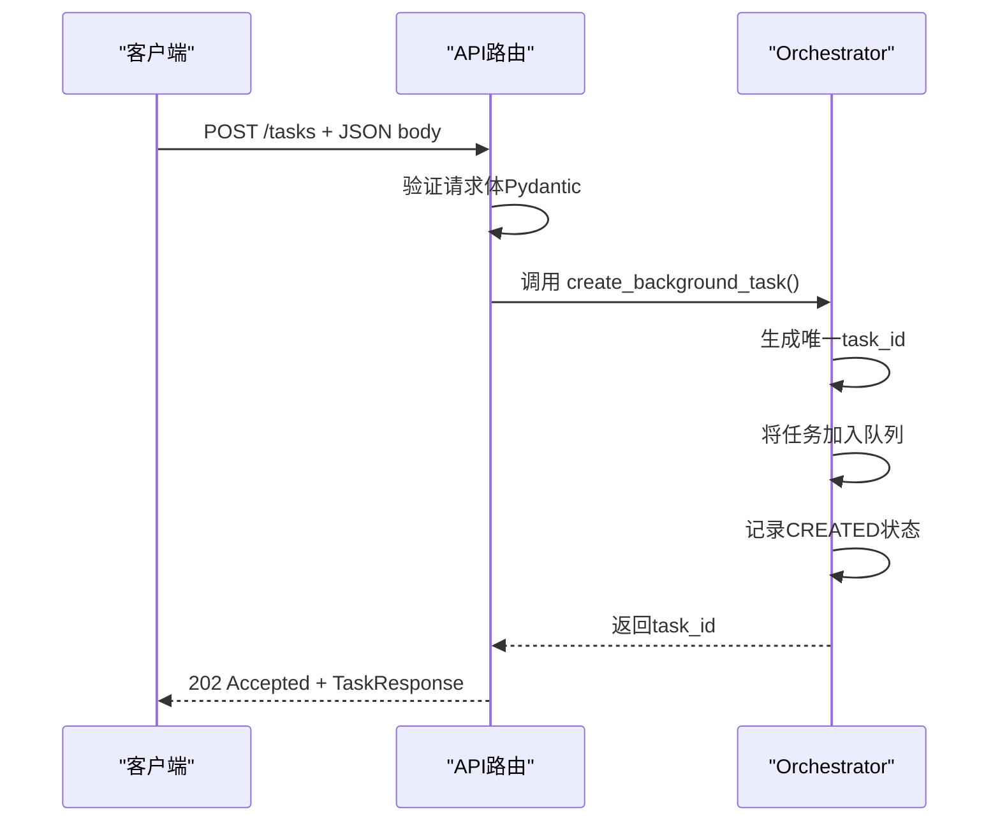

# 任务创建API

<cite>
**本文档引用的文件**
- [api_router.py](file://python/agent/api_router.py)
- [schemas.py](file://python/models/schemas.py)
- [orchestrator.py](file://python/agent/orchestrator.py)
- [main.py](file://python/main.py)
- [dependencies.py](file://python/core/dependencies.py)
</cite>

## 目录
1. [简介](#简介)
2. [请求体结构](#请求体结构)
3. [接口工作流程](#接口工作流程)
4. [JSON请求示例](#json请求示例)
5. [响应格式](#响应格式)
6. [输入验证机制](#输入验证机制)
7. [常见错误情况](#常见错误情况)
8. [异步处理与任务ID使用](#异步处理与任务id使用)

## 简介
`POST /tasks` 接口用于创建后台任务，通过该端点客户端可以提交任务请求，系统将返回任务ID供后续查询。此接口由FastAPI框架驱动，利用依赖注入获取调度器实例，并通过Pydantic模型进行数据验证。

**Section sources**
- [api_router.py](file://python/agent/api_router.py#L39-L82)
- [main.py](file://python/main.py#L0-L119)

## 请求体结构
任务请求体基于 `TaskRequest` Pydantic 模型定义，包含以下字段：

| 字段名 | 类型 | 是否必需 | 描述 |
|--------|------|----------|------|
| task_type | string | 是 | 任务类型标识符，用于区分不同种类的任务 |
| description | string | 是 | 任务描述信息，说明任务目的或内容 |
| parameters | object (dict) | 否 | 参数字典，传递具体执行所需的键值对参数 |
| priority | integer | 否 | 任务优先级（1-10），数值越大优先级越高，默认为1 |
| timeout_seconds | integer | 否 | 超时时间（秒），任务执行超过该时间将被终止 |

这些字段在 `TaskRequest` 类中通过 `Field` 显式定义了描述和默认值，确保清晰的语义和良好的文档生成能力。

**Section sources**
- [schemas.py](file://python/models/schemas.py#L55-L61)

## 接口工作流程
当客户端发送 `POST /tasks` 请求后，系统按如下流程处理：



**Diagram sources**
- [api_router.py](file://python/agent/api_router.py#L39-L82)
- [orchestrator.py](file://python/agent/orchestrator.py#L300-L320)

## JSON请求示例
以下是一个完整的有效请求示例：

```json
{
  "task_type": "data_processing",
  "description": "处理用户上传的数据文件并生成分析报告",
  "parameters": {
    "input_file": "user_uploads/report.csv",
    "output_format": "pdf",
    "include_summary": true,
    "analysis_type": "trend"
  },
  "priority": 5,
  "timeout_seconds": 300
}
```

该请求表示一个中等优先级的数据处理任务，携带多个自定义参数用于控制处理行为。

**Section sources**
- [schemas.py](file://python/models/schemas.py#L55-L61)

## 响应格式
成功创建任务时，服务器返回 **202 Accepted** 状态码及如下响应体：

```json
{
  "task_id": "a1b2c3d4-e5f6-7890-g1h2-i3j4k5l6m7n8",
  "status": "created",
  "message": "任务已创建",
  "created_at": "2024-01-01T12:00:00Z",
  "updated_at": "2024-01-01T12:00:00Z"
}
```

其中：
- `task_id`：全局唯一UUID，用于后续查询任务状态
- `status`：当前状态为 `"created"`，表示任务已进入队列
- `message`：人类可读的状态消息
- `created_at` 和 `updated_at`：ISO 8601时间戳

**Section sources**
- [schemas.py](file://python/models/schemas.py#L64-L73)

## 输入验证机制
系统使用 **Pydantic 模型验证** 对输入进行严格校验：

- 所有必填字段（如 `task_type`, `description`）缺失时会自动拒绝请求
- 字段类型不匹配（如字符串传入数字）将触发400错误
- 枚举值、范围限制等约束条件均在模型层定义并强制执行
- FastAPI 自动捕获验证异常并转换为标准HTTP 400响应

验证过程发生在进入路由函数之前，确保只有合法请求才能调用业务逻辑。

**Section sources**
- [schemas.py](file://python/models/schemas.py#L55-L61)
- [api_router.py](file://python/agent/api_router.py#L39-L82)

## 常见错误情况
以下是可能遇到的错误及其修复方法：

| 错误代码 | 原因 | 修复建议 |
|---------|------|---------|
| 400 Bad Request | 缺少必填字段或类型错误 | 检查JSON结构，确保所有必需字段存在且类型正确 |
| 401 Unauthorized | 未提供认证头或API密钥无效 | 添加 `Authorization: Bearer <your_api_key>` 头部 |
| 422 Unprocessable Entity | 参数不符合预期格式 | 参考文档检查 `parameters` 字典中的嵌套结构 |
| 500 Internal Server Error | 服务内部异常 | 检查服务日志，联系管理员排查问题 |

特别注意：若 `priority` 不在1-10范围内或 `timeout_seconds` 为负数，也会导致400错误。

**Section sources**
- [api_router.py](file://python/agent/api_router.py#L82)
- [dependencies.py](file://python/core/dependencies.py#L10-L18)

## 异步处理与任务ID使用
客户端应在收到 `202 Accepted` 后，使用返回的 `task_id` 定期轮询任务状态：

1. 使用 `GET /tasks/{task_id}` 查询当前状态
2. 若状态为 `running`，继续等待并重试
3. 若状态为 `completed`，获取结果数据
4. 若状态为 `failed`，读取 `error` 字段了解失败原因

推荐轮询间隔为每5-10秒一次，避免过度请求。长期任务建议结合WebSocket实现事件通知机制以提高效率。

**Section sources**
- [api_router.py](file://python/agent/api_router.py#L85-L103)
- [orchestrator.py](file://python/agent/orchestrator.py#L322-L335)