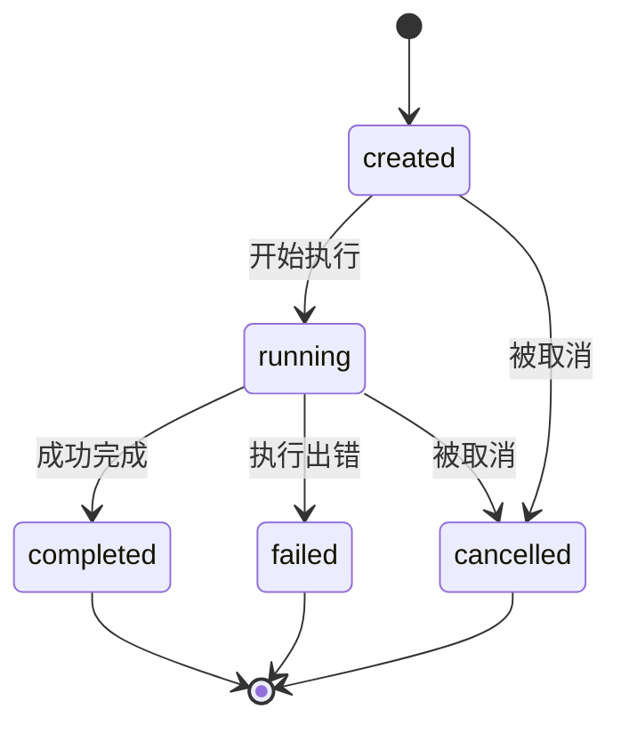
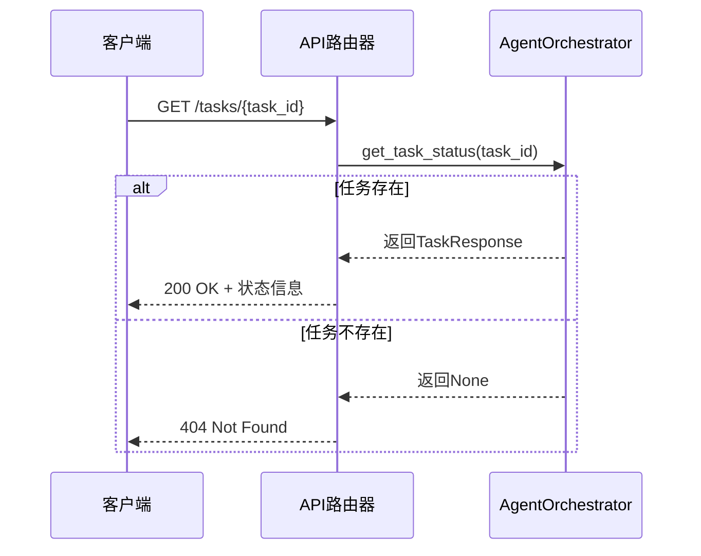

# 任务状态查询API

<cite>
**本文档引用的文件**
- [api_router.py](file://python/agent/api_router.py)
- [schemas.py](file://python/models/schemas.py)
- [orchestrator.py](file://python/agent/orchestrator.py)
</cite>

## 目录
1. [简介](#简介)
2. [核心组件](#核心组件)
3. [任务生命周期与状态管理](#任务生命周期与状态管理)
4. [状态查询流程](#状态查询流程)
5. [HTTP响应规范](#http响应规范)
6. [轮询策略最佳实践](#轮询策略最佳实践)
7. [超时与资源清理机制](#超时与资源清理机制)

## 简介
本文档详细说明了`GET /tasks/{task_id}`端点的工作机制，涵盖任务从创建到完成或失败的完整生命周期。文档描述了系统如何通过内存存储管理任务状态，以及客户端如何通过API获取任务上下文。同时提供了关于HTTP状态码、响应体结构、轮询策略和超时处理的最佳实践建议。

## 核心组件

该功能涉及三个主要组件：API路由处理器、任务响应模型和调度器核心逻辑。API路由负责接收HTTP请求并调用调度器方法；任务响应模型定义了返回数据的结构；调度器则维护着所有活动任务的状态。

**Section sources**
- [api_router.py](file://python/agent/api_router.py#L85-L119)
- [schemas.py](file://python/models/schemas.py#L64-L87)
- [orchestrator.py](file://python/agent/orchestrator.py#L305-L343)

## 任务生命周期与状态管理

系统中的任务经历以下几种状态：
- **created（已创建）**：任务已被提交至队列但尚未开始执行
- **running（运行中）**：任务正在被处理
- **completed（已完成）**：任务成功执行完毕
- **failed（失败）**：任务执行过程中发生错误
- **cancelled（已取消）**：任务被显式取消

这些状态由`TaskStatus`枚举类定义，并在`AgentOrchestrator`的`active_tasks`字典中进行跟踪。每个任务ID作为键，其对应的状态对象作为值保存在内存中。



**Diagram sources**
- [schemas.py](file://python/models/schemas.py#L40-L61)
- [orchestrator.py](file://python/agent/orchestrator.py#L30-L70)

**Section sources**
- [schemas.py](file://python/models/schemas.py#L40-L61)
- [orchestrator.py](file://python/agent/orchestrator.py#L30-L70)

## 状态查询流程

当客户端发起`GET /tasks/{task_id}`请求时，系统按照以下步骤处理：

1. API路由器接收到请求并提取`task_id`
2. 调用`AgentOrchestrator.get_task_status(task_id)`方法
3. 检查`active_tasks`字典中是否存在该任务ID
4. 若存在，则构造包含当前状态的`TaskResponse`对象
5. 若不存在，则返回`None`，触发404异常

任务上下文信息主要存储在内存的`active_tasks`字典中。对于更复杂的持久化需求，系统可通过扩展`_process_background_task`方法来集成数据库或其他持久化存储机制。



**Diagram sources**
- [api_router.py](file://python/agent/api_router.py#L85-L119)
- [orchestrator.py](file://python/agent/orchestrator.py#L305-L343)

**Section sources**
- [api_router.py](file://python/agent/api_router.py#L85-L119)
- [orchestrator.py](file://python/agent/orchestrator.py#L305-L343)

## HTTP响应规范

### 响应状态码
| 状态码 | 含义 | 触发条件 |
|--------|------|----------|
| 200 OK | 请求成功 | 找到指定任务并返回状态 |
| 404 Not Found | 任务不存在 | 提供的task_id在系统中找不到 |
| 500 Internal Server Error | 服务器内部错误 | 系统处理请求时发生未预期的异常 |

### 响应体结构
成功的响应将返回一个符合`TaskResponse`模型的JSON对象：

```json
{
  "task_id": "string",
  "status": "created|running|completed|failed|cancelled",
  "progress": 0.0-1.0,
  "result": "any",
  "error": "string",
  "created_at": "datetime",
  "updated_at": "datetime",
  "message": "string"
}
```

其中`progress`字段根据状态自动填充：`running`状态为0.5，`completed`为1.0，其他状态为0.0。

**Section sources**
- [schemas.py](file://python/models/schemas.py#L64-L87)
- [api_router.py](file://python/agent/api_router.py#L85-L119)

## 轮询策略最佳实践

对于需要监控长时间运行任务的客户端，推荐采用以下轮询策略：

1. **初始间隔**：开始时使用较短的轮询间隔（如1秒）
2. **指数退避**：若任务仍在运行，逐步增加轮询间隔（如每次乘以1.5）
3. **最大间隔限制**：设置最大轮询间隔（建议不超过30秒）
4. **终止条件判断**：
   - 收到`completed`或`failed`状态时停止轮询
   - 达到预设的最大等待时间后放弃
   - 用户主动取消监控

示例伪代码：
```python
interval = 1  # 初始1秒
max_interval = 30
max_wait_time = 300  # 最大等待5分钟

while elapsed_time < max_wait_time:
    status = get_task_status(task_id)
    if status.status in ['completed', 'failed']:
        break
    sleep(interval)
    interval = min(interval * 1.5, max_interval)
    elapsed_time += interval
```

**Section sources**
- [orchestrator.py](file://python/agent/orchestrator.py#L305-L343)

## 超时与资源清理机制

虽然当前实现中没有明确的任务超时阈值，但从架构设计角度建议添加以下机制：

1. **超时阈值**：为每个任务设置默认300秒的超时时间，可通过`TaskRequest.timeout_seconds`参数覆盖
2. **定时清理**：在`_task_processor`循环中定期检查超过时限的任务并标记为`failed`
3. **资源回收**：当任务进入终态（completed/failed/cancelled）后，应在一定延迟后从`active_tasks`中移除，防止内存泄漏
4. **健康检查集成**：利用现有的组件健康检查机制，在系统资源不足时暂停新任务的创建

目前系统的资源清理主要依赖于`cleanup()`方法，在服务关闭时清除所有缓存。未来可扩展为基于LRU（最近最少使用）算法的动态内存管理策略。

**Section sources**
- [orchestrator.py](file://python/agent/orchestrator.py#L432-L469)
- [orchestrator.py](file://python/agent/orchestrator.py#L30-L70)