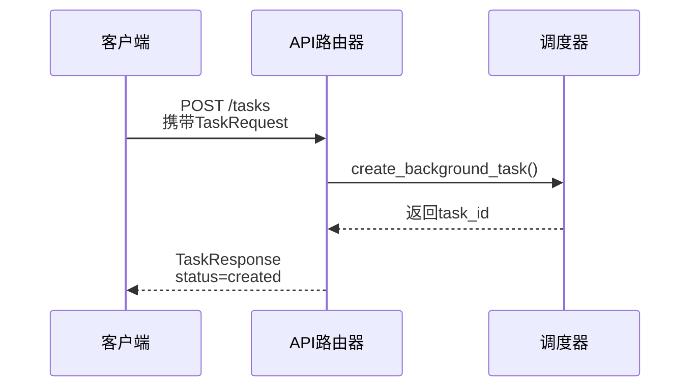
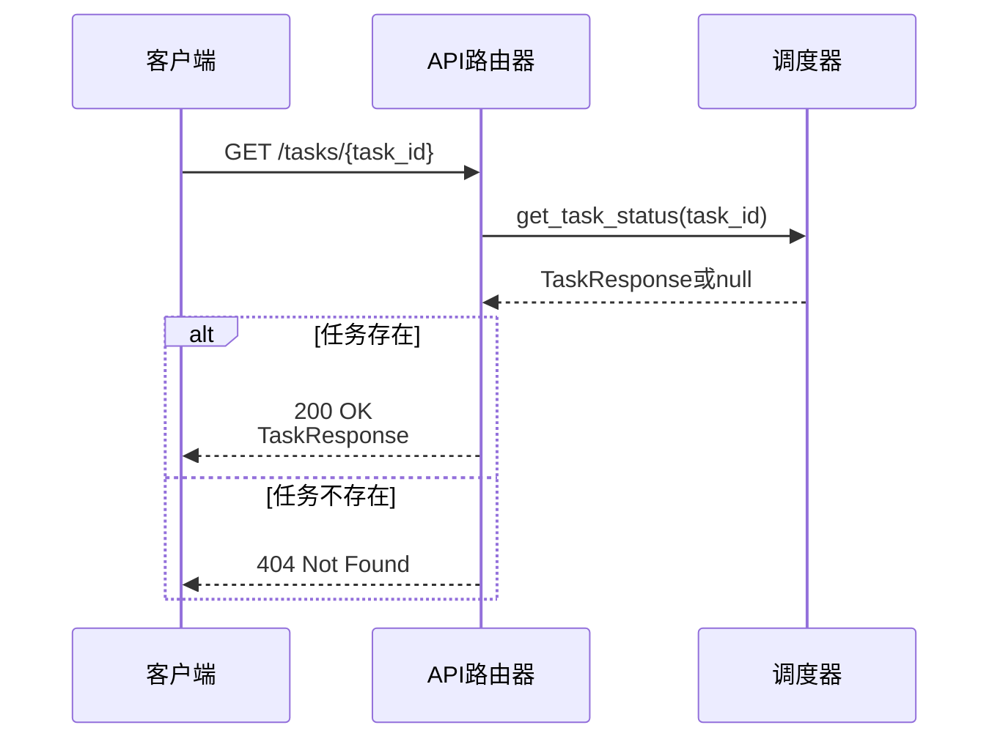
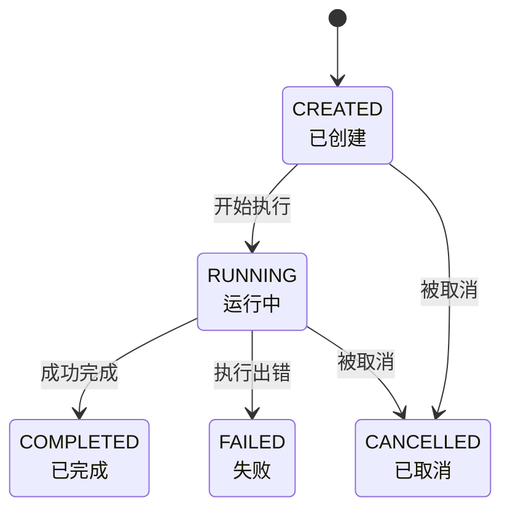
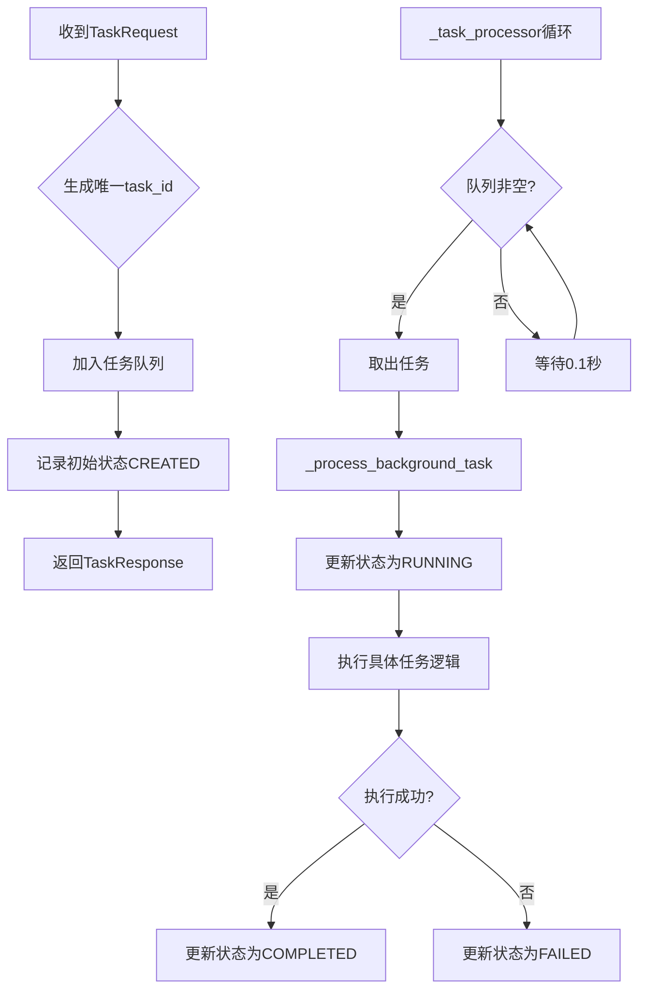
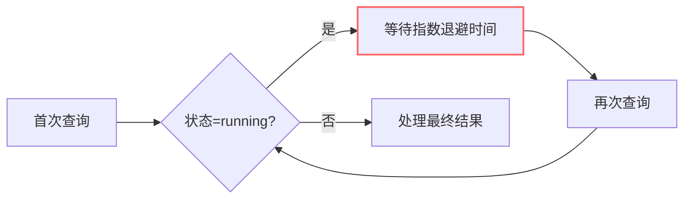
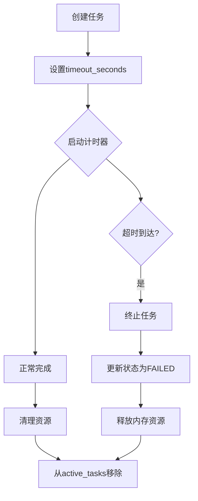

# 任务管理API

<cite>
**本文档引用的文件**
- [api_router.py](file://python/agent/api_router.py)
- [orchestrator.py](file://python/agent/orchestrator.py)
- [schemas.py](file://python/models/schemas.py)
</cite>

## 目录
1. [简介](#简介)
2. [核心端点说明](#核心端点说明)
3. [任务请求模型](#任务请求模型)
4. [任务状态生命周期](#任务状态生命周期)
5. [任务调度与执行流程](#任务调度与执行流程)
6. [状态查询与轮询最佳实践](#状态查询与轮询最佳实践)
7. [超时策略与资源清理](#超时策略与资源清理)
8. [错误处理与调试建议](#错误处理与调试建议)
9. [客户端实现建议](#客户端实现建议)

## 简介
本文档详细说明了任务管理API的核心功能，包括任务创建、状态查询和结果获取。系统通过`AgentOrchestrator`组件协调后台任务的调度与执行，并使用内存存储跟踪任务状态。所有任务操作均通过RESTful API接口暴露，支持异步处理长时间运行的任务。

**Section sources**
- [orchestrator.py](file://python/agent/orchestrator.py#L1-L50)
- [api_router.py](file://python/agent/api_router.py#L1-L50)

## 核心端点说明

### 任务创建 (POST /tasks)
用于创建新的后台任务。成功后返回任务ID和初始状态。



**Diagram sources**
- [api_router.py](file://python/agent/api_router.py#L40-L83)
- [orchestrator.py](file://python/agent/orchestrator.py#L267-L308)

### 任务状态查询 (GET /tasks/{task_id})
根据任务ID查询当前任务的状态信息。



**Diagram sources**
- [api_router.py](file://python/agent/api_router.py#L86-L120)
- [orchestrator.py](file://python/agent/orchestrator.py#L305-L346)

## 任务请求模型
定义了创建任务时所需的请求体结构。

| 字段 | 类型 | 必需 | 描述 |
|------|------|------|------|
| task_type | string | 是 | 任务类型标识符 |
| description | string | 是 | 任务描述信息 |
| parameters | object | 否 | 任务执行参数（键值对） |
| priority | integer | 否 | 任务优先级（1-10，默认为1） |
| timeout_seconds | integer | 否 | 任务超时时间（秒），超过则自动终止 |

**Section sources**
- [schemas.py](file://python/models/schemas.py#L55-L61)

## 任务状态生命周期
任务在系统中经历一系列预定义的状态转换。



**Diagram sources**
- [schemas.py](file://python/models/schemas.py#L17-L23)
- [orchestrator.py](file://python/agent/orchestrator.py#L267-L308)

## 任务调度与执行流程
`AgentOrchestrator`负责管理所有后台任务的调度与执行。



**Diagram sources**
- [orchestrator.py](file://python/agent/orchestrator.py#L67-L102)
- [orchestrator.py](file://python/agent/orchestrator.py#L374-L410)

## 状态查询与轮询最佳实践
推荐的客户端轮询策略以避免过度请求。



**Section sources**
- [api_router.py](file://python/agent/api_router.py#L86-L120)
- [orchestrator.py](file://python/agent/orchestrator.py#L305-L346)

## 超时策略与资源清理
系统通过配置化的超时机制防止资源泄漏。



**Section sources**
- [schemas.py](file://python/models/schemas.py#L61)
- [orchestrator.py](file://python/agent/orchestrator.py#L408-L450)

## 错误处理与调试建议

### 常见错误情况

| HTTP状态码 | 场景 | 日志定位方法 |
|----------|------|-------------|
| 404 Not Found | 任务ID不存在 | 检查`get_task_status`中`active_tasks`字典 |
| 500 Internal Server Error | 任务执行失败 | 查看`_process_background_task`异常堆栈 |
| 503 Service Unavailable | 系统过载 | 检查`is_healthy`健康检查结果 |

### 调试步骤
1. 确认任务是否成功创建并获得有效task_id
2. 检查`active_tasks`字典中是否存在该任务
3. 查阅日志中的`创建任务失败`或`获取任务状态失败`相关条目
4. 验证`_task_processor`循环是否正常运行

**Section sources**
- [api_router.py](file://python/agent/api_router.py#L40-L83)
- [api_router.py](file://python/agent/api_router.py#L86-L120)
- [orchestrator.py](file://python/agent/orchestrator.py#L408-L450)

## 客户端实现建议

### 重试逻辑
```python
async def poll_task_status(task_id, max_retries=5):
    delay = 1
    for i in range(max_retries):
        try:
            response = await get(f"/tasks/{task_id}")
            if response.status == 200:
                return response.json()
        except Exception as e:
            if i == max_retries - 1:
                raise
            await asyncio.sleep(delay)
            delay *= 2  # 指数退避
```

### 状态缓存
建议客户端缓存最近的任务状态，减少重复查询。可使用LRU缓存策略限制内存占用。

**Section sources**
- [api_router.py](file://python/agent/api_router.py#L86-L120)
- [orchestrator.py](file://python/agent/orchestrator.py#L305-L346)