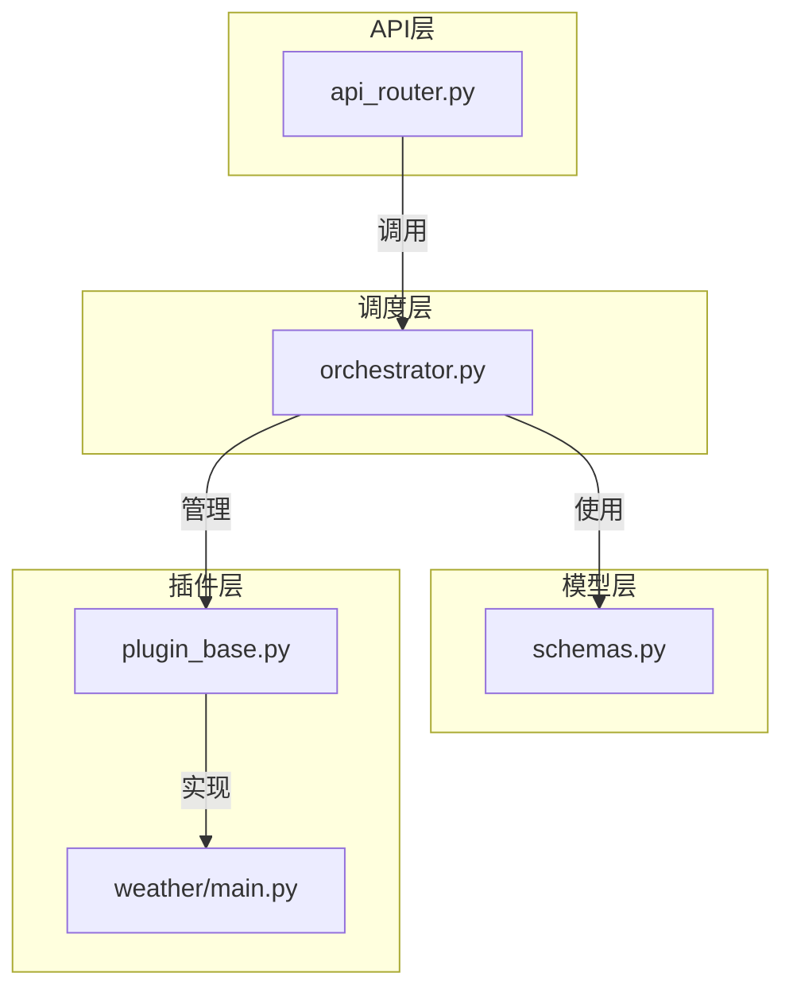
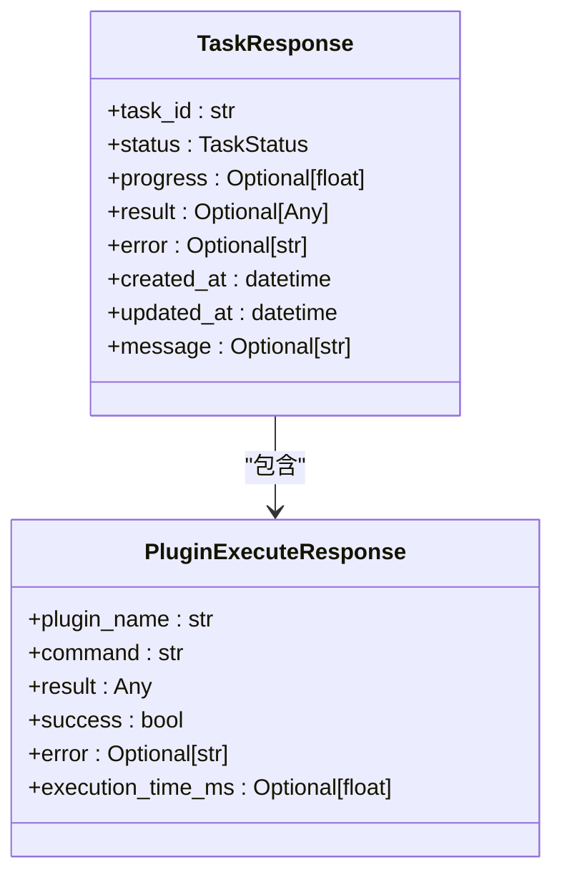
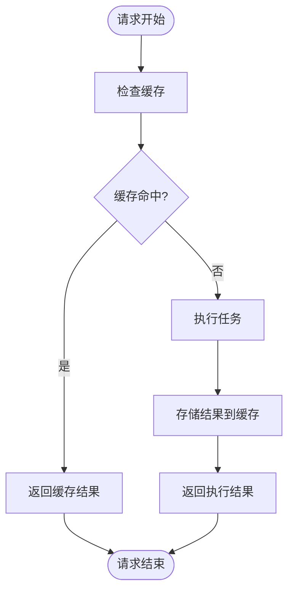
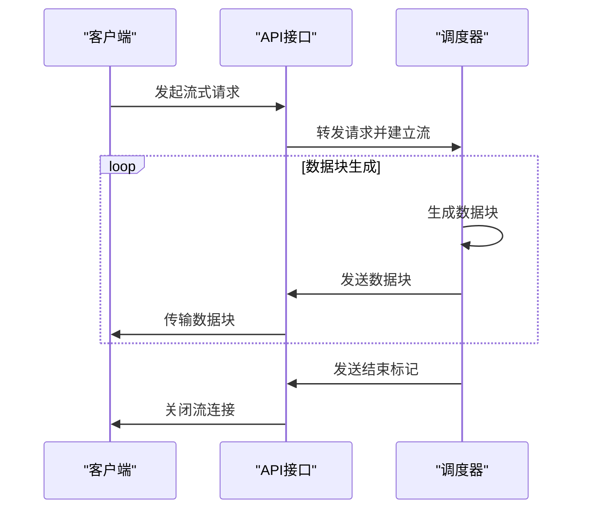
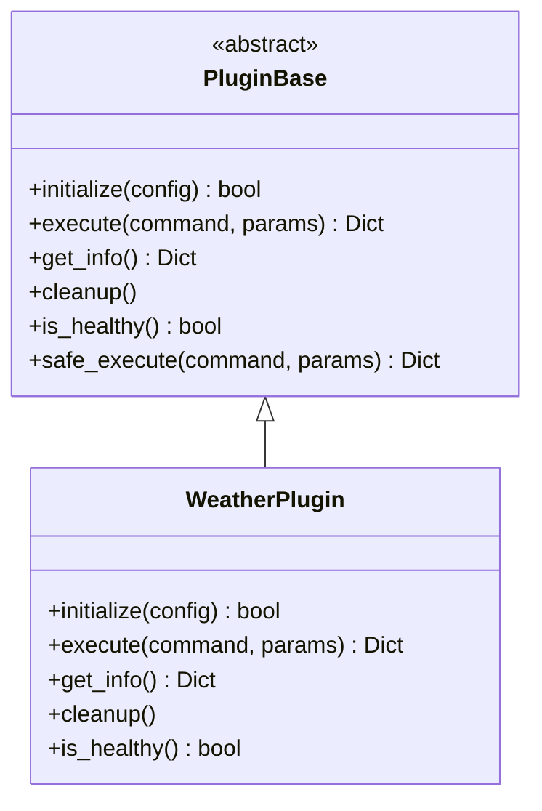

# 任务结果获取机制

<cite>
**本文档引用的文件**
- [orchestrator.py](file://python/agent/orchestrator.py)
- [schemas.py](file://python/models/schemas.py)
- [api_router.py](file://python/agent/api_router.py)
- [plugin_base.py](file://python/sdk/plugin_base.py)
- [main.py](file://python/plugins/weather/main.py)
</cite>

## 目录
1. [简介](#简介)
2. [核心组件分析](#核心组件分析)
3. [结果数据结构定义](#结果数据结构定义)
4. [成功与失败场景示例](#成功与失败场景示例)
5. [结果缓存策略与时效性控制](#结果缓存策略与时效性控制)
6. [大结果集分块传输可能性](#大结果集分块传输可能性)
7. [插件返回值兼容性指导](#插件返回值兼容性指导)

## 简介
本文档深入解析任务执行完成后结果的提取与序列化过程，说明调度器（orchestrator）如何将执行输出封装为标准响应格式。文档详细描述了结果数据结构的定义、不同场景下的实际返回示例、结果缓存策略以及时效性控制机制，并探讨了大结果集的分块传输可能性。同时为开发者提供在插件或自定义任务中正确设置返回值的指导，确保系统兼容性和稳定性。

## 核心组件分析
本节分析任务结果处理的核心组件及其交互关系。



**Diagram sources**
- [orchestrator.py](file://python/agent/orchestrator.py)
- [schemas.py](file://python/models/schemas.py)
- [api_router.py](file://python/agent/api_router.py)
- [plugin_base.py](file://python/sdk/plugin_base.py)
- [main.py](file://python/plugins/weather/main.py)

**Section sources**
- [orchestrator.py](file://python/agent/orchestrator.py)
- [schemas.py](file://python/models/schemas.py)

## 结果数据结构定义
本节详细说明任务结果的数据结构定义，包括result字段类型和metadata附加信息。

### 任务响应模型
`TaskResponse` 模型定义了任务的标准响应格式：



**Diagram sources**
- [schemas.py](file://python/models/schemas.py#L64-L87)

#### 字段说明
- **task_id**: 任务唯一标识符
- **status**: 任务当前状态（创建、运行、完成、失败、取消）
- **progress**: 进度百分比（0.0-1.0）
- **result**: 任务执行结果，类型为Any，可容纳任意数据结构
- **error**: 错误信息字符串
- **created_at**: 任务创建时间戳
- **updated_at**: 任务最后更新时间戳
- **message**: 状态描述消息

**Section sources**
- [schemas.py](file://python/models/schemas.py#L64-L87)

## 成功与失败场景示例
本节展示任务执行在成功与失败场景下的实际返回示例。

### 成功场景
当任务成功执行时，返回包含结果数据的响应：

```json
{
  "task_id": "550e8400-e29b-41d4-a716-446655440000",
  "status": "completed",
  "progress": 1.0,
  "result": {
    "city": "北京",
    "temperature": {
      "current": 22.5,
      "unit": "°C"
    },
    "weather": "晴"
  },
  "error": null,
  "created_at": "2024-01-01T10:00:00",
  "updated_at": "2024-01-01T10:01:30",
  "message": "任务执行成功"
}
```

### 失败场景
当任务执行失败时，返回包含错误信息的响应：

```json
{
  "task_id": "550e8400-e29b-41d4-a716-446655440001",
  "status": "failed",
  "progress": 0.0,
  "result": null,
  "error": "API密钥无效或已过期",
  "created_at": "2024-01-01T10:05:00",
  "updated_at": "2024-01-01T10:05:30",
  "message": "任务执行失败"
}
```

**Section sources**
- [orchestrator.py](file://python/agent/orchestrator.py#L400-L450)
- [schemas.py](file://python/models/schemas.py#L64-L87)

## 结果缓存策略与时效性控制
本节解释系统的结果缓存策略与时效性控制机制。

### 缓存实现
系统通过内存缓存机制提高性能，避免重复计算和外部API调用：



**Diagram sources**
- [main.py](file://python/plugins/weather/main.py#L250-L300)

#### 时效性控制
缓存项具有预设的有效期，通过时间戳进行管理：

- 默认缓存时长：300秒（5分钟）
- 缓存键格式：`{功能类型}:{参数}:{单位}`
- 过期检查：每次访问时验证时间戳
- 自动清理：过期条目在下次访问时被移除

**Section sources**
- [main.py](file://python/plugins/weather/main.py#L250-L300)

## 大结果集分块传输可能性
本节探讨大结果集的分块传输可能性及实现方式。

### 流式传输支持
系统支持流式传输模式，适用于大结果集的渐进式交付：



**Diagram sources**
- [api_router.py](file://python/agent/api_router.py#L39-L82)
- [orchestrator.py](file://python/agent/orchestrator.py#L200-L250)

#### 实现特点
- 媒体类型：text/plain
- 头部设置：Cache-Control: no-cache
- 数据格式：data: {JSON}\n\n
- 错误处理：独立的错误数据流
- 资源效率：避免内存中累积大量数据

**Section sources**
- [api_router.py](file://python/agent/api_router.py#L39-L82)

## 插件返回值兼容性指导
本节指导开发者如何在插件或自定义任务中正确设置返回值以确保兼容性。

### 返回值规范
插件必须遵循统一的返回值格式规范：



**Diagram sources**
- [plugin_base.py](file://python/sdk/plugin_base.py#L30-L100)
- [main.py](file://python/plugins/weather/main.py#L30-L50)

#### 开发者指南
1. **继承基类**: 所有插件必须继承 `PluginBase` 类
2. **实现抽象方法**: 必须实现 `initialize`, `execute`, `get_info`, `cleanup`, `is_healthy`
3. **返回格式**: `execute` 方法必须返回包含 `success` 和 `result` 的字典
4. **错误处理**: 异常应被捕获并转换为结构化错误响应
5. **统计信息**: 系统自动维护调用统计和执行时间
6. **安全执行**: 使用 `safe_execute` 包装器确保错误处理一致性

**Section sources**
- [plugin_base.py](file://python/sdk/plugin_base.py)
- [main.py](file://python/plugins/weather/main.py)