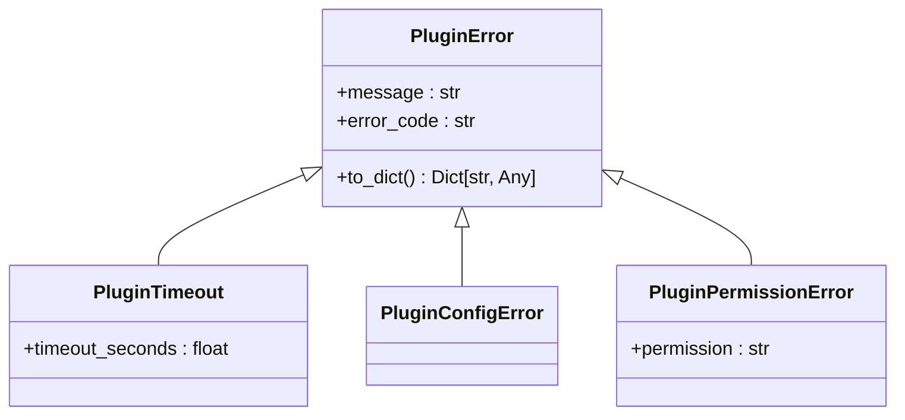
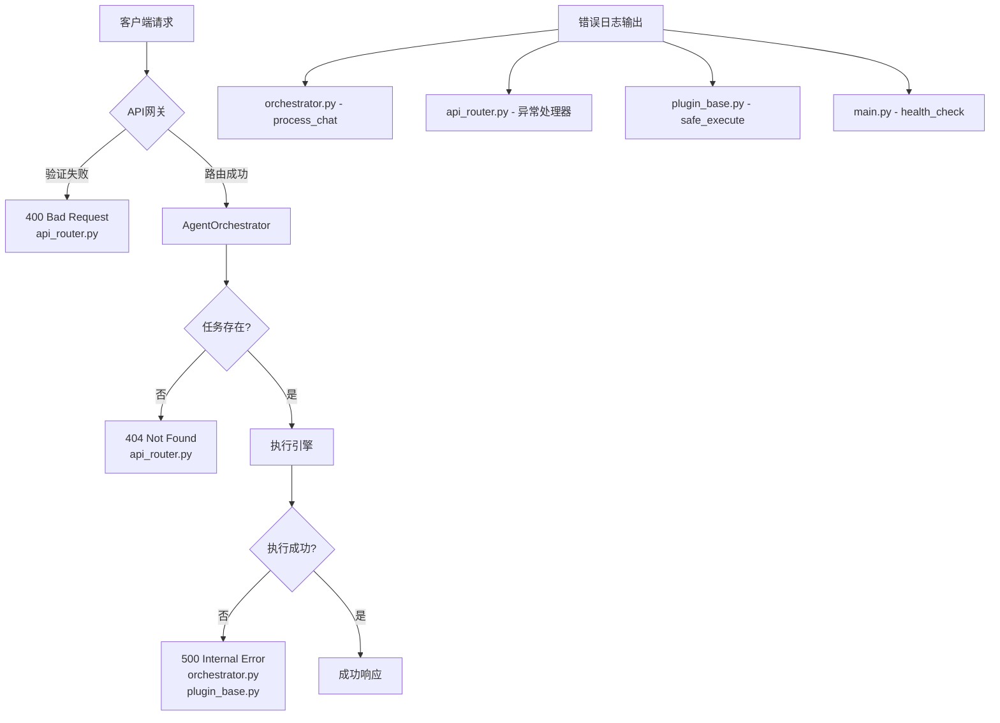
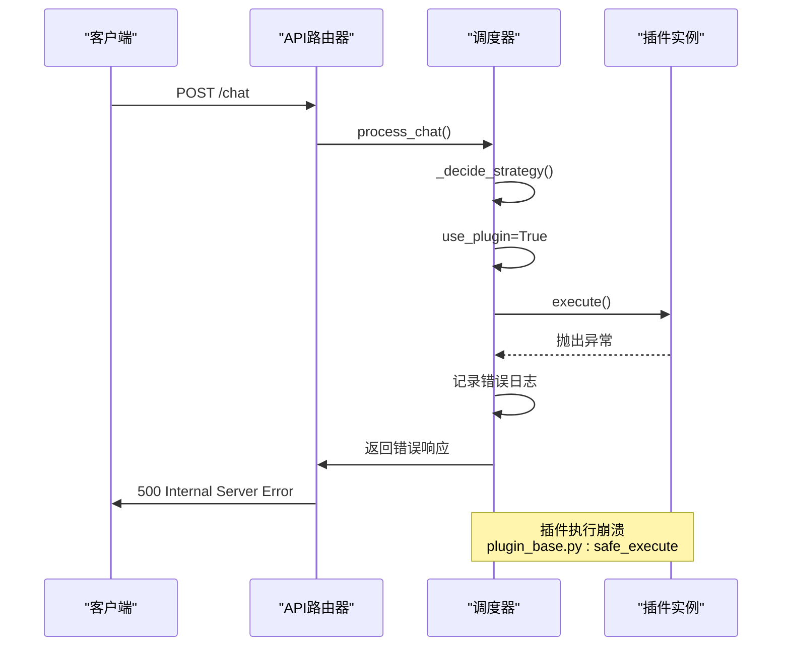
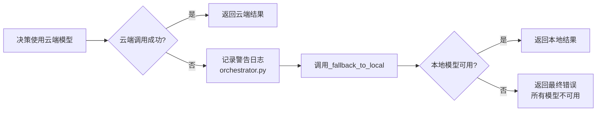

# 任务错误处理与调试

<cite>
**本文档引用的文件**
- [orchestrator.py](file://python/agent/orchestrator.py)
- [api_router.py](file://python/agent/api_router.py)
- [plugin_base.py](file://python/sdk/plugin_base.py)
- [main.py](file://python/main.py)
- [common.hpp](file://cpp/include/common.hpp)
</cite>

## 目录
1. [简介](#简介)
2. [核心异常类型分析](#核心异常类型分析)
3. [诊断路径与日志追踪](#诊断路径与日志追踪)
4. [典型错误案例分析](#典型错误案例分析)
5. [客户端健壮性建议](#客户端健壮性建议)
6. [结论](#结论)

## 简介
本指南系统化整理了任务执行过程中可能出现的各类异常情况，包括任务不存在（404）、执行失败（500）、参数无效（400）等常见错误。通过深入分析代码库中的错误处理机制，为每种错误提供清晰的诊断路径，指出相关日志记录位置和关键堆栈追踪线索。同时，建议启用详细日志模式进行问题排查，并提供典型错误案例分析。最后，推荐客户端实现重试退避算法和状态缓存机制以提升整体系统的健壮性。

## 核心异常类型分析

### 任务不存在 (404 错误)
当请求一个不存在的任务时，系统会返回404状态码。这种错误通常发生在客户端尝试获取一个从未创建或已被清理的任务状态时。

在 `api_router.py` 中，`get_task_status` 函数明确处理了这种情况：
```python
if not status:
    raise HTTPException(status_code=404, detail="任务不存在")
```

该异常表示任务ID在调度器的活动任务字典中找不到，可能是由于任务ID输入错误、任务已超时清除或任务从未被创建。

**Section sources**
- [api_router.py](file://python/agent/api_router.py#L187-L199)

### 执行失败 (500 错误)
500内部服务器错误是最常见的执行失败类型，表示系统在处理请求时遇到了未预期的异常。这类错误可能由多种原因引起，包括组件初始化失败、外部服务不可用、资源不足等。

在多个API端点中都实现了统一的500错误处理模式：
```python
except Exception as e:
    logger.error(f"获取系统状态失败: {e}")
    raise HTTPException(status_code=500, detail=str(e))
```

这种模式确保了任何未捕获的异常都会被记录到日志并以500状态码返回给客户端，同时保留了原始错误信息用于诊断。

**Section sources**
- [api_router.py](file://python/agent/api_router.py#L178-L199)
- [api_router.py](file://python/agent/api_router.py#L150-L161)

### 参数无效 (400 错误)
400错误表示客户端发送了无效的请求参数。系统通过两种方式检测此类错误：API层面的验证和插件层面的参数校验。

在插件管理接口中，明确使用了400状态码表示操作失败：
```python
if not success:
    raise HTTPException(status_code=400, detail="插件启用失败")
```

此外，在 `plugin_base.py` 中提供了完整的参数验证框架，能够检查参数是否存在、类型是否正确等，并返回详细的验证错误信息。

**Section sources**
- [api_router.py](file://python/agent/api_router.py#L125-L130)
- [plugin_base.py](file://python/sdk/plugin_base.py#L189-L212)

### 插件相关异常
系统定义了一套专门的插件异常体系，继承自 `PluginError` 基类，用于处理插件特有的错误情况：



**Diagram sources**
- [plugin_base.py](file://python/sdk/plugin_base.py#L215-L250)

这些异常类型分别对应不同的错误场景：
- **PluginTimeout**: 插件执行超时
- **PluginConfigError**: 插件配置错误
- **PluginPermissionError**: 插件权限不足

## 诊断路径与日志追踪

### 错误日志定位策略
系统采用分层的日志记录策略，不同组件在发生错误时会在特定位置输出日志信息：



**Diagram sources**
- [orchestrator.py](file://python/agent/orchestrator.py#L30-L70)
- [api_router.py](file://python/agent/api_router.py#L164-L199)
- [main.py](file://python/main.py#L55-L119)

### 关键堆栈追踪线索
当发生异常时，以下文件和函数是主要的堆栈追踪线索：

1. **orchestrator.py** - `process_chat` 方法：这是主要的错误源头，大多数业务逻辑错误都会在这里被捕获和处理。
2. **api_router.py** - 各API端点的异常处理器：负责将内部异常转换为适当的HTTP状态码。
3. **plugin_base.py** - `safe_execute` 方法：插件执行的安全包装器，会捕获所有插件相关的异常。
4. **main.py** - 全局健康检查：提供系统级的错误诊断信息。

特别值得注意的是 `orchestrator.py` 中的错误处理模式：
```python
try:
    # 处理逻辑
except Exception as e:
    logger.error(f"处理聊天请求失败: {e}")
    return ChatResponse(
        content="抱歉，处理您的请求时出现了错误，请稍后重试。",
        session_id=session_id,
        model_used=ModelType.LOCAL_SMALL,
        error=str(e)
    )
```

这个模式既保证了服务的可用性（返回友好的错误消息），又确保了错误被充分记录以便后续分析。

**Section sources**
- [orchestrator.py](file://python/agent/orchestrator.py#L30-L70)
- [api_router.py](file://python/agent/api_router.py#L164-L199)

## 典型错误案例分析

### 案例一：插件崩溃导致任务失败
当插件在执行过程中发生未预期的异常时，系统会按照以下流程处理：



**Diagram sources**
- [plugin_base.py](file://python/sdk/plugin_base.py#L215-L250)
- [orchestrator.py](file://python/agent/orchestrator.py#L30-L70)

在这种情况下，`plugin_base.py` 中的 `safe_execute` 方法会捕获异常，更新插件统计信息，并返回结构化的错误响应。同时，错误会被记录到日志中，便于后续分析。

### 案例二：云端模型不可用的降级处理
系统设计了优雅的降级机制，当云端模型服务不可用时，会自动切换到本地模型：



**Diagram sources**
- [orchestrator.py](file://python/agent/orchestrator.py#L30-L70)

这种设计确保了即使部分服务出现故障，系统仍然能够提供基本的服务能力，提高了整体的可用性。

## 客户端健壮性建议

### 启用详细日志模式
为了更好地进行问题排查，建议在调试环境中启用详细日志模式。可以通过以下方式实现：

1. 在 `main.py` 中调整日志级别：
```python
uvicorn.run(..., log_level="debug")
```

2. 使用系统状态API监控组件健康状况：
```python
GET /api/v1/system/status
```

此接口返回各组件的健康状态，可以帮助快速定位问题根源。

**Section sources**
- [main.py](file://python/main.py#L55-L119)
- [api_router.py](file://python/agent/api_router.py#L164-L199)

### 实现重试退避算法
客户端应实现智能的重试机制来应对临时性故障：

```python
import asyncio
import random

async def retry_with_backoff(func, max_retries=3):
    for attempt in range(max_retries):
        try:
            return await func()
        except (ClientError, TimeoutError) as e:
            if attempt == max_retries - 1:
                raise
            # 指数退避 + 随机抖动
            delay = (2 ** attempt) + random.uniform(0, 1)
            await asyncio.sleep(delay)
```

这种策略可以有效应对网络波动、服务短暂不可用等情况，而不会对服务器造成过大压力。

### 状态缓存机制
客户端可以实现状态缓存来减少对服务器的查询压力：

1. 缓存任务状态：对于长时间运行的任务，客户端可以在一定时间内缓存其状态，避免频繁查询。
2. 缓存插件列表：插件列表变化不频繁，可以适当缓存。
3. 使用ETag或Last-Modified头