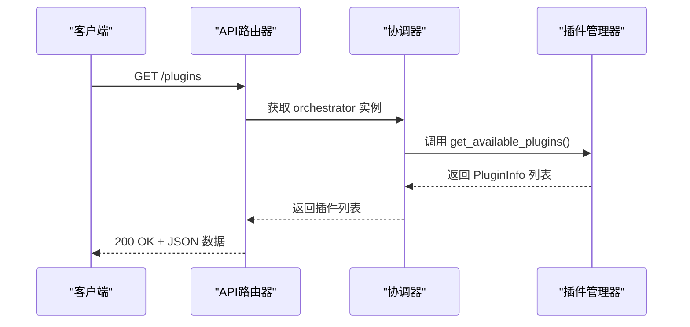
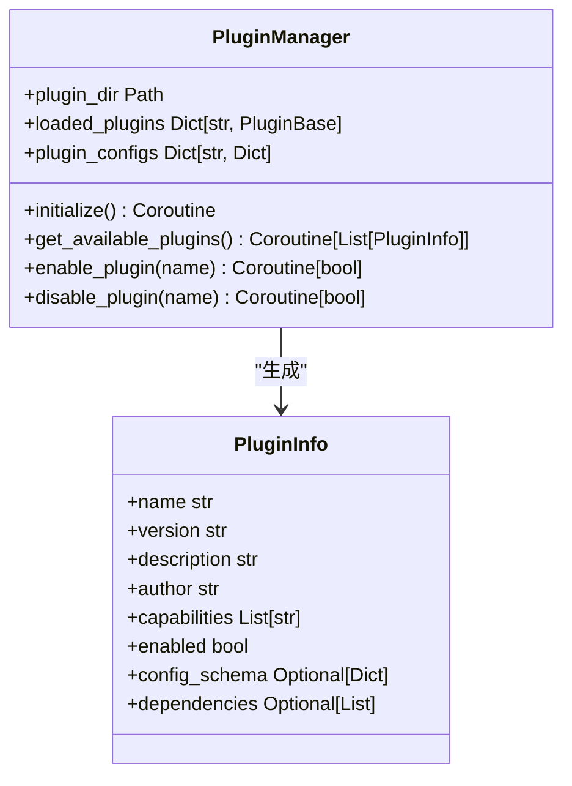
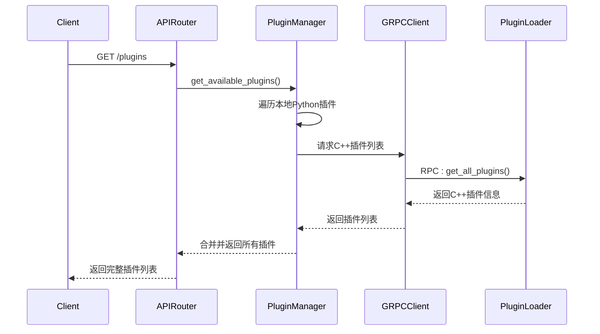

# 插件发现API

<cite>
**本文档引用的文件**
- [api_router.py](file://python/agent/api_router.py)
- [plugin_manager.py](file://python/core/plugin_manager.py)
- [schemas.py](file://python/models/schemas.py)
- [plugin.json](file://python/plugins/weather/plugin.json)
- [grpc_client.py](file://python/core/grpc_client.py)
- [plugin_loader.hpp](file://cpp/include/plugin_loader.hpp)
</cite>

## 目录
1. [简介](#简介)
2. [核心组件分析](#核心组件分析)
3. [接口功能与数据模型](#接口功能与数据模型)
4. [插件枚举流程](#插件枚举流程)
5. [成功响应示例](#成功响应示例)
6. [错误状态码](#错误状态码)
7. [前端使用场景](#前端使用场景)

## 简介
`GET /plugins` 接口是系统插件管理系统的核心发现接口，用于获取所有已注册插件的元信息列表。该接口通过Python应用层与C++核心层协同工作，实现跨语言插件枚举能力。它为前端插件市场和管理界面提供基础数据支持，使用户能够查看、启用或禁用可用插件。

**Section sources**
- [api_router.py](file://python/agent/api_router.py#L85-L119)

## 核心组件分析

### API路由处理
`api_router.py` 中定义了 `/plugins` 路由，通过 FastAPI 的依赖注入机制获取 `AgentOrchestrator` 实例，并调用其插件管理器来获取插件列表。



**Diagram sources**
- [api_router.py](file://python/agent/api_router.py#L85-L119)

**Section sources**
- [api_router.py](file://python/agent/api_router.py#L85-L119)

### 插件管理器实现
`PluginManager` 类负责维护所有已加载插件的状态，包括配置信息和运行实例。`get_available_plugins()` 方法遍历内存中的插件配置和实例，构建标准化的 `PluginInfo` 响应对象。



**Diagram sources**
- [plugin_manager.py](file://python/core/plugin_manager.py#L114-L150)
- [schemas.py](file://python/models/schemas.py#L100-L115)

**Section sources**
- [plugin_manager.py](file://python/core/plugin_manager.py#L114-L150)

## 接口功能与数据模型

### PluginInfo 模型字段说明
| 字段名 | 类型 | 说明 |
|-------|------|------|
| name | string | 插件名称，唯一标识符 |
| version | string | 插件版本号，遵循语义化版本规范 |
| description | string | 插件功能描述 |
| author | string | 插件开发者或组织 |
| capabilities | array[string] | 插件支持的功能能力列表 |
| enabled | boolean | 当前是否已启用 |
| config_schema | object | 插件配置项的JSON Schema定义 |
| dependencies | array[string] | 插件依赖的外部库列表 |

**Section sources**
- [schemas.py](file://python/models/schemas.py#L100-L115)

### 天气插件实际示例
以 `python/plugins/weather/plugin.json` 文件为例：

```json
{
  "name": "weather_plugin",
  "version": "1.0.0",
  "description": "天气查询插件，支持查询全球城市天气信息",
  "author": "AI Assistant Team",
  "capabilities": [
    "weather_query",
    "weather_forecast",
    "weather_alerts"
  ],
  "dependencies": [
    "requests",
    "json"
  ],
  "config_schema": {
    "type": "object",
    "properties": {
      "api_key": {
        "type": "string",
        "description": "天气API密钥"
      },
      "default_units": {
        "type": "string",
        "enum": ["metric", "imperial"],
        "default": "metric"
      }
    },
    "required": ["api_key"]
  },
  "enabled": true
}
```

**Section sources**
- [plugin.json](file://python/plugins/weather/plugin.json#L1-L43)

## 插件枚举流程

### 跨语言协同架构
系统采用 Python 应用层 + C++ 核心层的混合架构，通过 gRPC 实现高效通信。

```mermaid
graph TB
subgraph "Python 应用层"
A[API Router]
B[Orchestrator]
C[PluginManager]
D[gRPC Client]
end
subgraph "C++ 核心层"
E[gRPC Server]
F[PluginLoader]
G[C++ Plugins]
H[Python Plugins]
end
A --> B
B --> C
C --> D
D < --> E
E --> F
F --> G
F --> H
```

**Diagram sources**
- [grpc_client.py](file://python/core/grpc_client.py#L0-L57)
- [plugin_loader.hpp](file://cpp/include/plugin_loader.hpp#L0-L108)

### 枚举过程时序图


**Diagram sources**
- [api_router.py](file://python/agent/api_router.py#L85-L119)
- [plugin_manager.py](file://python/core/plugin_manager.py#L114-L150)
- [grpc_client.py](file://python/core/grpc_client.py#L0-L240)
- [plugin_loader.hpp](file://cpp/include/plugin_loader.hpp#L47-L97)

**Section sources**
- [api_router.py](file://python/agent/api_router.py#L85-L119)
- [plugin_manager.py](file://python/core/plugin_manager.py#L114-L150)

## 成功响应示例
```json
[
  {
    "name": "weather_plugin",
    "version": "1.0.0",
    "description": "天气查询插件，支持查询全球城市天气信息",
    "author": "AI Assistant Team",
    "capabilities": ["weather_query", "weather_forecast", "weather_alerts"],
    "enabled": true,
    "config_schema": {
      "type": "object",
      "properties": {
        "api_key": {
          "type": "string",
          "description": "天气API密钥"
        },
        "default_units": {
          "type": "string",
          "enum": ["metric", "imperial"],
          "default": "metric"
        }
      },
      "required": ["api_key"]
    },
    "dependencies": ["requests", "json"]
  }
]
```

## 错误状态码
| 状态码 | 原因 | 解决方案 |
|-------|------|---------|
| 500 Internal Server Error | 获取插件列表过程中发生异常 | 检查服务日志，确认插件目录权限和配置文件完整性 |

当出现内部错误时，响应体示例：
```json
{
  "detail": "获取插件列表失败: [具体错误信息]"
}
```

**Section sources**
- [api_router.py](file://python/agent/api_router.py#L85-L119)

## 前端使用场景
此接口主要应用于以下前端场景：

1. **插件市场页面**：展示所有可用插件及其详细信息，供用户浏览和选择安装。
2. **插件管理界面**：允许管理员查看当前系统中所有插件的状态（启用/禁用），并进行启停操作。
3. **功能动态加载**：根据插件的能力列表（capabilities）动态渲染相关功能按钮或模块。
4. **依赖关系可视化**：基于 dependencies 字段展示插件间的依赖关系图谱。
5. **配置界面生成**：利用 config_schema 自动生成插件配置表单，实现无代码配置。

这些应用场景共同构成了系统的可扩展性基础，使得新功能可以通过插件形式无缝集成到现有系统中。