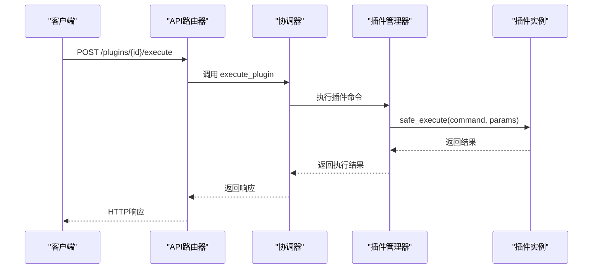
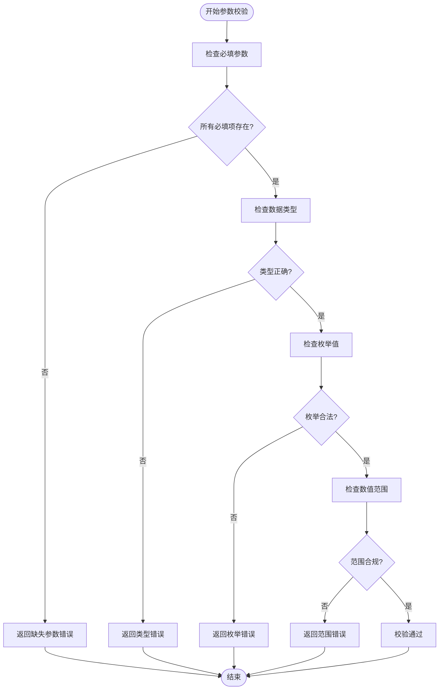

# 插件执行API

<cite>
**本文档引用的文件**   
- [api_router.py](file://python/agent/api_router.py)
- [plugin_manager.py](file://python/core/plugin_manager.py)
- [plugin_base.py](file://python/sdk/plugin_base.py)
- [schemas.py](file://python/models/schemas.py)
- [main.py](file://python/plugins/weather/main.py)
- [plugin.json](file://python/plugins/weather/plugin.json)
</cite>

## 目录
1. [简介](#简介)
2. [参数传递与请求结构](#参数传递与请求结构)
3. [执行调度流程](#执行调度流程)
4. [结果返回机制](#结果返回机制)
5. [天气插件示例](#天气插件示例)
6. [权限验证与启用检查](#权限验证与启用检查)
7. [输入参数校验](#输入参数校验)
8. [调用示例](#调用示例)
9. [超时控制](#超时控制)
10. [沙箱安全限制](#沙箱安全限制)
11. [错误传播机制](#错误传播机制)

## 简介
本文档详细说明 `POST /plugins/{plugin_id}/execute` 接口的技术实现，涵盖从参数传递、执行调度到结果返回的完整流程。以 weather 插件为例，展示如何通过该接口调用插件功能，并深入解析底层架构中的关键机制。

## 参数传递与请求结构
该接口接收符合 `PluginExecuteRequest` 模型的 JSON 请求体，包含以下字段：

- **plugin_name**: 要执行的插件名称
- **command**: 要执行的具体命令
- **parameters**: 命令所需的参数字典
- **session_id**: 可选的会话标识符

请求通过 FastAPI 的依赖注入系统进行处理，确保用户身份认证和资源访问控制。

**Section sources**
- [schemas.py](file://python/models/schemas.py#L90-L95)
- [api_router.py](file://python/agent/api_router.py#L85-L119)

## 执行调度流程
当接收到执行请求后，系统按照以下步骤进行调度：

1. 由 `AgentOrchestrator` 协调器接收请求
2. 调用 `PluginManager.execute_plugin()` 方法
3. 查找并验证目标插件实例
4. 执行安全包装后的插件命令
5. 返回标准化响应

整个过程异步非阻塞，支持高并发场景下的稳定运行。



**Diagram sources**
- [api_router.py](file://python/agent/api_router.py#L85-L119)
- [plugin_manager.py](file://python/core/plugin_manager.py#L186-L225)
- [plugin_base.py](file://python/sdk/plugin_base.py#L108-L149)

## 结果返回机制
执行结果遵循 `PluginExecuteResponse` 模型格式化输出，包含：

- **plugin_name**: 插件名称
- **command**: 执行的命令
- **result**: 实际执行结果数据
- **success**: 布尔值表示是否成功
- **error**: 错误信息（如有）
- **execution_time_ms**: 执行耗时（毫秒）

所有响应均经过统一序列化处理，确保前后端交互的一致性。

**Section sources**
- [schemas.py](file://python/models/schemas.py#L96-L103)

## 天气插件示例
以 `weather` 插件为例，其主模块位于 `main.py`，定义了 `WeatherPlugin` 类继承自 `PluginBase`。该类实现了 `execute` 方法来处理不同类型的天气查询命令。

当调用 `get_weather` 命令时，系统会：
1. 验证传入的城市参数
2. 检查本地缓存是否存在有效数据
3. 若无缓存则向 OpenWeatherMap API 发起请求
4. 格式化原始数据为易读形式
5. 存储结果至缓存供后续使用

此设计兼顾性能与用户体验。

**Section sources**
- [main.py](file://python/plugins/weather/main.py#L0-L411)

## 权限验证与启用检查
在执行任何插件前，系统会严格验证两个条件：

1. **插件加载状态**：确认插件已正确加载至内存
2. **启用状态**：检查插件是否处于启用状态

这些检查在 `PluginManager.execute_plugin()` 中完成。若插件未启用，则直接返回 `"插件未启用"` 错误信息，阻止非法调用。

此外，每个插件可通过装饰器声明所需权限（如网络访问），并在执行时进行动态检查。

**Section sources**
- [plugin_manager.py](file://python/core/plugin_manager.py#L186-L225)
- [plugin_base.py](file://python/sdk/plugin_base.py#L250-L270)

## 输入参数校验
系统利用 `plugin.json` 文件中定义的 `input_schema` 对请求参数进行校验。`validate_params()` 方法根据 schema 定义执行以下检查：

- 必填字段是否存在
- 数据类型是否匹配（字符串、整数、布尔等）
- 枚举值是否合法
- 数值范围是否合规

校验失败时将返回详细的错误列表，帮助客户端快速定位问题。



**Diagram sources**
- [plugin_base.py](file://python/sdk/plugin_base.py#L145-L192)
- [plugin.json](file://python/plugins/weather/plugin.json#L20-L42)

## 调用示例
以下是调用 weather 插件获取北京天气的完整示例：

```http
POST /plugins/weather_plugin/execute HTTP/1.1
Host: localhost:8000
Authorization: Bearer <token>
Content-Type: application/json

{
  "plugin_name": "weather_plugin",
  "command": "get_weather",
  "parameters": {
    "city": "北京"
  },
  "session_id": "sess_12345"
}
```

预期成功响应：
```json
{
  "plugin_name": "weather_plugin",
  "command": "get_weather",
  "result": {
    "success": true,
    "data": {
      "city": "北京",
      "temperature": { "current": 22.5 },
      "weather": { "description": "晴" }
    }
  },
  "success": true,
  "execution_time_ms": 150
}
```

**Section sources**
- [plugin.json](file://python/plugins/weather/plugin.json#L20-L42)
- [main.py](file://python/plugins/weather/main.py#L150-L200)

## 超时控制
为防止插件长时间占用资源，系统设置了全局最大执行时间限制（`max_execution_time`）。该值从配置中读取，默认为30秒。

实际执行时采用 `asyncio.wait_for()` 包装插件调用，一旦超过设定时限即抛出 `TimeoutError`，并返回 `"插件执行超时"` 的标准化错误响应。

此机制保障了系统的整体响应性和稳定性。

**Section sources**
- [plugin_manager.py](file://python/core/plugin_manager.py#L186-L225)

## 沙箱安全限制
所有插件运行于受限的 Python 沙箱环境中，主要安全措施包括：

- **网络访问控制**：仅允许白名单内的域名请求
- **文件系统隔离**：禁止访问上级目录及敏感路径
- **资源限额**：限制CPU、内存使用量
- **代码执行限制**：禁用危险内置函数（如 `exec`）

此外，插件无法