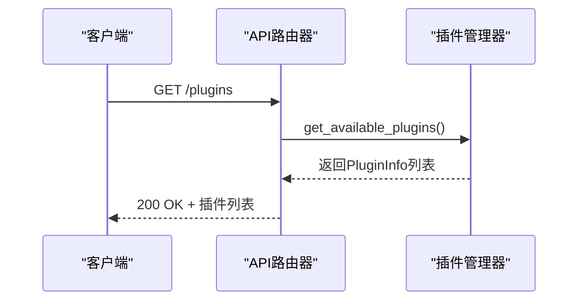
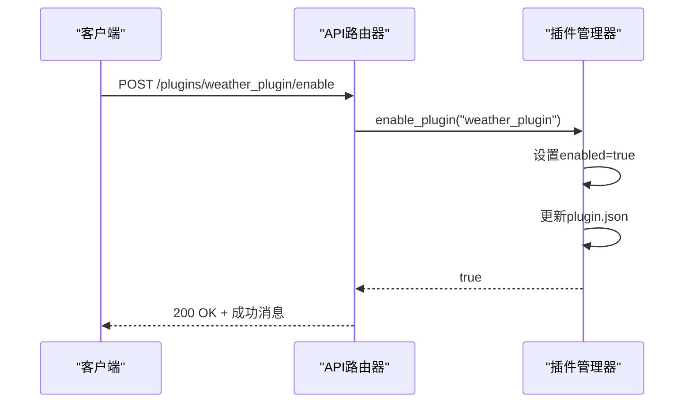
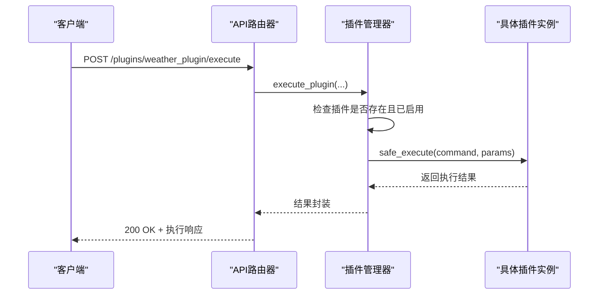

# 插件管理API

<cite>
**本文档中引用的文件**
- [api_router.py](file://python/agent/api_router.py)
- [plugin_manager.py](file://python/core/plugin_manager.py)
- [schemas.py](file://python/models/schemas.py)
- [main.py](file://python/plugins/weather/main.py)
- [plugin.json](file://python/plugins/weather/plugin.json)
- [plugin_loader.hpp](file://cpp/include/plugin_loader.hpp)
</cite>

## 目录
1. [简介](#简介)
2. [核心端点说明](#核心端点说明)
3. [PluginInfo数据模型](#plugininfo数据模型)
4. [插件执行调用链示例](#插件执行调用链示例)
5. [插件配置与注册流程](#插件配置与注册流程)
6. [权限控制机制](#权限控制机制)
7. [常见问题排查](#常见问题排查)

## 简介
本技术文档详细说明了系统中`/plugins`端点的功能实现，涵盖插件列表获取、启用/禁用及执行等核心操作。文档深入解析了Python与C++层之间的交互机制，通过`api_router`、`plugin_manager`和底层`plugin_loader`组件协同工作，实现了动态插件加载与管理能力。

## 核心端点说明

### 获取插件列表 (GET /plugins)
该接口返回所有可用插件的详细信息列表，包括名称、版本、描述、作者、功能、启用状态等元数据。



**Diagram sources**
- [api_router.py](file://python/agent/api_router.py#L86-L120)
- [plugin_manager.py](file://python/core/plugin_manager.py#L114-L150)

### 启用/禁用插件 (POST /plugins/{plugin_name}/enable|disable)
这两个接口用于动态启用或禁用指定插件。操作成功后会更新内存状态并持久化到`plugin.json`配置文件中。



**Diagram sources**
- [api_router.py](file://python/agent/api_router.py#L123-L162)
- [plugin_manager.py](file://python/core/plugin_manager.py#L148-L187)

### 执行插件 (POST /plugins/{plugin_id}/execute)
此接口用于执行已启用插件的具体命令，支持参数传递，并包含超时保护机制。



**Diagram sources**
- [plugin_manager.py](file://python/core/plugin_manager.py#L186-L225)

**Section sources**
- [api_router.py](file://python/agent/api_router.py#L123-L162)
- [plugin_manager.py](file://python/core/plugin_manager.py#L148-L225)

## PluginInfo数据模型
`PluginInfo`模型定义了插件的核心属性，其字段含义如下：

| 字段 | 类型 | 说明 |
|------|------|------|
| name | string | 插件唯一标识名称 |
| version | string | 插件版本号（语义化版本） |
| description | string | 插件功能描述 |
| author | string | 插件开发者信息 |
| capabilities | list[string] | 插件具备的能力标签列表 |
| enabled | boolean | 当前是否已启用 |
| config_schema | object | 配置项结构定义（JSON Schema格式） |
| dependencies | list[string] | 运行依赖的第三方库 |

以天气插件为例，实际响应内容示例如下：
```json
{
  "name": "weather_plugin",
  "version": "1.0.0",
  "description": "天气查询插件，支持查询全球城市天气信息",
  "author": "AI Assistant Team",
  "capabilities": ["weather_query", "weather_forecast", "weather_alerts"],
  "enabled": true,
  "config_schema": {
    "type": "object",
    "properties": {
      "api_key": {"type": "string", "description": "天气API密钥"},
      "default_units": {"type": "string", "enum": ["metric", "imperial"], "default": "metric"}
    },
    "required": ["api_key"]
  },
  "dependencies": ["requests", "json"]
}
```

**Section sources**
- [schemas.py](file://python/models/schemas.py#L64-L87)
- [plugin.json](file://python/plugins/weather/plugin.json)

## 插件执行调用链示例
以下是以启用天气插件并查询北京天气为例的完整调用链：

```mermaid
flowchart TD
A[客户端发起请求] --> B{启用天气插件}
B --> C[调用 /plugins/weather_plugin/enable]
C --> D[api_router处理请求]
D --> E[plugin_manager.enable_plugin()]
E --> F[设置插件enabled=true]
F --> G[更新plugin.json中的enabled字段]
G --> H[返回启用成功]
H --> I{执行天气查询}
I --> J[调用 /plugins/weather_plugin/execute]
J --> K[plugin_manager.execute_plugin()]
K --> L[检查插件已启用]
L --> M[调用WeatherPlugin.safe_execute()]
M --> N[执行_get_current_weather()]
N --> O[检查缓存]
O --> P{是否有有效缓存?}
P --> |是| Q[返回缓存数据]
P --> |否| R[调用OpenWeatherMap API]
R --> S[获取原始数据]
S --> T[格式化为标准响应]
T --> U[存入缓存]
U --> V[返回最终结果]
Q --> V
V --> W[客户端接收天气信息]
```

**Diagram sources**
- [api_router.py](file://python/agent/api_router.py#L123-L162)
- [plugin_manager.py](file://python/core/plugin_manager.py#L186-L225)
- [main.py](file://python/plugins/weather/main.py#L150-L250)

## 插件配置与注册流程
`plugin.json`配置文件在插件注册过程中起关键作用，其主要职责包括：

1. **元数据声明**：提供插件名称、版本、描述等基本信息
2. **入口点定位**：通过`entry_point`字段指定主模块文件
3. **依赖管理**：声明运行所需的Python包依赖
4. **配置约束**：使用`config_schema`定义合法配置结构
5. **权限声明**：列出所需系统权限（如网络访问）
6. **初始状态**：`enabled`字段决定插件默认启用状态

注册流程如下：
```mermaid
flowchart LR
A[扫描插件目录] --> B{发现plugin.json?}
B --> |否| C[跳过该目录]
B --> |是| D[读取plugin.json配置]
D --> E[验证必需字段]
E --> F{验证通过?}
F --> |否| G[记录错误并终止]
F --> |是| H[动态导入entry_point模块]
H --> I[获取plugin_instance实例]
I --> J{是PluginBase子类?}
J --> |否| K[报错退出]
J --> |是| L[调用initialize()初始化]
L --> M{初始化成功?}
M --> |否| N[标记加载失败]
M --> |是| O[加入loaded_plugins集合]
O --> P[根据enabled字段设置初始状态]
P --> Q[完成注册]
```

**Diagram sources**
- [plugin_manager.py](file://python/core/plugin_manager.py#L0-L54)
- [plugin.json](file://python/plugins/weather/plugin.json)

## 权限控制机制
系统采用多层权限控制防止未授权插件执行：

1. **存在性验证**：首先检查插件是否存在于`loaded_plugins`字典中
2. **启用状态检查**：确保插件`enabled`标志为`true`
3. **认证中间件**：通过`get_current_user`依赖注入实现用户身份验证
4. **执行超时保护**：使用`asyncio.wait_for`限制最大执行时间
5. **安全执行封装**：通过`safe_execute`方法捕获异常并保证资源清理

```python
if plugin_name not in self.loaded_plugins:
    return {"success": False, "error": f"插件 {plugin_name} 未加载"}

plugin = self.loaded_plugins[plugin_name]
if not plugin.enabled:
    return {"success": False, "error": f"插件 {plugin_name} 未启用"}

try:
    result = await asyncio.wait_for(
        plugin.safe_execute(command, params or {}),
        timeout=self.max_execution_time
    )
except asyncio.TimeoutError:
    return {"success": False, "error": f"插件 {plugin_name} 执行超时"}
```

**Section sources**
- [plugin_manager.py](file://python/core/plugin_manager.py#L186-L225)

## 常见问题排查

### 插件加载失败
可能原因及解决方案：
- **缺少必需字段**：检查`plugin.json`是否包含`name`, `version`, `description`, `author`
- **入口文件缺失**：确认`entry_point`指向的文件存在且可读
- **实例化失败**：确保模块中定义了`plugin_instance`且继承自`PluginBase`
- **初始化失败**：查看日志中`initialize()`方法的错误详情

### 依赖缺失
当插件声明了依赖但环境中未安装时：
1. 查看`dependencies`字段明确所需包
2. 使用pip安装对应依赖：`pip install requests`
3. 重启服务使更改生效

### 执行无响应
若插件执行长时间无返回：
1. 检查是否触发超时机制（默认有超时控制）
2. 查看插件内部是否存在阻塞操作
3. 确认网络访问权限是否满足要求
4. 验证外部API服务是否正常

**Section sources**
- [plugin_manager.py](file://python/core/plugin_manager.py#L0-L54)
- [plugin.json](file://python/plugins/weather/plugin.json)
- [main.py](file://python/plugins/weather/main.py#L0-L50)