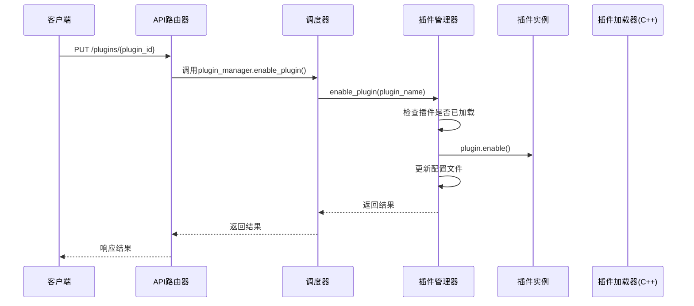
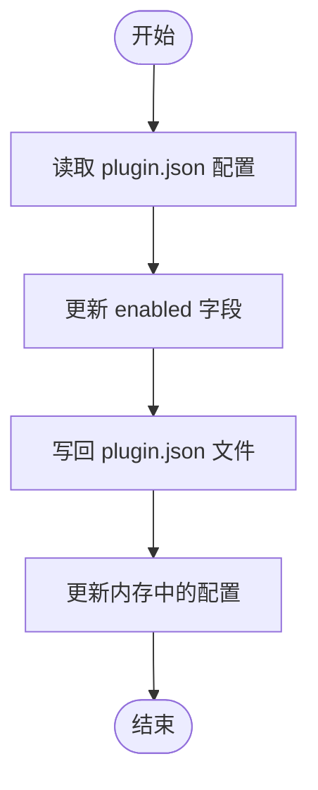
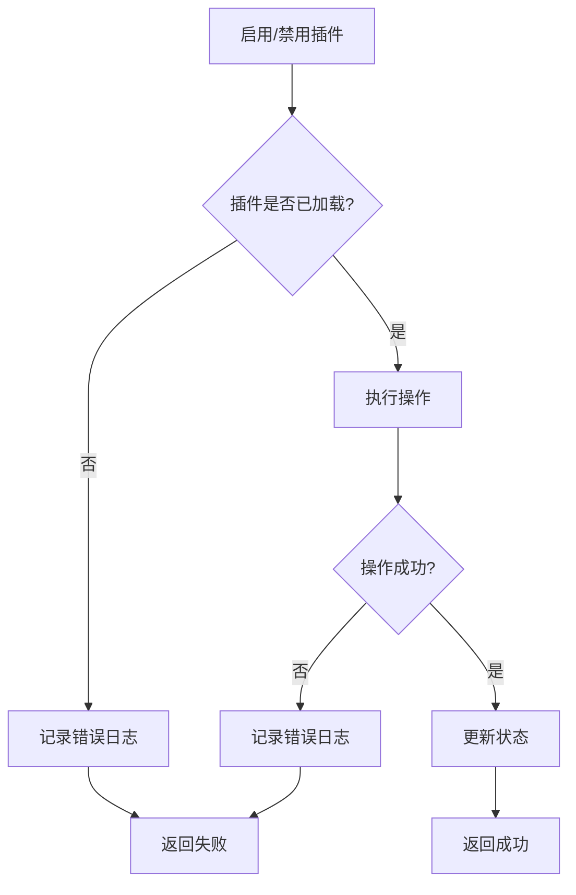
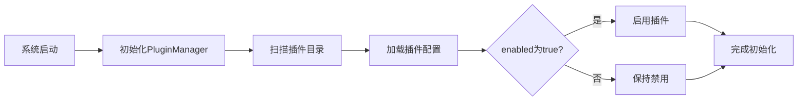

# 插件管理操作

<cite>
**本文档引用的文件**
- [api_router.py](file://python/agent/api_router.py)
- [plugin_manager.py](file://python/core/plugin_manager.py)
- [plugin_base.py](file://python/sdk/plugin_base.py)
- [plugin_loader.hpp](file://cpp/include/plugin_loader.hpp)
- [plugin.json](file://python/plugins/weather/plugin.json)
</cite>

## 目录
1. [接口技术实现](#接口技术实现)
2. [插件状态持久化策略](#插件状态持久化策略)
3. [异常处理流程](#异常处理流程)
4. [系统启动时的自动加载机制](#系统启动时的自动加载机制)
5. [调试与故障排查](#调试与故障排查)

## 接口技术实现

`PUT /plugins/{plugin_id}` 接口用于启用或禁用指定插件，其技术实现涉及多个组件的协同工作。该功能通过 `api_router.py` 中的路由定义实现，调用 `PluginManager` 类中的相应方法。

当接收到启用或禁用插件的请求时，`AgentOrchestrator` 会通过 `plugin_manager` 调用相应的 `enable_plugin` 或 `disable_plugin` 方法。这些方法首先检查插件是否已加载，然后调用插件实例的 `enable()` 或 `disable()` 方法来改变插件的状态。

对于 C++ 核心层的插件，`PluginLoader` 提供了 `enable_plugin` 和 `disable_plugin` 方法，允许从 Python 层向 C++ 核心发送加载/卸载指令。这种跨语言通信机制确保了插件管理的一致性和高效性。

**图示来源**
- [api_router.py](file://python/agent/api_router.py#L122-L161)
- [plugin_manager.py](file://python/core/plugin_manager.py#L148-L187)
- [plugin_base.py](file://python/sdk/plugin_base.py#L190-L200)
- [plugin_loader.hpp](file://cpp/include/plugin_loader.hpp#L75-L76)

**本节来源**
- [api_router.py](file://python/agent/api_router.py#L122-L161)
- [plugin_manager.py](file://python/core/plugin_manager.py#L148-L187)

## 插件状态持久化策略

插件的状态持久化通过将启用状态保存在 `plugin.json` 配置文件中实现。每次启用或禁用插件时，系统都会更新对应插件目录下的 `plugin.json` 文件中的 `enabled` 字段。

`PluginManager` 类中的 `_update_plugin_enabled_status` 方法负责这一过程。它读取现有的 `plugin.json` 文件，修改 `enabled` 字段的值，然后将更改写回文件。同时，内存中的配置也会被同步更新，以确保数据一致性。

这种方法的优点是简单可靠，即使系统重启，插件的启用状态也能保持不变。此外，由于每个插件都有独立的配置文件，因此可以灵活地管理各个插件的状态。

**图示来源**
- [plugin_manager.py](file://python/core/plugin_manager.py#L258-L268)
- [plugin.json](file://python/plugins/weather/plugin.json#L42)

**本节来源**
- [plugin_manager.py](file://python/core/plugin_manager.py#L258-L268)

## 异常处理流程

系统在处理插件启停过程中实现了完善的异常处理机制。主要的异常情况包括插件依赖缺失、权限不足等。

当尝试启用一个未加载的插件时，系统会记录错误日志并返回失败状态。同样，在禁用插件时也会进行类似的检查。如果插件存在依赖关系，系统会在加载时验证这些依赖是否满足。

权限控制方面，系统通过装饰器 `require_permission` 实现。当插件执行需要特定权限的操作时，会自动检查是否有相应的权限。如果没有，将抛出 `PluginPermissionError` 异常。

**图示来源**
- [plugin_manager.py](file://python/core/plugin_manager.py#L148-L187)
- [plugin_base.py](file://python/sdk/plugin_base.py#L280-L295)

**本节来源**
- [plugin_manager.py](file://python/core/plugin_manager.py#L148-L187)
- [plugin_base.py](file://python/sdk/plugin_base.py#L280-L295)

## 系统启动时的自动加载机制

系统启动时会自动加载所有标记为启用的插件。这一过程由 `PluginManager` 的初始化方法完成。系统会扫描插件目录，加载所有有效的插件，并根据 `plugin.json` 文件中的 `enabled` 字段决定是否立即启用插件。

这种设计确保了配置的一致性：无论是在运行时还是重启后，插件的状态都与配置文件保持一致。这避免了因系统重启而导致的配置丢失问题。

**图示来源**
- [plugin_manager.py](file://python/core/plugin_manager.py#L84-L116)
- [plugin.json](file://python/plugins/weather/plugin.json#L42)

**本节来源**
- [plugin_manager.py](file://python/core/plugin_manager.py#L84-L116)

## 调试与故障排查

当遇到插件启停失败的问题时，可以通过以下步骤进行调试：

1. 检查日志文件，查找相关的错误信息
2. 确认插件目录结构是否正确
3. 验证 `plugin.json` 文件的格式和内容
4. 检查插件依赖是否满足
5. 确认是否有足够的权限

常见解决方案包括：
- 确保插件目录下存在 `plugin.json` 和入口文件
- 检查 `plugin.json` 中的必需字段是否完整
- 确认插件实例是否正确继承自 `PluginBase`
- 验证插件配置中的 `enabled` 字段值

**本节来源**
- [plugin_manager.py](file://python/core/plugin_manager.py#L148-L187)
- [plugin_base.py](file://python/sdk/plugin_base.py#L190-L200)