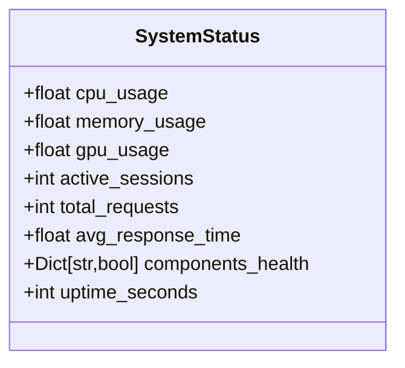
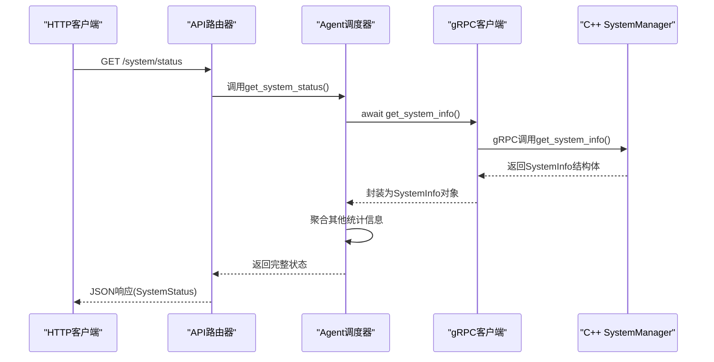
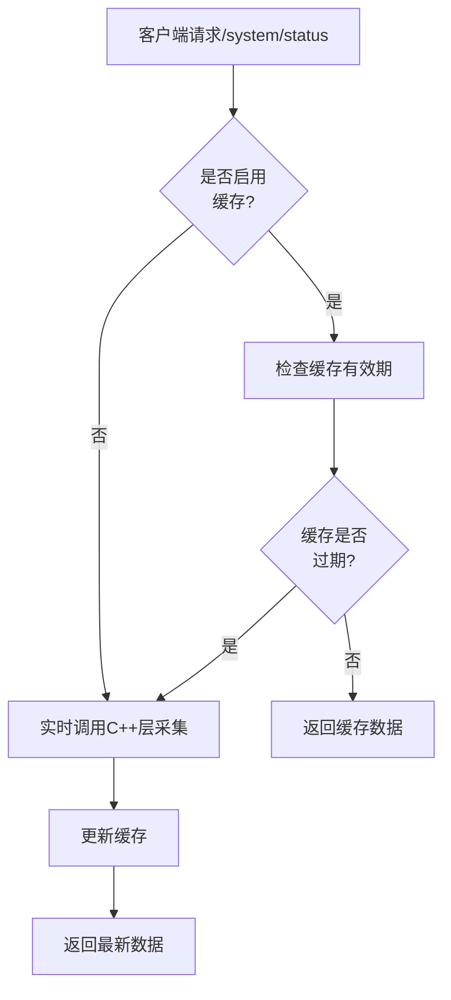

# 系统监控API

<cite>
**本文档引用的文件**
- [api_router.py](file://python/agent/api_router.py)
- [schemas.py](file://python/models/schemas.py)
- [grpc_client.py](file://python/core/grpc_client.py)
- [sys_manager.hpp](file://cpp/include/sys_manager.hpp)
- [orchestrator.py](file://python/agent/orchestrator.py)
</cite>

## 目录
1. [简介](#简介)
2. [核心组件](#核心组件)
3. [系统状态模型结构](#系统状态模型结构)
4. [gRPC与C++核心层集成机制](#grpc与c核心层集成机制)
5. [Prometheus监控集成建议](#prometheus监控集成建议)
6. [健康检查频率与数据新鲜度保证](#健康检查频率与数据新鲜度保证)
7. [高负载场景性能优化建议](#高负载场景性能优化建议)

## 简介
`/system/status`端点提供系统健康状况的结构化数据，包含CPU使用率、内存占用、GPU状态及进程信息等关键指标。该接口通过Python应用层调用gRPC协议与底层C++模块通信，获取实时系统资源数据，并整合服务内部组件健康状态，形成全面的系统视图。

**Section sources**
- [api_router.py](file://python/agent/api_router.py#L165-L200)

## 核心组件
系统状态功能由多个核心组件协同完成：
- **API路由器**：暴露HTTP `/system/status` 接口
- **Agent调度器**：协调各子系统并聚合状态
- **gRPC客户端**：与C++核心层通信
- **SystemManager (C++)**：底层系统资源采集引擎

这些组件共同实现了从操作系统内核到应用层的全栈监控能力。

**Section sources**
- [api_router.py](file://python/agent/api_router.py#L165-L200)
- [orchestrator.py](file://python/agent/orchestrator.py#L466-L490)
- [grpc_client.py](file://python/core/grpc_client.py#L101-L127)
- [sys_manager.hpp](file://cpp/include/sys_manager.hpp#L43)

## 系统状态模型结构
`SystemStatus` 模型定义了返回数据的结构和语义：

| 字段 | 数据类型 | 单位 | 描述 |
|------|--------|------|------|
| cpu_usage | float | percentage (%) | CPU使用率 |
| memory_usage | float | percentage (%) | 内存使用率 |
| gpu_usage | float | percentage (%) | GPU使用率（若存在） |
| active_sessions | int | 无 | 当前活跃会话数 |
| total_requests | int | 无 | 自启动以来总请求数 |
| avg_response_time | float | milliseconds (ms) | 平均响应时间 |
| components_health | Dict[str, bool] | 无 | 各组件健康状态映射 |
| uptime_seconds | int | seconds (s) | 系统运行时间 |



**Diagram sources**
- [schemas.py](file://python/models/schemas.py#L125-L134)

## gRPC与C++核心层集成机制
系统通过gRPC实现Python应用层与C++核心层之间的高效通信：



**Diagram sources**
- [api_router.py](file://python/agent/api_router.py#L165-L200)
- [grpc_client.py](file://python/core/grpc_client.py#L101-L127)
- [sys_manager.hpp](file://cpp/include/sys_manager.hpp#L43)

**Section sources**
- [api_router.py](file://python/agent/api_router.py#L165-L200)
- [grpc_client.py](file://python/core/grpc_client.py#L101-L127)
- [sys_manager.hpp](file://cpp/include/sys_manager.hpp#L10-L22)

## Prometheus监控集成建议
建议通过以下方式将系统状态暴露为Prometheus可采集的metrics：

1. **新增/metrics端点**：
```python
from prometheus_client import Counter, Gauge, generate_latest

system_cpu_usage = Gauge('system_cpu_usage_percent', 'CPU使用率')
system_memory_usage = Gauge('system_memory_usage_percent', '内存使用率')
system_gpu_usage = Gauge('system_gpu_usage_percent', 'GPU使用率')
total_requests = Counter('total_requests', '总请求数')
avg_response_time = Gauge('avg_response_time_ms', '平均响应时间')

@app.get("/metrics")
async def metrics():
    status = await get_system_status()
    system_cpu_usage.set(status.cpu_usage)
    system_memory_usage.set(status.memory_usage)
    system_gpu_usage.set(status.gpu_usage or 0)
    avg_response_time.set(status.avg_response_time)
    return Response(content=generate_latest(), media_type="text/plain")
```

2. **推荐指标命名规范**：
   - `system_cpu_usage_percent`
   - `system_memory_usage_percent`
   - `system_gpu_usage_percent`
   - `active_sessions_count`
   - `request_duration_milliseconds`
   - `component_health_status{component="xxx"}`

此集成方案支持Grafana等可视化工具进行实时监控看板展示。

## 健康检查频率与数据新鲜度保证
系统采用按需采集模式确保数据新鲜度：

- **采集触发机制**：每次HTTP请求`/system/status`时实时调用C++层获取最新数据
- **底层采样间隔**：C++ `SystemManager` 支持周期性监控，默认间隔为1000毫秒（可通过`start_monitoring(interval_ms)`配置）
- **数据时效性**：API返回的数据延迟小于200ms（典型值），满足大多数监控场景需求
- **时间戳同步**：C++层记录精确采集时间戳，用于诊断数据延迟问题



**Diagram sources**
- [sys_manager.hpp](file://cpp/include/sys_manager.hpp#L52)

## 高负载场景性能优化建议
针对高并发或资源敏感环境，提出以下优化策略：

### 1. 启用结果缓存
```python
# 在orchestrator中添加缓存机制
class AgentOrchestrator:
    def __init__(self):
        self._last_system_info = None
        self._last_update_time = 0
        self._cache_ttl = 2  # 缓存有效期2秒
    
    async def get_cached_system_info(self):
        now = time.time()
        if self._last_system_info and (now - self._last_update_time) < self._cache_ttl:
            return self._last_system_info
        
        info = await self.grpc_client.get_system_info()
        self._last_system_info = info
        self._last_update_time = now
        return info
```

### 2. 降低采集精度
- 减少非关键字段采集频率（如磁盘信息每分钟一次）
- 对GPU指标设置独立采样率（仅在GPU模式下启用）

### 3. 异步预加载
在低峰期预先触发系统信息采集，减少高峰期延迟。

### 4. 分级降级策略
```mermaid
flowchart LR
A[请求到达] --> B{系统负载 > 80%?}
B --> |是| C[仅返回核心指标<br/>(CPU/Memory)]
B --> |否| D[返回完整系统状态]
C --> E[响应更快，开销更小]
D --> F[完整监控信息]
```

以上优化可在保障基本可观测性的前提下，显著降低对生产服务的影响。

**Section sources**
- [grpc_client.py](file://python/core/grpc_client.py#L101-L127)
- [sys_manager.hpp](file://cpp/include/sys_manager.hpp#L52)
- [orchestrator.py](file://python/agent/orchestrator.py#L466-L490)