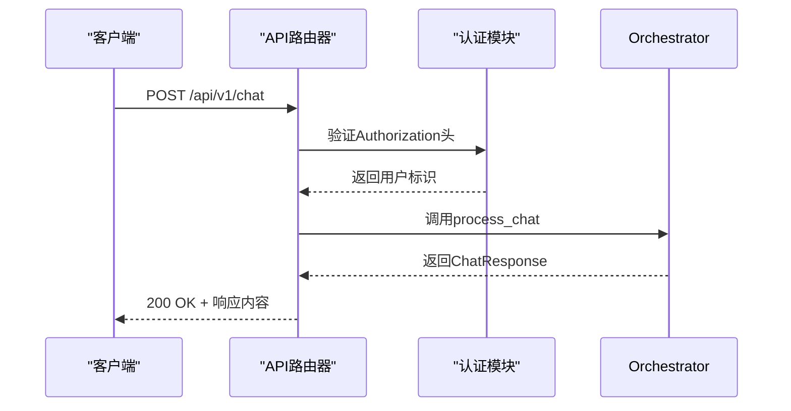
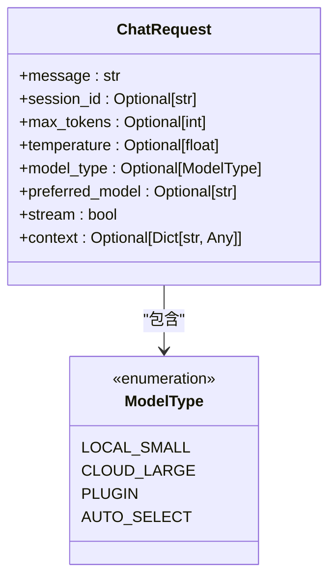
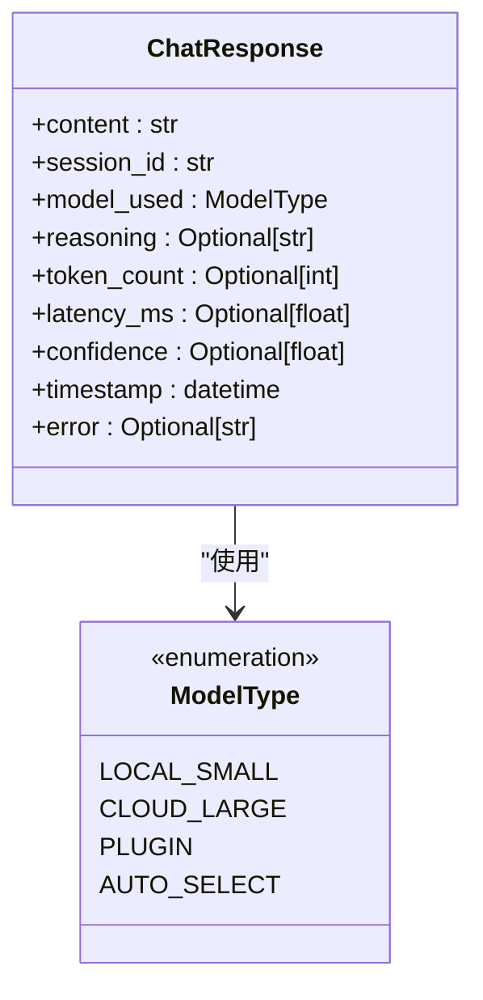
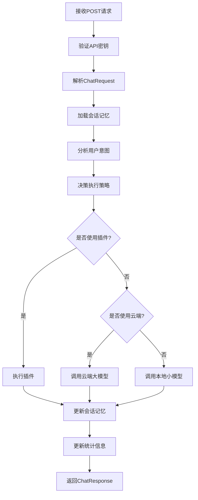
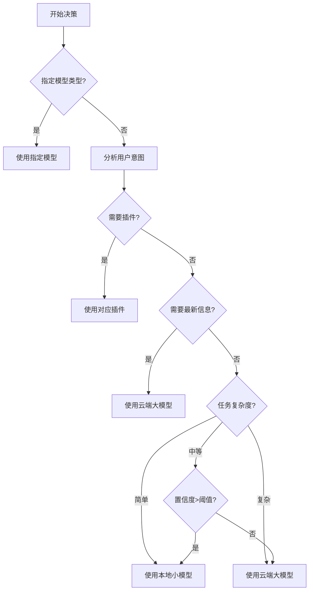

# 普通聊天API

<cite>
**本文档引用的文件**
- [api_router.py](file://python/agent/api_router.py)
- [schemas.py](file://python/models/schemas.py)
- [orchestrator.py](file://python/agent/orchestrator.py)
- [dependencies.py](file://python/core/dependencies.py)
- [config.py](file://python/core/config.py)
</cite>

## 目录
1. [简介](#简介)
2. [API端点与认证](#api端点与认证)
3. [请求体结构](#请求体结构)
4. [响应格式](#响应格式)
5. [处理流程分析](#处理流程分析)
6. [模型选择策略](#模型选择策略)
7. [使用示例](#使用示例)
8. [错误处理](#错误处理)
9. [性能优化建议](#性能优化建议)

## 简介
本API文档详细说明了普通聊天接口的功能和使用方法。该接口是AI助手系统的核心功能，支持智能路由决策，能够根据任务复杂度、系统资源状况和用户配置自动选择最优的推理模型进行响应。

**Section sources**
- [api_router.py](file://python/agent/api_router.py#L0-L36)
- [orchestrator.py](file://python/agent/orchestrator.py#L67-L102)

## API端点与认证
### 请求URL
```
POST /api/v1/chat
```

### 认证方式
采用Bearer Token认证机制，通过HTTP Authorization头传递API密钥：

```http
Authorization: Bearer <your_api_key>
```

系统通过`get_current_user`依赖函数验证API密钥的有效性。如果在配置中未设置API密钥，则允许所有请求访问。



**Diagram sources**
- [api_router.py](file://python/agent/api_router.py#L0-L36)
- [dependencies.py](file://python/core/dependencies.py#L25-L47)

**Section sources**
- [api_router.py](file://python/agent/api_router.py#L0-L36)
- [dependencies.py](file://python/core/dependencies.py#L25-L47)
- [config.py](file://python/core/config.py#L25-L30)

## 请求体结构
请求体基于`ChatRequest`模型定义，包含以下字段：

| 字段 | 类型 | 必需 | 默认值 | 描述 |
|------|------|------|--------|------|
| message | string | 是 | - | 用户输入的消息内容 |
| session_id | string | 否 | 自动生成 | 会话标识符，用于维护对话上下文 |
| max_tokens | integer | 否 | 1024 | 生成回复的最大token数量 |
| temperature | float | 否 | 0.7 | 温度参数，控制输出的随机性 |
| model_type | ModelType | 否 | auto_select | 模型类型选择策略 |
| preferred_model | string | 否 | null | 首选模型名称 |
| stream | boolean | 否 | false | 是否启用流式响应 |
| context | object | 否 | null | 额外的上下文信息 |

其中`ModelType`枚举包含以下选项：
- `local_small`: 强制使用本地小模型
- `cloud_large`: 强制使用云端大模型
- `plugin`: 使用插件处理
- `auto_select`: 自动选择（默认）



**Diagram sources**
- [schemas.py](file://python/models/schemas.py#L37-L61)
- [schemas.py](file://python/models/schemas.py#L0-L37)

**Section sources**
- [schemas.py](file://python/models/schemas.py#L37-L61)

## 响应格式
响应基于`ChatResponse`模型，返回JSON格式数据：

| 字段 | 类型 | 描述 |
|------|------|------|
| content | string | AI生成的回复内容 |
| session_id | string | 会话标识符 |
| model_used | ModelType | 实际使用的模型类型 |
| reasoning | string | 模型选择的原因说明 |
| token_count | integer | 使用的token数量 |
| latency_ms | float | 响应延迟（毫秒） |
| confidence | float | 置信度评分 |
| timestamp | datetime | 响应时间戳 |
| error | string | 错误信息（如有） |

```json
{
  "content": "您好！我是AI助手，很高兴为您服务。",
  "session_id": "session_1712345678",
  "model_used": "local_small",
  "reasoning": "简单任务，本地模型处理",
  "token_count": 15,
  "latency_ms": 234.5,
  "confidence": 0.95,
  "timestamp": "2024-04-05T10:30:00Z"
}
```



**Diagram sources**
- [schemas.py](file://python/models/schemas.py#L40-L61)
- [schemas.py](file://python/models/schemas.py#L0-L37)

**Section sources**
- [schemas.py](file://python/models/schemas.py#L40-L61)

## 处理流程分析
当收到聊天请求时，系统按照以下流程进行处理：



核心处理逻辑位于`AgentOrchestrator.process_chat`方法中，主要步骤包括：
1. 加载会话上下文记忆
2. 分析用户消息的意图和复杂度
3. 决策最优执行策略
4. 执行相应任务
5. 更新会话记忆
6. 更新性能统计

**Diagram sources**
- [orchestrator.py](file://python/agent/orchestrator.py#L67-L102)
- [api_router.py](file://python/agent/api_router.py#L0-L36)

**Section sources**
- [orchestrator.py](file://python/agent/orchestrator.py#L67-L102)

## 模型选择策略
系统采用智能路由决策机制，根据多种因素自动选择最优模型：



具体决策逻辑如下：
- **插件优先**: 当检测到需要特定功能（如天气查询）时，优先调用相应插件
- **联网需求**: 需要获取最新信息的任务使用云端大模型
- **复杂度评估**: 复杂问题或长文本使用云端大模型
- **资源考量**: 在系统资源充足时优先使用本地模型以降低成本
- **降级机制**: 云端调用失败时自动降级到本地模型

**Section sources**
- [orchestrator.py](file://python/agent/orchestrator.py#L104-L239)

## 使用示例
### curl命令示例
```bash
curl -X POST "http://localhost:8000/api/v1/chat" \
  -H "Authorization: Bearer your_api_key_here" \
  -H "Content-Type: application/json" \
  -d '{
    "message": "今天天气怎么样？",
    "session_id": "user_001_session",
    "max_tokens": 512,
    "temperature": 0.5,
    "model_type": "auto_select"
  }'
```

### Python同步客户端代码
```python
import requests
import json

class ChatClient:
    def __init__(self, api_url: str, api_key: str):
        self.api_url = api_url.rstrip('/')
        self.api_key = api_key
        self.session = requests.Session()
        self.session.headers.update({
            'Authorization': f'Bearer {api_key}',
            'Content-Type': 'application/json'
        })
    
    def chat(self, message: str, **kwargs) -> dict:
        """
        发送聊天请求
        
        Args:
            message: 用户消息
            **kwargs: 其他ChatRequest参数
            
        Returns:
            ChatResponse字典
        """
        payload = {
            'message': message,
            **kwargs
        }
        
        response = self.session.post(
            f'{self.api_url}/api/v1/chat',
            data=json.dumps(payload, ensure_ascii=False),
            timeout=30
        )
        
        if response.status_code == 200:
            return response.json()
        else:
            raise Exception(f'请求失败: {response.status_code} - {response.text}')

# 使用示例
client = ChatClient('http://localhost:8000', 'your_api_key_here')
response = client.chat(
    message='请解释量子计算的基本原理',
    max_tokens=1024,
    temperature=0.7
)
print(f'回复: {response["content"]}')
print(f'使用模型: {response["model_used"]}')
print(f'决策原因: {response["reasoning"]}')
