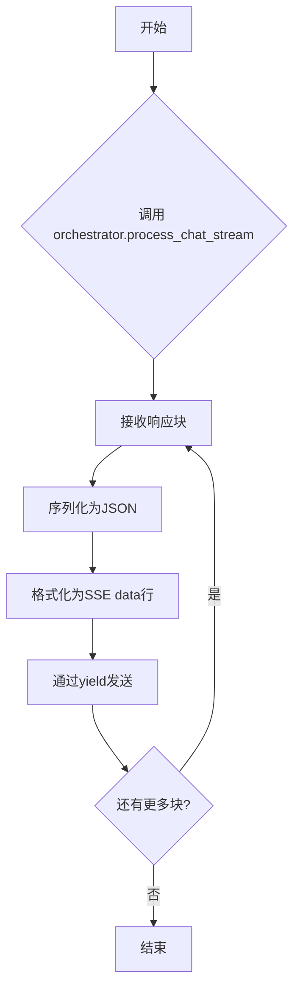
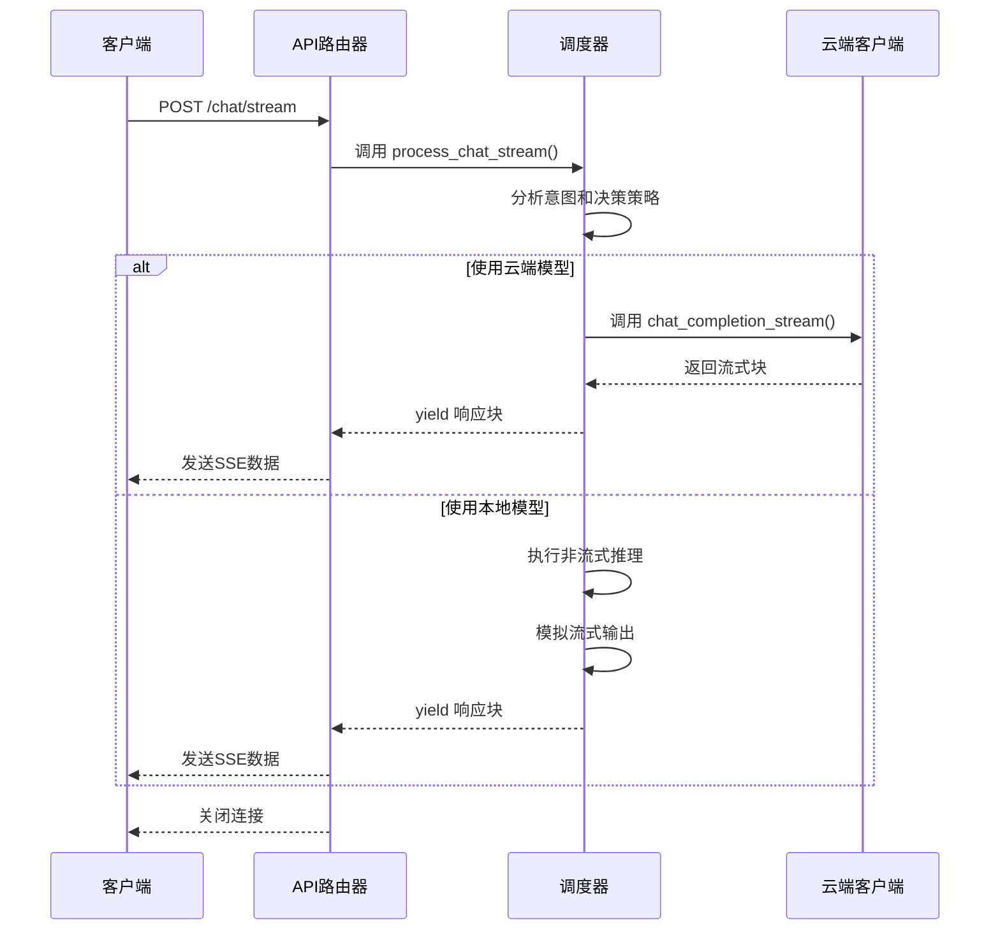

# 流式聊天API

<cite>
**本文档中引用的文件**   
- [api_router.py](file://python/agent/api_router.py)
- [orchestrator.py](file://python/agent/orchestrator.py)
- [schemas.py](file://python/models/schemas.py)
- [dependencies.py](file://python/core/dependencies.py)
- [config.py](file://python/core/config.py)
</cite>

## 目录
1. [简介](#简介)
2. [端点详情](#端点详情)
3. [请求结构](#请求结构)
4. [流式响应协议](#流式响应协议)
5. [后端处理流程](#后端处理流程)
6. [使用示例](#使用示例)
7. [错误处理](#错误处理)
8. [性能优化建议](#性能优化建议)

## 简介
本API文档详细说明了`/chat/stream`端点的实现和使用方法。该端点提供实时流式AI对话功能，通过Server-Sent Events (SSE)协议将响应逐块发送给客户端，实现类似打字机效果的实时输出体验。

## 端点详情
`/chat/stream`端点接收POST请求，返回流式文本响应。与常规API不同，该接口不会等待完整响应生成后再返回，而是随着内容的生成逐步发送数据块。

**HTTP方法**: POST  
**URL路径**: `/api/v1/chat/stream`  
**认证方式**: Bearer Token（API密钥）  
**媒体类型**: `text/plain`

**Section sources**
- [api_router.py](file://python/agent/api_router.py#L85-L119)

## 请求结构
请求体必须符合`ChatRequest`模型定义，包含以下字段：

| 字段名 | 类型 | 必需 | 描述 |
|-------|------|------|------|
| message | string | 是 | 用户输入的消息内容 |
| session_id | string | 否 | 会话标识符，用于上下文记忆 |
| max_tokens | integer | 否 | 响应的最大token数量，默认1024 |
| temperature | float | 否 | 生成温度参数，控制随机性，默认0.7 |
| model_type | ModelType | 否 | 指定模型类型，支持自动选择、本地小模型、云端大模型 |
| preferred_model | string | 否 | 首选模型名称 |
| stream | boolean | 否 | 是否启用流式响应，默认false |

**Section sources**
- [schemas.py](file://python/models/schemas.py#L20-L35)

## 流式响应协议
流式响应采用标准的Server-Sent Events (SSE)协议格式，具有以下特点：

### 数据格式
每个数据块以`data:`开头，后跟JSON编码的内容，以`\n\n`结尾：
```
data: {"content": "部分响应内容", "session_id": "session_123", "model_used": "cloud_large"}\n\n
```

### 心跳机制
服务器定期发送空数据块或注释行以保持连接活跃，防止代理或客户端超时。

### 连接关闭条件
- **正常完成**: 当AI生成完整响应后，服务器关闭连接。
- **发生错误**: 如果处理过程中出现异常，发送错误数据块后关闭连接。
- **客户端断开**: 客户端主动关闭连接。

**Section sources**
- [api_router.py](file://python/agent/api_router.py#L85-L119)

## 后端处理流程
流式聊天的核心处理逻辑由两个组件协同完成：API路由中的生成器函数和调度器中的流式处理器。

### 异步生成器工作原理
`generate_stream`异步生成器负责将内部处理结果转换为SSE格式的响应流：



**Diagram sources**
- [api_router.py](file://python/agent/api_router.py#L85-L119)

### 流式处理引擎
`orchestrator.process_chat_stream`方法实现了核心的流式处理逻辑，根据决策策略选择不同的执行路径：



**Diagram sources**
- [orchestrator.py](file://python/agent/orchestrator.py#L300-L350)

## 使用示例
### curl命令示例
```bash
curl -X POST https://api.example.com/api/v1/chat/stream \
  -H "Authorization: Bearer your-api-key" \
  -H "Content-Type: application/json" \
  -d '{
    "message": "请解释量子计算的基本原理",
    "stream": true
  }' \
  --no-buffer
```

### Python异步客户端代码
```python
import aiohttp
import asyncio

async def stream_chat():
    async with aiohttp.ClientSession() as session:
        async with session.post(
            'https://api.example.com/api/v1/chat/stream',
            json={'message': '你好', 'stream': True},
            headers={'Authorization': 'Bearer your-api-key'}
        ) as response:
            async for line in response.content:
                if line.startswith(b'data:'):
                    data = line[5:].strip()
                    if data != b'[DONE]':
                        chunk = json.loads(data.decode('utf-8'))
                        print(chunk['content'], end='', flush=True)
```

**Section sources**
- [api_router.py](file://python/agent/api_router.py#L85-L119)
- [orchestrator.py](file://python/agent/orchestrator.py#L300-L350)

## 错误处理
在流式场景下，错误处理采用特殊的SSE格式，确保客户端能够正确接收和解析错误信息。

### 常见错误码
| 错误码 | 场景 | 处理方式 |
|-------|------|---------|
| 400 | 无效请求参数 | 在首个数据块中返回错误信息并关闭连接 |
| 500 | 内部服务器错误 | 捕获异常后发送错误数据块并关闭连接 |

当发生错误时，服务器发送如下格式的数据块：
```
data: {"error": "错误描述信息"}\n\n
```

**Section sources**
- [api_router.py](file://python/agent/api_router.py#L85-L119)
- [orchestrator.py](file://python/agent/orchestrator.py#L300-L350)

## 性能优化建议
为了获得最佳的流式传输性能，建议考虑以下优化措施：

1. **调整chunk大小**: 根据网络条件和用户体验需求平衡延迟和吞吐量
2. **连接复用**: 对于频繁交互的场景，保持长连接减少握手开销
3. **客户端缓冲**: 适当配置客户端缓冲区大小，避免过度频繁的UI更新
4. **心跳间隔**: 设置合理的心跳间隔（通常15-30秒），防止连接中断

**Section sources**
- [orchestrator.py](file://python/agent/orchestrator.py#L300-L350)
- [api_router.py](file://python/agent/api_router.py#L85-L119)