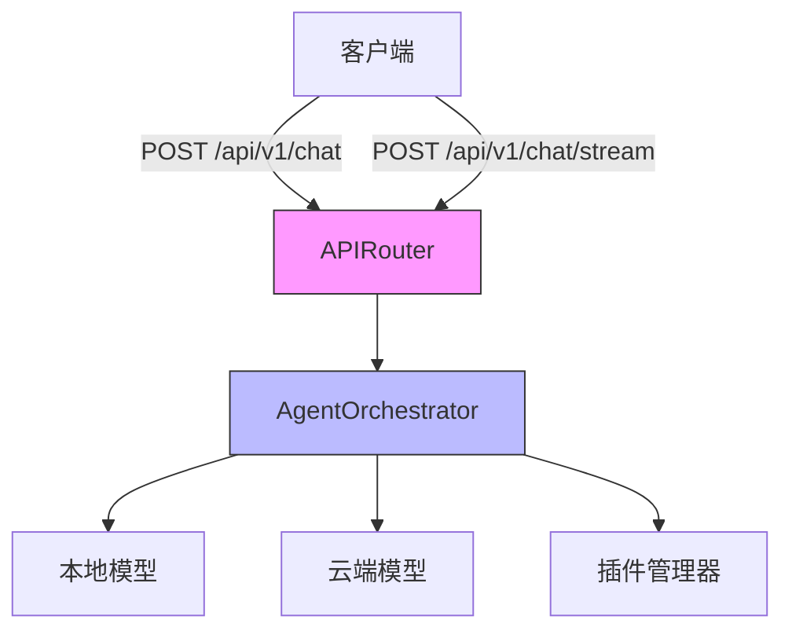
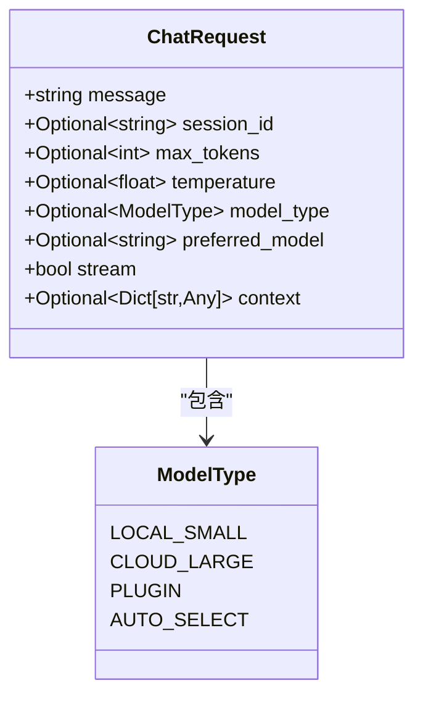
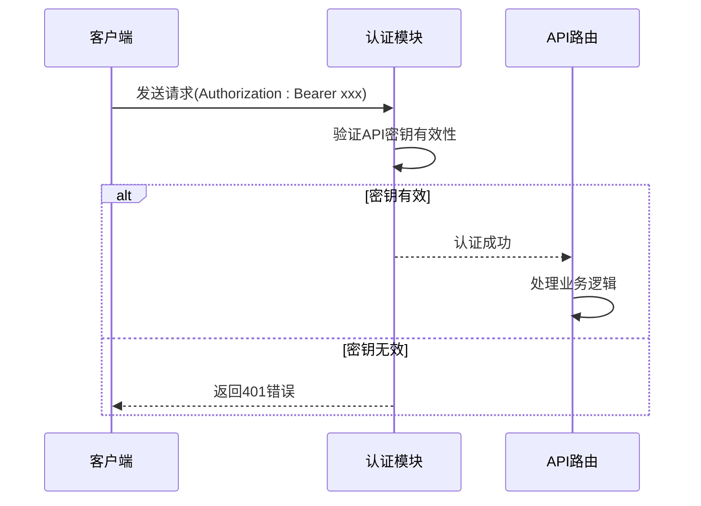
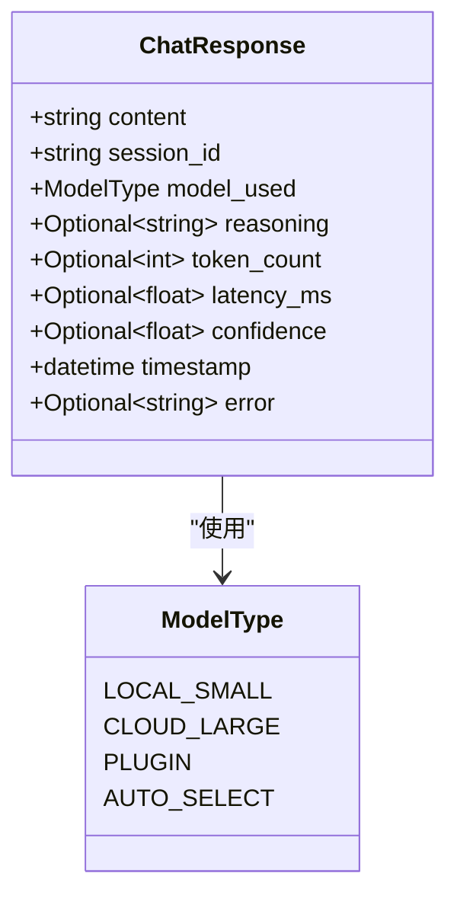
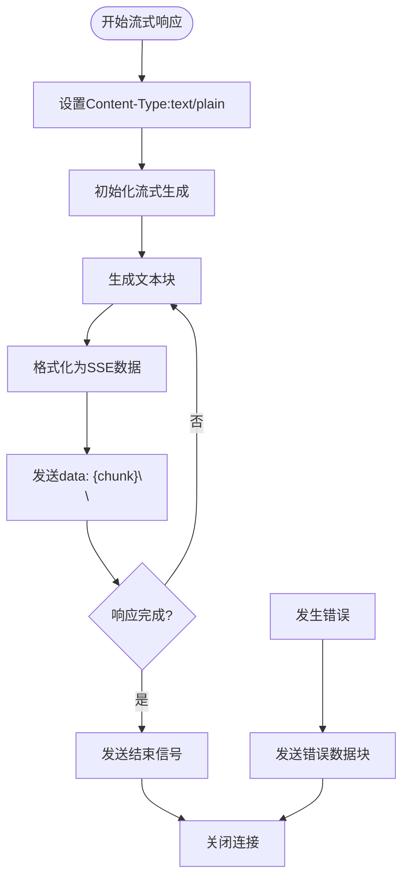

# 聊天API

<cite>
**本文档引用的文件**
- [api_router.py](file://python/agent/api_router.py)
- [schemas.py](file://python/models/schemas.py)
- [orchestrator.py](file://python/agent/orchestrator.py)
- [dependencies.py](file://python/core/dependencies.py)
- [config.py](file://python/core/config.py)
- [main.py](file://python/main.py)
</cite>

## 目录
1. [简介](#简介)
2. [端点说明](#端点说明)
3. [请求体结构](#请求体结构)
4. [认证方式](#认证方式)
5. [响应格式](#响应格式)
6. [流式响应协议](#流式响应协议)
7. [调用示例](#调用示例)
8. [请求处理流程](#请求处理流程)
9. [模型决策机制](#模型决策机制)
10. [错误码说明](#错误码说明)
11. [性能优化建议](#性能优化建议)

## 简介
本API文档详细介绍了聊天服务的两个核心端点：`/chat`和`/chat/stream`。该系统提供智能对话功能，支持同步响应和流式输出两种模式，能够根据任务复杂度自动选择本地小模型或云端大模型进行处理。

**Section sources**
- [main.py](file://python/main.py#L53-L58)

## 端点说明
聊天服务提供了两个主要端点：

### 同步聊天端点
```
POST /api/v1/chat
```
此端点用于普通聊天请求，服务器在完成整个响应生成后一次性返回结果。

### 流式聊天端点
```
POST /api/v1/chat/stream
```
此端点用于流式聊天请求，服务器通过Server-Sent Events (SSE)协议逐步发送响应内容，实现文本实时输出效果。



**Diagram sources**
- [api_router.py](file://python/agent/api_router.py#L25-L45)
- [orchestrator.py](file://python/agent/orchestrator.py#L50-L60)

**Section sources**
- [api_router.py](file://python/agent/api_router.py#L25-L45)

## 请求体结构
聊天请求基于`ChatRequest`模型，包含以下字段：

| 字段名 | 类型 | 必需 | 默认值 | 描述 |
|-------|------|------|--------|------|
| message | string | 是 | - | 用户输入的消息内容 |
| session_id | string | 否 | 自动生成 | 会话标识符，用于保持对话上下文 |
| max_tokens | integer | 否 | 1024 | 生成回复的最大token数量 |
| temperature | float | 否 | 0.7 | 温度参数，控制输出的随机性 |
| model_type | ModelType | 否 | auto_select | 模型类型选择策略 |
| preferred_model | string | 否 | - | 首选模型名称 |
| stream | boolean | 否 | false | 是否启用流式响应 |
| context | object | 否 | null | 额外的上下文信息 |



**Diagram sources**
- [schemas.py](file://python/models/schemas.py#L28-L37)

**Section sources**
- [schemas.py](file://python/models/schemas.py#L28-L37)

## 认证方式
所有API请求都需要通过API密钥进行身份验证，采用标准的Bearer Token认证方案。

### 认证流程
1. 客户端在HTTP请求头中包含Authorization字段
2. 格式为：`Bearer <API_KEY>`
3. 服务器验证密钥的有效性
4. 验证通过后处理请求，否则返回401错误



**Diagram sources**
- [dependencies.py](file://python/core/dependencies.py#L15-L47)

**Section sources**
- [dependencies.py](file://python/core/dependencies.py#L15-L47)

## 响应格式
### 同步响应
同步聊天端点返回标准的JSON响应，基于`ChatResponse`模型：

| 字段名 | 类型 | 描述 |
|-------|------|------|
| content | string | AI生成的回复内容 |
| session_id | string | 会话ID |
| model_used | ModelType | 实际使用的模型类型 |
| reasoning | string | 模型选择的原因说明 |
| token_count | integer | 使用的token数量 |
| latency_ms | float | 响应延迟（毫秒） |
| confidence | float | 回复置信度 |
| timestamp | datetime | 响应时间戳 |
| error | string | 错误信息（如有） |



**Diagram sources**
- [schemas.py](file://python/models/schemas.py#L40-L50)

**Section sources**
- [schemas.py](file://python/models/schemas.py#L40-L50)

## 流式响应协议
流式聊天端点使用Server-Sent Events (SSE)协议传输数据。

### 协议格式
每个数据块遵循以下格式：
```
data: {"content": "部分文本", "session_id": "xxx", ...}\n\n
```

### 数据字段编码规则
- 所有JSON数据必须使用UTF-8编码
- 特殊字符需要正确转义
- 使用`ensure_ascii=False`确保中文字符正常显示
- 每个数据块以`\n\n`结尾

### 心跳机制
系统定期发送心跳消息以保持连接活跃：
```
data: {"heartbeat": true, "timestamp": "2023-01-01T00:00:00"}\n\n
```

### 连接关闭条件
当满足以下任一条件时，服务器将关闭SSE连接：
1. 完整的响应已全部发送
2. 发生不可恢复的错误
3. 客户端主动断开连接
4. 超过最大响应时间限制
5. 达到max_tokens限制



**Diagram sources**
- [api_router.py](file://python/agent/api_router.py#L50-L65)

**Section sources**
- [api_router.py](file://python/agent/api_router.py#L50-L65)

## 调用示例
### 普通聊天调用
```bash
curl -X POST "http://localhost:8000/api/v1/chat" \
  -H "Authorization: Bearer your-api-key" \
  -H "Content-Type: application/json" \
  -d '{
    "message": "你好，今天天气怎么样？",
    "session_id": "session_123",
    "max_tokens": 512,
    "temperature": 0.7
  }'
```

### 流式输出调用
```bash
curl -X POST "http://localhost:8000/api/v1/chat/stream" \
  -H "Authorization: Bearer your-api-key" \
  -H "Content-Type: application/json" \
  -d '{
    "message": "请详细解释量子计算的基本原理",
    "stream": true,
    "max_tokens": 2048
  }'
```

### Python异步客户端
```python
import aiohttp
import asyncio

async def chat_stream():
    async with aiohttp.ClientSession() as session:
        headers = {
            "Authorization": "Bearer your-api-key",
            "Content-Type": "application/json"
        }
        
        data = {
            "message": "讲一个有趣的故事",
            "stream": True
        }
        
        async with session.post(
            "http://localhost:8000/api/v1/chat/stream",
            json=data,
            headers=headers
        ) as response:
            async for line in response.content:
                if line.strip():
                    chunk = line.decode('utf-8').strip()
                    if chunk.startswith('data:'):
                        content = chunk[5:].strip()
                        print(f"收到: {content}")

if __name__ == "__main__":
    asyncio.run(chat_stream())
```

**Section sources**
- [api_router.py](file://python/agent/api_router.py#L25-L65)

## 请求处理流程
当收到聊天请求时，系统按照以下流程进行处理：

```mermaid
sequenceDiagram
    participant Client as 客户端
    participant Router as API路由器
    participant Orchestrator as 调度器
    participant Memory as 记忆管理器
    participant Intent as 意图分析器
    participant Model as 模型处理器
    
    Client->>Router: 发送聊天请求
    Router->>Orchestrator: 转发请求
    Orchestrator->>Memory: 加载会话上下文
    Memory-->>Orchestrator: 返回上下文数据
    Orchestrator->>Intent: 分析用户意图
   