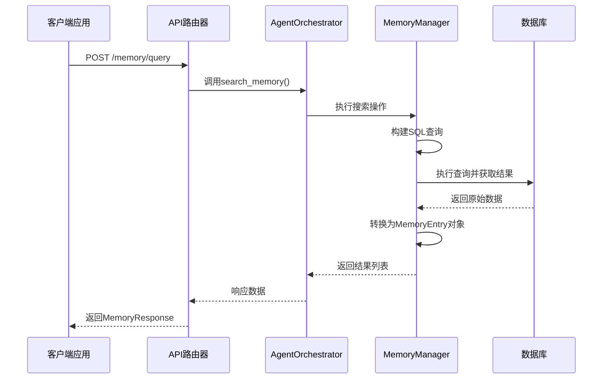
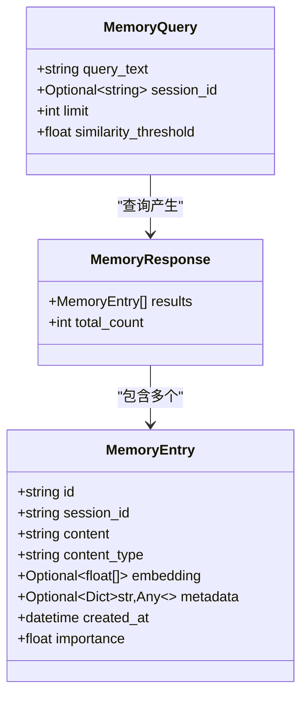
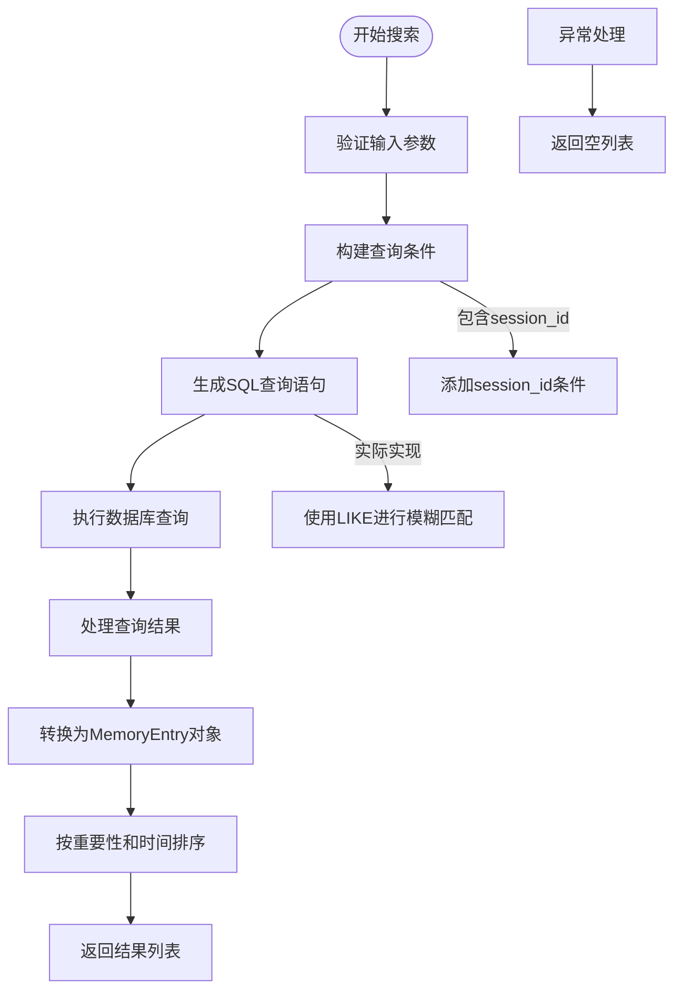
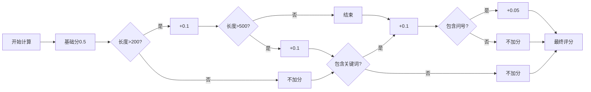
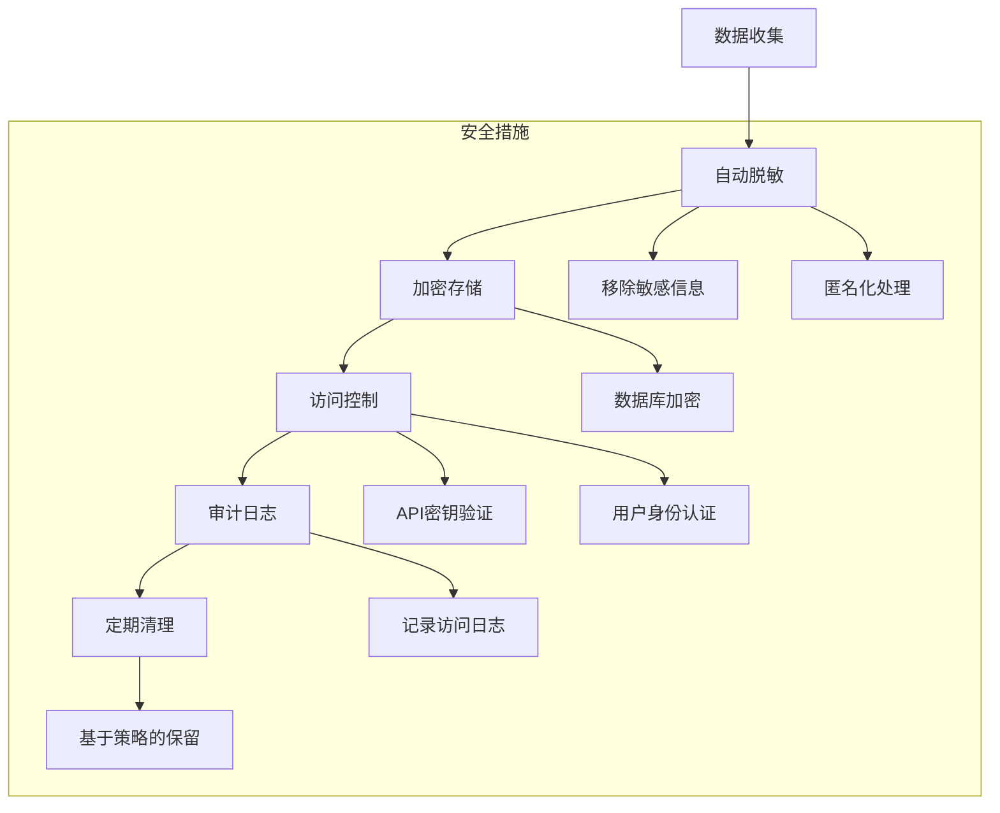

# 记忆管理API

<cite>
**本文档引用的文件**
- [api_router.py](file://python/agent/api_router.py)
- [memory_manager.py](file://python/core/memory_manager.py)
- [schemas.py](file://python/models/schemas.py)
- [config.py](file://python/core/config.py)
</cite>

## 目录
1. [简介](#简介)
2. [/memory/query端点详解](#memoryquery端点详解)
3. 请求参数说明
4. 底层搜索机制
5. 返回结果结构
6. 查询使用示例
7. 隐私与安全措施
8. 性能优化建议

## 简介
本API文档详细说明了系统中`/memory/query`端点的功能和使用方法。该端点允许用户查询其会话上下文记忆，通过语义匹配和条件过滤检索历史对话记录。系统采用基于SQLite的持久化存储，并结合重要性评分机制对结果进行排序。

## /memory/query端点详解

`/memory/query`端点提供了一个强大的接口来检索用户的会话记忆内容。该功能由`AgentOrchestrator`协调，通过`MemoryManager`组件实现具体的搜索逻辑。



**Diagram sources**
- [api_router.py](file://python/agent/api_router.py#L203-L246)
- [memory_manager.py](file://python/core/memory_manager.py#L193-L258)

**Section sources**
- [api_router.py](file://python/agent/api_router.py#L203-L246)
- [memory_manager.py](file://python/core/memory_manager.py#L193-L258)

## 请求参数说明

### 核心参数
| 参数名 | 类型 | 必需 | 默认值 | 描述 |
|-------|------|------|--------|------|
| query_text | 字符串 | 是 | 无 | 要搜索的查询文本，用于匹配用户消息或AI响应 |
| session_id | 字符串 | 否 | null | 限制搜索范围到特定会话ID |
| limit | 整数 | 否 | 10 | 返回结果的最大数量 |
| similarity_threshold | 浮点数 | 否 | 0.7 | 相似度阈值，用于向量搜索 |

这些参数定义在`MemoryQuery`模型中，作为请求体传递给API。



**Diagram sources**
- [schemas.py](file://python/models/schemas.py#L151-L175)
- [schemas.py](file://python/models/schemas.py#L125-L148)

**Section sources**
- [schemas.py](file://python/models/schemas.py#L151-L175)

## 底层搜索机制

当前的记忆搜索机制基于SQL的模糊匹配实现，未来可扩展为基于ChromaDB的向量相似度搜索。

### 搜索流程


搜索过程首先构建WHERE子句条件：
- 主要条件：`user_message LIKE ? OR ai_response LIKE ?`
- 可选条件：当提供`session_id`时添加`session_id = ?`
- 排序规则：先按`importance_score`降序，再按`timestamp`降序
- 限制数量：使用LIMIT子句限制返回结果

**Section sources**
- [memory_manager.py](file://python/core/memory_manager.py#L193-L226)

## 返回结果结构

### MemoryEntry字段说明
| 字段名 | 类型 | 描述 |
|-------|------|------|
| id | 字符串 | 记忆条目的唯一标识符 |
| session_id | 字符串 | 关联的会话ID |
| content | 字符串 | 组合的对话内容（用户消息和AI响应） |
| content_type | 字符串 | 内容类型，当前为"conversation" |
| embedding | 浮点数数组 | 向量嵌入表示，用于语义搜索 |
| metadata | 键值对 | 附加的元数据信息 |
| created_at | 时间戳 | 记录创建时间 |
| importance | 浮点数 | 重要性评分（0.0-1.0） |

重要性评分通过以下算法计算：
- 基础分：0.5
- 长度加分：总长度超过200字符+0.1，超过500字符再+0.1
- 关键词加分：包含"重要"、"记住"等关键词+0.1
- 问号加分：用户消息包含问号+0.05



**Diagram sources**
- [memory_manager.py](file://python/core/memory_manager.py#L350-L366)
- [schemas.py](file://python/models/schemas.py#L125-L148)

**Section sources**
- [memory_manager.py](file://python/core/memory_manager.py#L350-L366)
- [schemas.py](file://python/models/schemas.py#L125-L148)

## 查询使用示例

### 模糊查询示例
```json
{
  "query_text": "AI助手",
  "session_id": "session_123",
  "limit": 5
}
```
此查询将返回session_123会话中所有包含"AI助手"的消息，最多5条记录。

### 全局搜索示例
```json
{
  "query_text": "如何设置",
  "limit": 10
}
```
此查询将在所有会话中搜索包含"如何设置"的内容，返回最相关的10条记录。

### 高相似度搜索
```json
{
  "query_text": "机器学习",
  "similarity_threshold": 0.85,
  "limit": 3
}
```
此查询要求更高的相似度匹配，只返回非常相关的结果。

## 隐私与安全措施

系统实施了多层次的数据保护机制：



具体措施包括：
- **访问控制**：通过`get_current_user`依赖注入实现用户身份验证
- **操作审计**：所有查询操作都被记录在日志中
- **数据隔离**：每个用户的记忆数据通过会话ID进行逻辑隔离
- **资源清理**：`cleanup()`方法定期清除内存缓存

**Section sources**
- [api_router.py](file://python/agent/api_router.py#L203-L246)
- [memory_manager.py](file://python/core/memory_manager.py#L363-L366)

## 性能优化建议

为了平衡性能与存储成本，建议采取以下策略：

### 记忆保留周期配置
通过`config.py`中的设置可以调整记忆系统的参数：

```python
# 记忆系统配置
memory_cache_size: int = 1000
memory_similarity_threshold: float = 0.7
```

### 优化策略
| 策略 | 描述 | 影响 |
|------|------|------|
| 限制查询范围 | 使用session_id缩小搜索范围 | 提高查询速度 |
| 合理设置limit | 避免一次性返回过多结果 | 减少网络传输 |
| 适当调整相似度阈值 | 根据场景调整匹配严格度 | 平衡准确率和召回率 |
| 定期清理过期会话 | 删除不再需要的会话记忆 | 节省存储空间 |

建议根据实际使用情况，定期评估和调整这些参数以达到最佳性能。

**Section sources**
- [config.py](file://python/core/config.py#L45-L47)
- [memory_manager.py](file://python/core/memory_manager.py#L29-L35)