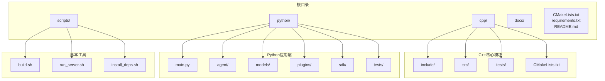
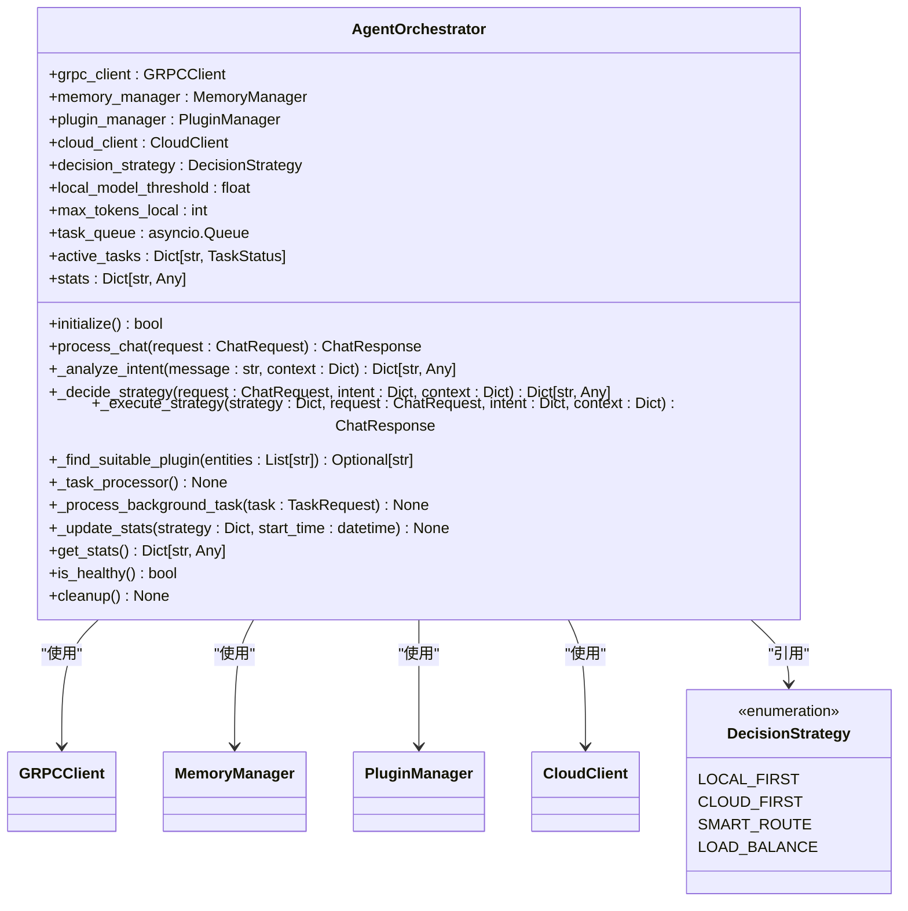
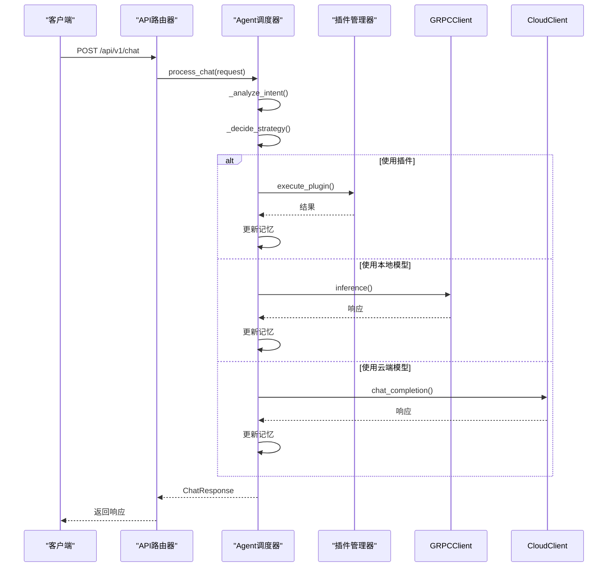
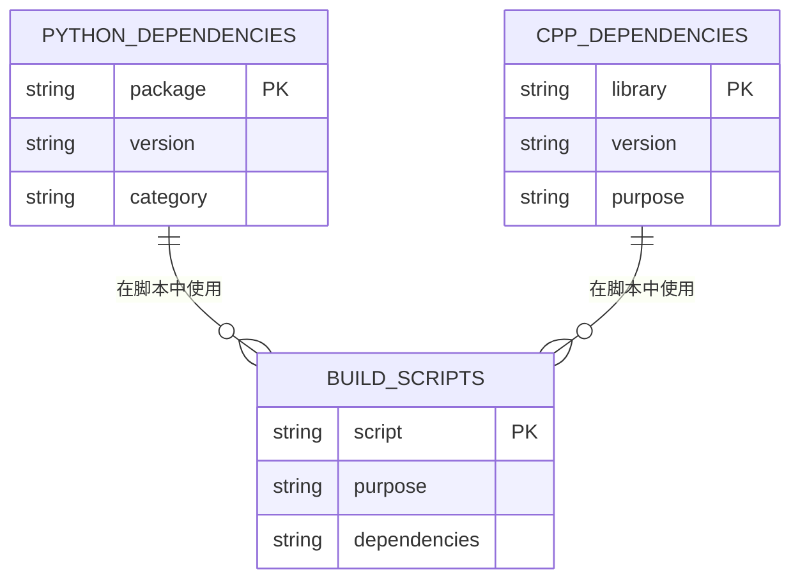

# 开发者贡献指南

<cite>
**本文档引用的文件**   
- [README.md](file://README.md)
- [requirements.txt](file://requirements.txt)
- [build.sh](file://scripts/build.sh)
- [run_server.sh](file://scripts/run_server.sh)
- [CMakeLists.txt](file://CMakeLists.txt)
- [cpp/CMakeLists.txt](file://cpp/CMakeLists.txt)
- [python/main.py](file://python/main.py)
- [python/agent/orchestrator.py](file://python/agent/orchestrator.py)
- [python/agent/api_router.py](file://python/agent/api_router.py)
- [python/models/schemas.py](file://python/models/schemas.py)
- [python/sdk/plugin_base.py](file://python/sdk/plugin_base.py)
- [python/plugins/weather/main.py](file://python/plugins/weather/main.py)
- [python/plugins/weather/plugin.json](file://python/plugins/weather/plugin.json)
- [cpp/include/model_engine.hpp](file://cpp/include/model_engine.hpp)
- [cpp/include/sys_manager.hpp](file://cpp/include/sys_manager.hpp)
</cite>

## 目录
1. [简介](#简介)
2. [项目结构](#项目结构)
3. [核心组件](#核心组件)
4. [架构概述](#架构概述)
5. [详细组件分析](#详细组件分析)
6. [依赖分析](#依赖分析)
7. [性能考虑](#性能考虑)
8. [故障排除指南](#故障排除指南)
9. [结论](#结论)

## 简介
本项目是一个基于C++和Python混合架构的AI助手，支持本地小模型推理、云端大模型调用、插件扩展和记忆功能。项目采用分层设计，C++负责高性能计算任务，Python处理业务逻辑和API接口。通过gRPC实现跨语言通信，支持Python和C++双语言插件系统。

## 项目结构



**图示来源**
- [README.md](file://README.md#L10-L117)

**本节来源**
- [README.md](file://README.md#L10-L117)

## 核心组件

本项目由多个核心组件构成，包括C++核心引擎、Python应用层、插件系统和通信层。C++部分负责模型推理、系统资源管理和插件加载，Python部分负责API服务、Agent调度和业务逻辑处理。

**本节来源**
- [README.md](file://README.md#L10-L117)
- [python/main.py](file://python/main.py#L1-L117)
- [cpp/include/model_engine.hpp](file://cpp/include/model_engine.hpp#L1-L79)

## 架构概述

```mermaid
flowchart LR
subgraph User[用户/应用]
A[CLI] --> |HTTP/WebSocket| B[FastAPI API]
W[Web UI] --> |HTTP| B
end
subgraph Python[Python 层]
B --> O[Agent Orchestrator]
O --> |调用| P[插件 SDK]
O --> |gRPC/Pybind11| CppCore
end
subgraph CppCore[C++ 核心层]
CppCore --> M[Model Engine (llama.cpp / vLLM)]
CppCore --> S[SysManager (CPU/MEM/IO)]
CppCore --> L[Plugin Loader (C++ 插件)]
end
```

**图示来源**
- [README.md](file://README.md#L25-L40)

## 详细组件分析

### Agent调度器分析



**图示来源**
- [python/agent/orchestrator.py](file://python/agent/orchestrator.py#L1-L351)

**本节来源**
- [python/agent/orchestrator.py](file://python/agent/orchestrator.py#L1-L351)

### API路由分析



**图示来源**
- [python/agent/api_router.py](file://python/agent/api_router.py#L1-L285)
- [python/agent/orchestrator.py](file://python/agent/orchestrator.py#L1-L351)

**本节来源**
- [python/agent/api_router.py](file://python/agent/api_router.py#L1-L285)

### 模型引擎分析

```mermaid
classDiagram
class ModelEngine {
+initialize(config_path : string) bool
+inference(request : InferenceRequest) InferenceResponse
+inference_async(request : InferenceRequest) future~InferenceResponse~
+inference_stream(request : InferenceRequest, callback : StreamCallback) void
+load_local_model(model_path : string) bool
+set_cloud_config(api_key : string, endpoint : string) void
+get_available_models() vector~string~
+is_healthy() bool
}
class InferenceRequest {
+prompt : string
+model_type : ModelType
+max_tokens : int
+temperature : float
+stream : bool
+session_id : string
}
class InferenceResponse {
+text : string
+finished : bool
+confidence : float
+used_model : ModelType
+token_count : int
+latency_ms : double
}
class ModelType {
<<enumeration>>
LOCAL_SMALL
CLOUD_LARGE
AUTO_SELECT
}
class StreamCallback {
<<typedef>>
function<void(const InferenceResponse&)>
}
ModelEngine --> InferenceRequest : "接收"
ModelEngine --> InferenceResponse : "返回"
ModelEngine --> ModelType : "使用"
ModelEngine --> StreamCallback : "使用"
```

**图示来源**
- [cpp/include/model_engine.hpp](file://cpp/include/model_engine.hpp#L1-L79)

**本节来源**
- [cpp/include/model_engine.hpp](file://cpp/include/model_engine.hpp#L1-L79)

## 依赖分析



**图示来源**
- [requirements.txt](file://requirements.txt#L1-L25)
- [build.sh](file://scripts/build.sh#L1-L159)
- [CMakeLists.txt](file://CMakeLists.txt#L1-L29)

**本节来源**
- [requirements.txt](file://requirements.txt#L1-L25)
- [build.sh](file://scripts/build.sh#L1-L159)
- [CMakeLists.txt](file://CMakeLists.txt#L1-L29)

## 性能考虑
本项目通过C++核心层处理计算密集型任务，确保高性能推理能力。Python层采用异步框架FastAPI处理API请求，支持高并发。系统采用智能调度策略，根据任务复杂度和系统资源状况自动选择本地小模型或云端大模型进行处理。内存管理系统实现了会话状态的持久化存储，支持长期对话记忆。

## 故障排除指南
常见问题包括依赖安装