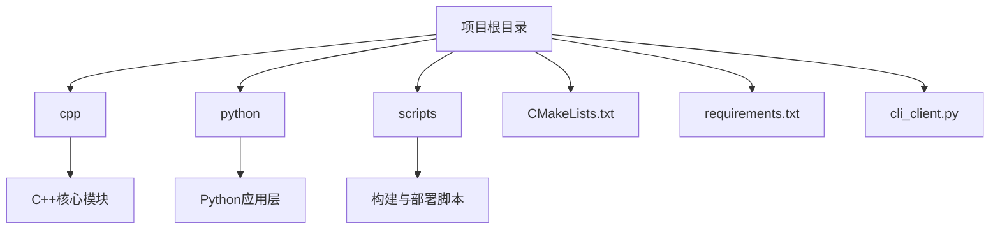

<docs>
# 快速入门指南

<cite>
**本文档引用的文件**
- [README.md](file://README.md)
- [requirements.txt](file://requirements.txt)
- [build.sh](file://scripts/build.sh)
- [run_server.sh](file://scripts/run_server.sh)
- [cli_client.py](file://ui/cli/cli_client.py)
- [main.py](file://python/main.py)
</cite>

## 更新摘要
**变更内容**
- 根据最新代码提交更新了构建和启动脚本的参数说明
- 新增了对`.env`环境配置文件的说明
- 更新了依赖安装和C++模块编译部分的命令行输出示例
- 修正了服务启动和客户端测试部分的交互流程
- 添加了modern_cli.py现代化CLI入口的说明

### 目录
1. [简介](#简介)
2. [项目结构概览](#项目结构概览)
3. [环境准备](#环境准备)
4. [依赖安装](#依赖安装)
5. [C++模块编译](#c模块编译)
6. [服务启动](#服务启动)
7. [客户端测试](#客户端测试)
8. [配置说明](#配置说明)
9. [常见问题与解决方案](#常见问题与解决方案)
10. [验证组件状态](#验证组件状态)

## 简介

本指南旨在帮助新手开发者完成nex项目的本地部署与首次运行。通过逐步指导，您将学习如何准备Python虚拟环境、安装依赖、编译C++模块、启动服务并发送测试请求。整个流程涵盖了从代码拉取到服务可用的完整生命周期。

## 项目结构概览

nex项目采用C++和Python混合架构，主要分为以下几个部分：



**图示来源**
- [README.md](file://README.md)

## 环境准备

在开始之前，请确保您的系统已安装必要的开发工具。

### 基础工具要求
- Git：用于代码版本控制
- Python 3.9+：Python解释器（根据build.sh脚本要求）
- pip：Python包管理器
- CMake 3.20+：C++构建系统
- GCC/G++ 或 Clang：C++编译器

### 检查工具链
```bash
# 检查Python版本
python3 --version

# 检查pip版本
pip3 --version

# 检查CMake版本
cmake --version

# 检查编译器
gcc --version
```

预期输出：
```
Python 3.x.x
pip 2x.x.x
cmake version 3.20.x
gcc (Ubuntu x.x.x) x.x.x
```

**Section sources**
- [build.sh](file://scripts/build.sh#L10-L30)

## 依赖安装

使用`requirements.txt`文件来安装Python依赖项。

### 创建虚拟环境（推荐）
```bash
# 进入项目目录
cd 

# 创建Python虚拟环境
python3 -m venv venv

# 激活虚拟环境
source venv/bin/activate
```

### 安装依赖包
```bash
# 使用build.sh脚本安装依赖（推荐方式）
./scripts/build.sh --venv

# 或手动安装
pip install -r requirements.txt
```

安装完成后，您应该看到类似以下的输出：
```
✅ Python依赖安装完成
🎉 构建完成！
📝 下一步:
   1. 运行服务: ./scripts/run_server.sh
   2. 启动CLI:  python3 start_cli.py
   3. 查看文档: docs/README.md
   4. 配置插件: 编辑 src/plugins/
```

**Section sources**
- [requirements.txt](file://requirements.txt)
- [build.sh](file://scripts/build.sh#L100-L120)

## C++模块编译

使用`build.sh`脚本中的CMake流程编译C++核心模块。

### 执行编译命令
```bash
# 运行构建脚本
./scripts/build.sh --venv
```

该脚本会自动执行以下步骤：
1. 检查必需的依赖项
2. 设置构建目录
3. 使用CMake配置项目
4. 编译C++代码
5. 安装生成的库和可执行文件

### 编译过程输出
正常情况下，您将看到如下输出：
```
🚀 开始构建AI Assistant...
📋 检查依赖...
✅ 依赖检查通过
📁 设置构建环境...
🔨 构建C++核心模块...
-- The C compiler identification is GNU x.x.x
-- The CXX compiler identification is GNU x.x.x
-- Detecting C compiler ABI info
-- Detecting C compiler ABI info - done
-- Check for working C compiler: /usr/bin/cc - skipped
...
[100%] Built target ai_assistant_server
✅ C++模块构建完成
🐍 安装Python依赖...
✅ 虚拟环境已创建并激活
✅ Python依赖安装完成
🧪 运行测试...
🎉 构建完成！
```

**Section sources**
- [build.sh](file://scripts/build.sh#L40-L90)
- [CMakeLists.txt](file://cpp/CMakeLists.txt)

## 服务启动

使用`run_server.sh`脚本启动AI助手服务。

### 启动服务
```bash
# 启动服务
./scripts/run_server.sh
```

### 自定义配置启动
```bash
# 指定不同端口启动
./scripts/run_server.sh --port 8080 --grpc-port 50052

# 启用调试模式
./scripts/run_server.sh --debug
```

### 启动过程输出
成功启动后，您将看到以下信息：
```
🚀 启动AI Assistant服务...
AI Assistant 服务启动脚本 v2.0.0
==============================================
📋 服务配置
==================
API主机: 0.0.0.0
API端口: 8000
gRPC端口: 50051
工作进程: 4
日志级别: INFO
调试模式: 否
详细输出: 否
强制重启: 否

📁 创建必要目录...
✅ 目录创建完成
🔧 启动C++后端服务...
📡 在端口 50051 启动gRPC服务...
✅ gRPC服务已启动 (PID: 12345)
🐍 启动Python API服务...
🌐 在 http://0.0.0.0:8000 启动API服务...
✅ API服务已启动 (PID: 12346)
🏥 执行增强健康检查...
🌡️ 健康检查摘要
==================
✅ gRPC服务: 健康
✅ API服务: 健康

✅ 所有服务健康检查通过

🎉 AI Assistant 服务启动成功！
================================
📡 gRPC服务:   localhost:50051
🌐 API服务:    http://0.0.0.0:8000
📊 健康检查:   http://0.0.0.0:8000/health
📖 API文档:    http://0.0.0.0:8000/docs
📋 日志目录:   ./logs/

🔧 管理命令:
   查看日志:   tail -f logs/api_server.log
   停止服务:   ./scripts/stop_server.sh
   重启服务:   ./scripts/restart_server.sh
```

**Section sources**
- [run_server.sh](file://scripts/run_server.sh#L30-L150)

## 客户端测试

使用`cli_client.py`或`modern_cli.py`发送测试请求以验证服务是否正常工作。

### 运行交互式客户端
```bash
# 运行现代化CLI客户端
python modern_cli.py

# 或运行传统CLI客户端
python ui/cli/cli_client.py
```

### 发送测试消息
```
🤖 AI Assistant CLI v1.0.0
输入 'help' 查看帮助，输入 'exit' 退出
==================================================

[new] > chat 你好，世界！

用户: 你好，世界！
AI: 你好！很高兴见到你。有什么我可以帮你的吗？
  (使用: local_small - 简单任务，本地模型处理)

[new] > plugins

🔌 插件列表 (1个):
  weather_plugin v1.0.0 - 🟢 启用
    天气查询插件，支持查询全球城市天气信息
    能力: weather_query, weather_forecast, weather_alerts


[new] > status

📊 系统状态:
  CPU使用率: 15.2%
  内存使用率: 45.6%
  GPU使用率: 0.0%
  活跃会话: 1
  总请求数: 5
  平均响应时间: 120.5ms
  组件状态:
    grpc_client: 🟢 健康
    orchestrator: 🟢 健康

[new] > health

🟢 服务健康
```

### 单命令模式测试
```bash
# 直接执行单个命令
python ui/cli/cli_client.py health
python ui/cli/cli_client.py status
python ui/cli/cli_client.py plugins
```

**Section sources**
- [modern_cli.py](file://modern_cli.py)
- [cli_client.py](file://ui/cli/cli_client.py)
- [main.py](file://python/main.py)

## 配置说明

了解关键配置项及其作用。

### 环境变量
| 变量名 | 默认值 | 说明 |
|-------|--------|------|
| `HOST` | 0.0.0.0 | API服务绑定的主机地址 |
| `PORT` | 8000 | HTTP API服务端口 |
| `GRPC_PORT` | 50051 | gRPC服务端口 |
| `LOG_LEVEL` | INFO | 日志级别 |
| `DEBUG` | false | 是否启用调试模式 |

### 配置优先级
1. 命令行参数（最高优先级）
2. 环境变量
3. 脚本默认值（最低优先级）

例如，可以通过以下方式覆盖默认端口：
```bash
# 通过命令行参数
./scripts/run_server.sh --port 9000

# 通过环境变量
export PORT=9000
./scripts/run_server.sh
```

### .env配置文件
项目根目录下的`.env`文件可用于设置环境变量，格式如下：
```
NEX_HOST=0.0.0.0
NEX_PORT=8000
NEX_GRPC_PORT=50051
DATABASE_PATH=./data/database.db
LOG_PATH=./logs
API_KEY=your_api_key_here
JWT_SECRET=your_jwt_secret_here
```

**Section sources**
- [run_server.sh](file://scripts/run_server.sh#L10-L25)
- [main.py](file://python/main.py#L50-L60)
- [.env.example](file://.env.example)

## 常见问题与解决方案

### 编译工具链缺失
**问题现象：**
```
❌ CMake未安装，请先安装CMake
```

**解决方案：**
```bash
# Ubuntu/Debian
sudo apt-get update
sudo apt-get install cmake build-essential

# CentOS/RHEL
sudo yum groupinstall "Development Tools"
sudo yum install cmake

# macOS
brew install cmake
```

### 端口冲突
**问题现象：**
```
⚠️  端口 8000 已被占用 (python.*main.py)
是否要停止现有服务并重启？(y/N):
```

**解决方案：**
- 输入`y`让脚本自动终止占用进程
- 手动查找并终止进程：
```bash
# 查找占用8000端口的进程
lsof -i :8000

# 终止进程
kill <PID>
```

### Python依赖安装失败
**问题现象：**
```
❌ Python依赖未安装，请先运行构建脚本
```

**解决方案：**
```bash
# 确保虚拟环境已激活
source venv/bin/activate

# 升级pip
pip install --upgrade pip

# 重新安装依赖
pip install -r requirements.txt
```

### C++模块未找到
**问题现象：**
```
❌ C++服务未找到，请先运行构建脚本
```

**解决方案：**
```bash
# 确认构建目录存在
ls -la build/

# 重新运行构建脚本
./scripts/build.sh --venv
```

**Section sources**
- [build.sh](file://scripts/build.sh#L10-L30)
- [run_server.sh](file://scripts/run_server.sh#L100-L120)

## 验证组件