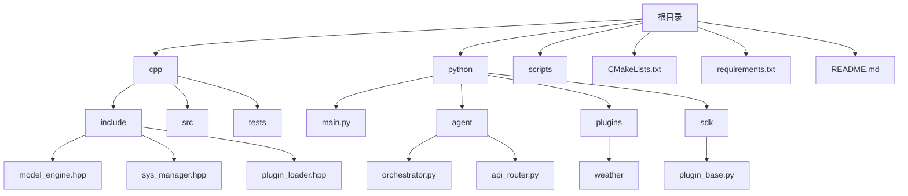

# 技术栈与依赖

<cite>
**本文档引用的文件**  
- [model_engine.hpp](file://cpp/include/model_engine.hpp)
- [sys_manager.hpp](file://cpp/include/sys_manager.hpp)
- [plugin_loader.hpp](file://cpp/include/plugin_loader.hpp)
- [CMakeLists.txt](file://CMakeLists.txt)
- [main.py](file://python/main.py)
- [api_router.py](file://python/agent/api_router.py)
- [orchestrator.py](file://python/agent/orchestrator.py)
- [schemas.py](file://python/models/schemas.py)
- [requirements.txt](file://requirements.txt)
</cite>

## 目录
1. [简介](#简介)
2. [项目结构](#项目结构)
3. [C++核心层技术栈](#c核心层技术栈)
4. [Python应用层技术栈](#python应用层技术栈)
5. [系统架构与协同机制](#系统架构与协同机制)
6. [关键技术集成方式](#关键技术集成方式)
7. [依赖版本兼容性建议](#依赖版本兼容性建议)
8. [安装配置指南](#安装配置指南)
9. [环境配置问题排查](#环境配置问题排查)
10. [结论](#结论)

## 简介
本项目采用C++和Python混合架构，构建高性能AI助手系统。C++层负责计算密集型任务和底层资源管理，Python层处理业务逻辑、API服务和智能调度。这种分层设计实现了性能与开发效率的最佳平衡。

## 项目结构
项目采用清晰的分层架构，包含C++核心模块、Python应用层、脚本工具和配置文件。



**Diagram sources**
- [README.md](file://README.md#L10-L117)

## C++核心层技术栈

### 构建系统：CMake
项目使用CMake作为构建系统，支持跨平台编译和复杂依赖管理。顶层`CMakeLists.txt`配置了项目基本信息、C++标准（C++20）、编译选项，并通过`find_package`查找Protobuf和gRPC等关键依赖。

```cmake
cmake_minimum_required(VERSION 3.20)
project(ai_assistant VERSION 1.0.0 LANGUAGES CXX)
set(CMAKE_CXX_STANDARD 20)
find_package(Protobuf REQUIRED)
find_package(gRPC REQUIRED)
add_subdirectory(cpp)
```

**Section sources**
- [CMakeLists.txt](file://CMakeLists.txt#L1-L29)

### 关键头文件功能说明

#### model_engine.hpp：模型推理引擎
封装本地（llama.cpp）和云端模型调用，提供同步、异步和流式推理接口。定义了`InferenceRequest`和`InferenceResponse`数据结构，以及`StreamCallback`流式回调类型。

```cpp
class ModelEngine {
public:
    bool initialize(const std::string& config_path);
    InferenceResponse inference(const InferenceRequest& request);
    void inference_stream(const InferenceRequest& request, StreamCallback callback);
};
```

**Section sources**
- [model_engine.hpp](file://cpp/include/model_engine.hpp#L1-L79)

#### sys_manager.hpp：系统资源管理器
跨平台监控CPU、内存、磁盘和GPU使用情况，为模型选择提供决策依据。包含`SystemInfo`和`ProcessInfo`结构体，支持资源限制设置和CUDA可用性检查。

```cpp
class SystemManager {
public:
    SystemInfo get_system_info() const;
    bool has_sufficient_resources(const std::string& model_name) const;
    bool is_cuda_available() const;
};
```

**Section sources**
- [sys_manager.hpp](file://cpp/include/sys_manager.hpp#L1-L78)

#### plugin_loader.hpp：插件加载管理器
支持动态加载C++和Python插件，实现扩展功能。定义`IPlugin`接口基类和`PluginInfo`信息结构，提供插件扫描、加载、卸载和执行功能。

```cpp
class IPlugin {
public:
    virtual bool initialize(const std::string& config) = 0;
    virtual std::string execute(...) = 0;
};

class PluginLoader {
public:
    void scan_plugins(const std::string& plugin_dir);
    bool load_cpp_plugin(const std::string& plugin_path);
    bool load_python_plugin(const std::string& plugin_path);
};
```

**Section sources**
- [plugin_loader.hpp](file://cpp/include/plugin_loader.hpp#L1-L109)

## Python应用层技术栈

### 主要依赖项及其功能定位

| 依赖库 | 版本 | 功能定位 |
|-------|------|---------|
| FastAPI | 0.104.1 | 异步Web框架，提供RESTful API和WebSocket支持 |
| uvicorn | 0.24.0 | ASGI服务器，运行FastAPI应用 |
| grpcio | 1.59.0 | gRPC客户端/服务器实现，与C++层通信 |
| pydantic | 2.5.0 | 数据验证和设置管理，定义API模型 |
| chromadb | 0.4.18 | 向量数据库，存储和检索记忆内容 |
| torch | 2.1.0 | 深度学习框架，支持本地模型推理 |

**Section sources**
- [requirements.txt](file://requirements.txt#L1-L25)

### 核心组件分析

#### FastAPI与API路由
`main.py`创建FastAPI应用实例，通过`lifespan`上下文管理器初始化gRPC客户端和Agent调度器。`api_router.py`定义了聊天、任务、插件等API端点。

```python
app = FastAPI(lifespan=lifespan)
app.include_router(api_router, prefix="/api/v1")
```

**Section sources**
- [main.py](file://python/main.py#L1-L117)
- [api_router.py](file://python/agent/api_router.py#L1-L285)

#### Agent调度器
`orchestrator.py`是智能任务编排核心，根据用户意图、系统资源和任务复杂度决策执行策略（本地模型、云端模型或插件）。

```python
class AgentOrchestrator:
    async def _decide_strategy(self, request, intent, context):
        # 智能路由决策逻辑
```

**Section sources**
- [orchestrator.py](file://python/agent/orchestrator.py#L1-L351)

#### 数据模型定义
`schemas.py`使用Pydantic定义所有API请求和响应模型，确保数据类型安全和自动验证。

```python
class ChatRequest(BaseModel):
    message: str
    session_id: Optional[str]
    stream: bool = False
```

**Section sources**
- [schemas.py](file://python/models/schemas.py#L1-L210)

## 系统架构与协同机制

### 整体架构图
```mermaid
flowchart LR
subgraph User[用户/应用]
A[CLI] --> |HTTP/WebSocket| B[FastAPI API]
W[Web UI] --> |HTTP| B
end
subgraph Python[Python 层]
B --> O[Agent Orchestrator]
O --> |调用| P[插件 SDK]
O --> |gRPC| CppCore
end
subgraph CppCore[C++ 核心层]
CppCore --> M[Model Engine (llama.cpp / vLLM)]
CppCore --> S[SysManager (CPU/MEM/IO)]
CppCore --> L[Plugin Loader (C++ 插件)]
end
```

**Diagram sources**
- [README.md](file://README.md#L50-L60)

### 协同工作机制

#### 流式响应支持
通过FastAPI的`StreamingResponse`和C++层的`inference_stream`接口实现。当`ChatRequest.stream=True`时，后端逐块返回响应。

```python
@api_router.post("/chat/stream")
async def chat_stream():
    return StreamingResponse(generate_stream(), media_type="text/plain")
```

**Section sources**
- [api_router.py](file://python/agent/api_router.py#L20-L40)

#### WebSocket通信
支持实时双向通信，适用于需要持续交互的场景。虽然相关文件未完全提供，但架构已预留WebSocket支持。

#### 向量存储
使用ChromaDB存储会话记忆的向量嵌入，实现语义搜索和长期记忆。

```python
class MemoryManager:
    def search_memory(self, query_text, similarity_threshold=0.7):
        # 向量相似度搜索
```

**Section sources**
- [orchestrator.py](file://python/agent/orchestrator.py#L250-L260)

#### 深度学习推理
C++层通过llama.cpp调用本地模型，Python层通过API调用云端大模型，由调度器智能选择最优路径。

## 关键技术集成方式

### FastAPI服务启动
在`main.py`中创建FastAPI应用并配置生命周期管理，在`if __name__ == "__main__":`块中使用uvicorn启动。

```python
if __name__ == "__main__":
    uvicorn.run("main:app", host=settings.host, port=settings.port)
```

**Section sources**
- [main.py](file://python/main.py#L110-L117)

### llama.cpp库链接
在`cpp/CMakeLists.txt`中通过`target_link_libraries`链接gRPC和Protobuf，间接支持llama.cpp集成。

```cmake
target_link_libraries(ai_assistant_core
    gRPC::grpc++
    protobuf::libprotobuf
)
```

**Section sources**
- [cpp/CMakeLists.txt](file://cpp/CMakeLists.txt#L25-L30)

## 依赖版本兼容性建议

### 推荐版本组合
- **Python**: 3.10 或 3.11（与Torch 2.1.0最佳兼容）
- **Torch**: 2.1.0（与transformers 4.35.0兼容）
- **FastAPI**: 0.104.1（稳定版本，避免早期异步问题）
- **gRPC**: 1.59.0（与Protobuf 4.25.0匹配）

### 版本冲突注意事项
- 避免使用Python 3.12，可能导致部分C++扩展编译失败
- Torch版本不宜过高，以免与llama.cpp绑定不兼容
- Protobuf版本需与gRPC严格匹配，避免序列化错误

## 安装配置指南

### 环境准备
```bash
# 创建虚拟环境
python -m venv venv
source venv/bin/activate

# 安装Python依赖
pip install -r requirements.txt

# 构建C++核心
mkdir build && cd build
cmake ..
make
```

### 服务启动
```bash
# 方式1：直接运行
python python/main.py

# 方式2：使用脚本
./scripts/run_server.sh
```

### 配置文件
主要配置通过环境变量或`core/config.py`管理：
- `GRPC_SERVER_ADDRESS`: C++服务地址
- `HOST`和`PORT`: Web服务监听地址
- `DEBUG`: 调试模式开关

## 环境配置问题排查

### 常见问题及解决方案

| 问题现象 | 可能原因 | 解决方案 |
|--------|--------|--------|
| C++编译失败 | 缺少Protobuf/gRPC | 运行`install_deps.sh`安装系统依赖 |
| gRPC连接拒绝 | C++服务未启动 | 检查`ai_assistant_server`进程状态 |
| CUDA不可用 | 驱动或PyTorch版本问题 | 验证`nvidia-smi`输出，重装CUDA版Torch |
| 插件加载失败 | 权限或路径问题 | 检查插件目录权限，确认`plugin.json`格式正确 |
| 内存不足 | 模型过大或系统资源不足 | 使用`sys_manager.hpp`监控资源，选择小模型 |

### 调试建议
1. 启用调试日志：设置`DEBUG=true`
2. 检查健康端点：访问`/health`获取组件状态
3. 验证gRPC连接：使用`grpc_cli`测试服务可达性
4. 监控系统资源：通过`/system/status`API查看负载

## 结论
本项目通过C++核心层提供高性能计算能力，Python应用层实现灵活的业务逻辑和API服务，形成了高效的技术栈组合。合理的分层架构和明确的职责划分使得系统既具备高性能又易于维护扩展。遵循推荐的版本组合和配置指南，可有效避免常见环境问题，确保系统稳定运行。