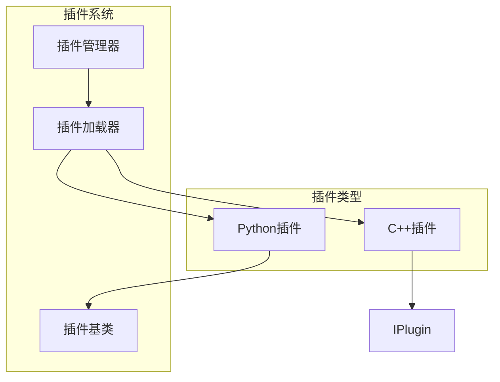
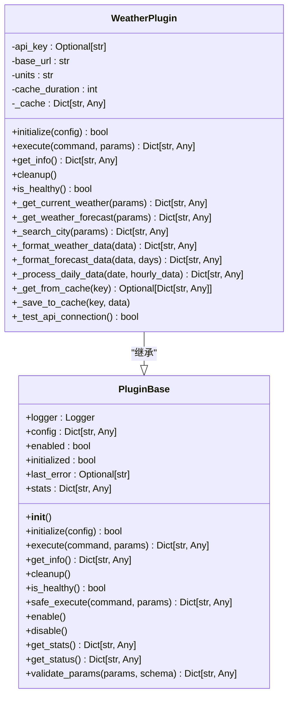
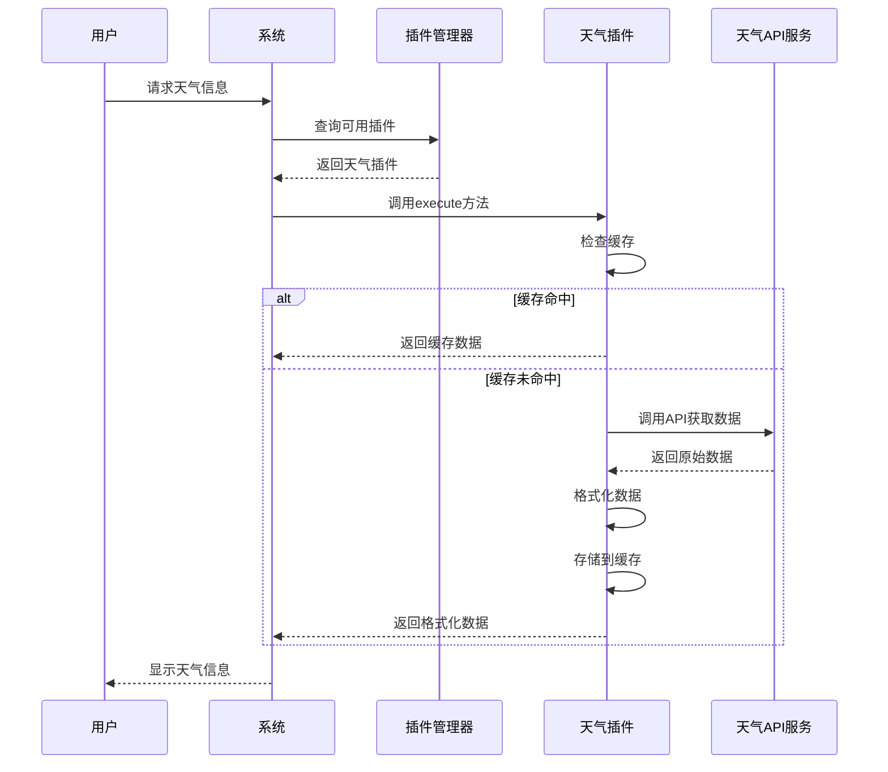
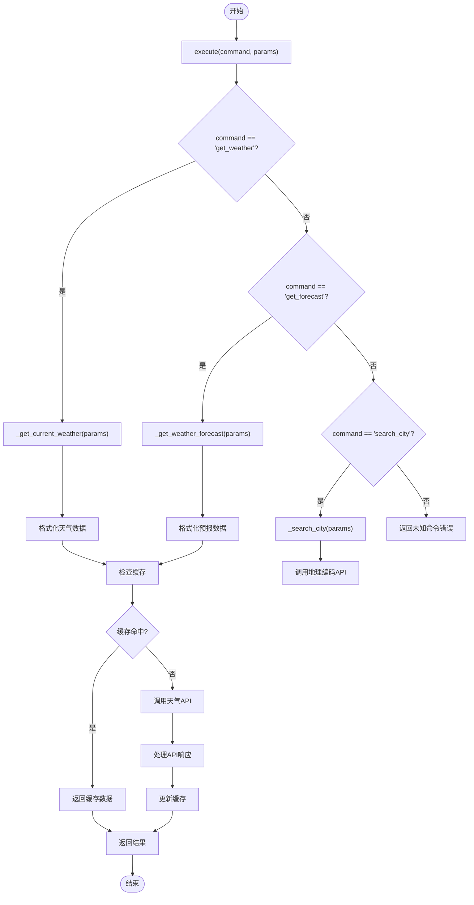
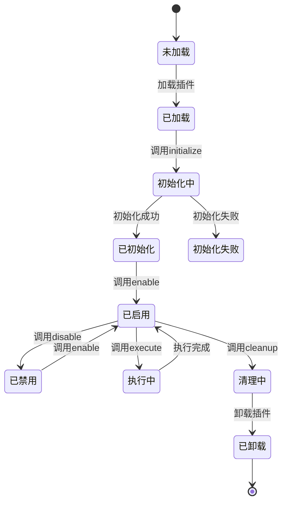
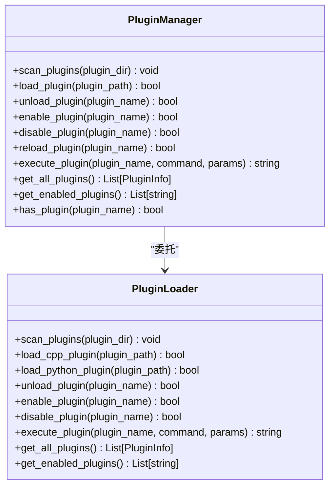
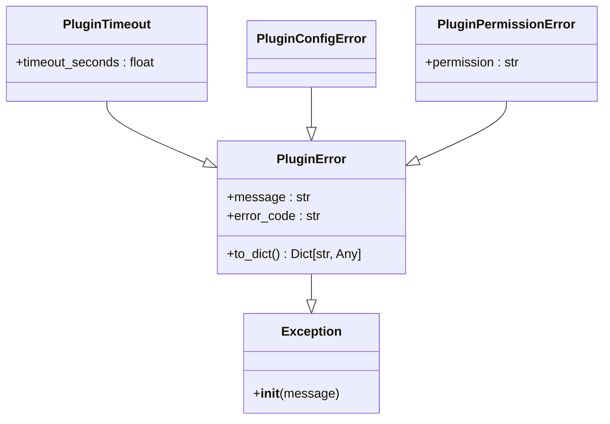
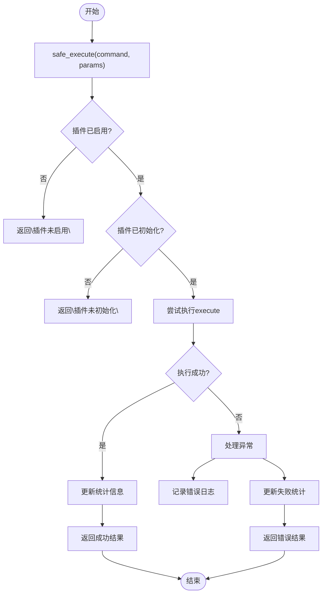
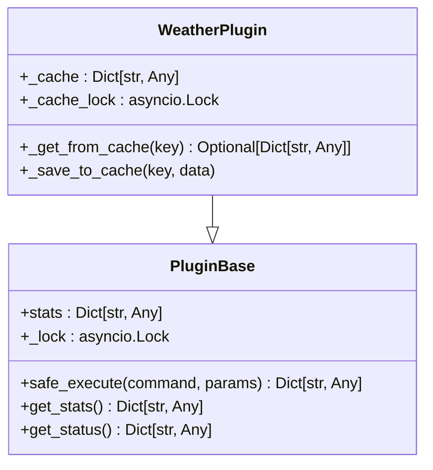

# 插件开发指南

<cite>
**本文档引用的文件**
- [plugin_base.py](file://python/sdk/plugin_base.py)
- [main.py](file://python/plugins/weather/main.py)
- [plugin.json](file://python/plugins/weather/plugin.json)
- [plugin_loader.hpp](file://cpp/include/plugin_loader.hpp)
</cite>

## 目录
1. [插件架构概述](#插件架构概述)
2. [核心基类PluginBase详解](#核心基类pluginbase详解)
3. [插件配置文件规范](#插件配置文件规范)
4. [天气插件实现示例](#天气插件实现示例)
5. [插件生命周期管理](#插件生命周期管理)
6. [调试与异常处理](#调试与异常处理)
7. [线程安全与通信机制](#线程安全与通信机制)
8. [最佳实践建议](#最佳实践建议)
9. [安全沙箱与权限控制](#安全沙箱与权限控制)

## 插件架构概述



**图示来源**
- [plugin_loader.hpp](file://cpp/include/plugin_loader.hpp#L0-L54)
- [plugin_base.py](file://python/sdk/plugin_base.py#L0-L64)

## 核心基类PluginBase详解

### 继承PluginBase类

所有Python插件必须继承`PluginBase`抽象基类，该类定义了插件的核心接口和功能。开发者需要实现以下抽象方法：



**图示来源**
- [plugin_base.py](file://python/sdk/plugin_base.py#L0-L64)
- [main.py](file://python/plugins/weather/main.py#L0-L50)

### 核心方法实现

#### initialize方法
初始化插件实例，接收配置参数并进行必要的设置和验证。

**代码路径**
- [plugin_base.py](file://python/sdk/plugin_base.py#L15-L30)
- [main.py](file://python/plugins/weather/main.py#L50-L80)

#### execute方法
执行插件命令的核心方法，根据不同的命令名称调用相应的处理函数。

**代码路径**
- [plugin_base.py](file://python/sdk/plugin_base.py#L30-L45)
- [main.py](file://python/plugins/weather/main.py#L80-L110)

#### get_info方法
返回插件的元数据信息，包括名称、版本、功能描述等。

**代码路径**
- [plugin_base.py](file://python/sdk/plugin_base.py#L45-L58)
- [main.py](file://python/plugins/weather/main.py#L350-L390)

#### cleanup方法
清理插件占用的资源，如关闭连接、清除缓存等。

**代码路径**
- [plugin_base.py](file://python/sdk/plugin_base.py#L58-L67)
- [main.py](file://python/plugins/weather/main.py#L392-L396)

#### is_healthy方法
健康检查方法，用于检测插件是否处于正常工作状态。

**代码路径**
- [plugin_base.py](file://python/sdk/plugin_base.py#L67-L78)
- [main.py](file://python/plugins/weather/main.py#L400-L404)

## 插件配置文件规范

### plugin.json结构解析

每个插件必须包含一个`plugin.json`配置文件，定义插件的基本信息和运行要求。

```json
{
    "name": "weather_plugin",
    "version": "1.0.0",
    "description": "天气查询插件，支持查询全球城市天气信息",
    "author": "AI Assistant Team",
    "type": "python",
    "entry_point": "main.py",
    "capabilities": [
        "weather_query",
        "weather_forecast",
        "weather_alerts"
    ],
    "dependencies": [
        "requests",
        "json"
    ],
    "config_schema": {
        "type": "object",
        "properties": {
            "api_key": {
                "type": "string",
                "description": "天气API密钥"
            },
            "default_units": {
                "type": "string",
                "enum": ["metric", "imperial"],
                "default": "metric",
                "description": "默认单位制"
            },
            "cache_duration": {
                "type": "integer",
                "default": 300,
                "description": "缓存时间(秒)"
            }
        },
        "required": ["api_key"]
    },
    "permissions": [
        "network_access",
        "cache_access"
    ],
    "enabled": true
}
```

### 配置字段说明

| 字段 | 类型 | 必需 | 说明 |
|------|------|------|------|
| name | string | 是 | 插件唯一标识名称 |
| version | string | 是 | 插件版本号，遵循语义化版本规范 |
| description | string | 是 | 插件功能描述 |
| author | string | 是 | 插件作者信息 |
| type | string | 是 | 插件类型(python/cpp) |
| entry_point | string | 是 | 插件入口文件路径 |
| capabilities | array | 否 | 插件能力列表 |
| dependencies | array | 否 | 插件依赖的第三方库 |
| config_schema | object | 是 | 插件配置参数架构 |
| permissions | array | 是 | 插件所需权限列表 |
| enabled | boolean | 是 | 插件初始启用状态 |

**代码路径**
- [plugin.json](file://python/plugins/weather/plugin.json#L0-L42)

## 天气插件实现示例

### 完整实现流程



**图示来源**
- [main.py](file://python/plugins/weather/main.py#L80-L110)
- [main.py](file://python/plugins/weather/main.py#L110-L200)

### 命令路由实现

天气插件实现了三个主要命令：获取当前天气、获取天气预报和搜索城市。



**图示来源**
- [main.py](file://python/plugins/weather/main.py#L80-L110)
- [main.py](file://python/plugins/weather/main.py#L110-L200)

## 插件生命周期管理

### 生命周期阶段



**图示来源**
- [plugin_base.py](file://python/sdk/plugin_base.py#L15-L78)
- [plugin_loader.hpp](file://cpp/include/plugin_loader.hpp#L47-L97)

### 状态转换API

插件管理系统提供了完整的生命周期管理API：



**代码路径**
- [plugin_loader.hpp](file://cpp/include/plugin_loader.hpp#L47-L97)
- [api_router.py](file://python/agent/api_router.py#L123-L162)

## 调试与异常处理

### 异常类型体系



**图示来源**
- [plugin_base.py](file://python/sdk/plugin_base.py#L215-L250)

### 错误处理策略



**代码路径**
- [plugin_base.py](file://python/sdk/plugin_base.py#L80-L149)

## 线程安全与通信机制

### 并发控制



**代码路径**
- [plugin_base.py](file://python/sdk/plugin_base.py#L8-L20)
- [main.py](file://python/plugins/weather/main.py#L5-L20)

### 插件间通信

```mermaid
graph TD
subgraph "消息总线"
EventBus[事件总线]
end
subgraph "插件A"
PluginA[插件A]
PluginA --> EventBus : 发布事件
end
subgraph "插件B"
PluginB[插件B]
EventBus --> PluginB : 订阅事件
end
subgraph "插件C"
PluginC[插件C]
EventBus --> PluginC : 订阅事件
end
EventBus < --> PluginManager : 事件分发
PluginManager --> Orchestrator : 状态同步
```

**代码路径**
- [orchestrator.py](file://python/agent/orchestrator.py#L278-L316)

## 最佳实践建议

### 性能优化

```mermaid
flowchart LR
    A[避免阻塞主线程] --> B[使用异步IO]
    B --> C[合理使用缓存]
