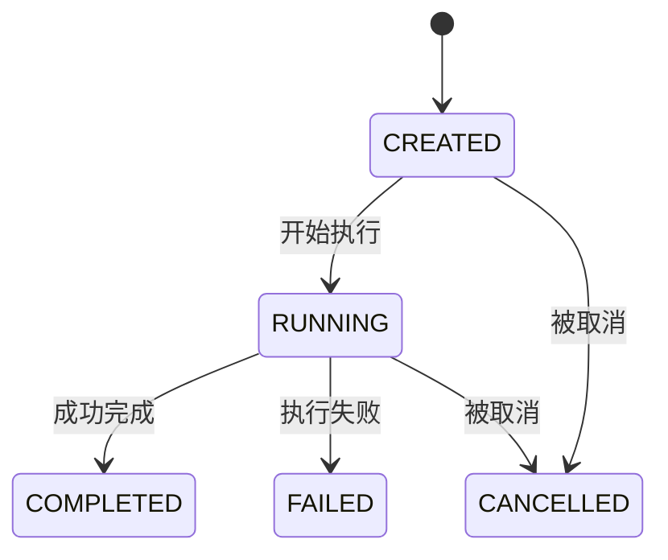
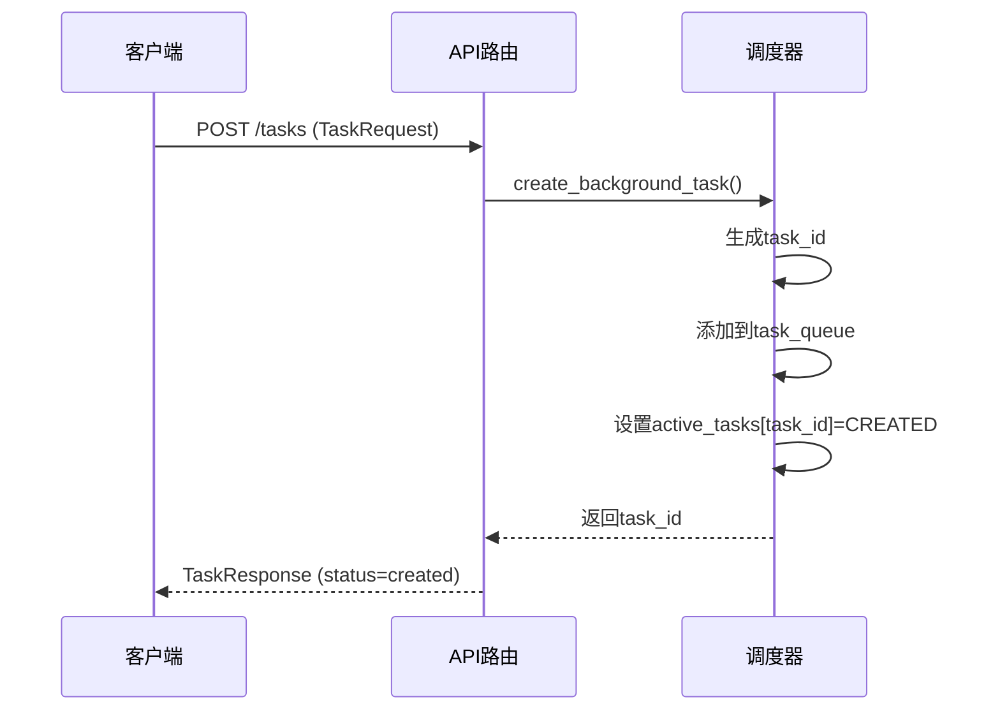
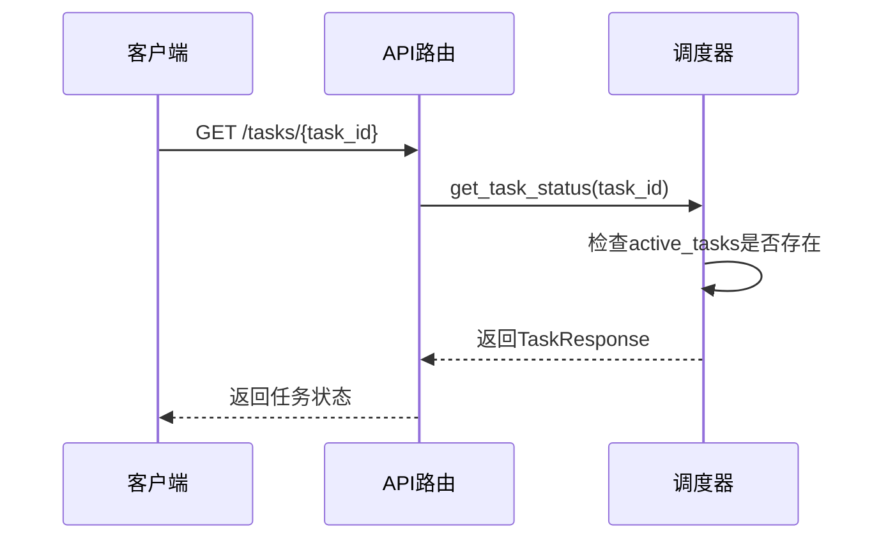
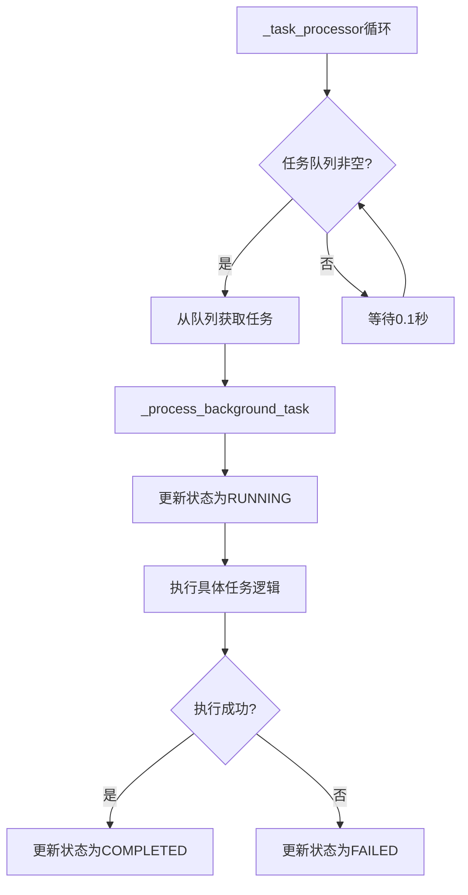

# 任务相关数据模型

<cite>
**本文档引用的文件**
- [schemas.py](file://python/models/schemas.py)
- [orchestrator.py](file://python/agent/orchestrator.py)
- [api_router.py](file://python/agent/api_router.py)
</cite>

## 目录
1. [简介](#简介)
2. [核心数据模型设计](#核心数据模型设计)
3. [任务状态机流转逻辑](#任务状态机流转逻辑)
4. [任务生命周期管理](#任务生命周期管理)
5. [典型应用场景示例](#典型应用场景示例)
6. [超时控制与错误恢复](#超时控制与错误恢复)

## 简介
本项目中的任务相关数据模型为后台异步任务的创建、调度和状态跟踪提供了完整的解决方案。通过`TaskRequest`和`TaskResponse`两个核心模型，系统实现了灵活的任务定义和精细化的状态管理。这些模型在智能Agent调度器中扮演着关键角色，支持从简单查询到复杂推理的各种后台任务处理需求。

**Section sources**
- [schemas.py](file://python/models/schemas.py#L55-L73)

## 核心数据模型设计

### TaskRequest模型
`TaskRequest`模型用于定义后台任务的创建请求，包含以下关键字段：

- **task_type**: 任务类型标识符，用于区分不同种类的任务（如推理、数据处理等）
- **description**: 任务描述信息，提供任务的语义说明
- **parameters**: 可选的任务参数字典，支持动态传递任务执行所需的数据
- **priority**: 任务优先级（1-10），影响任务在队列中的调度顺序
- **timeout_seconds**: 可选的超时时间设置，防止任务无限期运行

该模型的设计支持高度灵活的任务创建机制，允许客户端根据具体需求定制任务属性。

### TaskResponse模型
`TaskResponse`模型用于返回任务的状态信息和执行结果，包含以下重要字段：

- **task_id**: 唯一的任务标识符，用于后续状态查询
- **status**: 当前任务状态，遵循预定义的状态机流转
- **progress**: 可选的进度百分比，提供任务执行的可视化反馈
- **result**: 可选的任务执行结果，包含成功完成后的输出数据
- **error**: 可选的错误信息，在任务失败时提供诊断详情
- **created_at/updated_at**: 任务的时间戳信息，支持生命周期追踪
- **message**: 状态消息，提供人类可读的任务状态描述

**Section sources**
- [schemas.py](file://python/models/schemas.py#L55-L87)

## 任务状态机流转逻辑

### 状态枚举定义
`TaskStatus`枚举定义了任务的完整生命周期状态：



**Diagram sources**
- [schemas.py](file://python/models/schemas.py#L17-L23)

### 状态流转规则
任务状态遵循严格的单向流转原则：

1. **CREATED → RUNNING**: 当任务被任务处理器从队列中取出并开始执行时发生状态转换
2. **RUNNING → COMPLETED**: 任务成功执行完毕，结果已生成
3. **RUNNING → FAILED**: 任务执行过程中遇到不可恢复的错误
4. **任意状态 → CANCELLED**: 支持外部请求取消正在排队或执行中的任务

这种状态机设计确保了任务状态的一致性和可预测性，避免了状态混乱的问题。

**Section sources**
- [schemas.py](file://python/models/schemas.py#L17-L23)
- [orchestrator.py](file://python/agent/orchestrator.py#L290-L310)

## 任务生命周期管理

### 任务创建流程


**Diagram sources**
- [api_router.py](file://python/agent/api_router.py#L40-L83)
- [orchestrator.py](file://python/agent/orchestrator.py#L290-L310)

### 任务状态查询


**Diagram sources**
- [api_router.py](file://python/agent/api_router.py#L86-L120)
- [orchestrator.py](file://python/agent/orchestrator.py#L307-L316)

### 任务处理器架构


**Diagram sources**
- [orchestrator.py](file://python/agent/orchestrator.py#L318-L328)

**Section sources**
- [orchestrator.py](file://python/agent/orchestrator.py#L290-L330)

## 典型应用场景示例

### 长时间推理任务
对于需要长时间运行的AI推理任务，可以构造如下请求：

```json
{
  "task_type": "long_inference",
  "description": "执行复杂的多步骤推理",
  "parameters": {
    "prompt": "请分析市场趋势并预测未来三个月的发展",
    "max_tokens": 4096,
    "temperature": 0.8
  },
  "priority": 8,
  "timeout_seconds": 300
}
```

服务端将返回：
```json
{
  "task_id": "uuid-xxx",
  "status": "created",
  "message": "任务已创建",
  "created_at": "timestamp"
}
```

客户端可以通过轮询或WebSocket监听方式获取进度更新：
```json
{
  "task_id": "uuid-xxx",
  "status": "running",
  "progress": 0.65,
  "message": "任务状态: running"
}
```

最终获得完整结果：
```json
{
  "task_id": "uuid-xxx",
  "status": "completed",
  "progress": 1.0,
  "result": {"analysis": "...", "prediction": "..."},
  "message": "任务状态: completed"
}
```

**Section sources**
- [schemas.py](file://python/models/schemas.py#L55-L73)
- [orchestrator.py](file://python/agent/orchestrator.py#L290-L316)

## 超时控制与错误恢复

### 超时机制实现
系统通过`timeout_seconds`字段实现任务超时控制。虽然当前代码框架中尚未完全实现超时检测逻辑，但模型设计已预留了必要的字段支持。完整的超时控制应包括：

1. 在任务元数据中记录开始时间
2. 任务处理器定期检查运行时间是否超过阈值
3. 超时时自动终止任务并更新状态为FAILED
4. 清理相关资源并释放队列位置

### 错误恢复策略
系统采用分层的错误处理机制：

- **字段级验证**: Pydantic模型自动验证输入数据的有效性
- **状态一致性**: 通过状态机确保任务状态的正确流转
- **异常捕获**: 在关键方法中使用try-catch块捕获运行时异常
- **日志记录**: 记录详细的错误信息便于问题排查

当任务执行失败时，`error`字段会包含具体的错误描述，帮助客户端理解失败原因并决定后续操作。

**Section sources**
- [schemas.py](file://python/models/schemas.py#L55-L73)
- [orchestrator.py](file://python/agent/orchestrator.py#L320-L328)