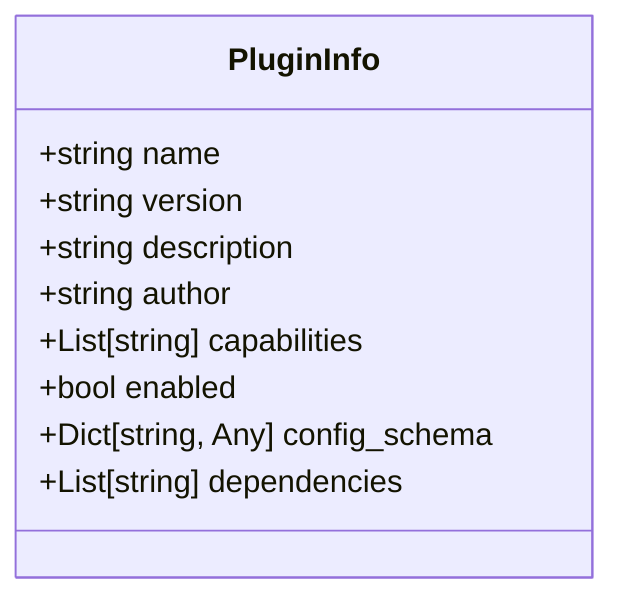
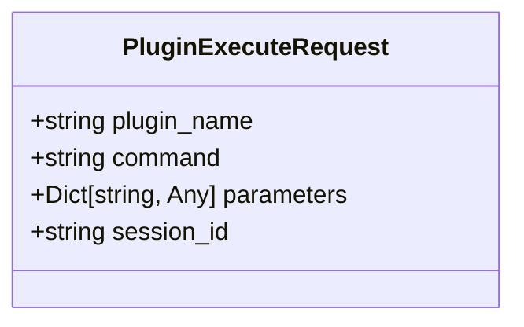
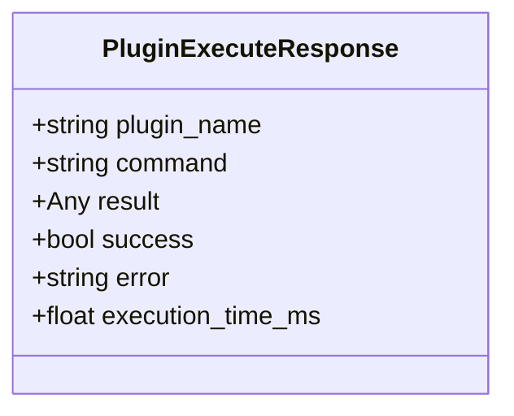
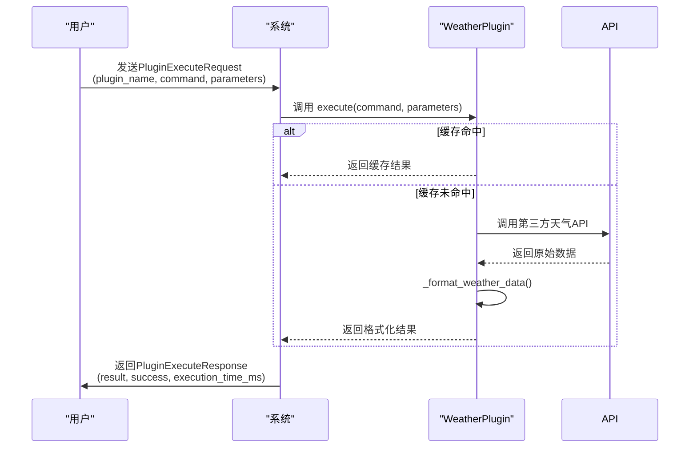

<cite>
**本文档中引用的文件**
- [schemas.py](file://python/models/schemas.py)
- [main.py](file://python/plugins/weather/main.py)
- [plugin.json](file://python/plugins/weather/plugin.json)
</cite>

## 目录
1. [插件核心模型概述](#插件核心模型概述)
2. [PluginInfo 模型详解](#plugininfo-模型详解)
3. [PluginExecuteRequest 模型解析](#pluginexecuterequest-模型解析)
4. [PluginExecuteResponse 模型分析](#plugineexecuteresponse-模型分析)
5. [实际调用中的数据流动](#实际调用中的数据流动)
6. [启用控制与依赖管理](#启用控制与依赖管理)

## 插件核心模型概述

本文档深入解析系统中三个核心的插件相关数据模型：`PluginInfo`、`PluginExecuteRequest` 和 `PluginExecuteResponse`。这些模型定义了插件的元数据描述、执行请求规范以及执行结果反馈，构成了插件系统通信的基础协议。

**Section sources**
- [schemas.py](file://python/models/schemas.py#L78-L105)

## PluginInfo 模型详解

`PluginInfo` 模型用于描述一个插件的静态元数据和配置要求。

### 核心字段说明

- **name**: 插件的唯一标识名称，用于在系统中查找和调用该插件。
- **version**: 插件的版本号，遵循语义化版本控制，确保兼容性管理。
- **description**: 对插件功能的简要描述，便于用户理解其用途。
- **author**: 插件的开发者或维护者信息。
- **capabilities**: 字符串列表，声明插件所具备的能力（如 "weather_query"），供调度器进行能力匹配。
- **enabled**: 布尔值，指示该插件当前是否处于激活状态，是实现插件启停控制的关键字段。
- **config_schema**: 一个可选的JSON Schema对象，严格定义了插件所需的配置参数结构，包括每个配置项的类型、默认值和约束条件。
- **dependencies**: 可选的字符串列表，声明了插件运行所依赖的外部库或模块，系统加载器会据此检查环境依赖。

**Diagram sources**
- [schemas.py](file://python/models/schemas.py#L78-L87)

**Section sources**
- [schemas.py](file://python/models/schemas.py#L78-L87)
- [plugin.json](file://python/plugins/weather/plugin.json#L1-L43)

## PluginExecuteRequest 模型解析

`PluginExecuteRequest` 模型定义了向插件发起执行调用时所需的数据结构。

### 动态调用机制

该模型的核心在于 `command` 和 `parameters` 字段，它们共同实现了对插件功能的动态调用：
- **plugin_name**: 指定目标插件的名称，系统根据此名称定位并加载对应的插件实例。
- **command**: 指定要在目标插件上执行的具体命令（如 "get_weather"）。这使得单个插件可以暴露多个功能接口。
- **parameters**: 一个可选的字典，包含执行该命令所需的全部参数。其结构由插件自身决定，并通常在其 `config_schema` 或内部文档中定义。
- **session_id**: 关联此次执行请求的会话ID，用于上下文跟踪和日志关联。

这种设计模式允许系统以统一的方式调用不同插件的不同功能，极大地提高了系统的灵活性和扩展性。

**Diagram sources**
- [schemas.py](file://python/models/schemas.py#L90-L95)

**Section sources**
- [schemas.py](file://python/models/schemas.py#L90-L95)
- [main.py](file://python/plugins/weather/main.py#L50-L58)

## PluginExecuteResponse 模型分析

`PluginExecuteResponse` 模型封装了插件执行后的结果和状态信息。

### 监控价值分析

该模型不仅返回业务结果，还提供了关键的监控指标：
- **plugin_name & command**: 回显请求信息，便于结果溯源。
- **result**: 执行的实际结果数据，其结构取决于具体的插件和命令。
- **success**: 布尔标志，快速判断执行是否成功，是故障排查的第一道关卡。
- **error**: 当 `success` 为 `false` 时，此字段包含详细的错误信息，对于调试至关重要。
- **execution_time_ms**: 记录插件执行耗时（毫秒），是性能监控的核心指标，可用于识别慢插件、优化瓶颈和计算服务等级协议(SLA)。

**Diagram sources**
- [schemas.py](file://python/models/schemas.py#L98-L105)

**Section sources**
- [schemas.py](file://python/models/schemas.py#L98-L105)
- [main.py](file://python/plugins/weather/main.py#L50-L58)

## 实际调用中的数据流动

以天气插件 (`weather_plugin`) 为例，展示从请求到响应的完整数据流：

1.  **初始化**: 系统读取 `plugin.json` 文件，利用其中的 `config_schema` 验证并加载配置（如API密钥），创建 `WeatherPlugin` 实例。
2.  **请求**: 用户通过API发送一个 `PluginExecuteRequest`，指定 `plugin_name="weather_plugin"`，`command="get_weather"`，`parameters={"city": "Beijing"}`。
3.  **路由与执行**: 系统找到 `WeatherPlugin` 实例，调用其 `execute("get_weather", {"city": "Beijing"})` 方法。
4.  **处理**: 插件方法 `_get_current_weather` 被触发，它首先检查缓存，若无则调用OpenWeatherMap API获取数据，并格式化结果。
5.  **响应**: 插件返回一个字典，系统将其包装成 `PluginExecuteResponse` 对象，填充 `result`、`success`、`execution_time_ms` 等字段后返回给用户。

**Diagram sources**
- [main.py](file://python/plugins/weather/main.py#L50-L58)
- [plugin.json](file://python/plugins/weather/plugin.json#L1-L43)

**Section sources**
- [main.py](file://python/plugins/weather/main.py#L50-L58)
- [plugin.json](file://python/plugins/weather/plugin.json#L1-L43)

## 启用控制与依赖管理

### 启用控制 (enabled字段)

`PluginInfo` 模型中的 `enabled` 字段是一个简单的布尔开关。当系统加载插件清单时，会检查此字段。如果为 `false`，系统将不会加载该插件，使其无法被调用。这提供了一种安全、非侵入式的插件启停方式，常用于维护、降级或禁用有问题的插件。

### 依赖管理 (dependencies字段)

`dependencies` 字段列出了插件正常运行所必需的外部Python包（如 `requests`, `json`）。在插件加载阶段，系统会检查这些依赖是否已安装在环境中。如果存在缺失的依赖，加载过程将失败并记录错误，从而防止因缺少库而导致的运行时崩溃。这是一种声明式依赖管理，确保了插件环境的完整性。

**Section sources**
- [plugin.json](file://python/plugins/weather/plugin.json#L1-L43)
- [schemas.py](file://python/models/schemas.py#L78-L87)