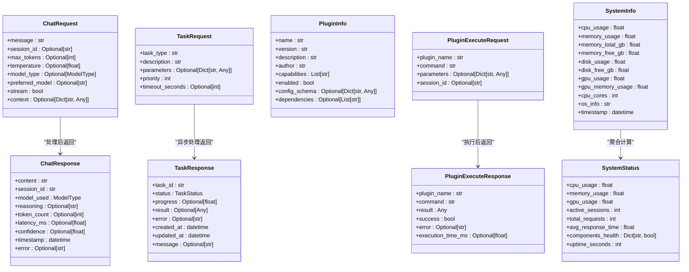

# 数据模型与Schema

<cite>
**本文档中引用的文件**
- [schemas.py](file://python/models/schemas.py)
- [api_router.py](file://python/agent/api_router.py)
- [orchestrator.py](file://python/agent/orchestrator.py)
- [plugin_base.py](file://python/sdk/plugin_base.py)
- [main.py](file://python/main.py)
</cite>

## 目录
1. [介绍](#介绍)
2. [核心数据模型详解](#核心数据模型详解)
3. [实体关系图](#实体关系图)
4. [模型复用机制](#模型复用机制)
5. [JSON样例数据](#json样例数据)
6. [模型演进策略](#模型演进策略)
7. [外部系统数据映射](#外部系统数据映射)
8. [结论](#结论)

## 介绍
本项目通过Pydantic定义了一套完整的数据模型体系，用于规范API接口、内部消息传递和持久化存储的数据结构。这些模型确保了系统各组件间的数据一致性，并提供了类型安全和自动验证功能。

**Section sources**
- [schemas.py](file://python/models/schemas.py#L1-L209)

## 核心数据模型详解

### 聊天相关模型

#### ChatRequest
聊天请求模型，用于客户端向服务端发送对话请求。

- **message**: 字符串类型，必填字段，表示用户输入的消息内容。
- **session_id**: 可选字符串，会话标识符，用于维护多轮对话上下文。
- **max_tokens**: 可选整数，默认值1024，限制生成文本的最大token数量。
- **temperature**: 可选浮点数，默认值0.7，控制生成文本的随机性。
- **model_type**: 可选ModelType枚举，默认值AUTO_SELECT，指定使用的模型类型。
- **preferred_model**: 可选字符串，首选模型名称。
- **stream**: 布尔类型，默认False，指示是否启用流式响应。
- **context**: 可选字典，包含额外的上下文信息。

#### ChatResponse
聊天响应模型，用于服务端返回对话结果。

- **content**: 字符串类型，必填字段，AI生成的回复内容。
- **session_id**: 字符串类型，必填字段，关联的会话ID。
- **model_used**: ModelType枚举，必填字段，实际使用的模型类型。
- **reasoning**: 可选字符串，解释选择该模型的原因。
- **token_count**: 可选整数，记录使用的token数量。
- **latency_ms**: 可选浮点数，响应延迟时间（毫秒）。
- **confidence**: 可选浮点数，置信度评分。
- **timestamp**: datetime类型，默认当前时间，响应生成时间戳。
- **error**: 可选字符串，错误信息描述。

### 任务相关模型

#### TaskRequest
后台任务创建请求模型。

- **task_type**: 字符串类型，必填字段，任务类型标识。
- **description**: 字符串类型，必填字段，任务描述说明。
- **parameters**: 可选字典，任务执行所需的参数配置。
- **priority**: 整数类型，默认值1，任务优先级（1-10）。
- **timeout_seconds**: 可选整数，任务超时时间设置。

#### TaskResponse
任务状态响应模型。

- **task_id**: 字符串类型，必填字段，任务唯一标识。
- **status**: TaskStatus枚举，必填字段，当前任务状态。
- **progress**: 可选浮点数，任务完成进度百分比。
- **result**: 可选任意类型，任务执行结果数据。
- **error**: 可选字符串，错误信息描述。
- **created_at**: datetime类型，默认当前时间，任务创建时间。
- **updated_at**: datetime类型，默认当前时间，最后更新时间。
- **message**: 可选字符串，状态附加消息。

### 插件相关模型

#### PluginInfo
插件元信息模型。

- **name**: 字符串类型，必填字段，插件名称。
- **version**: 字符串类型，必填字段，版本号。
- **description**: 字符串类型，必填字段，功能描述。
- **author**: 字符串类型，必填字段，作者信息。
- **capabilities**: 字符串列表，必填字段，支持的能力清单。
- **enabled**: 布尔类型，必填字段，是否已启用。
- **config_schema**: 可选字典，配置项结构定义。
- **dependencies**: 可选字符串列表，依赖的其他插件。

#### PluginExecuteRequest
插件执行请求模型。

- **plugin_name**: 字符串类型，必填字段，目标插件名称。
- **command**: 字符串类型，必填字段，执行命令。
- **parameters**: 可选字典，命令参数。
- **session_id**: 可选字符串，关联会话ID。

#### PluginExecuteResponse
插件执行响应模型。

- **plugin_name**: 字符串类型，必填字段，执行的插件名称。
- **command**: 字符串类型，必填字段，执行的命令。
- **result**: 任意类型，必填字段，执行结果。
- **success**: 布尔类型，必填字段，执行是否成功。
- **error**: 可选字符串，错误信息。
- **execution_time_ms**: 可选浮点数，执行耗时（毫秒）。

### 系统相关模型

#### SystemInfo
系统资源信息模型。

- **cpu_usage**: 浮点数，CPU使用率（%）。
- **memory_usage**: 浮点数，内存使用率（%）。
- **memory_total_gb**: 浮点数，总内存容量（GB）。
- **memory_free_gb**: 浮点数，可用内存（GB）。
- **disk_usage**: 浮点数，磁盘使用率（%）。
- **disk_free_gb**: 浮点数，可用磁盘空间（GB）。
- **gpu_usage**: 浮点数，GPU使用率（%）。
- **gpu_memory_usage**: 浮点数，GPU内存使用率（%）。
- **cpu_cores**: 整数，CPU核心数量。
- **os_info**: 字符串，操作系统信息。
- **timestamp**: datetime类型，默认当前时间，采集时间戳。

#### SystemStatus
综合系统状态模型。

- **cpu_usage**: 浮点数，CPU使用率。
- **memory_usage**: 浮点数，内存使用率。
- **gpu_usage**: 浮点数，GPU使用率。
- **active_sessions**: 整数，活跃会话数。
- **total_requests**: 整数，累计请求数。
- **avg_response_time**: 浮点数，平均响应时间（毫秒）。
- **components_health**: 字符串到布尔值的字典，组件健康状态。
- **uptime_seconds**: 整数，系统运行时间（秒）。

**Section sources**
- [schemas.py](file://python/models/schemas.py#L1-L209)

## 实体关系图



**Diagram sources**
- [schemas.py](file://python/models/schemas.py#L1-L209)

## 模型复用机制

这些Pydantic模型在系统中被广泛复用，贯穿于API序列化、内部消息传递和持久化过程：

1. **API序列化**：FastAPI框架直接使用这些模型作为请求和响应的类型注解，实现自动的数据验证和文档生成。

2. **内部消息传递**：Agent调度器在处理流程中直接传递这些模型实例，确保组件间通信的一致性和类型安全。

3. **持久化存储**：部分模型如MemoryEntry可直接映射到数据库表结构，简化ORM映射逻辑。

4. **WebSocket通信**：WebSocket消息封装这些模型进行实时传输。

这种统一的数据契约设计减少了数据转换成本，提高了开发效率和系统可靠性。

**Section sources**
- [schemas.py](file://python/models/schemas.py#L1-L209)
- [api_router.py](file://python/agent/api_router.py#L1-L284)
- [orchestrator.py](file://python/agent/orchestrator.py#L1-L350)

## JSON样例数据

### 聊天请求示例
```json
{
  "message": "今天天气怎么样？",
  "session_id": "sess_12345",
  "max_tokens": 512,
  "temperature": 0.8,
  "model_type": "auto_select",
  "stream": false,
  "context": {
    "location": "北京"
  }
}
```

### 聊天响应示例
```json
{
  "content": "今天北京天气晴朗，气温25℃。",
  "session_id": "sess_12345",
  "model_used": "cloud_large",
  "reasoning": "需要最新信息，使用云端大模型",
  "token_count": 45,
  "latency_ms": 1250.5,
  "confidence": 0.95,
  "timestamp": "2024-01-01T12:00:00Z",
  "error": null
}
```

### 插件信息示例
```json
{
  "name": "weather_plugin",
  "version": "1.0.0",
  "description": "天气查询插件",
  "author": "AI Assistant Team",
  "capabilities": ["weather_query", "forecast"],
  "enabled": true,
  "config_schema": {
    "api_key": {"type": "string", "required": true}
  },
  "dependencies": []
}
```

### 系统状态示例
```json
{
  "cpu_usage": 45.2,
  "memory_usage": 68.7,
  "gpu_usage": 30.1,
  "active_sessions": 15,
  "total_requests": 1234,
  "avg_response_time": 234.5,
  "components_health": {
    "grpc_client": true,
    "