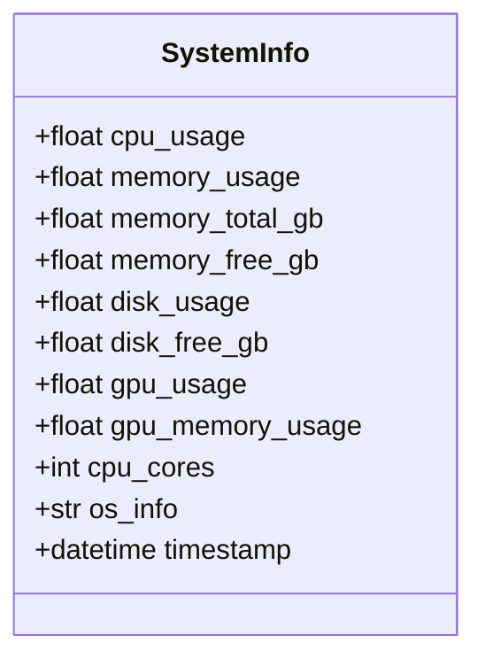
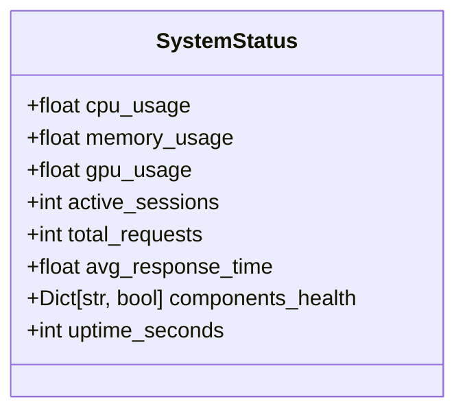
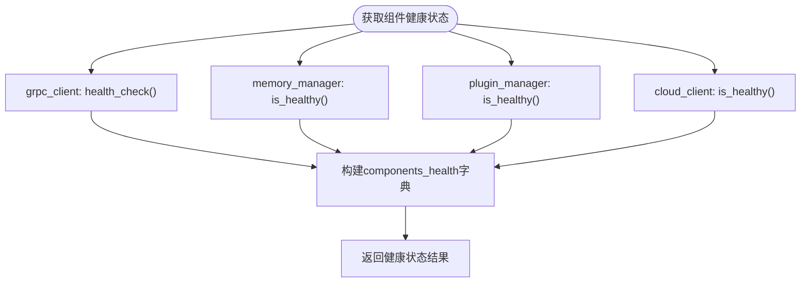
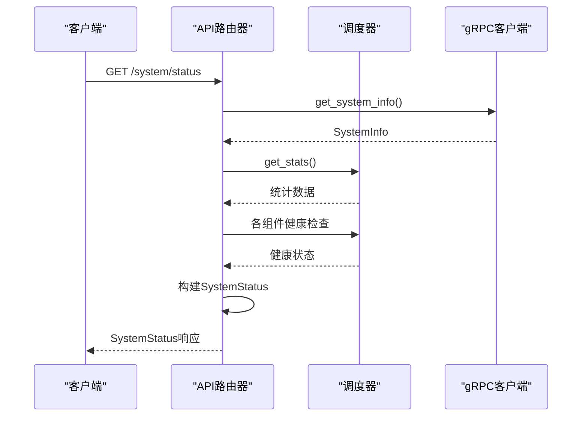
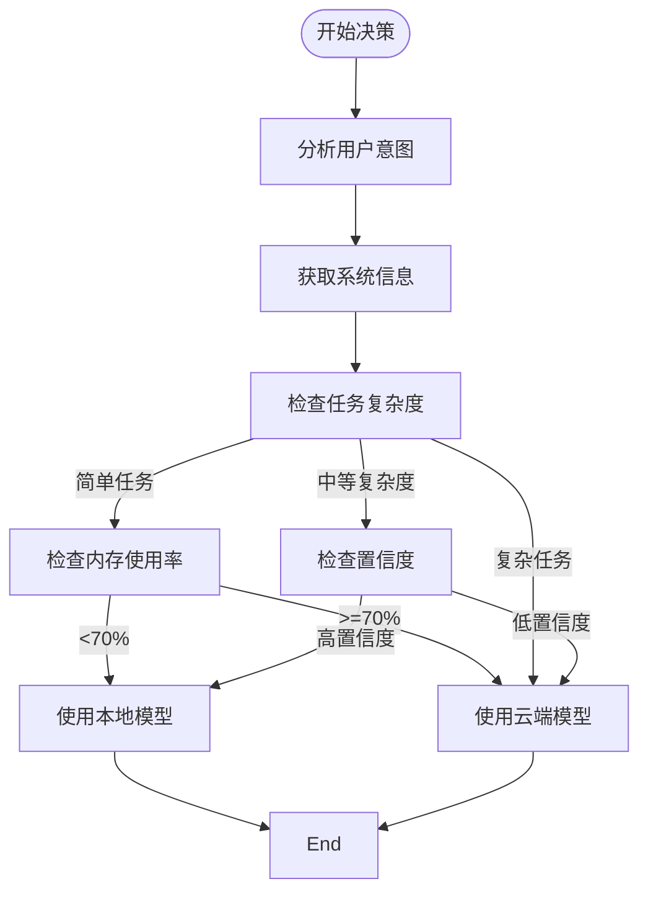
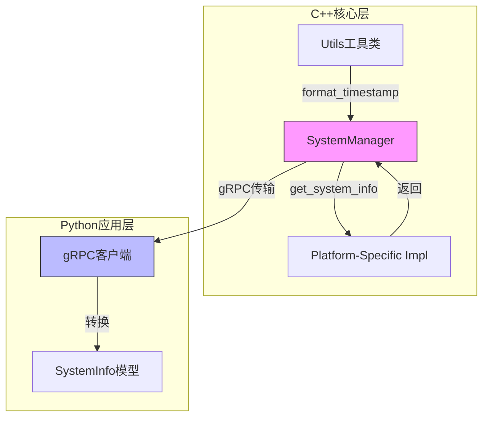

# 系统状态相关数据模型

<cite>
**本文档引用的文件**
- [schemas.py](file://python/models/schemas.py)
- [api_router.py](file://python/agent/api_router.py)
- [orchestrator.py](file://python/agent/orchestrator.py)
- [sys_manager.hpp](file://cpp/include/sys_manager.hpp)
- [grpc_client.py](file://python/core/grpc_client.py)
</cite>

## 目录
1. [引言](#引言)
2. [SystemInfo与SystemStatus模型对比](#systeminfo与systemstatus模型对比)
3. [components_health字典解析](#components_health字典解析)
4. [/sys/status端点实现机制](#sysstatus端点实现机制)
5. [资源感知型决策应用](#资源感知型决策应用)
6. [Prometheus指标导出映射方案](#prometheus指标导出映射方案)
7. [时间戳精度与跨平台OS信息处理](#时间戳精度与跨平台os信息处理)
8. [结论](#结论)

## 引言
本系统通过`SystemInfo`和`SystemStatus`两个核心数据模型，实现了对AI助手服务的全面监控。这两个模型分别从硬件资源详情和服务运行时健康度两个维度提供监控指标，为系统的稳定运行和智能调度提供了关键的数据支持。

## SystemInfo与SystemStatus模型对比

### SystemInfo模型：硬件资源详情
`SystemInfo`模型专注于采集底层硬件资源使用情况，其主要监控指标包括：

- **CPU指标**：`cpu_usage`（CPU使用率）、`cpu_cores`（CPU核心数）
- **内存指标**：`memory_usage`（内存使用率）、`memory_total_gb`（总内存）、`memory_free_gb`（可用内存）
- **磁盘指标**：`disk_usage`（磁盘使用率）、`disk_free_gb`（可用磁盘空间）
- **GPU指标**：`gpu_usage`（GPU使用率）、`gpu_memory_usage`（GPU内存使用率）
- **系统信息**：`os_info`（操作系统信息）、`timestamp`（时间戳）

该模型在C++核心层和Python应用层均有定义，确保了跨语言的一致性。



**图示来源**
- [schemas.py](file://python/models/schemas.py#L110-L122)
- [sys_manager.hpp](file://cpp/include/sys_manager.hpp#L10-L22)

### SystemStatus模型：服务运行时健康度
`SystemStatus`模型聚焦于服务层面的运行健康状况，其主要监控指标包括：

- **资源使用率**：`cpu_usage`、`memory_usage`、`gpu_usage`
- **会话指标**：`active_sessions`（活跃会话数）
- **性能指标**：`total_requests`（总请求数）、`avg_response_time`（平均响应时间）
- **健康状态**：`components_health`（组件健康状态字典）
- **运行时间**：`uptime_seconds`（运行时间）



**图示来源**
- [schemas.py](file://python/models/schemas.py#L125-L134)

**本节来源**
- [schemas.py](file://python/models/schemas.py#L110-L134)

## components_health字典解析

`components_health`字典是`SystemStatus`模型的核心组成部分，用于反映各微服务组件的实时可用性状态。该字典的键为组件名称，值为布尔类型的健康状态。

### 字典构成与来源
根据API路由实现，`components_health`字典包含以下四个核心组件：

- `grpc_client`：gRPC客户端连接状态
- `memory_manager`：记忆管理器健康状态
- `plugin_manager`：插件管理器健康状态
- `cloud_client`：云端客户端健康状态

### 健康检查机制
每个组件的健康检查逻辑如下：
- `grpc_client`：通过`health_check()`方法验证与C++核心层的连接
- `memory_manager`：通过`is_healthy()`方法检查记忆存储状态
- `plugin_manager`：通过`is_healthy()`方法确认插件系统正常
- `cloud_client`：通过`is_healthy()`方法验证云端服务连接



**图示来源**
- [api_router.py](file://python/agent/api_router.py#L180-L189)

**本节来源**
- [api_router.py](file://python/agent/api_router.py#L180-L189)
- [orchestrator.py](file://python/agent/orchestrator.py#L480-L485)

## /sys/status端点实现机制

`/system/status`端点是系统监控的核心接口，负责整合来自不同组件的数据并生成完整的`SystemStatus`响应。

### 数据聚合流程
该端点通过以下步骤构建`SystemStatus`对象：

1. **获取硬件资源信息**：调用`grpc_client.get_system_info()`从C++核心层获取`SystemInfo`
2. **获取性能统计**：调用`orchestrator.get_stats()`获取请求处理统计
3. **获取组件健康状态**：构建`components_health`字典，检查各组件健康状况
4. **构建响应对象**：将上述数据整合为`SystemStatus`实例

### 关键代码路径
- CPU、内存、GPU使用率：源自`SystemInfo`模型
- 活跃会话数：通过`memory_manager.get_active_session_count()`获取
- 总请求数和平均响应时间：来自`orchestrator.stats`统计字典
- 组件健康状态：通过各组件的健康检查方法获取



**图示来源**
- [api_router.py](file://python/agent/api_router.py#L165-L200)

**本节来源**
- [api_router.py](file://python/agent/api_router.py#L165-L200)

## 资源感知型决策应用

`SystemInfo`和`SystemStatus`模型在`orchestrator.py`中被用于实现资源感知型的智能决策，主要体现在任务路由策略中。

### 决策流程中的应用
在`_decide_strategy`方法中，系统利用`SystemInfo`中的资源数据进行智能路由决策：

1. **获取系统信息**：通过`grpc_client.get_system_info()`获取当前硬件资源使用情况
2. **资源评估**：检查内存使用率等指标是否低于阈值
3. **决策执行**：根据资源状况和任务复杂度决定使用本地模型还是云端模型

### 具体应用场景
当系统检测到以下情况时，会做出相应决策：
- **简单任务且资源充足**：如果任务复杂度为"simple"且内存使用率低于70%，优先使用本地模型
- **复杂任务或资源紧张**：如果任务复杂度为"complex"或消息长度超过1000字符，则使用云端大模型
- **需要最新信息**：如果意图分析显示需要联网搜索，则直接使用云端模型



**图示来源**
- [orchestrator.py](file://python/agent/orchestrator.py#L240-L280)

**本节来源**
- [orchestrator.py](file://python/agent/orchestrator.py#L240-L280)

## Prometheus指标导出映射方案

基于现有的`SystemInfo`和`SystemStatus`模型，可以设计一套完整的Prometheus指标导出方案。

### 指标映射表
以下是建议的Prometheus指标与模型字段的映射关系：

| Prometheus指标名 | 指标类型 | 说明 | 对应模型字段 |
|------------------|---------|------|-------------|
| ai_assistant_cpu_usage_percent | Gauge | CPU使用率百分比 | SystemInfo.cpu_usage |
| ai_assistant_memory_usage_percent | Gauge | 内存使用率百分比 | SystemInfo.memory_usage |
| ai_assistant_memory_total_gb | Gauge | 总内存大小(GB) | SystemInfo.memory_total_gb |
| ai_assistant_memory_free_gb | Gauge | 可用内存大小(GB) | SystemInfo.memory_free_gb |
| ai_assistant_disk_usage_percent | Gauge | 磁盘使用率百分比 | SystemInfo.disk_usage |
| ai_assistant_disk_free_gb | Gauge | 可用磁盘空间(GB) | SystemInfo.disk_free_gb |
| ai_assistant_gpu_usage_percent | Gauge | GPU使用率百分比 | SystemInfo.gpu_usage |
| ai_assistant_gpu_memory_usage_percent | Gauge | GPU内存使用率百分比 | SystemInfo.gpu_memory_usage |
| ai_assistant_active_sessions | Gauge | 活跃会话数量 | SystemStatus.active_sessions |
| ai_assistant_total_requests | Counter | 总请求数量 | SystemStatus.total_requests |
| ai_assistant_avg_response_time_ms | Gauge | 平均响应时间(毫秒) | SystemStatus.avg_response_time |
| ai_assistant_uptime_seconds | Gauge | 服务运行时间(秒) | SystemStatus.uptime_seconds |
| ai_assistant_component_health | Gauge | 组件健康状态(1=健康,0=异常) | components_health |

### 组件健康状态指标
对于`components_health`字典，建议为每个组件创建独立的Gauge指标，并使用标签区分：

```
ai_assistant_component_health{component="grpc_client"} 1
ai_assistant_component_health{component="memory_manager"} 1
ai_assistant_component_health{component="plugin_manager"} 1
ai_assistant_component_health{component="cloud_client"} 1
```

**本节来源**
- [schemas.py](file://python/models/schemas.py#L110-L134)
- [api_router.py](file://python/agent/api_router.py#L165-L200)

## 时间戳精度与跨平台OS信息处理

### 时间戳精度要求
系统中的时间戳精度设计遵循以下原则：

- **高精度需求**：在性能统计和响应时间计算中，需要毫秒级甚至微秒级精度
- **一致性保证**：所有时间戳使用UTC时间，避免时区问题
- **同步机制**：Python和C++层使用相同的时间基准，确保跨语言一致性

在`SystemInfo`模型中，`timestamp`字段使用`datetime.now()`生成，提供了足够的精度来满足监控需求。

### 跨平台OS信息采集策略
系统采用分层架构来确保跨平台OS信息采集的一致性：

1. **C++核心层采集**：`SystemManager`类在C++层实现跨平台系统信息采集
2. **统一数据结构**：`SystemInfo`结构体在C++和Python中保持一致
3. **gRPC传输**：通过gRPC协议将采集到的信息传输到Python应用层
4. **抽象化处理**：`SystemManager`的Pimpl模式隐藏了平台相关的实现细节

这种设计确保了无论在Linux、Windows还是macOS上运行，系统都能以一致的方式采集和呈现OS信息。



**图示来源**
- [sys_manager.hpp](file://cpp/include/sys_manager.hpp)
- [grpc_client.py](file://python/core/grpc_client.py)
- [schemas.py](file://python/models/schemas.py)

**本节来源**
- [sys_manager.hpp](file://cpp/include/sys_manager.hpp)
- [common.hpp](file://cpp/include/common.hpp)
- [grpc_client.py](file://python/core/grpc_client.py)

## 结论
`SystemInfo`和`SystemStatus`模型构成了系统监控的双支柱：前者关注硬件资源详情，后者聚焦服务运行时健康度。通过`/system/status`端点的集成，这些模型为系统的可观测性提供了全面支持。在`orchestrator.py`中的应用展示了如何利用这些监控数据实现资源感知型的智能决策