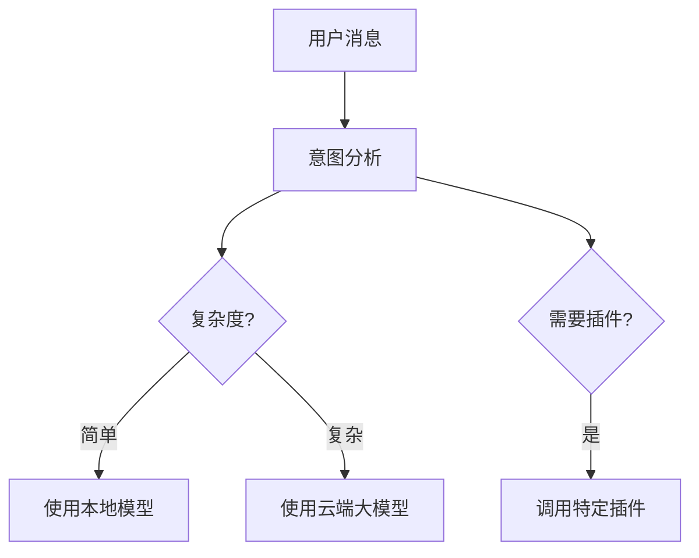
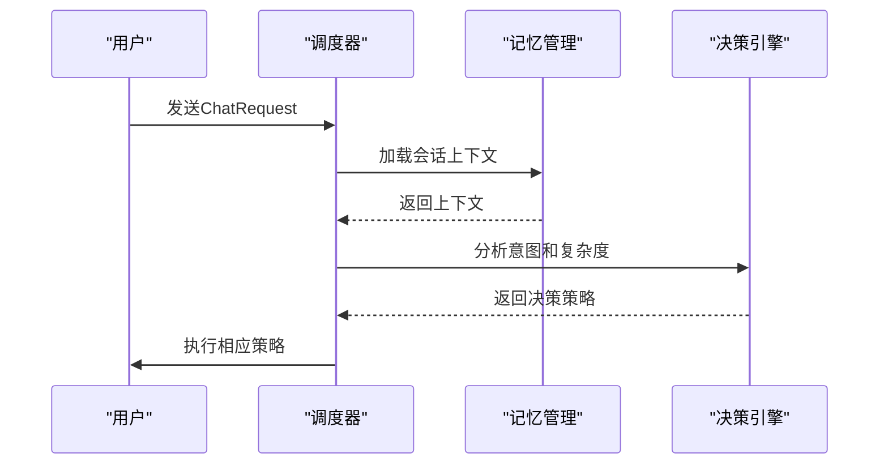
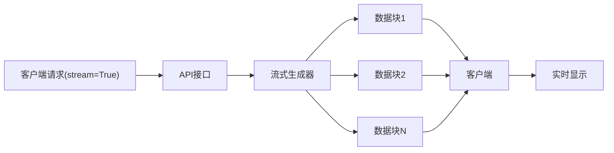
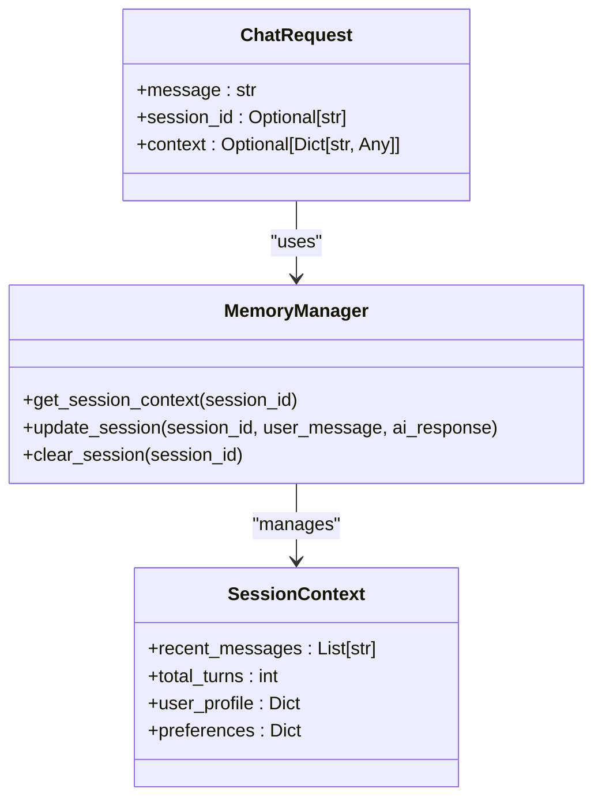

# 聊天相关数据模型

<cite>
**本文档引用的文件**
- [schemas.py](file://python/models/schemas.py#L0-L210)
- [orchestrator.py](file://python/agent/orchestrator.py#L0-L351)
- [api_router.py](file://python/agent/api_router.py#L0-L285)
</cite>

## 目录
1. [核心聊天数据模型](#核心聊天数据模型)
2. [关键字段在智能路由中的作用](#关键字段在智能路由中的作用)
3. [流式响应控制机制](#流式响应控制机制)
4. [JSON请求/响应样例](#json请求响应样例)
5. [模型复用机制](#模型复用机制)
6. [版本兼容策略](#版本兼容策略)
7. [模型验证规则](#模型验证规则)

## 核心聊天数据模型

### ChatRequest 模型定义

`ChatRequest` 类定义了聊天请求的数据结构，包含以下字段：

| 字段名 | 数据类型 | 默认值 | 业务语义 |
|--------|---------|-------|---------|
| message | str | 必需 | 用户输入的消息内容 |
| session_id | Optional[str] | None | 会话标识符，用于维护对话上下文 |
| max_tokens | Optional[int] | 1024 | 生成回复的最大token数量限制 |
| temperature | Optional[float] | 0.7 | 控制生成文本随机性的温度参数 |
| model_type | Optional[ModelType] | ModelType.AUTO_SELECT | 指定使用的模型类型 |
| preferred_model | Optional[str] | None | 首选的具体模型名称 |
| stream | bool | False | 是否启用流式响应模式 |
| context | Optional[Dict[str, Any]] | None | 附加的上下文信息 |

**Section sources**
- [schemas.py](file://python/models/schemas.py#L20-L37)

### ChatResponse 模型定义

`ChatResponse` 类定义了聊天响应的数据结构，包含以下字段：

| 字段名 | 数据类型 | 业务语义 |
|--------|---------|---------|
| content | str | AI生成的回复内容 |
| session_id | str | 关联的会话ID |
| model_used | ModelType | 实际使用的模型类型 |
| reasoning | Optional[str] | 选择该模型的原因说明 |
| token_count | Optional[int] | 实际使用的token数量 |
| latency_ms | Optional[float] | 响应延迟（毫秒） |
| confidence | Optional[float] | 回复置信度评分 |
| timestamp | datetime | 响应生成的时间戳 |
| error | Optional[str] | 错误信息（如有） |

**Section sources**
- [schemas.py](file://python/models/schemas.py#L40-L61)

## 关键字段在智能路由中的作用

### message 字段的作用

`message` 字段是智能路由决策的基础输入。系统通过分析用户消息内容来确定最佳处理策略：

1. **意图识别**：使用本地小模型分析消息的意图类型（聊天、搜索、插件调用等）
2. **复杂度评估**：根据消息长度和内容判断任务复杂度
3. **实体提取**：识别消息中的关键实体以决定是否需要特定插件



**Diagram sources**
- [orchestrator.py](file://python/agent/orchestrator.py#L110-L140)

### session_id 字段的作用

`session_id` 字段在会话管理和上下文维护中起着关键作用：

1. **会话状态跟踪**：唯一标识一个对话会话
2. **上下文加载**：从数据库加载历史对话记录
3. **记忆更新**：将新的对话条目存储到对应会话中
4. **统计计算**：用于计算活跃会话数等指标

当 `session_id` 为空时，系统会自动生成一个新的会话ID。

**Section sources**
- [orchestrator.py](file://python/agent/orchestrator.py#L69-L72)
- [memory_manager.py](file://python/core/memory_manager.py#L62-L98)

### model_type 字段的作用

`model_type` 字段直接影响智能路由决策过程：

1. **优先级设置**：指定模型类型会影响调度器的决策权重
2. **资源分配**：不同模型类型对应不同的计算资源需求
3. **性能优化**：根据模型特性调整最大token数和温度参数

智能路由决策流程如下：


**Diagram sources**
- [orchestrator.py](file://python/agent/orchestrator.py#L139-L180)

## 流式响应控制机制

### stream 字段的功能

`stream` 字段控制着响应行为的两种模式：

- `stream=False`：常规模式，等待完整响应生成后一次性返回
- `stream=True`：流式模式，逐块返回响应内容，实现即时显示效果

流式响应的工作原理：


**Section sources**
- [api_router.py](file://python/agent/api_router.py#L40-L48)

### 流式响应实现细节

流式响应通过 `StreamingResponse` 实现，遵循 Server-Sent Events (SSE) 协议：

1. **响应格式**：每个数据块以 `data: ` 开头，以 `\n\n` 结尾
2. **JSON编码**：数据块内容为 JSON 格式的字符串
3. **无缓存**：设置 `Cache-Control: no-cache` 头部确保实时传输

```python
async def generate_stream():
    async for chunk in orchestrator.process_chat_stream(request):
        yield f"data: {json.dumps(chunk.dict(), ensure_ascii=False)}\n\n"
```

**Section sources**
- [api_router.py](file://python/agent/api_router.py#L42-L47)

## JSON请求/响应样例

### 普通聊天请求/响应

**普通聊天请求示例：**
```json
{
  "message": "今天天气怎么样？",
  "session_id": "session_12345",
  "max_tokens": 512,
  "temperature": 0.8,
  "model_type": "auto_select",
  "stream": false
}
```

**普通聊天响应示例：**
```json
{
  "content": "今天天气晴朗，气温25度，适合户外活动。",
  "session_id": "session_12345",
  "model_used": "cloud_large",
  "reasoning": "需要最新天气信息，使用云端大模型",
  "token_count": 28,
  "latency_ms": 1250.5,
  "confidence": 0.92,
  "timestamp": "2024-01-15T10:30:00Z"
}
```

### 流式聊天请求/响应

**流式聊天请求示例：**
```json
{
  "message": "请写一首关于春天的诗",
  "session_id": "session_67890",
  "max_tokens": 1024,
  "temperature": 0.9,
  "model_type": "cloud_large",
  "stream": true
}
```

**流式聊天响应数据流：**
```
data: {"content": "春风拂面花自开", "session_id": "session_67890"}
data: {"content": "柳绿桃红映山川", "session_id": "session_67890"}
data: {"content": "燕语莺啼春意闹", "session_id": "session_67890"}
data: {"content": "人间美景胜仙境", "session_id": "session_67890"}
data: {"content": "", "session_id": "session_67890", "model_used": "cloud_large", "token_count": 45, "latency_ms": 2100.3}
```

**Section sources**
- [api_router.py](file://python/agent/api_router.py#L40-L48)
- [cli_client.py](file://cli_client.py#L46-L77)

## 模型复用机制

### FastAPI 接口序列化

聊天数据模型在 FastAPI 中作为请求和响应的类型注解：

```python
@api_router.post("/chat", response_model=ChatResponse)
async def chat(request: ChatRequest):
    response = await orchestrator.process_chat(request)
    return response
```

这种设计实现了：
- 自动请求验证
- OpenAPI 文档生成
- 类型安全的接口定义

**Section sources**
- [api_router.py](file://python/agent/api_router.py#L20-L37)

### gRPC 消息传递

数据模型在 gRPC 通信中被转换为 protobuf 消息格式，实现跨语言通信：

1. **请求转换**：将 `ChatRequest` 转换为 gRPC 请求消息
2. **响应映射**：将 gRPC 响应消息映射回 `ChatResponse`
3. **错误处理**：统一的错误信息传递机制

**Section sources**
- [grpc_client.py](file://python/core/grpc_client.py#L90-L132)

### 会话上下文管理

聊天模型与记忆管理系统深度集成：



**Diagram sources**
- [orchestrator.py](file://python/agent/orchestrator.py#L69-L72)
- [memory_manager.py](file://python/core/memory_manager.py#L130-L166)

## 版本兼容策略

### 使用 Optional 类型保证向后兼容

新增字段时采用 `Optional` 类型确保向后兼容性：

```python
class ChatRequest(BaseModel):
    # 现有字段...
    new_feature: Optional[str] = Field(None, description="新功能")
