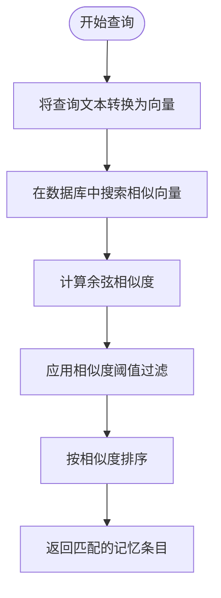
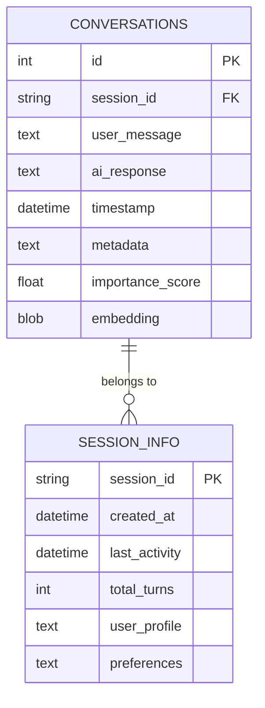
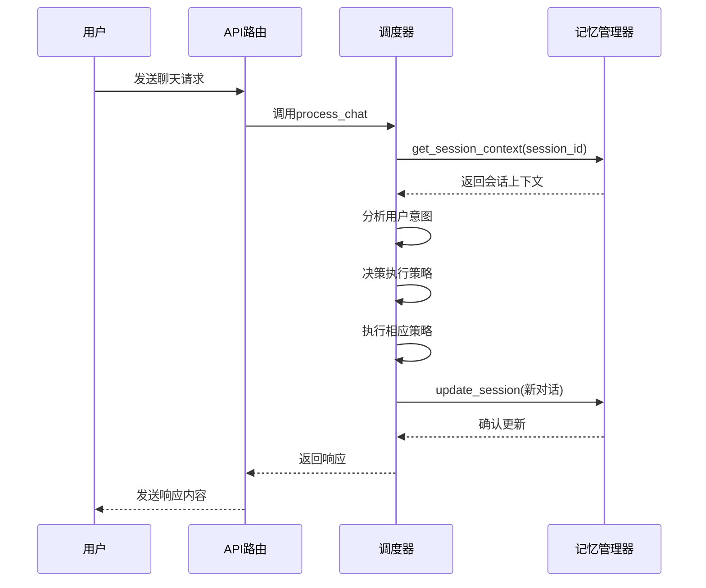
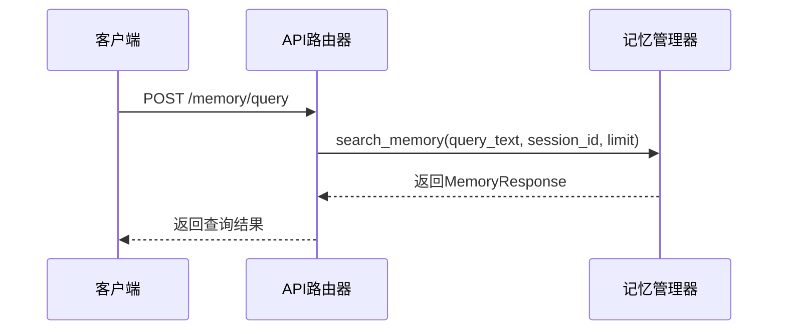

# 记忆管理相关数据模型

<cite>
**本文档引用的文件**
- [schemas.py](file://python/models/schemas.py)
- [memory_manager.py](file://python/core/memory_manager.py)
- [orchestrator.py](file://python/agent/orchestrator.py)
- [config.py](file://python/core/config.py)
- [api_router.py](file://python/agent/api_router.py)
</cite>

## 目录
1. [引言](#引言)
2. [核心数据模型设计](#核心数据模型设计)
3. [记忆检索机制](#记忆检索机制)
4. [上下文扩展能力](#上下文扩展能力)
5. [会话持久化实现](#会话持久化实现)
6. [完整查询流程](#完整查询流程)
7. [记忆保留策略](#记忆保留策略)
8. [结论](#结论)

## 引言
本系统通过MemoryEntry、MemoryQuery和MemoryResponse三个核心数据模型构建了完整的记忆管理系统。该系统支持基于向量相似度的记忆检索，提供丰富的上下文扩展能力，并结合ChromaDB实现了高效的会话上下文持久化。通过重要性评分和时间戳管理，系统能够智能地保留关键记忆并处理过期数据。

## 核心数据模型设计

### MemoryEntry模型
`MemoryEntry`是记忆条目的基础数据结构，包含以下关键字段：
- **id**: 唯一标识符
- **session_id**: 会话ID，用于关联对话上下文
- **content**: 记忆内容，存储用户与AI的交互文本
- **content_type**: 内容类型，区分不同类型的记忆数据
- **embedding**: 向量嵌入，支持基于语义相似度的检索
- **metadata**: 元数据，提供可扩展的上下文信息
- **created_at**: 创建时间戳，用于记忆生命周期管理
- **importance**: 重要性评分，决定记忆的保留优先级

**Section sources**
- [schemas.py](file://python/models/schemas.py#L139-L148)

### MemoryQuery模型
`MemoryQuery`定义了记忆查询的参数结构：
- **query_text**: 查询文本，作为相似度匹配的基础
- **session_id**: 可选的会话ID过滤条件
- **limit**: 返回结果数量限制
- **similarity_threshold**: 相似度阈值，控制检索精度

**Section sources**
- [schemas.py](file://python/models/schemas.py#L151-L156)

### MemoryResponse模型
`MemoryResponse`封装了记忆查询的响应结果：
- **results**: MemoryEntry对象列表，包含匹配的记忆条目
- **total_count**: 匹配结果的总数

**Section sources**
- [schemas.py](file://python/models/schemas.py#L159-L162)

## 记忆检索机制

### 向量相似度检索
虽然当前实现使用了基于文本匹配的搜索方法，但`embedding`字段的设计为基于向量相似度的检索提供了基础支持。在实际应用中，可以通过将查询文本转换为向量，然后计算与存储的`embedding`向量之间的余弦相似度来实现语义级别的记忆检索。



**Diagram sources**
- [memory_manager.py](file://python/core/memory_manager.py#L200-L240)
- [schemas.py](file://python/models/schemas.py#L139-L148)

### 相似度阈值过滤
`similarity_threshold`参数在查询过程中起到关键的过滤作用。只有相似度得分高于该阈值的记忆条目才会被返回，这有助于：
- 提高检索结果的相关性
- 减少噪声干扰
- 控制返回结果的质量

系统配置中的默认阈值为0.7，可以在`config.py`中进行调整。

**Section sources**
- [config.py](file://python/core/config.py#L50)
- [memory_manager.py](file://python/core/memory_manager.py#L20)

## 上下文扩展能力

### content_type字段
`content_type`字段允许系统区分不同类型的记忆内容，如普通对话、任务记录、插件调用等。这种分类机制使得系统可以根据内容类型采取不同的处理策略。

### metadata字段
`metadata`字段是一个灵活的字典结构，可用于存储各种扩展信息：
- 用户偏好设置
- 对话上下文标记
- 情感分析结果
- 实体识别信息
- 自定义业务数据

这些元数据极大地增强了系统的上下文理解能力和个性化服务水平。

**Section sources**
- [schemas.py](file://python/models/schemas.py#L145-L146)

## 会话持久化实现

### ChromaDB集成
尽管当前代码使用SQLite作为存储后端，但`MemoryEntry`模型的设计完全兼容ChromaDB等向量数据库。通过将`embedding`字段与ChromaDB的向量化存储能力结合，可以实现高效的记忆持久化和快速检索。

### 数据库表结构
系统创建了两个主要的数据表来支持会话持久化：



**Diagram sources**
- [memory_manager.py](file://python/core/memory_manager.py#L60-L90)

### 缓存机制
系统实现了多层缓存策略以提高性能：
- 内存缓存：`session_cache`存储最近访问的会话上下文
- 数据库索引：为`session_id`和`timestamp`创建索引以加速查询

**Section sources**
- [memory_manager.py](file://python/core/memory_manager.py#L18-L21)

## 完整查询流程

### 从提问到响应的完整流程


**Diagram sources**
- [orchestrator.py](file://python/agent/orchestrator.py#L100-L130)
- [memory_manager.py](file://python/core/memory_manager.py#L100-L150)

### 记忆查询API
系统提供了专门的记忆查询接口：



**Diagram sources**
- [api_router.py](file://python/agent/api_router.py#L200-L215)
- [memory_manager.py](file://python/core/memory_manager.py#L200-L240)

## 记忆保留策略

### 重要性评分机制
系统通过`_calculate_importance`方法动态计算每条记忆的重要性评分，考虑因素包括：
- **长度因素**: 长度超过200字符加0.1分，超过500字符再加0.1分
- **关键词检测**: 包含"重要"、"记住"等关键词加0.1分
- **疑问标记**: 包含问号表示用户有疑问，加0.05分
- **基础分数**: 默认0.5分

最终评分上限为1.0，确保评分范围合理。

```mermaid
flowchart TD
    Start([开始计算重要性]) --> BaseScore["设置基础分数=0.5"]
    BaseScore --> CheckLength["检查内容长度"]
    CheckLength -->|>200字符| AddLength1["+0.1分"]
    CheckLength -->|>500字符| AddLength2["+0.1分"]
    AddLength1 --> CheckKeywords
    AddLength2 --> CheckKeywords
    CheckLength --> CheckKeywords
    CheckKeywords["检查关键词"] -->|包含关键词| AddKeyword["+0.1分"]
    CheckKeywords --> NoKeyword
    AddKeyword --> CheckQuestion
    NoKeyword --> CheckQuestion
    CheckQuestion["检查问号"] -->|包含问号| AddQuestion["+0.05分"]
    CheckQuestion --> NoQuestion
    AddQuestion --> CapScore
    NoQuestion --> CapScore
    CapScore["限制