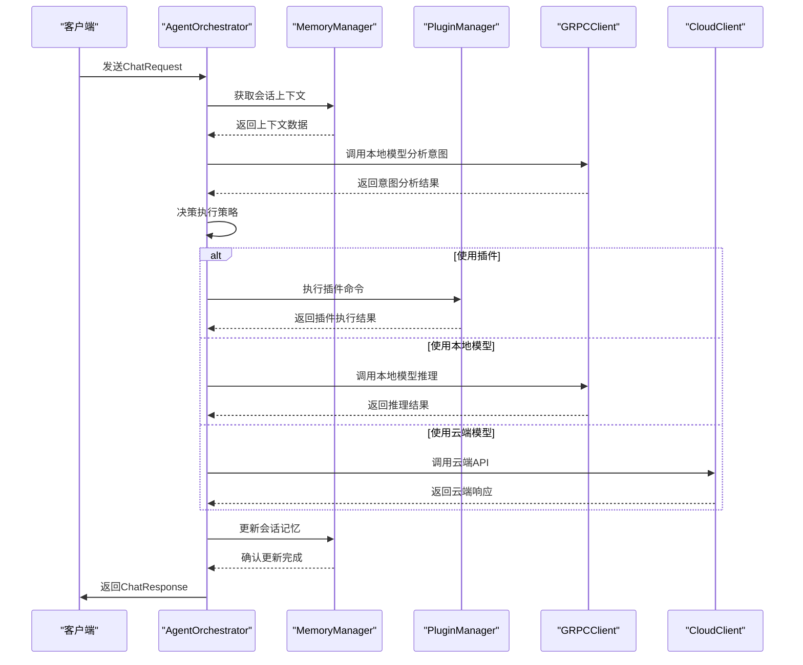
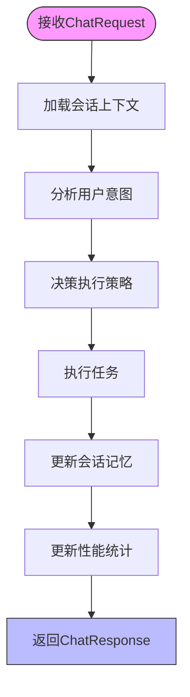
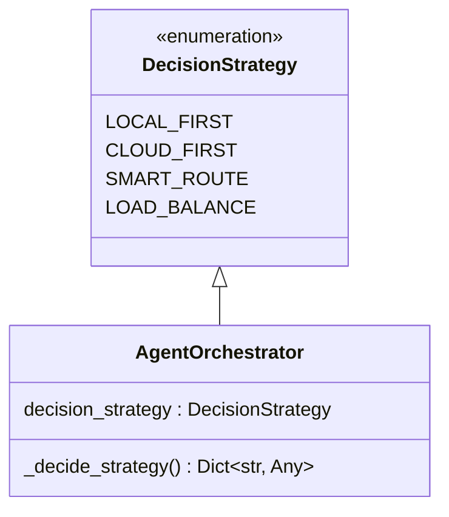
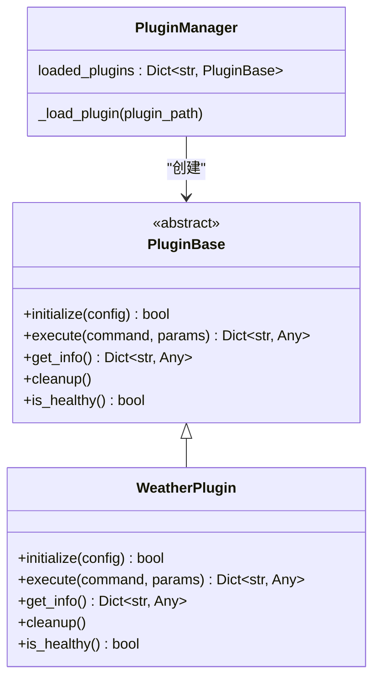
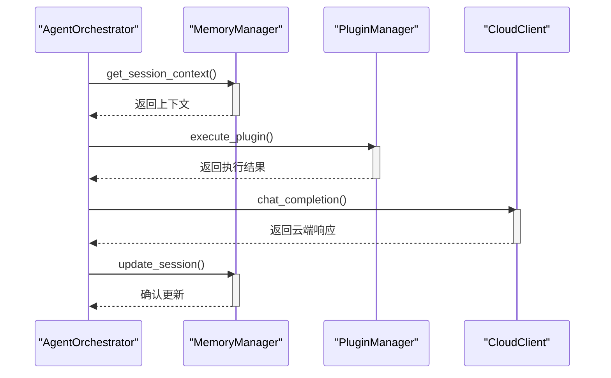
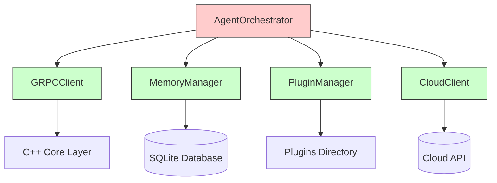
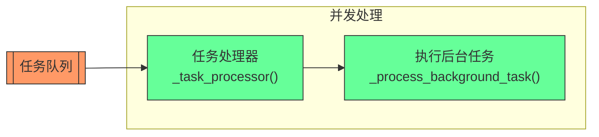

# Agent调度器架构

<cite>
**本文档引用的文件**
- [orchestrator.py](file://python/agent/orchestrator.py)
- [api_router.py](file://python/agent/api_router.py)
- [schemas.py](file://python/models/schemas.py)
- [grpc_client.py](file://python/core/grpc_client.py)
- [memory_manager.py](file://python/core/memory_manager.py)
- [plugin_manager.py](file://python/core/plugin_manager.py)
- [cloud_client.py](file://python/core/cloud_client.py)
- [main.py](file://python/main.py)
</cite>

## 目录
1. [简介](#简介)
2. [项目结构](#项目结构)
3. [核心组件](#核心组件)
4. [架构概述](#架构概述)
5. [详细组件分析](#详细组件分析)
6. [依赖关系分析](#依赖关系分析)
7. [性能考量](#性能考量)
8. [故障排除指南](#故障排除指南)
9. [结论](#结论)

## 简介
Agent调度器是AI助手系统的核心业务协调者，负责整合模型推理、插件执行、记忆管理和云服务调用四大能力。作为中央控制器，它通过智能决策机制选择最优的执行策略，实现本地小模型与云端大模型的混合推理，并支持Python和C++双语言插件生态。

## 项目结构
本项目采用C++和Python混合架构，分为核心计算层和应用逻辑层。C++层处理计算密集型任务，如模型推理和系统资源管理；Python层处理业务逻辑和API接口。

```mermaid
graph TD
subgraph User[用户/应用]
A[CLI] --> |HTTP/WebSocket| B[FastAPI API]
W[Web UI] --> |HTTP| B
end
subgraph Python[Python 层]
B --> O[Agent Orchestrator]
O --> |调用| P[插件 SDK]
O --> |gRPC/Pybind11| CppCore
end
subgraph CppCore[C++ 核心层]
CppCore --> M[Model Engine (llama.cpp / vLLM)]
CppCore --> S[SysManager (CPU/MEM/IO)]
CppCore --> L[Plugin Loader (C++ 插件)]
end
```

**图示来源**
- [README.md](file://README.md)

## 核心组件

AgentOrchestrator类是系统的核心，集成了四个主要功能模块：通过GRPCClient与C++核心层通信进行模型推理，通过MemoryManager管理会话记忆，通过PluginManager执行插件，以及通过CloudClient调用云端API。

**章节来源**
- [orchestrator.py](file://python/agent/orchestrator.py#L30-L70)

## 架构概述

Agent调度器采用分层架构设计，从接收ChatRequest开始，经过上下文检索、意图识别、策略选择到最终响应生成，形成完整的任务编排流程。



**图示来源**
- [orchestrator.py](file://python/agent/orchestrator.py#L100-L300)
- [api_router.py](file://python/agent/api_router.py#L15-L50)

## 详细组件分析

### 任务编排流程分析

Agent调度器的任务编排流程始于process_chat方法，该方法处理聊天请求并返回响应。整个流程包括六个关键步骤：加载会话记忆、分析用户意图、决策执行策略、执行任务、更新记忆和更新统计。

#### 流程图


**图示来源**
- [orchestrator.py](file://python/agent/orchestrator.py#L100-L150)

### 设计模式实现分析

Agent调度器在实现中应用了多种设计模式，包括策略模式、工厂模式和观察者模式。

#### 策略模式 - 路由决策


**图示来源**
- [orchestrator.py](file://python/agent/orchestrator.py#L20-L30)

#### 工厂模式 - 插件实例化


**图示来源**
- [plugin_base.py](file://python/sdk/plugin_base.py#L20-L100)
- [plugin_manager.py](file://python/core/plugin_manager.py#L50-L100)
- [weather/main.py](file://python/plugins/weather/main.py#L20-L50)

#### 观察者模式 - 事件通知


**图示来源**
- [orchestrator.py](file://python/agent/orchestrator.py#L100-L300)

## 依赖关系分析

Agent调度器与系统其他组件之间存在明确的交互协议和时序关系。通过gRPC与C++核心层通信，使用ChromaDB风格的记忆库管理会话状态，并通过插件管理器动态加载和执行插件。



**图示来源**
- [orchestrator.py](file://python/agent/orchestrator.py#L30-L70)
- [main.py](file://python/main.py#L40-L50)

## 性能考量

Agent调度器在高并发场景下采用异步处理机制，通过asyncio.Queue管理后台任务队列，并实现了超时控制和错误恢复策略。

### 异步处理机制


**图示来源**
- [orchestrator.py](file://python/agent/orchestrator.py#L250-L280)

### 错误恢复策略
当云端模型调用失败时，系统会自动降级到本地模型，确保服务的可用性。这种容错机制通过_fallback_to_local方法实现。

**章节来源**
- [orchestrator.py](file://python/agent/orchestrator.py#L230-L250)

## 故障排除指南

### 调试日志建议
系统提供了详细的日志记录，可通过以下方式进行调试：
- 检查gRPC连接状态
- 验证插件配置正确性
- 监控内存管理器的健康状态
- 查看云端API调用的错误信息

### 性能瓶颈分析方法
1. **监控性能统计**: 使用get_stats方法获取总请求数、各类请求分布和平均响应时间
2. **检查系统资源**: 通过system/status接口查看CPU、内存和GPU使用率
3. **分析任务队列**: 监控任务队列长度和处理速度
4. **评估模型延迟**: 比较本地模型和云端模型的响应时间

**章节来源**
- [orchestrator.py](file://python/agent/orchestrator.py#L350-L380)
- [api_router.py](file://python/agent/api_router.py#L165-L200)

## 结论

Agent调度器作为系统的中央控制器，成功整合了模型推理、插件执行、记忆管理和云服务调用四大能力。通过智能决策机制，它能够根据任务特点选择最优的执行策略，实现了本地小模型与云端大模型的高效协同。系统采用清晰的分层架构和模块化设计，支持灵活扩展和维护，为构建智能助手提供了坚实的基础。