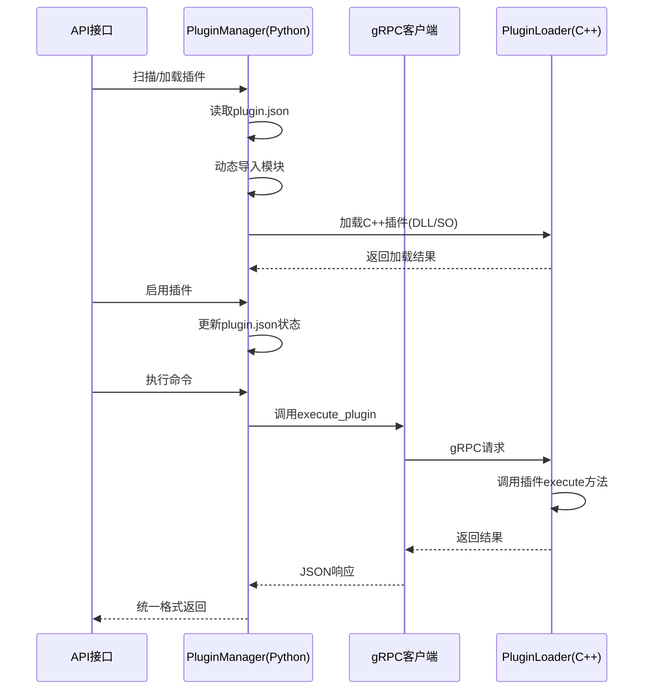
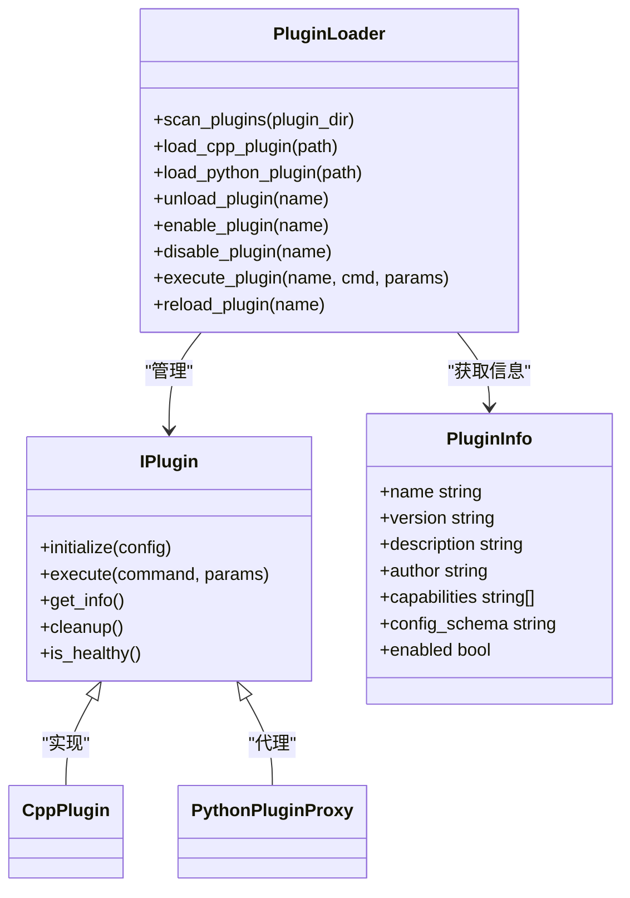
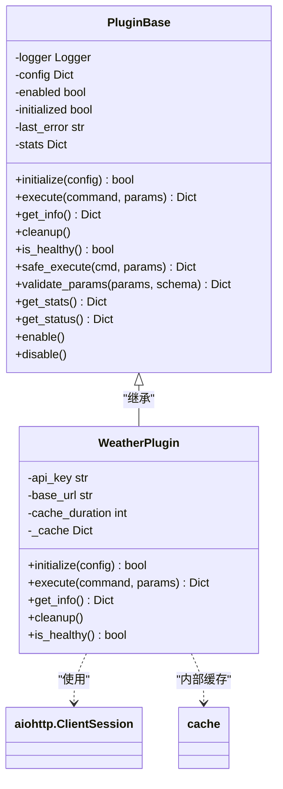
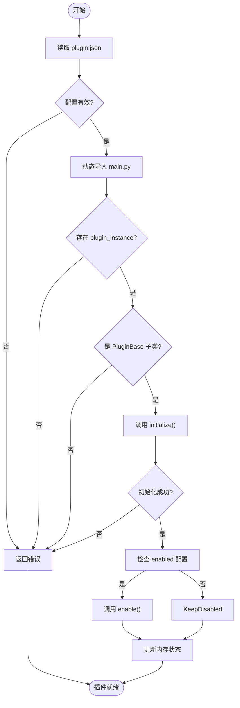
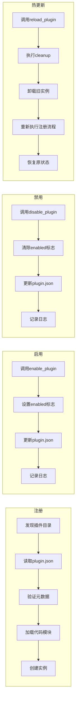

# 插件动态加载机制

<cite>
**本文档引用的文件**
- [plugin_loader.hpp](file://cpp/include/plugin_loader.hpp)
- [plugin_base.py](file://python/sdk/plugin_base.py)
- [main.py](file://python/plugins/weather/main.py)
- [plugin.json](file://python/plugins/weather/plugin.json)
</cite>

## 目录
1. [简介](#简介)
2. [项目结构](#项目结构)
3. [核心组件](#核心组件)
4. [架构概述](#架构概述)
5. [详细组件分析](#详细组件分析)
6. [依赖分析](#依赖分析)
7. [性能考虑](#性能考虑)
8. [故障排除指南](#故障排除指南)
9. [结论](#结论)

## 简介
本系统实现了支持Python和C++插件的双语言动态加载架构。通过`PluginLoader`类统一管理插件生命周期，包括扫描、加载、启用、禁用和热更新等操作。插件系统采用元信息驱动方式，通过`plugin.json`文件定义插件配置、能力声明和权限需求。Python插件基于异步框架设计，提供安全执行、参数验证和统计功能；C++插件通过gRPC与主进程通信，实现高性能本地计算任务处理。

## 项目结构
系统采用分层架构设计，将C++核心引擎与Python应用逻辑分离。插件分为两种类型：C++插件位于编译模块中，通过动态链接库形式加载；Python插件集中存放在`python/plugins`目录下，每个插件拥有独立子目录和配置文件。

```mermaid
graph TB
subgraph "C++ 核心"
PL[plugin_loader.hpp]
ME[model_engine.hpp]
SM[sys_manager.hpp]
end
subgraph "Python 应用"
PM[core/plugin_manager.py]
SDK[sdk/plugin_base.py]
AGENT[agent/api_router.py]
end
subgraph "插件实例"
W[plugins/weather]
CPP[C++插件]
end
PL --> PM : "跨语言接口"
SDK --> W : "继承基类"
PM --> W : "动态加载"
PM --> CPP : "gRPC调用"
```

**图示来源**
- [plugin_loader.hpp](file://cpp/include/plugin_loader.hpp#L0-L108)
- [plugin_manager.py](file://python/core/plugin_manager.py#L0-L54)

**章节来源**
- [plugin_loader.hpp](file://cpp/include/plugin_loader.hpp#L0-L108)
- [project_structure](file://#L0-L20)

## 核心组件

系统的核心组件包括C++端的`PluginLoader`和Python端的`PluginManager`，二者协同完成插件管理任务。`PluginBase`为所有Python插件提供统一接口规范，确保一致性与可维护性。天气插件作为典型示例，展示了如何实现具体业务功能并集成到框架中。

**章节来源**
- [plugin_loader.hpp](file://cpp/include/plugin_loader.hpp#L0-L108)
- [plugin_base.py](file://python/sdk/plugin_base.py#L0-L316)
- [main.py](file://python/plugins/weather/main.py#L0-L411)

## 架构概述

整个插件系统采用混合架构，结合本地高性能计算与脚本灵活性优势：



**图示来源**
- [plugin_loader.hpp](file://cpp/include/plugin_loader.hpp#L47-L97)
- [plugin_manager.py](file://python/core/plugin_manager.py#L186-L225)
- [grpc_client.py](file://python/core/grpc_client.py#L170-L213)

## 详细组件分析

### C++插件加载器分析

`PluginLoader`是C++侧的核心管理类，负责插件的全生命周期管理：



**图示来源**
- [plugin_loader.hpp](file://cpp/include/plugin_loader.hpp#L0-L54)
- [plugin_loader.hpp](file://cpp/include/plugin_loader.hpp#L47-L97)

#### Python插件基类分析

`PluginBase`为开发者提供了完整的开发契约和辅助功能：



**图示来源**
- [plugin_base.py](file://python/sdk/plugin_base.py#L10-L111)
- [main.py](file://python/plugins/weather/main.py#L0-L411)

### 插件初始化流程

插件从发现到可用需经历完整初始化流程：



**图示来源**
- [plugin_manager.py](file://python/core/plugin_manager.py#L52-L86)
- [plugin_manager.py](file://python/core/plugin_manager.py#L84-L116)

**章节来源**
- [plugin_manager.py](file://python/core/plugin_manager.py#L52-L116)

### 插件操作流程

插件的注册、启用、禁用和热更新操作遵循标准化流程：



**图示来源**
- [plugin_loader.hpp](file://cpp/include/plugin_loader.hpp#L70-L75)
- [plugin_manager.py](file://python/core/plugin_manager.py#L148-L187)
- [plugin_manager.py](file://python/core/plugin_manager.py#L222-L261)

**章节来源**
- [api_router.py](file://python/agent/api_router.py#L123-L162)
- [plugin_manager.py](file://python/core/plugin_manager.py#L148-L187)

## 依赖分析

系统通过显式声明机制管理插件依赖关系，确保运行环境完整性：

```mermaid
erDiagram
  PLUGIN ||--o{ DEPENDENCY : requires
  PLUGIN ||--|| CONFIG_SCHEMA : defines
  PLUGIN ||--o{ PERMISSION : requests
  
  PLUGIN {
    string name PK
    string version
   