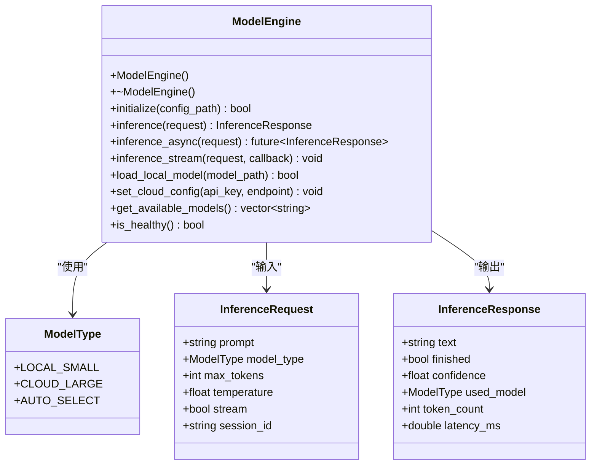
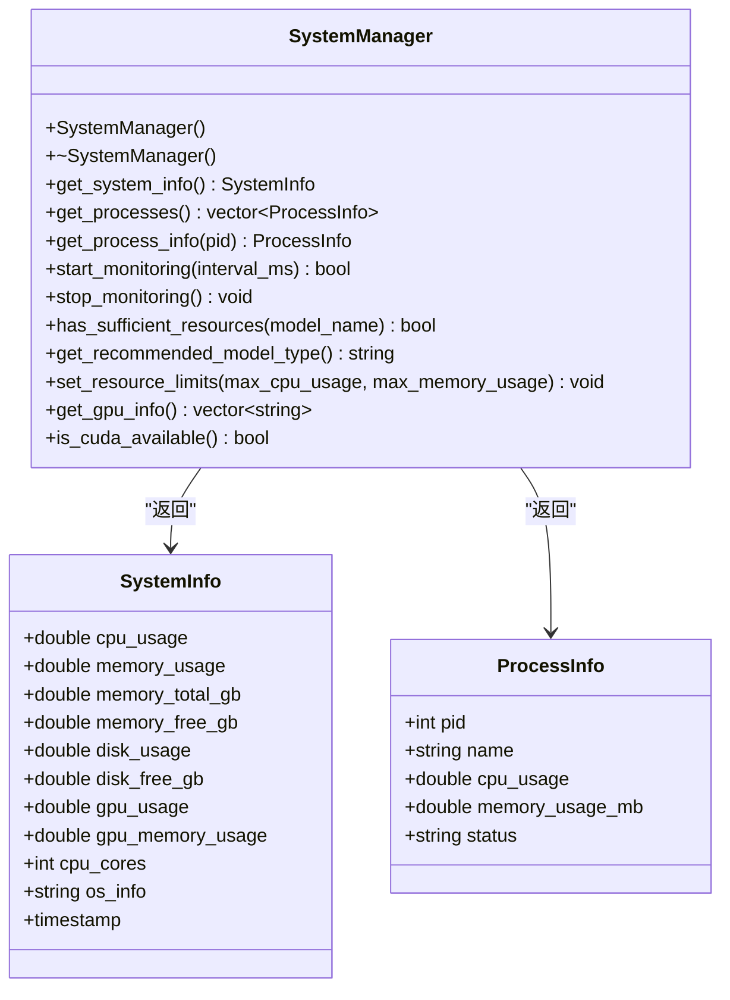
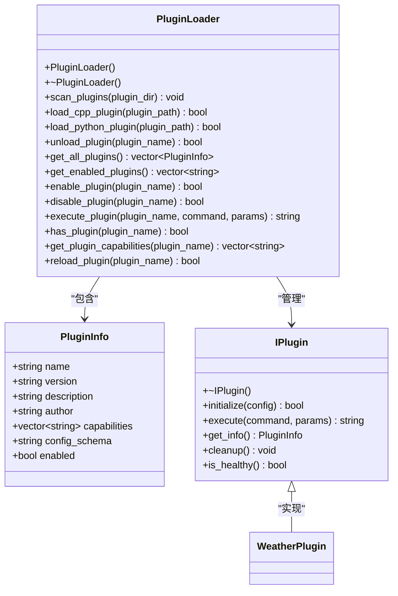
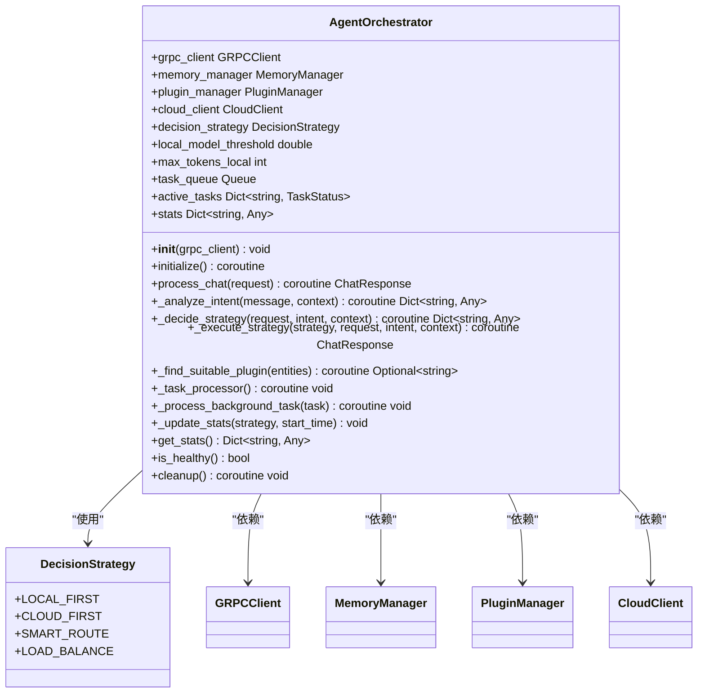
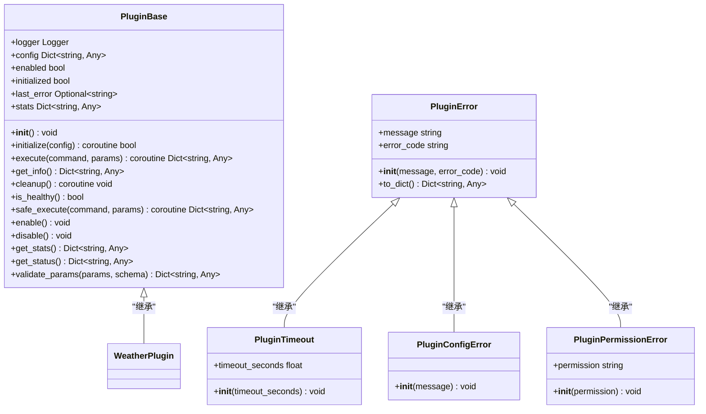

# 核心架构设计

<cite>
**本文档引用的文件**
- [model_engine.hpp](file://cpp/include/model_engine.hpp)
- [sys_manager.hpp](file://cpp/include/sys_manager.hpp)
- [plugin_loader.hpp](file://cpp/include/plugin_loader.hpp)
- [orchestrator.py](file://python/agent/orchestrator.py)
- [plugin_base.py](file://python/sdk/plugin_base.py)
- [main.py](file://python/plugins/weather/main.py)
- [plugin.json](file://python/plugins/weather/plugin.json)
</cite>

## 目录
1. [项目概述](#项目概述)
2. [微内核+插件化架构模式](#微内核插件化架构模式)
3. [C++核心层组件分析](#c核心层组件分析)
4. [Python调度器设计](#python调度器设计)
5. [设计模式应用](#设计模式应用)
6. [组件交互时序图](#组件交互时序图)
7. [运行时架构图](#运行时架构图)
8. [性能优化措施](#性能优化措施)

## 项目概述

nex项目采用C++与Python混合架构，实现了微内核+插件化的智能助手系统。该架构将核心功能封装在高性能的C++层，业务逻辑和调度协调放在灵活的Python层，通过gRPC进行跨语言通信。系统支持本地小模型推理、云端大模型调用、动态插件扩展和会话记忆管理等核心功能。

**Section sources**
- [README.md](file://README.md#L0-L34)

## 微内核+插件化架构模式

nex项目采用了典型的微内核架构模式，其中C++核心层作为微内核提供基础服务，包括模型推理、系统监控和插件管理。Python层作为外壳，实现高级业务逻辑和调度决策。这种架构具有高内聚、低耦合的特点，使得系统具备良好的可扩展性和维护性。

微内核负责提供稳定的基础服务接口，而具体的功能实现则通过插件机制动态加载。系统启动时仅加载必要的核心组件，其他功能模块按需加载，有效降低了内存占用和启动时间。插件可以是C++编写的高性能模块，也可以是Python编写的快速开发模块，为开发者提供了灵活的选择。

**Section sources**
- [README.md](file://README.md#L0-L34)

## C++核心层组件分析

### 模型引擎封装

C++核心层通过`model_engine.hpp`头文件中的`ModelEngine`类封装了本地与云端模型的推理能力。该类提供了统一的API接口，屏蔽了底层llama.cpp和云端API的实现差异。支持三种推理模式：同步推理、异步推理和流式推理，满足不同场景的需求。



**Diagram sources**
- [model_engine.hpp](file://cpp/include/model_engine.hpp#L0-L78)

**Section sources**
- [model_engine.hpp](file://cpp/include/model_engine.hpp#L0-L78)

### 跨平台资源监控

`sys_manager.hpp`文件中的`SystemManager`类实现了跨平台的系统资源监控功能。该类能够获取CPU、内存、磁盘和GPU等关键资源的使用情况，为决策引擎提供重要的上下文信息。通过Pimpl惯用法隐藏了平台相关的实现细节，确保了API的稳定性和可移植性。



**Diagram sources**
- [sys_manager.hpp](file://cpp/include/sys_manager.hpp#L0-L77)

**Section sources**
- [sys_manager.hpp](file://cpp/include/sys_manager.hpp#L0-L77)

### 动态插件加载

`plugin_loader.hpp`文件中的`PluginLoader`类支持动态加载C++和Python插件。通过定义标准的`IPlugin`接口和插件信息结构，实现了插件系统的标准化。C++插件通过共享库方式加载，Python插件通过Python C API集成，两种类型的插件都遵循相同的生命周期管理。



**Diagram sources**
- [plugin_loader.hpp](file://cpp/include/plugin_loader.hpp#L0-L108)

**Section sources**
- [plugin_loader.hpp](file://cpp/include/plugin_loader.hpp#L0-L108)

## Python调度器设计

### 中央调度器功能

Python层的`orchestrator.py`文件中的`AgentOrchestrator`类作为中央调度器，协调整个系统的运行。它通过gRPC客户端与C++核心层通信，管理记忆系统、插件管理和云服务客户端。调度器采用异步编程模型，能够高效处理并发请求。



**Diagram sources**
- [orchestrator.py](file://python/agent/orchestrator.py#L0-L350)

**Section sources**
- [orchestrator.py](file://python/agent/orchestrator.py#L0-L350)

### 插件SDK设计

Python SDK提供了`plugin_base.py`文件中的`PluginBase`抽象基类，为插件开发提供了标准化的接口和工具。所有插件必须继承此类并实现必要的方法。SDK还提供了装饰器来简化命令注册、参数验证和超时控制等功能。



**Diagram sources**
- [plugin_base.py](file://python/sdk/plugin_base.py#L0-L316)

**Section sources**
- [plugin_base.py](file://python/sdk/plugin_base.py#L0-L316)

## 设计模式应用

### 策略模式在决策引擎中的应用

决策引擎采用了策略模式，根据不同的场景选择最优的执行策略。`DecisionStrategy`枚举定义了多种策略类型，如`LOCAL_FIRST`（优先本地）、`CLOUD_FIRST`（优先云端）、`SMART_ROUTE`（智能路由）等。调度器根据当前系统资源、任务复杂度和用户意图动态选择合适的策略。

```mermaid
classDiagram
    class Strategy {
        +execute() Any
    }
    
    class LocalFirstStrategy {
        +execute() Any
    }
    
    class CloudFirstStrategy {
        +execute() Any
    }
    
    class SmartRouteStrategy {
        +execute() Any
    }
    
    class LoadBalanceStrategy {
        +execute() Any
    }
    
    class Context {
        -strategy Strategy
        +set_strategy(strategy) void
        +execute_strategy() Any
    }
    
    Strategy <|-- LocalFirstStrategy
    Strategy <|-- CloudFirstStrategy
