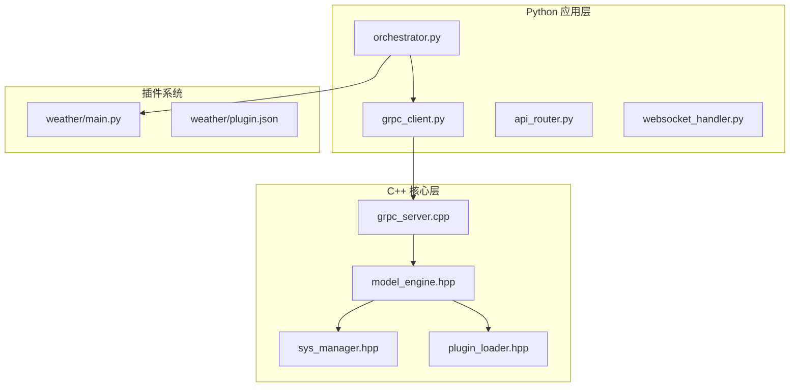
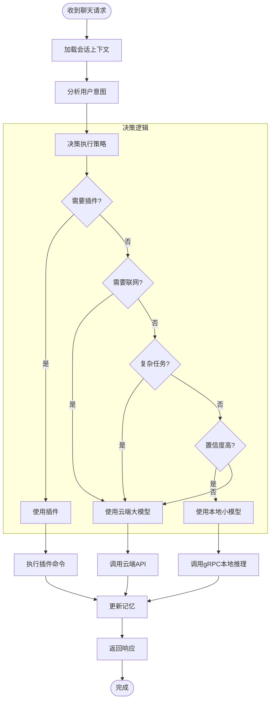
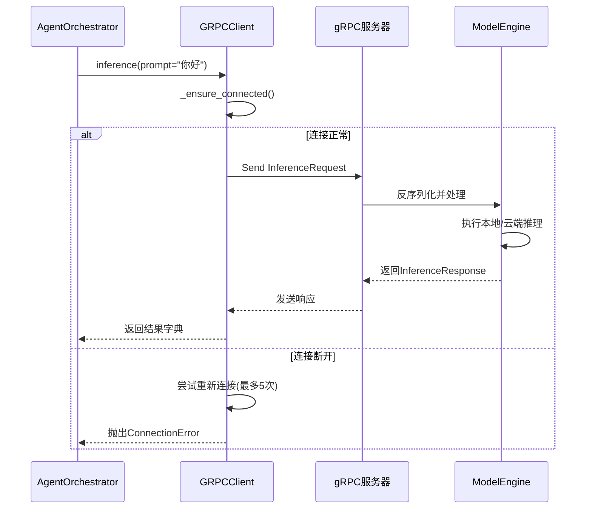
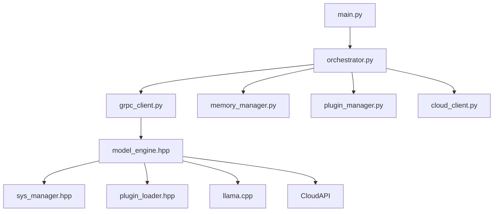

# 模型引擎设计

<cite>
**本文档引用文件**
- [model_engine.hpp](file://cpp/include/model_engine.hpp)
- [orchestrator.py](file://python/agent/orchestrator.py)
- [grpc_client.py](file://python/core/grpc_client.py)
- [sys_manager.hpp](file://cpp/include/sys_manager.hpp)
- [plugin_loader.hpp](file://cpp/include/plugin_loader.hpp)
</cite>

## 目录
1. [简介](#简介)
2. [项目结构](#项目结构)
3. [核心组件](#核心组件)
4. [架构概览](#架构概览)
5. [详细组件分析](#详细组件分析)
6. [依赖分析](#依赖分析)
7. [性能考量](#性能考量)
8. [故障排除指南](#故障排除指南)
9. [结论](#结论)

## 简介
本技术文档深入解析nex项目中的模型推理引擎，重点阐述`model_engine.hpp`头文件所定义的核心功能。该引擎作为系统智能决策中枢，实现了本地小模型（基于llama.cpp）与远程云端大模型的统一抽象和智能路由。文档将详细说明其gRPC集成机制、请求序列化流程、错误重试策略以及模型生命周期管理，并结合Python层调度器的调用逻辑，全面展示跨语言协同工作的完整架构。

## 项目结构
项目采用C++与Python混合架构，C++负责高性能核心计算，Python负责高层业务逻辑编排。整体结构清晰分离关注点：



**Diagram sources**
- [model_engine.hpp](file://cpp/include/model_engine.hpp)
- [orchestrator.py](file://python/agent/orchestrator.py)

**Section sources**
- [model_engine.hpp](file://cpp/include/model_engine.hpp)
- [orchestrator.py](file://python/agent/orchestrator.py)

## 核心组件
模型引擎（ModelEngine）是整个系统的核心，它通过Pimpl惯用法隐藏了复杂的内部实现细节，对外提供简洁稳定的接口。引擎支持同步、异步和流式三种推理模式，能够根据请求类型自动选择最优执行路径。其核心职责包括：统一本地与云端模型的API、管理模型加载与卸载、执行健康检查以及收集性能指标。

**Section sources**
- [model_engine.hpp](file://cpp/include/model_engine.hpp#L44-L76)

## 架构概览
系统采用分层架构，Python应用层通过gRPC与C++核心层通信，实现高效的数据交换和功能调用。

```mermaid
graph LR
Client[客户端] --> FastAPI[FastAPI服务器]
FastAPI --> Orchestrator[AgentOrchestrator]
Orchestrator --> GRPCClient[gRPC客户端]
GRPCClient < --> |gRPC| GRPCServer[gRPC服务器]
GRPCServer --> ModelEngine[ModelEngine]
ModelEngine --> LocalModel[本地llama.cpp模型]
ModelEngine --> CloudAPI[云端大模型API]
ModelEngine --> SysManager[SystemManager]
ModelEngine --> PluginLoader[PluginLoader]
style Client fill:#f9f,stroke:#333
style FastAPI fill:#bbf,stroke:#333
style Orchestrator fill:#f96,stroke:#333
style GRPCClient fill:#6f9,stroke:#333
style GRPCServer fill:#6f9,stroke:#333
style ModelEngine fill:#69f,stroke:#333
style LocalModel fill:#9f9,stroke:#333
style CloudAPI fill:#f99,stroke:#333
```

**Diagram sources**
- [model_engine.hpp](file://cpp/include/model_engine.hpp)
- [orchestrator.py](file://python/agent/orchestrator.py)
- [grpc_client.py](file://python/core/grpc_client.py)

## 详细组件分析

### 模型引擎类分析
`ModelEngine`类封装了所有模型推理相关的功能，为上层应用提供了统一的访问接口。

#### 类图
```mermaid
classDiagram
class ModelEngine {
+initialize(config_path) bool
+inference(request) InferenceResponse
+inference_async(request) future~InferenceResponse~
+inference_stream(request, callback) void
+load_local_model(model_path) bool
+set_cloud_config(api_key, endpoint) void
+get_available_models() vector~string~
+is_healthy() bool
}
class InferenceRequest {
+prompt string
+model_type ModelType
+max_tokens int
+temperature float
+stream bool
+session_id string
}
class InferenceResponse {
+text string
+finished bool
+confidence float
+used_model ModelType
+token_count int
+latency_ms double
}
class SystemManager {
+get_system_info() SystemInfo
+has_sufficient_resources(model_name) bool
}
class PluginLoader {
+execute_plugin(plugin_name, command, params) string
}
enum ModelType {
LOCAL_SMALL
CLOUD_LARGE
AUTO_SELECT
}
ModelEngine --> SystemManager : "使用"
ModelEngine --> PluginLoader : "使用"
ModelEngine --> InferenceRequest : "接收"
ModelEngine --> InferenceResponse : "返回"
```

**Diagram sources**
- [model_engine.hpp](file://cpp/include/model_engine.hpp#L0-L78)
- [sys_manager.hpp](file://cpp/include/sys_manager.hpp#L0-L77)
- [plugin_loader.hpp](file://cpp/include/plugin_loader.hpp#L0-L108)

### 调度器决策流程分析
`AgentOrchestrator`在Python层负责智能任务编排，其决策流程决定了最终使用的模型。

#### 决策流程图


**Diagram sources**
- [orchestrator.py](file://python/agent/orchestrator.py#L0-L350)

**Section sources**
- [orchestrator.py](file://python/agent/orchestrator.py#L0-L350)

### gRPC通信流程分析
Python层通过gRPC客户端与C++核心层进行通信，这是跨语言交互的关键。

#### 通信时序图


**Diagram sources**
- [orchestrator.py](file://python/agent/orchestrator.py#L0-L350)
- [grpc_client.py](file://python/core/grpc_client.py#L0-L92)

## 依赖分析
系统各组件之间存在明确的依赖关系，确保了模块间的松耦合和高内聚。



**Diagram sources**
- [main.py](file://python/main.py#L0-L49)
- [orchestrator.py](file://python/agent/orchestrator.py#L0-L350)
- [grpc_client.py](file://python/core/grpc_client.py#L0-L92)
- [model_engine.hpp](file://cpp/include/model_engine.hpp#L0-L78)

**Section sources**
- [main.py](file://python/main.py#L0-L49)
- [orchestrator.py](file://python/agent/orchestrator.py#L0-L350)

## 性能考量
系统在设计时充分考虑了性能优化，主要体现在以下几个方面：
- **批处理支持**：虽然当前接口未直接暴露批处理，但`std::future`异步接口为实现批处理提供了基础。
- **缓存机制**：通过`MemoryManager`维护会话上下文，避免重复计算。
- **低延迟设计**：对于简单任务优先使用本地模型，减少网络往返延迟。
- **资源监控**：`SystemManager`实时监控系统资源，确保模型运行环境稳定。
- **连接复用**：gRPC客户端保持长连接，避免频繁建立连接的开销。

## 故障排除指南
当系统出现异常时，可按以下步骤进行排查：

**Section sources**
- [grpc_client.py](file://python/core/grpc_client.py#L55-L92)
- [orchestrator.py](file://python/agent/orchestrator.py#L0-L350)

### 常见问题及解决方案
| 问题现象 | 可能原因 | 解决方案 |
|--------|--------|--------|
| gRPC连接失败 | C++服务未启动或地址配置错误 | 检查`settings.grpc_server_address`配置，确认`ai_assistant_server`进程正在运行 |
| 推理响应缓慢 | 本地资源不足或云端API限流 | 使用`get_system_info()`检查CPU/内存使用率，降低并发请求量 |
| 插件无法加载 | 插件目录权限问题或JSON格式错误 | 检查`plugins`目录下`.json`文件语法，确认`main.py`中`EXPORT_PLUGIN`宏正确使用 |
| 模型自动选择不准确 | 意图分析置信度过低 | 检查`_analyze_intent`提示词工程，调整`local_model_threshold`阈值 |

## 结论
nex项目的模型引擎成功实现了本地与云端AI模型的无缝集成，通过清晰的分层架构和高效的gRPC通信，构建了一个灵活、可扩展的智能推理平台。`ModelEngine`的抽象设计使得上层应用无需关心底层模型的具体实现，而`AgentOrchestrator`的智能决策机制则确保了资源的最优利用。该架构为未来集成更多类型的AI模型和服务奠定了坚实的基础。