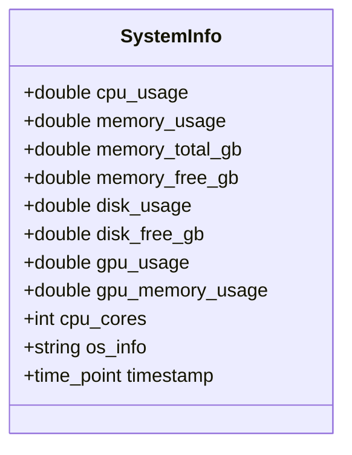
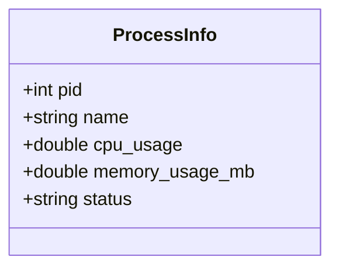
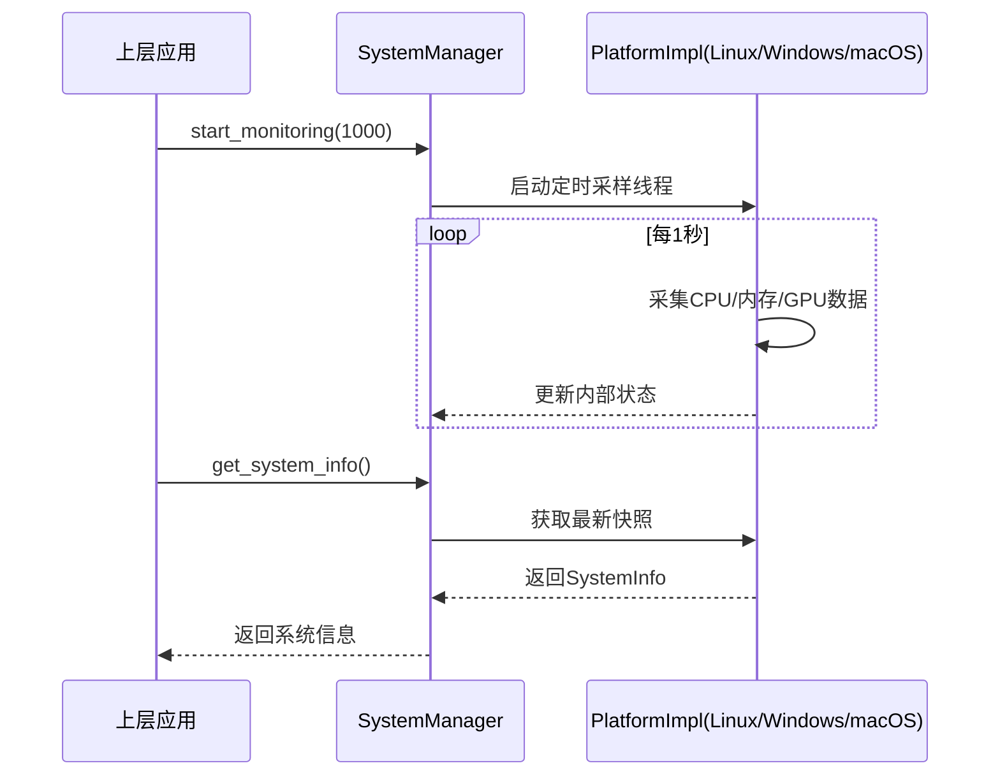
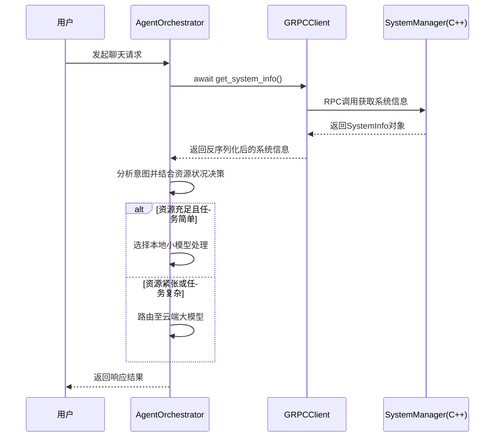

# 系统资源管理器

<cite>
**本文档引用文件**  
- [sys_manager.hpp](file://cpp/include/sys_manager.hpp#L1-L77)
- [orchestrator.py](file://python/agent/orchestrator.py#L1-L450)
- [grpc_client.py](file://python/core/grpc_client.py#L1-L240)
</cite>

## 目录
1. [引言](#引言)
2. [核心数据结构定义](#核心数据结构定义)
3. [跨平台系统监控机制](#跨平台系统监控机制)
4. [轻量级API接口设计](#轻量级api接口设计)
5. [系统状态采集与决策引擎集成](#系统状态采集与决策引擎集成)
6. [性能开销与优化策略](#性能开销与优化策略)
7. [异常处理与健壮性保障](#异常处理与健壮性保障)

## 引言
`SystemManager` 子系统是本项目中负责跨平台系统资源监控的核心组件，旨在为上层应用提供统一、高效的系统状态感知能力。该子系统通过封装底层操作系统差异，实现了对CPU、内存、GPU使用率及进程信息的实时采集，并以轻量级API形式暴露给Python层的调度引擎。其设计目标是在保证高精度监控的同时，最小化自身对系统资源的占用，从而支持在资源受限环境下稳定运行。

**Section sources**
- [sys_manager.hpp](file://cpp/include/sys_manager.hpp#L1-L10)

## 核心数据结构定义
系统监控子系统定义了两个关键的数据结构：`SystemInfo` 和 `ProcessInfo`，用于封装采集到的系统与进程级资源信息。

### SystemInfo 结构体
该结构体包含完整的系统级资源指标：



**Diagram sources**
- [sys_manager.hpp](file://cpp/include/sys_manager.hpp#L12-L25)

### ProcessInfo 结构体
该结构体描述单个进程的运行时资源消耗情况：



**Diagram sources**
- [sys_manager.hpp](file://cpp/include/sys_manager.hpp#L28-L33)

**Section sources**
- [sys_manager.hpp](file://cpp/include/sys_manager.hpp#L12-L33)

## 跨平台系统监控机制
`SystemManager` 类采用Pimpl（Pointer to Implementation）模式实现跨平台适配，将具体操作系统的系统调用细节封装在其私有实现类 `Impl` 中。这种设计有效隔离了平台相关代码，提升了可维护性和编译防火墙效果。

### 底层适配架构
不同操作系统下，系统信息采集依赖于各自的原生接口：
- **Linux**: 读取 `/proc` 文件系统中的 `stat`, `meminfo`, `uptime` 等文件
- **Windows**: 调用 `GetSystemTimes`, `GlobalMemoryStatusEx`, `WMI` 查询等Win32 API
- **macOS**: 使用 `sysctl` 系列函数获取硬件和性能数据

采样频率由 `start_monitoring(int interval_ms)` 方法控制，默认间隔为1000毫秒，可根据实际需求动态调整，平衡监控精度与性能开销。



**Diagram sources**
- [sys_manager.hpp](file://cpp/include/sys_manager.hpp#L35-L77)

## 轻量级API接口设计
`SystemManager` 提供了一组简洁且语义清晰的公共接口，便于上层模块快速集成。

| 接口方法 | 功能说明 |
|--------|--------|
| `get_system_info()` | 获取当前系统资源使用概况 |
| `get_processes()` | 获取所有活动进程列表 |
| `get_process_info(pid)` | 获取指定PID进程的详细信息 |
| `start_monitoring(interval_ms)` | 启动周期性监控任务 |
| `stop_monitoring()` | 停止监控任务释放资源 |
| `is_cuda_available()` | 检测CUDA环境是否可用 |
| `has_sufficient_resources(model_name)` | 判断是否满足模型运行资源要求 |

这些接口均声明为 `const` 成员函数，确保在多线程环境中安全访问共享状态。

**Section sources**
- [sys_manager.hpp](file://cpp/include/sys_manager.hpp#L40-L77)

## 系统状态采集与决策引擎集成
在Python层，`AgentOrchestrator` 调度器通过gRPC客户端远程调用C++核心提供的系统监控服务，实现基于实时资源状态的智能路由决策。

### 实时资源数据调用路径


**Diagram sources**
- [orchestrator.py](file://python/agent/orchestrator.py#L190-L210)
- [grpc_client.py](file://python/core/grpc_client.py#L110-L132)
- [sys_manager.hpp](file://cpp/include/sys_manager.hpp#L45-L50)

### 决策逻辑中的资源评估
在 `_decide_strategy` 方法中，系统信息被用于判断执行策略：
```python
system_info = await self.grpc_client.get_system_info()
if intent["complexity"] == "simple" and system_info.memory_usage < 70:
    strategy.update({
        "use_local": True,
        "model_type": ModelType.LOCAL_SMALL,
        "reasoning": "简单任务，本地模型处理"
    })
```
此机制确保只有在内存使用率低于阈值时才优先使用本地计算资源，避免因资源争用导致服务质量下降。

**Section sources**
- [orchestrator.py](file://python/agent/orchestrator.py#L190-L210)

## 性能开销与优化策略
高频监控可能带来显著的性能负担，为此系统采用了多种优化手段。

### 异步轮询机制
监控任务在独立线程中异步执行，不阻塞主线程。`start_monitoring` 启动一个后台线程，按设定间隔定期刷新 `SystemInfo` 快照，上层查询时直接返回最新缓存值，极大降低了每次调用的延迟。

### 事件驱动更新模式（预留扩展）
虽然当前版本主要采用轮询方式，但接口设计预留了事件驱动的可能性。未来可通过监听系统事件（如CPU突增、内存压力告警）触发即时更新，减少无意义轮询，进一步降低功耗。

### 采样频率自适应
允许根据应用场景动态调整 `interval_ms` 参数：
- 开发调试模式：设置为200ms，获得高精度监控曲线
- 生产部署模式：设置为2000ms以上，显著降低CPU唤醒频率

**Section sources**
- [sys_manager.hpp](file://cpp/include/sys_manager.hpp#L55-L60)

## 异常处理与健壮性保障
系统在各层级均实施了完善的错误处理机制，确保在极端条件下仍能提供基本服务能力。

### C++层异常防护
`Impl` 类在调用底层系统API时进行充分的边界检查与异常捕获，防止因权限不足、设备未就绪等问题导致进程崩溃。所有对外接口保证强异常安全（strong exception safety）。

### Python层容错重试
`GRPCClient` 实现了自动重连机制，在连接中断后会尝试最多5次重新建立连接，避免短暂网络波动影响整体服务可用性。

### 数据有效性校验
返回的 `SystemInfo` 中各项指标均经过合理性验证（如使用率限制在0~100之间），防止脏数据污染决策逻辑。

**Section sources**
- [grpc_client.py](file://python/core/grpc_client.py#L110-L132)
- [sys_manager.hpp](file://cpp/include/sys_manager.hpp#L45-L50)