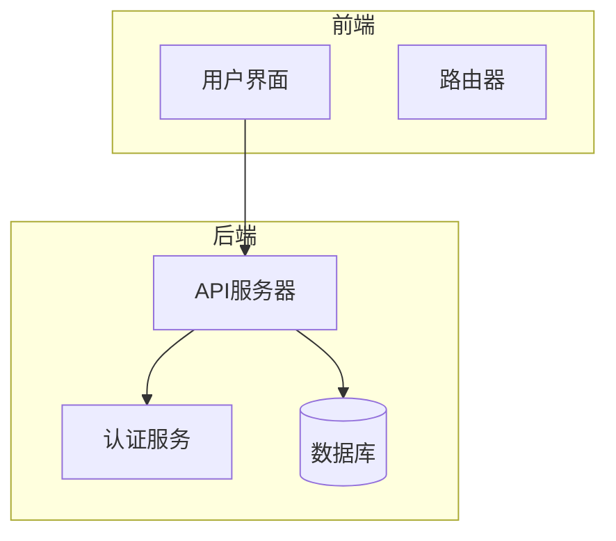
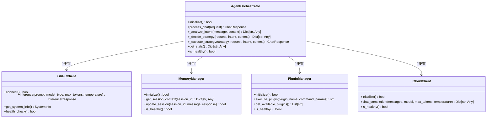
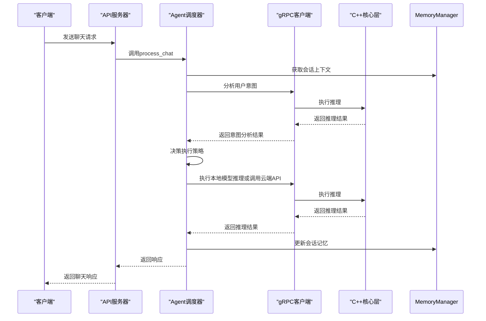
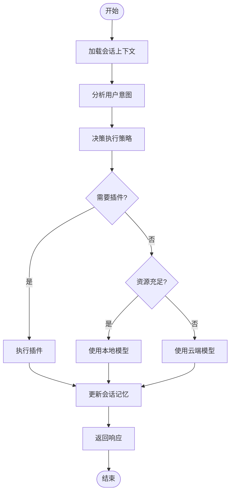
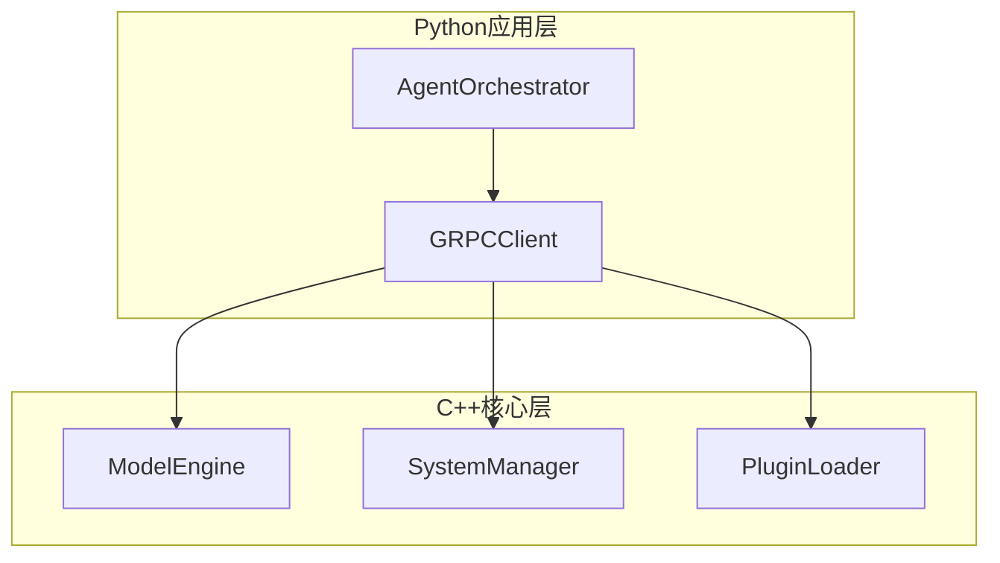

# 项目概述

<cite>
**本文档引用的文件**
- [README.md](file://README.md)
- [model_engine.hpp](file://cpp/include/model_engine.hpp)
- [plugin_loader.hpp](file://cpp/include/plugin_loader.hpp)
- [sys_manager.hpp](file://cpp/include/sys_manager.hpp)
- [orchestrator.py](file://python/agent/orchestrator.py)
- [main.py](file://python/main.py)
- [cli_client.py](file://cli_client.py)
- [plugin_base.py](file://python/sdk/plugin_base.py)
- [weather/main.py](file://python/plugins/weather/main.py)
</cite>

## 目录
1. [简介](#简介)
2. [项目结构](#项目结构)
3. [核心组件](#核心组件)
4. [架构概览](#架构概览)
5. [详细组件分析](#详细组件分析)
6. [依赖分析](#依赖分析)
7. [性能考量](#性能考量)
8. [故障排除指南](#故障排除指南)
9. [结论](#结论)

## 简介
Nex项目是一个基于C++与Python混合技术栈的智能助手系统，旨在通过微内核架构实现高性能AI服务。该项目支持本地小模型与云端大模型的智能路由、插件扩展系统以及会话记忆管理。目标用户包括AI应用开发者、系统架构师和插件开发者，他们可以利用该系统的灵活性和高效性来构建定制化的AI解决方案。

## 项目结构
Nex项目的目录结构清晰地划分了C++核心模块和Python应用层，确保了计算密集型任务由C++处理，而业务逻辑则由Python负责。这种分层设计不仅提高了性能，还增强了可维护性和扩展性。

```mermaid
flowchart LR
subgraph User[用户/应用]
A[CLI] --> |HTTP/WebSocket| B[FastAPI API]
W[Web UI] --> |HTTP| B
end
subgraph Python[Python 层]
B --> O[Agent Orchestrator]
O --> |调用| P[插件 SDK]
O --> |gRPC/Pybind11| CppCore
end
subgraph CppCore[C++ 核心层]
CppCore --> M[Model Engine (llama.cpp / vLLM)]
CppCore --> S[SysManager (CPU/MEM/IO)]
CppCore --> L[Plugin Loader (C++ 插件)]
end
```

**图表来源**
- [README.md](file://README.md)

**章节来源**
- [README.md](file://README.md)

## 核心组件
Nex项目的核心组件主要包括C++部分的模型推理引擎（ModelEngine）、系统资源管理器（SystemManager）和插件加载器（PluginLoader），以及Python部分的Agent调度器（AgentOrchestrator）。这些组件协同工作，实现了高效的AI服务。

**章节来源**
- [model_engine.hpp](file://cpp/include/model_engine.hpp)
- [sys_manager.hpp](file://cpp/include/sys_manager.hpp)
- [plugin_loader.hpp](file://cpp/include/plugin_loader.hpp)
- [orchestrator.py](file://python/agent/orchestrator.py)

## 架构概览
Nex项目采用微内核架构，将计算密集型任务交由C++核心层处理，而业务逻辑和API接口则由Python应用层管理。C++核心层通过gRPC与Python应用层通信，确保了跨语言调用的高效性。此外，系统支持本地小模型与云端大模型的智能路由，能够根据任务复杂度和系统资源自动选择最优执行策略。



**图表来源**
- [README.md](file://README.md)

**章节来源**
- [README.md](file://README.md)

## 详细组件分析
### Agent调度器分析
Agent调度器是Nex项目的核心逻辑组件，负责处理聊天请求、分析用户意图、决策执行策略并更新会话记忆。它通过gRPC客户端与C++核心层通信，获取系统资源信息，并根据任务特点选择最优执行路径。

#### 对于对象导向组件：


**图表来源**
- [orchestrator.py](file://python/agent/orchestrator.py)

#### 对于API/服务组件：


**图表来源**
- [orchestrator.py](file://python/agent/orchestrator.py)
- [main.py](file://python/main.py)

#### 对于复杂逻辑组件：


**图表来源**
- [orchestrator.py](file://python/agent/orchestrator.py)

**章节来源**
- [orchestrator.py](file://python/agent/orchestrator.py)

### 概念概述
Nex项目的设计理念是通过微内核架构实现高性能AI服务，同时保持高度的可扩展性和灵活性。系统支持本地小模型与云端大模型的智能路由，能够根据任务复杂度和系统资源自动选择最优执行策略。此外，插件扩展系统允许开发者轻松添加新功能，而会话记忆管理则确保了用户体验的一致性。

[无来源，因为本节不分析特定文件]

[无来源，因为本节不分析特定文件]

## 依赖分析
Nex项目的依赖关系主要体现在C++核心层与Python应用层之间的交互。C++核心层提供了模型推理、系统资源管理和插件加载等功能，而Python应用层通过gRPC客户端调用这些功能。此外，项目还依赖于外部库如Protobuf和gRPC，以实现高效的跨语言通信。



**图表来源**
- [README.md](file://README.md)

**章节来源**
- [README.md](file://README.md)

## 性能考量
Nex项目在性能方面进行了多项优化，包括使用C++处理计算密集型任务、通过gRPC实现高效的跨语言通信、以及利用缓存机制减少重复计算。此外，系统支持流式推理，能够在生成响应的同时逐步输出结果，从而提高用户体验。

[无来源，因为本节提供一般性指导]

## 故障排除指南
当遇到问题时，首先应检查服务是否正常运行。可以通过CLI客户端的`health`命令进行健康检查。如果服务异常，查看日志文件（如`logs/api_server.log`和`logs/grpc_server.log`）以定位问题。对于插件相关的问题，确保插件配置正确且已启用。

**章节来源**
- [cli_client.py](file://cli_client.py)
- [run_server.sh](file://scripts/run_server.sh)

## 结论
Nex项目通过结合C++与Python技术栈，实现了高性能AI服务。其微内核架构、智能路由、插件扩展系统和会话记忆管理为开发者提供了强大的工具集。无论是AI应用开发者、系统架构师还是插件开发者，都能从这一灵活且高效的平台中受益。

[无来源，因为本节总结而不分析特定文件]