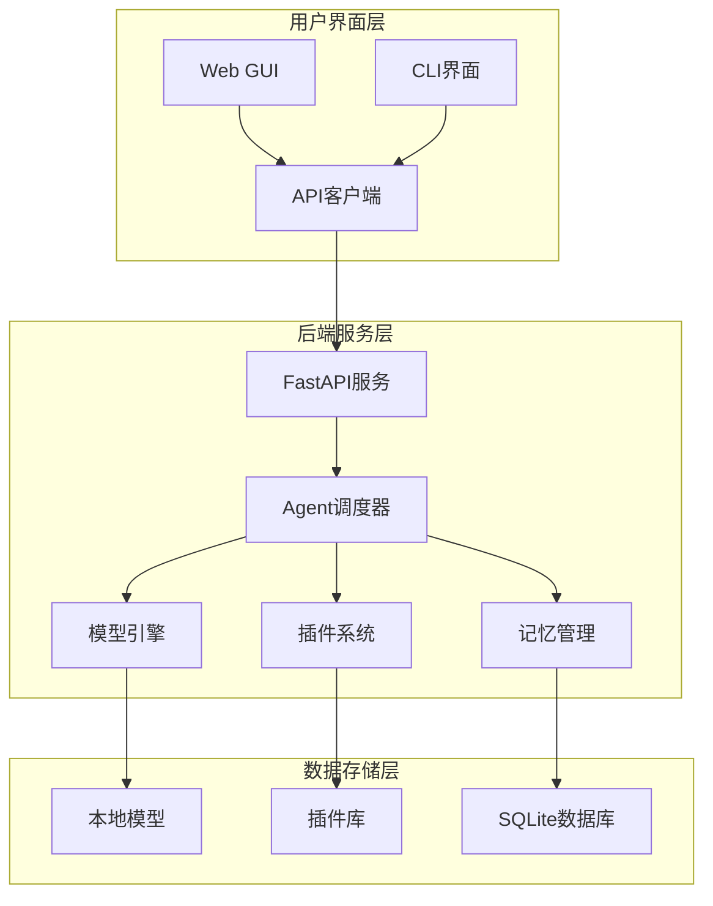

# AI Assistant 现代化UI系统

本文档描述了AI Assistant项目的现代化用户界面系统，包含CLI模式和GUI模式两种交互形式。

## 🎯 概述

AI Assistant现代化UI系统提供了两种使用方式：

1. **CLI模式** - 基于Rich/Textual的现代化终端界面，支持流式响应和丰富的可视化效果
2. **Web GUI模式** - 基于React + Vite的现代化Web界面，提供直观的图形化操作体验

## 🏗️ 系统架构



## 🚀 快速开始

### 环境要求

- Python 3.9+
- Node.js 16+
- npm/yarn

### 安装依赖

1. **Python依赖**
```bash
# 创建虚拟环境
python3 -m venv venv
source venv/bin/activate  # Linux/Mac
# venv\Scripts\activate   # Windows

# 安装依赖
pip install -r requirements.txt
```

2. **Web GUI依赖**
```bash
cd ui/web/ai-assistant-gui
npm install
```

### 启动服务

1. **启动后端服务**
```bash
python src/main.py
```

2. **启动Web GUI**
```bash
cd ui/web/ai-assistant-gui
npm run dev
```

3. **使用CLI界面**
```bash
python modern_cli.py
```

## 💻 CLI模式使用指南

### 基本命令

- `/help` - 显示帮助信息
- `/exit` - 退出程序
- `/status` - 查看系统状态
- `/plugins` - 查看插件列表
- `/chat <消息>` - 发送聊天消息
- `/stream <消息>` - 流式聊天
- `/bash <命令>` - 执行Bash命令

### 功能特性

#### 🎨 现代化界面
- 基于Rich库的丰富终端界面
- 支持深色/浅色主题
- 实时进度指示器
- 彩色输出和格式化显示

#### 💬 智能对话
- 支持流式响应显示
- 实时Token计数和性能统计
- 自动会话管理
- 上下文保持

#### ⚡ 流式响应
- 实时显示AI生成内容
- 动态进度条和统计信息
- 打字机效果
- 性能监控

### 使用示例

```bash
# 启动CLI
python modern_cli.py

# 基本对话
> 你好，今天天气怎么样？

# 流式对话
/stream 写一首关于春天的诗

# 系统状态
/status

# 执行系统命令
/bash ls -la
```

## 🌐 Web GUI使用指南

### 界面布局

Web GUI采用类似LM Studio的现代化布局设计：

- **侧边栏** - 导航菜单和快速操作
- **主内容区** - 功能页面显示
- **对话界面** - 实时聊天交互
- **系统监控** - 性能和状态监控
- **插件管理** - 插件安装和配置

### 主要功能

#### 📊 仪表板
- 系统状态概览
- 性能指标监控
- 快速操作入口
- 组件健康状态

#### 💬 对话界面
- 现代化聊天UI
- 流式响应支持
- 消息历史记录
- 多会话管理

#### 🔌 插件管理
- 插件列表展示
- 一键启用/禁用
- 插件详情查看
- 能力分类显示

#### 📈 系统监控
- 实时性能图表
- 资源使用统计
- 组件状态监控
- 历史趋势分析

### 访问地址

- Web界面: http://localhost:5173
- API文档: http://localhost:8000/docs
- 健康检查: http://localhost:8000/health

## 🛠️ 开发指南

### 目录结构

```
nex/
├── ui/                          # UI系统根目录
│   ├── cli/                     # CLI界面
│   │   ├── modern_cli.py       # 主控制器
│   │   ├── command_router.py   # 命令路由
│   │   ├── display_engine.py   # 显示引擎
│   │   ├── session_manager.py  # 会话管理
│   │   └── streaming_display.py # 流式显示
│   ├── web/                     # Web GUI
│   │   └── ai-assistant-gui/   # React应用
│   │       ├── src/
│   │       │   ├── components/ # UI组件
│   │       │   ├── pages/      # 页面组件
│   │       │   ├── stores/     # 状态管理
│   │       │   └── services/   # API服务
│   │       └── package.json
│   └── shared/                  # 共享模块
│       └── ai_client.py        # API客户端
├── src/                      # 后端服务
└── modern_cli.py               # CLI入口
```

### 扩展开发

#### 添加新CLI命令

1. 在`command_router.py`中创建新的命令类：
```python
class NewCommand(CommandBase):
    def __init__(self):
        super().__init__("new", "新命令描述")
    
    async def execute(self, args: List[str], cli_controller) -> CommandResult:
        # 命令实现
        return CommandResult(True, content="执行结果")
```

2. 注册命令到路由器

#### 添加新Web页面

1. 在`src/pages/`创建新页面组件
2. 在`App.tsx`中添加路由
3. 在`Sidebar.tsx`中添加导航菜单

### API集成

所有UI组件都通过统一的API客户端与后端通信：

```typescript
// 发送聊天消息
const response = await apiClient.sendMessage({
  message: "Hello",
  session_id: "session-123"
});

// 获取系统状态
const status = await apiClient.getSystemStatus();

// 管理插件
await apiClient.enablePlugin("weather");
```

## 🎨 设计规范

### 主题系统

- **深色模式** - 默认主题，适合开发环境
- **浅色模式** - 可选主题，适合办公环境
- **自适应** - 根据系统设置自动切换

### 颜色规范

- 主色调: `#1890ff` (蓝色)
- 成功色: `#52c41a` (绿色)
- 警告色: `#faad14` (橙色)
- 错误色: `#ff4d4f` (红色)

### 组件规范

- 使用Ant Design组件库
- 响应式布局设计
- 统一的图标使用
- 一致的间距和字体

## 🔧 配置选项

### CLI配置

```python
# ~/.ai_assistant_cli.json
{
  "theme": "dark",
  "show_timestamps": true,
  "stream_by_default": true,
  "max_width": 120
}
```

### Web GUI配置

通过界面设置或localStorage配置：
- API基础URL
- 主题偏好
- 侧边栏状态
- 通知设置

## 🚨 故障排除

### 常见问题

1. **CLI启动失败**
   - 检查Python虚拟环境是否激活
   - 确认Rich/Textual依赖已安装

2. **Web GUI无法访问**
   - 检查Node.js版本是否支持
   - 确认端口5173未被占用

3. **后端连接失败**
   - 检查后端服务是否启动
   - 确认端口8000可访问

### 调试模式

```bash
# CLI调试模式
python modern_cli.py --debug

# Web GUI开发模式
npm run dev
```

## 📝 更新日志

### v2.0.0 (2024-01-XX)
- ✨ 全新现代化CLI界面
- ✨ React + Vite Web GUI
- ✨ 流式响应支持
- ✨ 实时系统监控
- ✨ 插件管理界面
- 🔧 统一API客户端
- 🎨 现代化UI设计

## 📄 许可证

本项目采用MIT许可证，详见LICENSE文件。

## 🤝 贡献指南

欢迎提交Issue和Pull Request来改进这个项目！

1. Fork本仓库
2. 创建功能分支
3. 提交更改
4. 发起Pull Request

---

**AI Assistant现代化UI系统** - 让AI交互更加直观和高效！