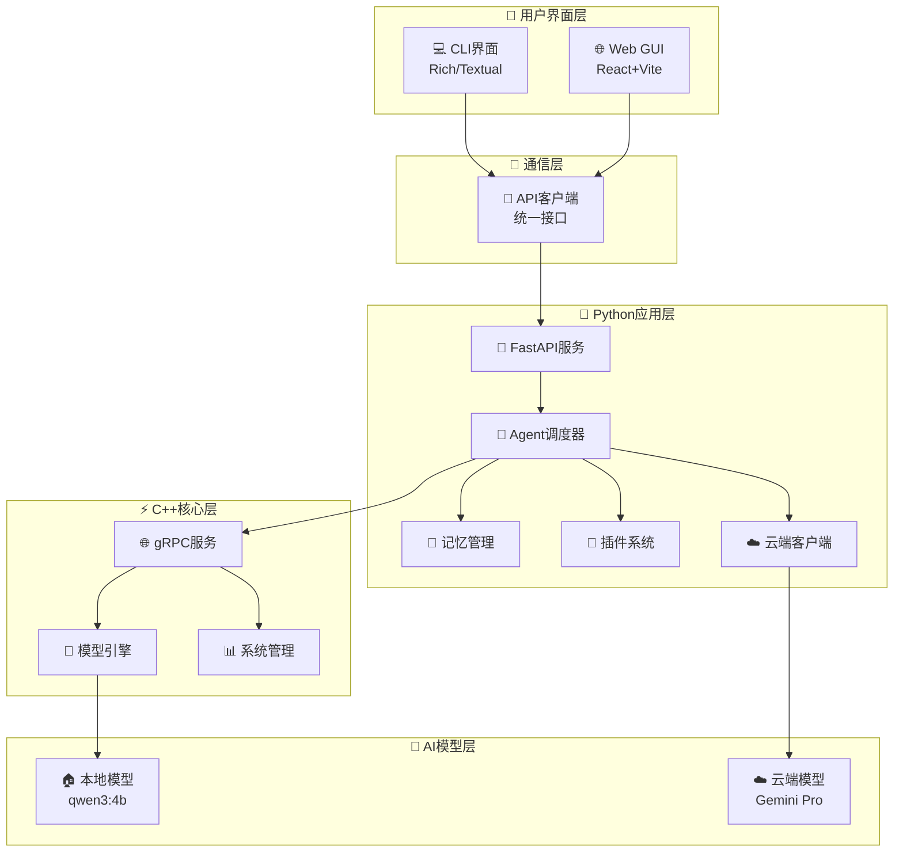
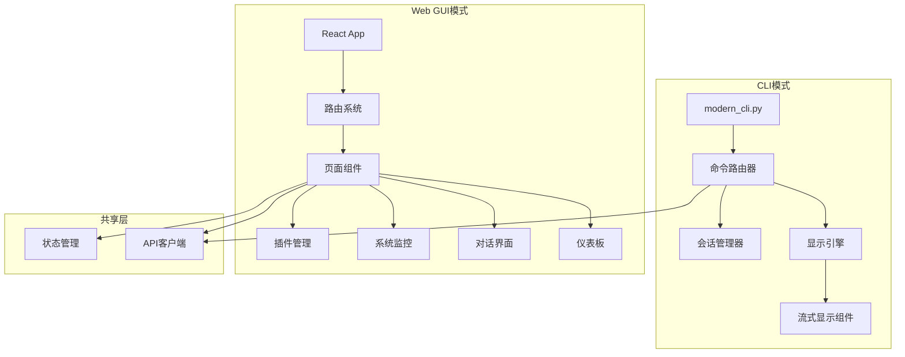

# 🤖 HuShell - 互协AI智能助手

<div align="center">
  
  <h3>HuShell: next ai assistant | 互协AI</h3>
  <p>现代化智能AI助手系统，重新定义人机协作体验</p>
</div>

[](https://python.org)
[](https://isocpp.org)
[](https://fastapi.tiangolo.com)
[](https://reactjs.org)
[](LICENSE)
[](https://github.com/JadeSnow7/assistant)

一个具有现代化用户界面的智能AI助手系统 **HuShell（互协AI）**，支持CLI和Web GUI两种交互模式。HuShell致力于重新定义人机协作体验，让AI助手真正成为您的智能工作伙伴。

## ✨ 特性概览

### 🖥️ CLI模式 (类似Claude Code)
- **Rich终端界面** - 基于Rich/Textual的现代化命令行体验
- **流式响应** - 实时显示AI生成内容，支持进度指示和性能统计
- **智能命令路由** - 支持聊天、系统管理、Shell命令等多种操作
- **会话管理** - 自动保存和恢复对话历史
- **多主题支持** - 深色/浅色主题切换

### 🌐 Web GUI模式 (类似LM Studio)
- **现代化界面** - React + TypeScript + Ant Design构建
- **响应式设计** - 支持桌面和移动设备
- **实时对话** - 支持流式聊天和消息历史管理
- **系统监控** - 实时性能图表和组件状态监控
- **插件管理** - 可视化插件安装、配置和管理
- **仪表板** - 系统概览和快速操作

### 🔧 技术特性
- **混合架构** - C++核心 + Python应用层
- **智能路由** - 本地模型与云端模型自动选择
- **插件系统** - 支持Python和C++插件开发
- **记忆管理** - 基于向量数据库的长期记忆
- **流式通信** - 支持WebSocket和SSE实时通信

## 🏗️ 系统架构

### 整体架构图



### UI架构设计



## 🚀 快速开始

### 环境要求
- Python 3.9+
- Node.js 16+
- npm/yarn

### 安装步骤

1. **克隆项目**
```bash
git clone https://github.com/JadeSnow7/assistant.git
cd assistant
```

2. **Python环境设置**
```bash
# 创建虚拟环境
python3 -m venv venv
source venv/bin/activate  # Linux/Mac
# venv\Scripts\activate   # Windows

# 安装依赖
pip install -r requirements.txt
```

3. **Web GUI设置**
```bash
cd ui/web/ai-assistant-gui
npm install
```

4. **配置环境**
```bash
cp .env.example .env
# 编辑.env文件，配置API密钥等
```

### 启动服务

1. **启动后端服务**
```bash
python hush.py
```

2. **启动Web GUI**
```bash
cd ui/web/ai-assistant-gui
npm run dev
```

3. **使用CLI界面**
```bash
python hush_cli.py
```

### 访问地址
- **Web界面**: http://localhost:5173
- **API文档**: http://localhost:8000/docs
- **健康检查**: http://localhost:8000/health

## 💻 使用指南

### CLI模式命令

```bash
# 基本命令
/help              # 显示帮助信息
/exit              # 退出程序
/status            # 查看系统状态
/plugins           # 查看插件列表

# 对话命令
/chat 你好         # 发送聊天消息
/stream 写一首诗   # 流式聊天

# 系统命令
/bash ls -la       # 执行Bash命令
/clear             # 清屏

# 直接输入消息（默认为流式聊天）
今天天气怎么样？
```

### Web GUI功能

#### 🏠 仪表板
- 系统状态概览
- 性能指标监控
- 快速操作入口
- 组件健康检查

#### 💬 对话界面
- 现代化聊天UI
- 流式响应支持
- 消息历史记录
- 多会话管理

#### 📊 系统监控
- 实时性能图表
- 资源使用统计
- 组件状态监控
- 历史趋势分析

#### 🔌 插件管理
- 插件列表展示
- 一键启用/禁用
- 插件详情查看
- 能力分类显示

## 📚 项目结构

```
ai-assistant/
├── ui/                          # UI系统根目录
│   ├── cli/                     # CLI界面
│   │   ├── modern_cli.py       # 主控制器
│   │   ├── command_router.py   # 命令路由
│   │   ├── display_engine.py   # 显示引擎
│   │   ├── session_manager.py  # 会话管理
│   │   └── streaming_display.py # 流式显示
│   ├── web/                     # Web GUI
│   │   └── ai-assistant-gui/   # React应用
│   │       ├── src/
│   │       │   ├── components/ # UI组件
│   │       │   ├── pages/      # 页面组件
│   │       │   ├── stores/     # 状态管理
│   │       │   └── services/   # API服务
│   │       └── package.json
│   └── shared/                  # 共享模块
│       └── ai_client.py        # API客户端
├── src/                      # 后端服务
│   ├── main.py                  # FastAPI入口
│   ├── agent/                   # Agent核心逻辑
│   ├── core/                    # 核心组件
│   └── plugins/                 # 插件目录
├── cpp/                         # C++核心模块
│   ├── include/                 # 头文件
│   └── CMakeLists.txt          # CMake构建文件
├── docs/                        # 文档
├── scripts/                     # 脚本工具
├── modern_cli.py               # CLI入口
├── demo.py                     # 演示脚本
├── MODERN_UI_GUIDE.md          # UI使用指南
└── README.md                   # 项目说明
```

## 🎨 技术栈

### 前端技术栈
- **React 18** - 现代化UI框架
- **TypeScript** - 类型安全的JavaScript
- **Vite** - 快速构建工具
- **Ant Design** - 企业级UI组件库
- **Zustand** - 轻量级状态管理
- **Recharts** - 数据可视化图表

### CLI技术栈
- **Rich** - 现代化终端输出
- **Textual** - 终端UI框架
- **asyncio** - 异步编程支持
- **aiohttp** - 异步HTTP客户端

### 后端技术栈
- **FastAPI** - 现代化Web框架
- **Python 3.9+** - 应用层开发语言
- **C++17** - 高性能核心模块
- **SQLite** - 轻量级数据库
- **WebSocket** - 实时通信

## 🔧 开发指南

### 添加新CLI命令

1. 在`ui/cli/command_router.py`中创建命令类：
```python
class NewCommand(CommandBase):
    def __init__(self):
        super().__init__("new", "新命令描述")
    
    async def execute(self, args: List[str], cli_controller) -> CommandResult:
        # 命令实现
        return CommandResult(True, content="执行结果")
```

2. 在`CommandRouter`中注册命令

### 添加新Web页面

1. 在`ui/web/ai-assistant-gui/src/pages/`创建页面组件
2. 在`App.tsx`中添加路由配置
3. 在`Sidebar.tsx`中添加导航菜单

### API集成

所有UI组件通过统一的API客户端与后端通信：

```typescript
// 发送聊天消息
const response = await apiClient.sendMessage({
  message: "Hello",
  session_id: "session-123"
});

// 获取系统状态
const status = await apiClient.getSystemStatus();
```

## 📖 使用示例

### CLI模式演示

```bash
# 启动现代化CLI
python hush_cli.py

# 系统会显示欢迎界面
╭─────────────────── AI Assistant CLI v2.0.0 ────────────────────╮
│                                                                │
│                🤖 AI Assistant CLI v2.0.0                      │
│                    智能助手终端界面                              │
│                                                                │
│              输入 /help 查看命令帮助，/exit 退出程序              │
│                                                                │
╰────────────────────────────────────────────────────────────────╯

# 进行对话
[abc12345] > 你好，请介绍一下你自己

# 系统显示实时流式响应
╭─────────────────── 实时响应 ────────────────────╮
│                                                │
│  [用户] 你好，请介绍一下你自己                    │
│                                                │
│  [AI] 🎭 正在创作中...                           │
│                                                │
│  你好！我是AI助手，█                             │
│                                                │
│  ┌─ 响应状态 ─────────────────────┐              │
│  │ 📊 进度: ████████░░ 80%        │              │
│  │ 🔄 模型: qwen3:4b (本地)        │              │
│  │ ⏱️ 已用时: 1.2s                │              │
│  │ 🔢 Token: 145/2048             │              │
│  └───────────────────────────────┘              │
│                                                │
╰────────────────────────────────────────────────╯
```

### Web GUI演示

访问 http://localhost:5173 查看现代化Web界面：

- **仪表板** - 显示系统概览和快速操作
- **对话页面** - 与AI进行实时聊天
- **监控页面** - 查看系统性能和状态
- **插件页面** - 管理和配置插件

## 🎯 演示脚本

运行演示脚本查看完整功能展示：

```bash
python demo.py
```

## 🤝 贡献指南

欢迎提交Issue和Pull Request！

1. Fork本仓库
2. 创建功能分支 (`git checkout -b feature/amazing-feature`)
3. 提交更改 (`git commit -m 'Add some amazing feature'`)
4. 推送到分支 (`git push origin feature/amazing-feature`)
5. 发起Pull Request

## 📄 许可证

本项目采用MIT许可证 - 查看 [LICENSE](LICENSE) 文件了解详情。

## 🙏 致谢

- [Rich](https://github.com/Textualize/rich) - 现代化终端输出
- [Ant Design](https://ant.design/) - 企业级UI组件
- [FastAPI](https://fastapi.tiangolo.com/) - 现代化Web框架
- [React](https://reactjs.org/) - 用户界面构建

---

**HuShell现代化智能助手系统** - 让AI交互更加直观和高效！🚀