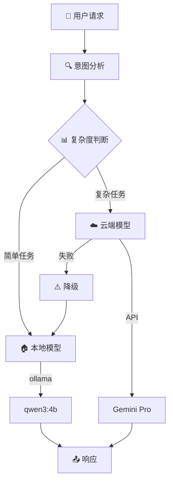

# AI Assistant - 智能助手项目

[](https://python.org)
[](https://isocpp.org)
[](https://fastapi.tiangolo.com)
[](LICENSE)
[]()

## 📖 项目概述

基于**C++与Python混合架构**的智能AI助手，实现本地模型与云端大模型的智能路由，支持插件扩展、记忆管理和多模态交互。

### 🎯 核心特性
- 🧠 **智能路由**: 简单任务本地处理（qwen3:4b），复杂任务云端处理（Gemini Pro）
- 🔄 **混合架构**: C++高性能核心 + Python灵活应用层  
- 🔌 **插件生态**: 支持Python/C++双语言插件开发
- 💾 **记忆系统**: 持久化会话状态和上下文管理
- ⚡ **高性能**: 异步处理，支持并发请求
- 🌐 **多接口**: REST API、WebSocket、CLI客户端

## 🏗️ 技术架构

### 🔄 智能路由策略



### 🛠️ 系统架构

```mermaid
flowchart TB
    subgraph "📱 用户层"
        CLI[💻CLI客户端]
        WEB[🌐Web UI]
        API[🔌API调用]
    end
    
    subgraph "🐍 Python 应用层"
        FASTAPI[🚀FastAPI 服务]
        AGENT[🤖 Agent调度器]
        MEMORY[💾 记忆管理]
        PLUGINS[🔌 插件系统]
        CLOUD[☁️ 云端客户端]
    end
    
    subgraph "⚡ C++ 核心层"
        GRPC[🌐 gRPC服务]
        MODEL[🧠 模型引擎]
        SYS[📊 系统管理]
    end
    
    subgraph "🤖 AI模型层"
        LOCAL[🏠 本地模型<br/>qwen3:4b]
        GEMINI[☁️ 云端模型<br/>Gemini Pro]
    end
    
    CLI --> FASTAPI
    WEB --> FASTAPI
    API --> FASTAPI
    
    FASTAPI --> AGENT
    AGENT --> MEMORY
    AGENT --> PLUGINS
    AGENT --> CLOUD
    AGENT --> GRPC
    
    GRPC --> MODEL
    GRPC --> SYS
    
    MODEL --> LOCAL
    CLOUD --> GEMINI

## 项目结构
ai-assistant/
├── cpp/                         # C++ 核心模块
│   ├── CMakeLists.txt           # CMake 构建文件
│   ├── include/                 # C++ 头文件
│   │   ├── model_engine.hpp     # 模型推理接口封装
│   │   ├── sys_manager.hpp      # 系统资源管理接口
│   │   └── plugin_loader.hpp    # 插件管理
│   ├── src/
│   │   ├── model_engine.cpp     # llama.cpp/vLLM 调用封装
│   │   ├── sys_manager.cpp      # CPU/MEM/磁盘调用
│   │   ├── plugin_loader.cpp    # 动态库插件加载
│   │   └── main.cpp             # gRPC/REST 服务入口
│   └── tests/                   # C++ 单元测试
│
├── python/                      # Python 部分
│   ├── main.py                  # FastAPI 入口
│   ├── agent/                   # Agent 核心逻辑
│   │   ├── orchestrator.py      # 调度器
│   │   ├── api_router.py        # API 路由
│   │   └── security.py          # 权限管理
│   ├── plugins/                 # Python 插件目录
│   │   ├── weather/
│   │   │   ├── plugin.json
│   │   │   └── main.py
│   │   └── music/
│   │       ├── plugin.json
│   │       └── main.py
│   ├── sdk/                     # 插件 SDK
│   │   ├── plugin_base.py
│   │   └── client.py
│   └── tests/                   # Python 单元测试
│
├── docs/                        # 文档
│   ├── api_spec.md              # 接口文档
│   └── architecture.md          # 架构设计
│
├── scripts/                     # 部署 & 工具
│   ├── build.sh                 # 构建脚本
│   ├── run_server.sh            # 启动服务
│   └── install_deps.sh          # 安装依赖
│
├── CMakeLists.txt               # 顶层 CMake
├── requirements.txt             # Python 依赖
└── README.md

```mermaid
flowchart LR
    subgraph User[用户/应用]
        A[CLI] -->|HTTP/WebSocket| B[FastAPI API]
        W[Web UI] -->|HTTP| B
    end

    subgraph Python[Python 层]
        B --> O[Agent Orchestrator]
        O -->|调用| P[插件 SDK]
        O -->|gRPC/Pybind11| CppCore
    end

    subgraph CppCore[C++ 核心层]
        CppCore --> M[Model Engine (llama.cpp / vLLM)]
        CppCore --> S[SysManager (CPU/MEM/IO)]
        CppCore --> L[Plugin Loader (C++ 插件)]
    end
```

## 核心特性

- 🧠 **混合推理**: 本地小模型 + 云端大模型智能选择
- 🔌 **插件生态**: Python/C++双语言插件支持
- 🌐 **联网搜索**: 集成搜索引擎API
- 💾 **记忆系统**: 持久化会话状态管理
- ⚡ **高性能**: C++核心 + Python业务逻辑
- 🖥️ **跨平台**: Linux/Windows/macOS支持

## 技术栈

### C++ 核心层
- **推理引擎**: llama.cpp / Ollama
- **系统管理**: 跨平台资源监控
- **插件接口**: 高性能C++插件加载
- **通信层**: gRPC服务端

### Python 应用层
- **Web框架**: FastAPI (异步支持)
- **Agent调度**: 智能任务编排
- **插件SDK**: 开发者友好接口
- **API网关**: RESTful + WebSocket

## 快速开始

```bash
# 安装依赖
./scripts/install_deps.sh

# 构建项目
./scripts/build.sh

# 启动服务
./scripts/run_server.sh
```

## 架构优势

1. **性能与效率平衡**: C++处理计算密集任务，Python处理业务逻辑
2. **模块化设计**: 清晰的分层架构，易于维护和扩展
3. **插件生态**: 支持社区开发者贡献插件
4. **智能调度**: 根据任务特点选择最优执行策略

## 项目状态

🚧 **开发中** - 欢迎贡献代码和建议