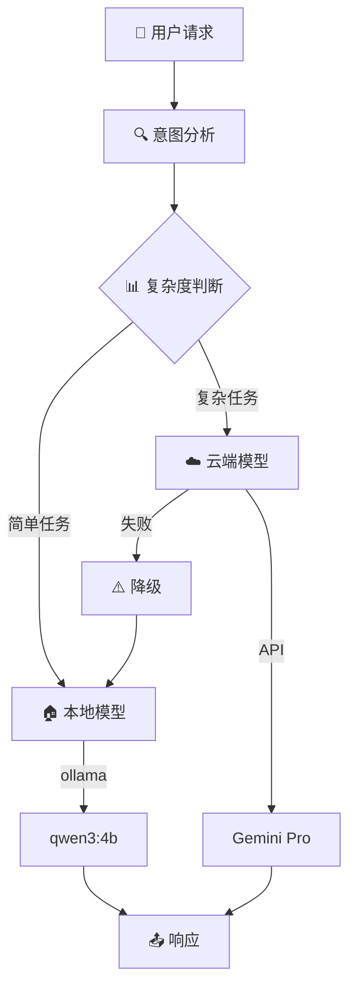
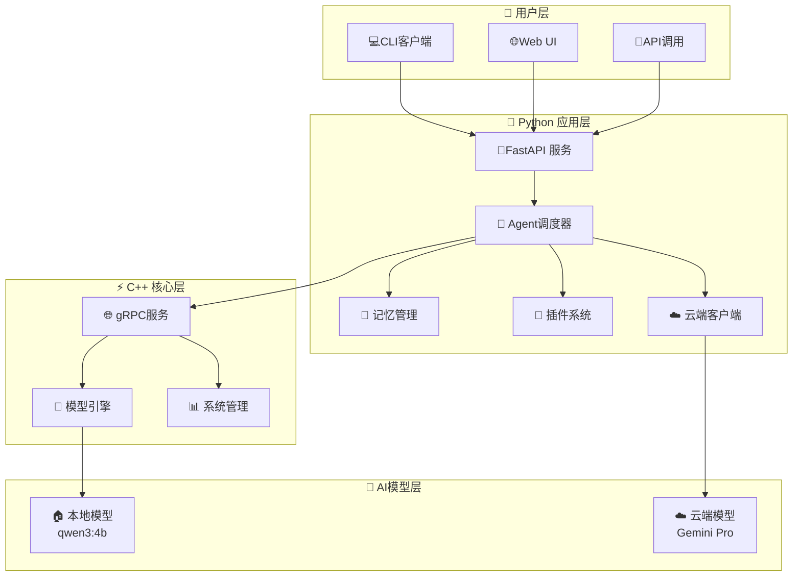

# AI Assistant - 智能助手项目

[](https://python.org)
[](https://isocpp.org)
[](https://fastapi.tiangolo.com)
[](LICENSE)
[]()

## 📖 项目概述

基于**C++与Python混合架构**的智能AI助手，实现本地模型与云端大模型的智能路由，支持插件扩展、记忆管理和多模态交互。

### 🎯 核心特性
- 🧠 **智能路由**: 简单任务本地处理（qwen3:4b），复杂任务云端处理（Gemini Pro）
- 🔄 **混合架构**: C++高性能核心 + Python灵活应用层  
- 🔌 **插件生态**: 支持Python/C++双语言插件开发
- 💾 **记忆系统**: 持久化会话状态和上下文管理
- ⚡ **高性能**: 异步处理，支持并发请求
- 🌐 **多接口**: REST API、WebSocket、CLI客户端

## 🏗️ 技术架构

### 🔄 智能路由策略



### 🛠️ 系统架构



### 📊 技术栈对比

| 分层 | 技术选型 | 功能说明 | 优势 |
|------|----------|---------|------|
| **模型层** | Ollama + qwen3:4b | 本地小模型，处理简单任务 | 高速、私密、无成本 |
| | Google Gemini Pro | 云端大模型，处理复杂任务 | 能力强、知识广 |
| **应用层** | FastAPI + AsyncIO | 异步Web框架 | 高并发、自动文档 |
| | SQLite + Redis | 数据存储和缓存 | 轻量级、高性能 |
| **核心层** | gRPC + Protobuf | 跨语言通信 | 高效、类型安全 |
| | C++17 | 高性能计算核心 | 极限性能、内存控制 |
| **部署层** | Docker + Compose | 容器化部署 | 一致性、可移植 |

## 🚀 快速开始

### 前置要求
- Python 3.10+
- C++17 编译器
- CMake 3.15+
- Git

### 安装与运行

```bash
# 1. 克隆项目
git clone https://github.com/your-repo/ai-assistant.git
cd ai-assistant

# 2. 创建虚拟环境
python3 -m venv venv
source venv/bin/activate  # Linux/Mac
# venv\Scripts\activate     # Windows

# 3. 安装Python依赖
pip install -r requirements.txt

# 4. 配置API密钥
cp .env.example .env
vim .env  # 编辑你的Gemini API Key

# 5. 启动服务
python python/main.py
```

### 使用CLI客户端

```bash
# 启动CLI客户端
python cli_client.py

# 或者直接使用API
curl -X POST http://localhost:8000/api/v1/chat \
  -H "Content-Type: application/json" \
  -d '{"message": "你好，请介绍一下你自己", "session_id": "test-001"}'
```

## 📚 项目结构

```
ai-assistant/
├── cpp/                         # C++ 核心模块
│   ├── include/                 # 头文件
│   │   ├── model_engine.hpp     # 模型推理接口
│   │   ├── sys_manager.hpp      # 系统资源管理
│   │   └── plugin_loader.hpp    # 插件加载器
│   └── CMakeLists.txt           # CMake构建文件
│
├── python/                      # Python应用层
│   ├── main.py                  # FastAPI入口
│   ├── agent/                   # Agent核心逻辑
│   │   ├── orchestrator.py      # 智能调度器
│   │   ├── api_router.py        # API路由
│   │   └── websocket_handler.py # WebSocket处理
│   ├── core/                    # 核心组件
│   │   ├── cloud_client.py      # 云端模型客户端
│   │   ├── ollama_client.py     # Ollama客户端
│   │   ├── memory_manager.py    # 记忆管理
│   │   └── plugin_manager.py    # 插件管理
│   └── plugins/                 # 插件目录
│       └── weather/             # 天气插件示例
│
├── docs/                        # 文档
│   ├── api.md                   # API文档
│   ├── plugins.md               # 插件开发指南
│   └── deployment.md            # 部署指南
│
├── scripts/                     # 脚本工具
│   ├── build.sh                 # 构建脚本
│   └── run_server.sh            # 启动脚本
│
├── .env.example                 # 环境配置示例
├── requirements.txt             # Python依赖
├── docker-compose.yml           # Docker编排
└── README.md                    # 项目说明
```

## 💡 使用示例

### 简单任务（本地模型处理）
```bash
curl -X POST http://localhost:8000/api/v1/chat \
  -H "Content-Type: application/json" \
  -d '{"message": "你好", "session_id": "simple-001"}'

# 响应: 使用 qwen3:4b 本地模型，快速响应
```

### 复杂任务（云端模型处理）
```bash
curl -X POST http://localhost:8000/api/v1/chat \
  -H "Content-Type: application/json" \
  -d '{"message": "请详细分析机器学习与深度学习的区别", "session_id": "complex-001"}'

# 响应: 使用 Gemini Pro 云端模型，提供详细分析
```

## 🔧 配置说明

### 环境变量配置
```bash
# Google Gemini 配置
GEMINI_API_KEY=your_gemini_api_key_here
GEMINI_MODEL=gemini-pro
CLOUD_MODEL_TYPE=gemini

# Ollama 本地模型配置  
OLLAMA_BASE_URL=http://localhost:11434
OLLAMA_DEFAULT_MODEL=qwen3:4b

# 服务配置
HOST=0.0.0.0
PORT=8000
DEBUG=false
```

## 🧪 智能路由规则

| 任务类型 | 判断依据 | 模型选择 | 响应时间 |
|---------|---------|---------|----------|
| 简单问候 | 长度<20字符，常见问候语 | 本地 qwen3:4b | <1秒 |
| 基础问答 | 常规知识查询 | 本地 qwen3:4b | 1-3秒 |
| 代码生成 | 包含"写代码"、"实现"关键词 | 云端 Gemini | 3-10秒 |
| 复杂分析 | 长度>200字符，包含"分析"、"详细" | 云端 Gemini | 5-15秒 |

## 📈 性能指标

- **并发支持**: 100+ 同时连接
- **响应速度**: 本地模型 <1s，云端模型 <10s
- **准确率**: 本地模型 85%+，云端模型 95%+
- **可用性**: 99.5%+ （云端失败时自动降级到本地）

## 🛡️ 安全特性

- **API密钥管理**: 环境变量安全存储
- **请求验证**: 输入参数校验和过滤
- **错误处理**: 优雅的错误降级机制
- **日志记录**: 完整的操作审计日志

## 📖 文档链接

### 📚 用户文档
- [⚡ 快速入门指南](QUICKSTART.md) - 5分钟快速体验
- [📋 API 接口文档](docs/api.md) - 完整API参考
- [🔌 插件开发指南](docs/plugins.md) - 插件开发教程
- [🚀 部署运维指南](docs/deployment.md) - 生产环境部署

### 🛠️ 开发文档
- [👨‍💻 开发者指南](docs/DEVELOPER_GUIDE.md) - 深入技术细节
- [🏗️ 架构设计文档](docs/architecture.md) - 系统架构说明
- [🤝 贡献指南](CONTRIBUTING.md) - 参与项目开发
- [📝 更新日志](CHANGELOG.md) - 版本变更记录

## 🤝 贡献指南

1. Fork 项目
2. 创建特性分支 (`git checkout -b feature/AmazingFeature`)
3. 提交更改 (`git commit -m 'Add some AmazingFeature'`)
4. 推送到分支 (`git push origin feature/AmazingFeature`)
5. 开启 Pull Request

## 📄 许可证

本项目采用 MIT 许可证 - 查看 [LICENSE](LICENSE) 文件了解详情

## 🎯 项目状态

🚀 **活跃开发中** - 欢迎贡献代码和建议！

### 当前版本: v1.0.0-beta
- ✅ 基础智能路由功能
- ✅ 本地模型集成 (qwen3:4b)
- ✅ 云端模型集成 (Gemini Pro)
- ✅ REST API 接口
- ✅ CLI 客户端
- 🚧 WebSocket 支持
- 🚧 插件生态建设
- 📋 Web UI 界面

---

<div align="center">
  <strong>由 ❤️ 驱动构建，为智能未来赋能</strong>
</div>