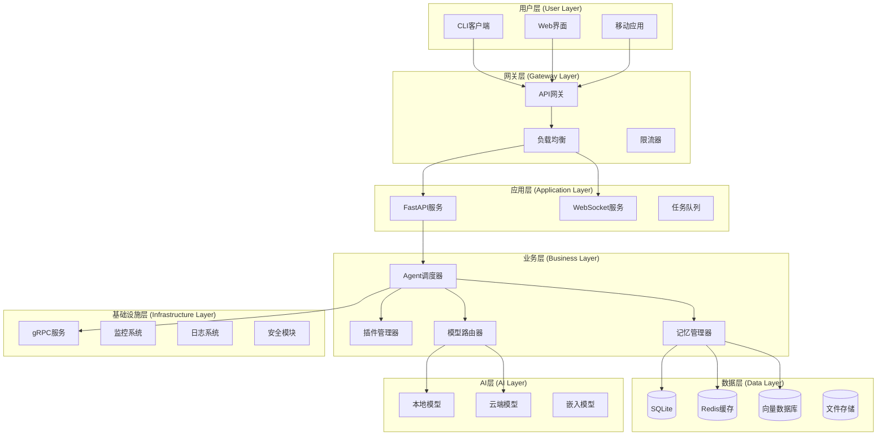
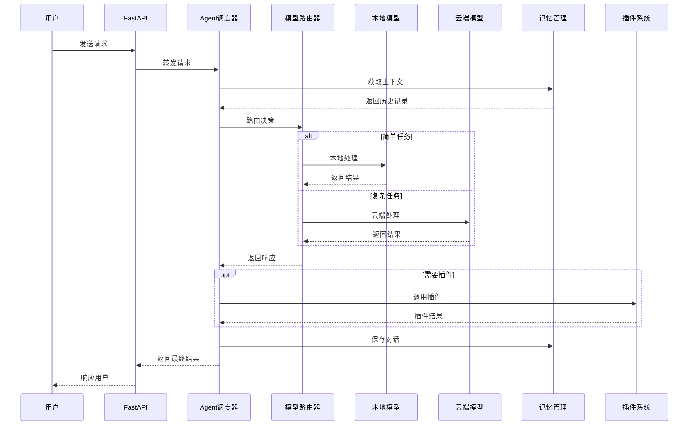

# 开发者指南

## 概述

本文档面向想要深入了解 AI Assistant 技术实现的开发者，提供架构细节、最佳实践和扩展指导。

## 🏗️ 技术架构深度解析

### 1. 混合架构设计



### 2. 数据流设计



## 🧠 核心模块深度解析

### 1. Agent 调度器 (Orchestrator)

**职责**: 协调各个组件，实现智能决策和任务分发。

```python
# python/agent/orchestrator.py
class AgentOrchestrator:
    """智能Agent调度器"""
    
    def __init__(self):
        self.model_router = ModelRouter()
        self.memory_manager = MemoryManager()
        self.plugin_manager = PluginManager()
        self.task_analyzer = TaskAnalyzer()
    
    async def process_request(self, request: ChatRequest) -> ChatResponse:
        """处理用户请求的主流程"""
        
        # 1. 上下文获取
        context = await self.memory_manager.get_context(request.session_id)
        
        # 2. 任务分析
        task_info = self.task_analyzer.analyze(request.message, context)
        
        # 3. 路由决策
        routing_decision = self.model_router.decide_route(task_info)
        
        # 4. 模型调用
        response = await self._call_model(routing_decision, request, context)
        
        # 5. 插件增强
        if task_info.needs_plugins:
            response = await self._enhance_with_plugins(response, task_info)
        
        # 6. 记忆保存
        await self.memory_manager.save_interaction(
            request.session_id, request.message, response.content
        )
        
        return response
```

**关键算法**:

```python
class TaskAnalyzer:
    """任务复杂度分析器"""
    
    def analyze(self, message: str, context: dict) -> TaskInfo:
        complexity_score = self._calculate_complexity(message)
        task_type = self._classify_task(message)
        required_capabilities = self._analyze_capabilities(message)
        
        return TaskInfo(
            complexity=complexity_score,
            task_type=task_type,
            capabilities=required_capabilities,
            estimated_tokens=self._estimate_tokens(message),
            priority=self._calculate_priority(context)
        )
    
    def _calculate_complexity(self, message: str) -> float:
        """计算任务复杂度分数 (0.0-1.0)"""
        factors = {
            'length': min(len(message) / 500, 1.0) * 0.3,
            'keywords': self._count_complex_keywords(message) * 0.4,
            'structure': self._analyze_structure(message) * 0.3
        }
        return sum(factors.values())
```

### 2. 智能路由器 (Model Router)

**职责**: 根据任务特征选择最适合的模型。

```python
class ModelRouter:
    """智能模型路由器"""
    
    def __init__(self):
        self.local_client = OllamaClient()
        self.cloud_client = CloudClient()
        self.performance_monitor = PerformanceMonitor()
    
    def decide_route(self, task_info: TaskInfo) -> RoutingDecision:
        """路由决策算法"""
        
        # 1. 基于复杂度的初步决策
        if task_info.complexity < 0.3:
            preferred_route = "local"
        elif task_info.complexity > 0.7:
            preferred_route = "cloud"
        else:
            # 中等复杂度任务需要更细致的分析
            preferred_route = self._detailed_analysis(task_info)
        
        # 2. 检查服务可用性
        available_routes = self._check_availability()
        
        # 3. 考虑性能指标
        route_scores = self._calculate_route_scores(
            task_info, available_routes
        )
        
        # 4. 最终决策
        final_route = max(route_scores.items(), key=lambda x: x[1])[0]
        
        return RoutingDecision(
            route=final_route,
            confidence=route_scores[final_route],
            fallback=self._get_fallback_route(final_route),
            reasoning=self._explain_decision(task_info, route_scores)
        )
    
    def _calculate_route_scores(self, task_info: TaskInfo, available_routes: list) -> dict:
        """计算各路由的综合得分"""
        scores = {}
        
        for route in available_routes:
            performance = self.performance_monitor.get_metrics(route)
            
            # 性能分数
            perf_score = (
                (1.0 - performance.avg_latency / 10000) * 0.4 +  # 延迟权重40%
                performance.success_rate * 0.3 +                 # 成功率权重30%
                (1.0 - performance.error_rate) * 0.3             # 错误率权重30%
            )
            
            # 适用性分数
            suitability_score = self._calculate_suitability(route, task_info)
            
            # 综合得分
            scores[route] = perf_score * 0.6 + suitability_score * 0.4
        
        return scores
```

### 3. 记忆管理系统

**设计思路**: 分层存储 + 智能检索

```python
class MemoryManager:
    """分层记忆管理系统"""
    
    def __init__(self):
        self.short_term = ShortTermMemory()    # Redis 缓存
        self.long_term = LongTermMemory()      # SQLite 持久化
        self.semantic = SemanticMemory()       # 向量数据库
        self.episodic = EpisodicMemory()       # 对话记录
    
    async def get_context(self, session_id: str, limit: int = 10) -> Context:
        """获取多层次上下文信息"""
        
        # 1. 短期记忆 (最近几轮对话)
        recent_messages = await self.short_term.get_recent(session_id, limit)
        
        # 2. 语义记忆 (相关知识)
        if recent_messages:
            query_embedding = await self._get_embedding(recent_messages[-1])
            semantic_context = await self.semantic.similarity_search(
                query_embedding, top_k=5
            )
        else:
            semantic_context = []
        
        # 3. 情节记忆 (重要历史对话)
        episodic_context = await self.episodic.get_important_episodes(
            session_id, limit=3
        )
        
        return Context(
            recent=recent_messages,
            semantic=semantic_context,
            episodic=episodic_context,
            user_profile=await self._get_user_profile(session_id)
        )
    
    async def save_interaction(self, session_id: str, user_msg: str, ai_msg: str):
        """保存交互到多层记忆"""
        
        interaction = Interaction(
            session_id=session_id,
            user_message=user_msg,
            ai_response=ai_msg,
            timestamp=datetime.utcnow(),
            importance=await self._calculate_importance(user_msg, ai_msg)
        )
        
        # 保存到各层记忆
        await asyncio.gather(
            self.short_term.add(interaction),
            self.long_term.save(interaction),
            self.semantic.index(interaction),
            self.episodic.process(interaction)
        )
```

## 🔌 插件系统架构

### 1. 插件生命周期管理

```python
class PluginManager:
    """插件生命周期管理"""
    
    def __init__(self):
        self.plugins: Dict[str, Plugin] = {}
        self.plugin_registry = PluginRegistry()
        self.sandbox = PluginSandbox()
    
    async def load_plugin(self, plugin_path: str) -> bool:
        """安全加载插件"""
        try:
            # 1. 安全检查
            if not await self._security_check(plugin_path):
                raise SecurityError("插件安全检查失败")
            
            # 2. 依赖检查
            dependencies = await self._check_dependencies(plugin_path)
            if not dependencies.satisfied:
                await self._install_dependencies(dependencies.missing)
            
            # 3. 沙箱加载
            plugin = await self.sandbox.load(plugin_path)
            
            # 4. 初始化
            await plugin.initialize()
            
            # 5. 注册
            self.plugins[plugin.name] = plugin
            self.plugin_registry.register(plugin)
            
            return True
            
        except Exception as e:
            logger.error(f"插件加载失败: {e}")
            return False
```

### 2. 插件沙箱安全机制

```python
class PluginSandbox:
    """插件安全沙箱"""
    
    def __init__(self):
        self.resource_limits = ResourceLimits(
            max_memory=100 * 1024 * 1024,  # 100MB
            max_cpu_time=30,               # 30秒
            max_file_size=10 * 1024 * 1024, # 10MB
            allowed_network=False          # 默认禁止网络访问
        )
    
    async def execute_plugin(self, plugin: Plugin, command: str, params: dict) -> dict:
        """在沙箱中执行插件"""
        
        # 创建隔离环境
        with self._create_namespace() as namespace:
            # 设置资源限制
            namespace.set_limits(self.resource_limits)
            
            # 执行插件
            result = await namespace.execute(
                plugin.execute, command, params
            )
            
            # 检查输出安全性
            if not self._validate_output(result):
                raise SecurityError("插件输出不安全")
            
            return result
```

## 🚀 性能优化策略

### 1. 异步并发优化

```python
class ConcurrencyManager:
    """并发管理器"""
    
    def __init__(self):
        self.semaphore = asyncio.Semaphore(100)  # 最大并发数
        self.rate_limiter = RateLimiter(requests_per_second=50)
        self.circuit_breaker = CircuitBreaker()
    
    async def execute_with_concurrency_control(self, coro):
        """带并发控制的执行"""
        async with self.semaphore:
            await self.rate_limiter.acquire()
            
            if self.circuit_breaker.is_open():
                raise ServiceUnavailableError("服务熔断中")
            
            try:
                result = await coro
                self.circuit_breaker.record_success()
                return result
            except Exception as e:
                self.circuit_breaker.record_failure()
                raise
```

### 2. 缓存策略

```python
class CacheManager:
    """多级缓存管理"""
    
    def __init__(self):
        self.l1_cache = LRUCache(maxsize=1000)      # 内存缓存
        self.l2_cache = RedisCache()                # Redis缓存
        self.l3_cache = DatabaseCache()             # 数据库缓存
    
    async def get(self, key: str) -> Any:
        """多级缓存获取"""
        # L1缓存
        if key in self.l1_cache:
            return self.l1_cache[key]
        
        # L2缓存
        value = await self.l2_cache.get(key)
        if value:
            self.l1_cache[key] = value
            return value
        
        # L3缓存
        value = await self.l3_cache.get(key)
        if value:
            await self.l2_cache.set(key, value, ttl=3600)
            self.l1_cache[key] = value
            return value
        
        return None
```

## 🛡️ 安全设计

### 1. API安全

```python
class SecurityMiddleware:
    """安全中间件"""
    
    async def __call__(self, request: Request, call_next):
        # 1. 输入验证
        await self._validate_input(request)
        
        # 2. 认证检查
        user = await self._authenticate(request)
        
        # 3. 授权检查
        await self._authorize(user, request)
        
        # 4. 限流检查
        await self._check_rate_limit(user, request)
        
        # 5. 执行请求
        response = await call_next(request)
        
        # 6. 输出过滤
        return await self._filter_output(response)
```

### 2. 数据加密

```python
class EncryptionManager:
    """加密管理器"""
    
    def __init__(self):
        self.key = self._load_encryption_key()
        self.cipher = Fernet(self.key)
    
    def encrypt_sensitive_data(self, data: str) -> str:
        """加密敏感数据"""
        return self.cipher.encrypt(data.encode()).decode()
    
    def decrypt_sensitive_data(self, encrypted_data: str) -> str:
        """解密敏感数据"""
        return self.cipher.decrypt(encrypted_data.encode()).decode()
```

## 📊 监控和调试

### 1. 性能监控

```python
class PerformanceMonitor:
    """性能监控系统"""
    
    def __init__(self):
        self.metrics = MetricsCollector()
        self.alerts = AlertManager()
    
    @contextmanager
    def monitor_request(self, request_id: str):
        """请求监控上下文"""
        start_time = time.time()
        
        try:
            yield
            # 记录成功指标
            self.metrics.record_success(request_id, time.time() - start_time)
        except Exception as e:
            # 记录失败指标
            self.metrics.record_error(request_id, str(e))
            
            # 检查是否需要告警
            if self._should_alert(e):
                self.alerts.send_alert(f"请求失败: {request_id}, 错误: {e}")
            
            raise
```

### 2. 分布式链路追踪

```python
class TracingManager:
    """链路追踪管理"""
    
    def __init__(self):
        self.tracer = opentracing.tracer
    
    def trace_request(self, operation_name: str):
        """请求链路追踪装饰器"""
        def decorator(func):
            @functools.wraps(func)
            async def wrapper(*args, **kwargs):
                with self.tracer.start_span(operation_name) as span:
                    span.set_tag("component", "ai-assistant")
                    try:
                        result = await func(*args, **kwargs)
                        span.set_tag("success", True)
                        return result
                    except Exception as e:
                        span.set_tag("success", False)
                        span.set_tag("error", str(e))
                        raise
            return wrapper
        return decorator
```

## 🧪 测试策略

### 1. 分层测试

```python
# 单元测试示例
class TestModelRouter:
    
    @pytest.mark.asyncio
    async def test_simple_task_routing(self):
        """测试简单任务路由到本地模型"""
        router = ModelRouter()
        task_info = TaskInfo(complexity=0.2, task_type="greeting")
        
        decision = router.decide_route(task_info)
        
        assert decision.route == "local"
        assert decision.confidence > 0.8
    
    @pytest.mark.asyncio 
    async def test_complex_task_routing(self):
        """测试复杂任务路由到云端模型"""
        router = ModelRouter()
        task_info = TaskInfo(complexity=0.9, task_type="analysis")
        
        decision = router.decide_route(task_info)
        
        assert decision.route == "cloud"
        assert decision.confidence > 0.8

# 集成测试示例
class TestAPIIntegration:
    
    @pytest.mark.asyncio
    async def test_end_to_end_chat(self):
        """端到端聊天测试"""
        async with httpx.AsyncClient() as client:
            response = await client.post(
                "http://localhost:8000/api/v1/chat",
                json={
                    "message": "你好",
                    "session_id": "test-session"
                }
            )
            
            assert response.status_code == 200
            data = response.json()
            assert "content" in data
            assert data["model_used"] == "local_small"
```

### 2. 压力测试

```python
class LoadTest:
    """负载测试"""
    
    async def test_concurrent_requests(self):
        """并发请求测试"""
        async def make_request(session, i):
            async with session.post(
                "http://localhost:8000/api/v1/chat",
                json={"message": f"测试消息 {i}", "session_id": f"session-{i}"}
            ) as response:
                return await response.json()
        
        async with aiohttp.ClientSession() as session:
            tasks = [make_request(session, i) for i in range(100)]
            results = await asyncio.gather(*tasks)
            
            # 验证所有请求都成功
            success_count = sum(1 for r in results if "content" in r)
            assert success_count >= 95  # 95%成功率
```

## 🔧 扩展开发

### 1. 自定义模型集成

```python
class CustomModelClient(BaseModelClient):
    """自定义模型客户端"""
    
    async def chat_completion(self, messages: List[dict], **kwargs) -> dict:
        """实现自定义模型的聊天接口"""
        # 1. 请求预处理
        formatted_request = self._format_request(messages, **kwargs)
        
        # 2. 调用模型API
        response = await self._call_model_api(formatted_request)
        
        # 3. 响应后处理
        return self._format_response(response)
    
    def _format_request(self, messages: List[dict], **kwargs) -> dict:
        """格式化请求以适配特定模型"""
        # 实现特定的请求格式转换
        pass
    
    async def _call_model_api(self, request: dict) -> dict:
        """调用具体的模型API"""
        # 实现具体的API调用逻辑
        pass
```

### 2. 自定义插件开发

参考完整的插件开发指南: [docs/plugins.md](docs/plugins.md)

---

## 💡 最佳实践

1. **错误处理**: 使用结构化错误处理，提供有意义的错误信息
2. **日志记录**: 关键操作都要有日志，便于问题排查
3. **配置管理**: 使用环境变量管理配置，支持不同环境
4. **文档维护**: 代码变更时同步更新文档
5. **测试覆盖**: 重要功能都要有测试用例
6. **安全意识**: 输入验证、权限检查、数据加密

## 🎯 性能指标

- **响应时间**: 简单任务 < 1s，复杂任务 < 10s
- **并发能力**: 支持100+并发连接
- **准确率**: 本地模型85%+，云端模型95%+
- **可用性**: 99.5%+ 服务可用性
- **吞吐量**: 1000+ 请求/分钟

---

这份开发者指南将持续更新，欢迎贡献更多技术细节和最佳实践！