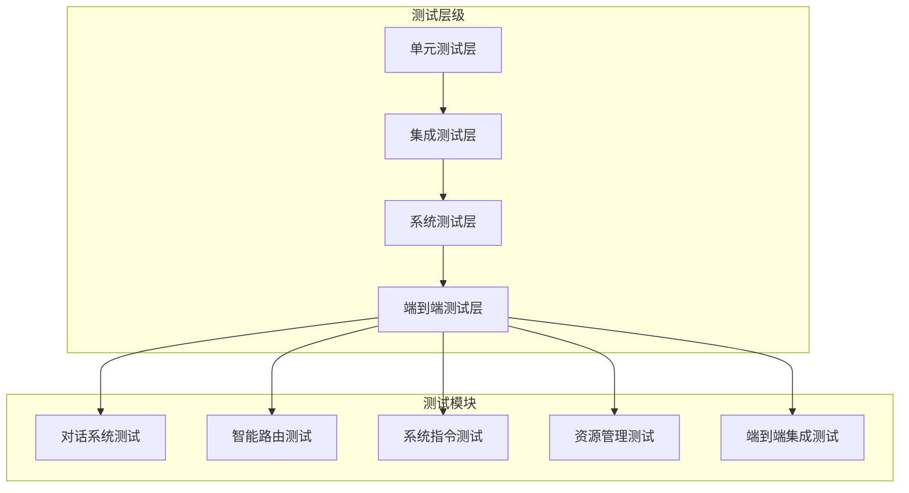

# AI助手功能测试与对话验证指南

## 概述

本指南详细介绍了AI助手项目的完整测试体系，包括功能测试、性能验证、安全检查等多个维度。测试框架基于Python异步编程实现，支持对话系统、智能路由、系统指令、资源管理等核心功能的全面验证。

## 测试架构

### 分层测试结构



### 核心测试套件

| 测试套件 | 文件位置 | 主要功能 | 优先级 |
|---------|---------|---------|--------|
| 对话系统测试 | `tests/unit/test_dialog_system.py` | 基础对话、复杂推理、上下文记忆、流式响应 | 高 |
| 智能路由测试 | `tests/unit/test_intelligent_routing.py` | 本地/云端模型选择、负载均衡 | 高 |
| 系统指令测试 | `tests/unit/test_system_commands.py` | 指令分类、权限验证、安全检查 | 高 |
| 资源管理测试 | `tests/unit/test_resource_management.py` | 系统监控、性能优化、资源分配 | 中 |
| 端到端集成测试 | `tests/e2e/test_integration_flows.py` | 完整业务流程验证 | 高 |

## 快速开始

### 环境准备

1. **确保服务运行**
```bash
# 启动AI助手服务
./scripts/run_server.sh

# 验证服务状态
curl http://localhost:8000/health
```

2. **安装测试依赖**
```bash
# 激活虚拟环境
source venv/bin/activate

# 安装依赖
pip install -r requirements.txt
pip install psutil  # 用于系统资源监控
```

### 基础测试执行

#### 使用测试脚本（推荐）

```bash
# 运行所有测试
./scripts/run_tests.sh

# 运行特定测试套件
./scripts/run_tests.sh dialog
./scripts/run_tests.sh routing commands
./scripts/run_tests.sh e2e

# 生成HTML报告
./scripts/run_tests.sh -f html all

# 跳过健康检查
./scripts/run_tests.sh -s dialog
```

#### 直接使用Python

```bash
# 运行自动化测试套件
cd tests
python test_runner.py

# 运行单个测试套件
python unit/test_dialog_system.py
python unit/test_intelligent_routing.py
python unit/test_system_commands.py
python unit/test_resource_management.py
python e2e/test_integration_flows.py
```

#### 运行现有的测试文件

```bash
# 核心功能测试
python test_core.py

# 简单对话测试
python test_chat_simple.py

# 云端集成测试
python test_cloud_integration.py
```

## 详细测试说明

### 1. 对话系统测试

**测试目标**: 验证AI助手的对话能力和智能响应

**主要测试场景**:
- **基础对话**: 问候、自我介绍、能力说明
- **复杂推理**: 复杂分析任务、技术设计问题
- **上下文记忆**: 多轮对话中的上下文保持
- **流式响应**: 实时流式输出功能
- **实时信息**: 天气查询、最新技术趋势

**执行方式**:
```bash
# 运行对话系统测试
python tests/unit/test_dialog_system.py

# 或使用脚本
./scripts/run_tests.sh dialog
```

**评估标准**:
- 响应时间: 简单对话 < 1s，复杂推理 < 10s
- 内容质量: 相关性 > 85%，完整性检查
- 上下文准确率: > 90%
- 流式响应流畅度评估

### 2. 智能路由测试

**测试目标**: 验证AI任务动态路由策略的正确性

**主要测试场景**:
- **复杂度识别**: 简单任务使用本地模型，复杂任务使用云端模型
- **负载均衡**: 高负载情况下的路由优化
- **插件路由**: 特定功能请求路由到相应插件
- **资源约束**: 资源受限时的路由决策

**执行方式**:
```bash
python tests/unit/test_intelligent_routing.py
./scripts/run_tests.sh routing
```

**评估标准**:
- 路由决策准确率: > 85%
- 响应时间优化效果
- 资源利用率平衡
- 决策推理过程清晰度

### 3. 系统指令测试

**测试目标**: 验证系统指令的安全执行和权限控制

**主要测试场景**:
- **安全级指令**: CPU监控、内存查询等安全操作
- **受限级指令**: 文件系统访问、网络检查等需确认操作
- **危险级指令**: 系统重启、服务控制等高风险操作
- **智能推荐**: 根据用户需求推荐合适的系统指令

**执行方式**:
```bash
python tests/unit/test_system_commands.py
./scripts/run_tests.sh commands
```

**评估标准**:
- 安全防护率: > 95%
- 权限控制正确性: 100%
- 推荐指令准确率: > 85%
- 恶意输入防护: > 90%

### 4. 资源管理测试

**测试目标**: 验证系统资源监控和性能优化功能

**主要测试场景**:
- **系统监控**: CPU、内存、磁盘、网络监控精度
- **性能优化**: 模型切换、缓存管理、并发处理
- **资源告警**: 阈值监控和告警机制
- **资源恢复**: 资源紧张时的恢复策略

**执行方式**:
```bash
python tests/unit/test_resource_management.py
./scripts/run_tests.sh resources
```

**评估标准**:
- 监控精度: CPU ±5%, 内存 ±2%
- 优化效果: 性能提升可量化
- 并发处理能力: 支持多用户同时访问
- 资源利用率优化

### 5. 端到端集成测试

**测试目标**: 验证完整业务流程的端到端功能

**主要测试场景**:
- **智能系统诊断流程**: 问题识别 → 系统检查 → 推荐方案 → 执行确认
- **信息查询与处理流程**: 查询请求 → 数据获取 → 分析处理 → 结果展示
- **复杂任务分解**: 任务理解 → 步骤分解 → 资源匹配 → 计划生成
- **多轮对话上下文**: 上下文保持 → 渐进式帮助 → 个性化响应

**执行方式**:
```bash
python tests/e2e/test_integration_flows.py
./scripts/run_tests.sh e2e
```

**评估标准**:
- 流程完整性: > 90%
- 用户体验质量: 友好性、实用性
- 错误恢复能力: 优雅处理异常
- 端到端响应时间: < 30s

## 测试报告分析

### 报告类型

1. **JSON格式报告**: 机器可读，便于集成和自动化分析
2. **HTML格式报告**: 人类友好，包含图表和详细统计

### 关键指标解读

| 指标类别 | 关键指标 | 良好标准 | 说明 |
|---------|---------|---------|------|
| **可靠性** | 测试通过率 | > 95% | 系统功能稳定性指标 |
| **性能** | 平均响应时间 | < 3s | 用户体验关键指标 |
| **安全** | 安全测试通过率 | 100% | 系统安全性保障 |
| **覆盖率** | 功能覆盖率 | > 80% | 测试完整性指标 |

### 质量评估等级

- **EXCELLENT** (优秀): 通过率 ≥ 95%，响应时间 ≤ 1s
- **GOOD** (良好): 通过率 ≥ 85%，响应时间 ≤ 3s  
- **FAIR** (合格): 通过率 ≥ 70%，响应时间 ≤ 5s
- **POOR** (较差): 通过率 < 70%，响应时间 > 5s

## 故障排除

### 常见问题及解决方案

#### 1. 服务连接失败

**症状**: 测试报告显示连接错误

**解决方案**:
```bash
# 检查服务状态
curl http://localhost:8000/health

# 重启服务
./scripts/run_server.sh

# 检查端口占用
netstat -tlnp | grep 8000
```

#### 2. 测试超时

**症状**: 测试执行时间过长或超时

**解决方案**:
- 检查云端API配置和网络连接
- 调整测试用例的超时设置
- 优化系统资源分配

#### 3. 权限错误

**症状**: 系统指令测试失败

**解决方案**:
```bash
# 检查文件权限
ls -la scripts/
chmod +x scripts/run_tests.sh

# 检查Python模块路径
export PYTHONPATH=$PYTHONPATH:$(pwd)/python
```

#### 4. 依赖缺失

**症状**: 导入模块失败

**解决方案**:
```bash
# 安装缺失依赖
pip install psutil aiohttp

# 检查虚拟环境
source venv/bin/activate
pip list
```

## 最佳实践

### 测试执行策略

1. **开发阶段**: 频繁运行单元测试，确保功能正确
2. **集成阶段**: 运行完整测试套件，验证模块协作
3. **发布前**: 执行端到端测试，确保用户体验
4. **生产监控**: 定期执行健康检查，监控系统状态

### 测试数据管理

1. **隔离性**: 使用独立的测试会话ID
2. **清理**: 测试完成后清理临时数据
3. **一致性**: 使用稳定的测试输入数据
4. **安全性**: 避免在测试中使用真实敏感数据

### 性能测试建议

1. **基线建立**: 记录系统基线性能指标
2. **负载模拟**: 模拟真实的用户负载场景
3. **瓶颈识别**: 使用性能分析工具定位瓶颈
4. **趋势监控**: 跟踪性能指标的长期趋势

## CI/CD集成

### GitHub Actions配置示例

```yaml
name: AI Assistant Tests

on:
  push:
    branches: [main, develop]
  pull_request:
    branches: [main]

jobs:
  test:
    runs-on: ubuntu-latest
    
    steps:
    - uses: actions/checkout@v3
    
    - name: Setup Python
      uses: actions/setup-python@v4
      with:
        python-version: '3.9'
    
    - name: Install Dependencies
      run: |
        python -m pip install --upgrade pip
        pip install -r requirements.txt
        pip install psutil
    
    - name: Start AI Assistant Service
      run: |
        ./scripts/run_server.sh &
        sleep 10
    
    - name: Run Tests
      run: |
        ./scripts/run_tests.sh -f json
    
    - name: Upload Test Reports
      uses: actions/upload-artifact@v3
      with:
        name: test-reports
        path: test_reports/
```

### 测试结果通知

配置测试结果通知到团队协作工具（如Slack、钉钉等），及时了解测试状态。

## 扩展和定制

### 添加新测试用例

1. **创建测试类**: 继承`BaseTestSuite`
2. **定义测试用例**: 使用`TestCase`数据结构
3. **实现测试逻辑**: 实现`run_test_case`方法
4. **注册到运行器**: 在`test_runner.py`中注册新套件

### 自定义测试指标

1. **扩展TestMetrics**: 添加新的指标字段
2. **实现指标收集**: 在测试执行过程中收集数据
3. **更新报告生成**: 在报告中展示新指标
4. **设置评估标准**: 定义新指标的评估标准

## 参考资料

- [项目架构文档](../README.md)
- [API参考文档](api.md)
- [插件开发指南](plugins.md)
- [部署运维指南](deployment.md)

---

📧 **技术支持**: 如有测试相关问题，请提交Issue或联系开发团队
🔄 **持续改进**: 测试体系将根据项目发展持续优化和扩展