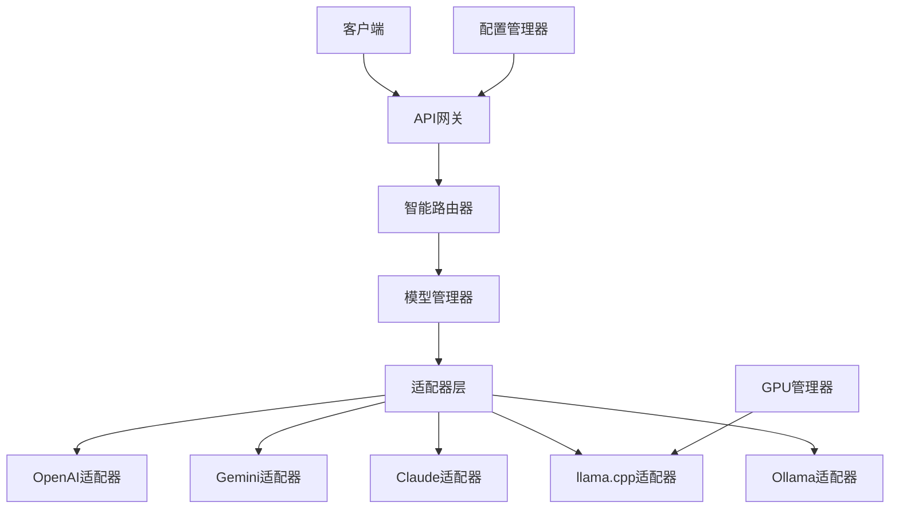

# 统一API接口系统使用指南

本文档介绍如何使用新开发的统一API接口系统，该系统支持多种AI模型提供商（OpenAI、Gemini、Claude）和本地模型（llama.cpp、Ollama），具备智能路由、GPU加速、动态配置等功能。

## 目录

1. [系统概述](#系统概述)
2. [快速开始](#快速开始)
3. [配置说明](#配置说明)
4. [API接口](#api接口)
5. [模型管理](#模型管理)
6. [智能路由](#智能路由)
7. [GPU加速](#gpu加速)
8. [性能监控](#性能监控)
9. [故障排除](#故障排除)

## 系统概述

### 架构特点

- **统一接口**: 兼容OpenAI API格式，支持多种模型提供商
- **智能路由**: 根据任务复杂度和模型能力自动选择最优模型
- **多引擎支持**: 云端模型（OpenAI、Gemini、Claude）+ 本地模型（llama.cpp、Ollama）
- **GPU加速**: 自动检测和配置GPU加速选项
- **动态配置**: 支持运行时配置更新和模型切换
- **性能监控**: 完整的性能统计和健康检查

### 核心组件



## 快速开始

### 1. 环境设置

```bash
# 安装依赖
pip install -r requirements.txt

# 设置环境变量（可选）
export OPENAI_API_KEY="your_openai_key"
export GEMINI_API_KEY="your_gemini_key" 
export CLAUDE_API_KEY="your_claude_key"
```

### 2. 配置文件

编辑 `configs/unified_api.yaml`：

```yaml
# API配置
api:
  host: "0.0.0.0"
  port: 8000

# 引擎配置
engines:
  # 启用本地模型
  llamacpp:
    enabled: true
    model_path: "./models"
    default_model: "qwen3:4b"
    gpu_layers: 35
  
  # 启用云端模型（需要API密钥）
  gemini:
    enabled: true
    api_key: "${GEMINI_API_KEY}"
    default_model: "gemini-1.5-pro"

# 路由策略
routing:
  strategy: "smart_route"  # 智能路由
  local_preference: 0.6    # 本地模型偏好
```

### 3. 启动服务

```bash
# 方式1: 直接启动
python python/core/unified_api_gateway.py

# 方式2: 使用演示脚本
python examples/unified_api_demo.py

# 方式3: 集成到现有系统
from core.unified_api_gateway import create_app
app = await create_app()
```

### 4. 基本使用

```python
import asyncio
from core.adapters import UnifiedChatRequest
from core.unified_api_gateway import UnifiedAPIGateway

async def chat_example():
    # 创建网关
    gateway = UnifiedAPIGateway()
    await gateway.initialize()
    
    # 创建请求
    request = UnifiedChatRequest(
        model="auto",  # 自动选择模型
        messages=[
            {"role": "user", "content": "你好，请介绍一下自己"}
        ],
        max_tokens=200,
        temperature=0.7
    )
    
    # 处理请求
    response = await gateway.handle_chat_completion(request)
    
    print(f"使用模型: {response.model} ({response.provider})")
    print(f"回复: {response.choices[0]['message']['content']}")
    
    await gateway.cleanup()

# 运行示例
asyncio.run(chat_example())
```

## 配置说明

### 引擎配置

#### OpenAI配置
```yaml
engines:
  openai:
    enabled: true
    endpoint: "https://api.openai.com/v1"
    api_key: "${OPENAI_API_KEY}"
    default_model: "gpt-3.5-turbo"
    rate_limit: 3000
    timeout: 60
```

#### Gemini配置
```yaml
engines:
  gemini:
    enabled: true
    api_key: "${GEMINI_API_KEY}"
    default_model: "gemini-1.5-pro"
    generation_config:
      temperature: 0.7
      top_p: 0.8
      top_k: 40
```

#### 本地模型配置
```yaml
engines:
  llamacpp:
    enabled: true
    model_path: "./models"
    default_model: "qwen3:4b"
    gpu_layers: 35  # GPU层数
    threads: 8      # CPU线程数
    context_length: 4096
    
  ollama:
    enabled: true
    endpoint: "http://localhost:11434"
    default_model: "qwen2.5:4b"
```

### GPU配置

```yaml
gpu:
  enabled: true
  auto_detect: true      # 自动检测GPU
  gpu_layers: 35         # 默认GPU层数
  main_gpu: 0            # 主GPU ID
  low_vram: false        # 低显存模式
  batch_size: 512        # 批处理大小
```

### 路由配置

```yaml
routing:
  strategy: "smart_route"     # 路由策略
  complexity_threshold: 0.7   # 复杂度阈值
  local_preference: 0.6       # 本地偏好权重
  cost_weight: 0.3           # 成本权重
  performance_weight: 0.4    # 性能权重
  fallback_strategy: "local_first"  # 备选策略
```

## API接口

### OpenAI兼容接口

#### 聊天完成
```http
POST /v1/chat/completions
Content-Type: application/json

{
  "model": "auto",
  "messages": [
    {"role": "user", "content": "Hello"}
  ],
  "max_tokens": 100,
  "temperature": 0.7,
  "stream": false,
  "provider": "auto"
}
```

#### 流式聊天
```http
POST /v1/chat/completions
Content-Type: application/json

{
  "model": "auto",
  "messages": [
    {"role": "user", "content": "写一首诗"}
  ],
  "stream": true
}
```

### 模型管理接口

#### 获取可用模型
```http
GET /v1/models

Response:
{
  "object": "list",
  "data": [
    {
      "id": "qwen3:4b",
      "provider": "llamacpp",
      "engine": "local",
      "capabilities": ["chat", "completion"],
      "context_length": 4096,
      "status": "available"
    },
    {
      "id": "gemini-1.5-pro",
      "provider": "gemini", 
      "engine": "cloud",
      "context_length": 2097152,
      "status": "available"
    }
  ]
}
```

#### 检查模型健康状态
```http
GET /v1/models/{model_id}/health

Response:
{
  "status": "healthy",
  "provider": "gemini",
  "last_check": "2024-01-01T12:00:00Z"
}
```

### 系统监控接口

#### 引擎状态
```http
GET /v1/engines/status

Response:
{
  "engines": {
    "llamacpp": {
      "status": "running",
      "models_loaded": ["qwen3:4b"],
      "memory_usage_mb": 4096,
      "gpu_utilization": 85.5
    },
    "gemini": {
      "status": "available",
      "models_available": ["gemini-1.5-pro"]
    }
  }
}
```

#### 性能统计
```http
GET /v1/stats

Response:
{
  "api_gateway": {
    "total_requests": 1250,
    "successful_requests": 1200,
    "avg_latency": 850.5,
    "requests_by_provider": {
      "llamacpp": 800,
      "gemini": 400
    }
  },
  "gpu_info": [
    {
      "id": 0,
      "name": "Tesla V100",
      "utilization": 85.5,
      "memory_used": 8192,
      "memory_total": 32768
    }
  ]
}
```

### 配置管理接口

#### 更新配置
```http
POST /v1/config/update
Content-Type: application/json

{
  "path": "routing.strategy",
  "value": "performance_optimized"
}
```

#### 获取配置
```http
GET /v1/config?path=engines.llamacpp.gpu_layers

Response:
{
  "path": "engines.llamacpp.gpu_layers",
  "value": 35
}
```

## 模型管理

### 支持的模型

#### 本地模型（llama.cpp）
- `qwen3:4b` - 通用聊天模型（推荐）
- `qwen2.5:7b` - 更强性能模型
- `deepseek:7b` - 代码专用模型
- `llama3:8b` - 多语言模型

#### 本地模型（Ollama）
- `qwen2.5:4b` - 轻量级模型
- `deepseek-coder:7b` - 编程助手
- `llama3.1:8b` - 最新版本
- `codellama:7b` - 代码生成

#### 云端模型
- OpenAI: `gpt-4`, `gpt-3.5-turbo`
- Gemini: `gemini-1.5-pro`, `gemini-1.5-flash`
- Claude: `claude-3-sonnet`, `claude-3-haiku`

### 模型切换

#### 1. 配置文件切换
修改 `unified_api.yaml` 中的 `default_model`：

```yaml
engines:
  llamacpp:
    default_model: "qwen2.5:7b"  # 切换到7B模型
```

#### 2. API动态切换
```python
# 指定特定模型
request = UnifiedChatRequest(
    model="deepseek:7b",  # 直接指定模型
    messages=[{"role": "user", "content": "写一个Python函数"}]
)

# 指定提供商
request = UnifiedChatRequest(
    model="auto",
    provider="gemini",  # 指定使用Gemini
    messages=[{"role": "user", "content": "复杂分析任务"}]
)
```

#### 3. 运行时配置
```http
POST /v1/config/update
{
  "path": "engines.llamacpp.default_model",
  "value": "llama3:8b"
}
```

## 智能路由

### 路由策略

智能路由器根据以下因素选择最优模型：

1. **任务复杂度**
   - 简单任务（问候、简短对话）→ 本地小模型
   - 复杂任务（分析、创作、编程）→ 云端大模型

2. **功能需求**
   - 编程任务 → 代码专用模型
   - 创作任务 → 创意能力强的模型
   - 翻译任务 → 多语言模型

3. **实时性要求**
   - 需要最新信息 → 云端模型
   - 本地处理 → 本地模型

4. **性能偏好**
   - 速度优先 → 本地模型
   - 质量优先 → 云端大模型
   - 成本优先 → 本地模型

### 配置路由策略

```python
from core.intelligent_router import RouteStrategy

# 更新路由策略
router.update_strategy(RouteStrategy.PERFORMANCE_OPTIMIZED)

# 更新偏好设置
router.update_preferences(
    local_preference=0.8,      # 提高本地偏好
    cost_weight=0.5,          # 提高成本权重
    performance_weight=0.3    # 降低性能权重
)
```

### 路由决策示例

```python
# 简单问候 → 本地模型
request = UnifiedChatRequest(
    model="auto",
    messages=[{"role": "user", "content": "你好"}]
)
# 结果: 选择 qwen3:4b (本地)

# 复杂编程任务 → 云端代码模型
request = UnifiedChatRequest(
    model="auto",
    messages=[{
        "role": "user", 
        "content": "请设计一个分布式系统架构，包括详细的技术选型和实现方案"
    }]
)
# 结果: 选择 gpt-4 (云端)

# 需要最新信息 → 云端模型
request = UnifiedChatRequest(
    model="auto",
    messages=[{"role": "user", "content": "今天的最新新闻"}]
)
# 结果: 选择 gemini-1.5-pro (云端)
```

## GPU加速

### 自动检测

系统启动时自动检测GPU硬件：

```python
from core.gpu_manager import GPUManager

gpu_manager = GPUManager()
await gpu_manager.initialize()

# 检查GPU信息
gpu_info = await gpu_manager.get_gpu_info()
for gpu in gpu_info:
    print(f"GPU {gpu.id}: {gpu.name}")
    print(f"显存: {gpu.memory_free}/{gpu.memory_total}MB")
    print(f"使用率: {gpu.utilization}%")
```

### GPU配置优化

系统根据显存大小自动配置：

| 显存大小 | GPU层数 | 批处理大小 | 低显存模式 |
|----------|---------|------------|------------|
| ≥24GB    | 全部(-1) | 1024      | 否         |
| ≥12GB    | 35      | 768       | 否         |
| ≥8GB     | 28      | 512       | 否         |
| ≥6GB     | 20      | 256       | 是         |
| ≥4GB     | 15      | 128       | 是         |
| <4GB     | 10      | 64        | 是         |

### 手动配置

```yaml
gpu:
  enabled: true
  gpu_layers: 35           # 手动设置层数
  main_gpu: 0              # 主GPU
  tensor_split: [0.6, 0.4] # 多GPU分配比例
  memory_limit: 8192       # 内存限制(MB)
  low_vram: true           # 启用低显存模式
```

### 多GPU支持

```python
# 获取推荐配置
config = gpu_manager.get_recommended_config("7b")

print(f"推荐GPU层数: {config['gpu_layers']}")
print(f"推荐批处理: {config['batch_size']}")
print(f"使用GPU: {config['gpu_ids']}")

if config['tensor_split']:
    print(f"GPU分配: {config['tensor_split']}")
```

## 性能监控

### 实时监控

```python
# 获取性能统计
stats = await gateway.get_performance_stats()

# API网关统计
api_stats = stats["api_gateway"]
print(f"总请求: {api_stats['total_requests']}")
print(f"成功率: {api_stats['successful_requests']/api_stats['total_requests']:.2%}")
print(f"平均延迟: {api_stats['avg_latency']:.0f}ms")

# 路由器性能
router_stats = stats["router_performance"]
for model, perf in router_stats.items():
    print(f"{model}: {perf['success_rate']:.2%} 成功率, {perf['avg_latency']:.0f}ms 延迟")

# GPU状态
gpu_info = stats["gpu_info"]
for gpu in gpu_info:
    print(f"GPU{gpu['id']}: {gpu['utilization']:.1f}% 使用率")
```

### 健康检查

```python
# 系统健康检查
health = await gateway.health_check()

if health["status"] == "healthy":
    print("✅ 系统运行正常")
else:
    print("❌ 系统存在问题")

# 检查各组件状态
components = health["components"]
for component, status in components.items():
    status_emoji = "✅" if status else "❌"
    print(f"{status_emoji} {component}")

# 检查适配器状态
if "adapters" in health:
    for adapter, status in health["adapters"].items():
        print(f"{adapter}: {status['status']}")
```

### 性能优化建议

1. **GPU优化**
   - 确保GPU驱动更新
   - 根据显存调整 `gpu_layers`
   - 多GPU时配置 `tensor_split`

2. **内存优化**
   - 启用低显存模式（<8GB显存）
   - 调整批处理大小
   - 定期清理缓存

3. **网络优化**
   - 使用连接池
   - 设置合适的超时时间
   - 启用缓存

4. **路由优化**
   - 根据使用模式调整策略
   - 提高本地模型偏好
   - 配置备选方案

## 故障排除

### 常见问题

#### 1. 模型加载失败

**问题**: `模型 xxx 不可用`

**解决方案**:
```bash
# 检查模型文件
ls -la models/

# 检查配置
cat configs/unified_api.yaml | grep -A 5 "llamacpp"

# 重新下载模型
wget https://huggingface.co/model_name/resolve/main/model.gguf
```

#### 2. GPU检测失败

**问题**: `未检测到GPU`

**解决方案**:
```bash
# 检查NVIDIA驱动
nvidia-smi

# 检查CUDA
nvcc --version

# 安装GPU工具
pip install nvidia-ml-py3
```

#### 3. API密钥错误

**问题**: `API密钥未配置或无效`

**解决方案**:
```bash
# 设置环境变量
export OPENAI_API_KEY="your_real_key"
export GEMINI_API_KEY="your_real_key"

# 或修改配置文件
vim configs/unified_api.yaml
```

#### 4. 内存不足

**问题**: `GPU内存不足`

**解决方案**:
```yaml
# 启用低显存模式
gpu:
  low_vram: true
  gpu_layers: 20  # 减少GPU层数
  batch_size: 128 # 减小批处理

# 或使用CPU模式
gpu:
  enabled: false
```

#### 5. 连接超时

**问题**: `云端API连接超时`

**解决方案**:
```yaml
engines:
  openai:
    timeout: 120  # 增加超时时间
  gemini:
    timeout: 120
```

### 日志调试

```python
import logging

# 启用详细日志
logging.basicConfig(level=logging.DEBUG)

# 查看特定组件日志
logger = logging.getLogger("core.intelligent_router")
logger.setLevel(logging.DEBUG)
```

### 性能调优

```python
# 监控性能瓶颈
import time

async def benchmark_model(model_name, requests_count=10):
    """基准测试模型性能"""
    total_time = 0
    successful = 0
    
    for i in range(requests_count):
        start_time = time.time()
        try:
            request = UnifiedChatRequest(
                model=model_name,
                messages=[{"role": "user", "content": f"测试消息 {i}"}],
                max_tokens=50
            )
            
            response = await gateway.handle_chat_completion(request)
            
            if response.choices:
                successful += 1
                total_time += (time.time() - start_time)
        
        except Exception as e:
            print(f"请求 {i} 失败: {e}")
    
    if successful > 0:
        avg_time = total_time / successful
        print(f"模型 {model_name}:")
        print(f"  成功率: {successful}/{requests_count}")
        print(f"  平均延迟: {avg_time*1000:.0f}ms")
        print(f"  吞吐量: {successful/total_time:.1f} req/s")

# 运行基准测试
await benchmark_model("qwen3:4b")
await benchmark_model("gemini-1.5-pro")
```

---

## 总结

统一API接口系统提供了强大而灵活的AI模型管理能力，支持：

- ✅ 多种模型提供商的统一接口
- ✅ 智能路由和自动模型选择
- ✅ GPU加速和性能优化
- ✅ 动态配置和实时监控
- ✅ 完整的错误处理和降级机制

通过合理配置和使用，可以实现高效、稳定、可扩展的AI应用系统。

如需更多帮助，请参考项目源码或提交Issue。