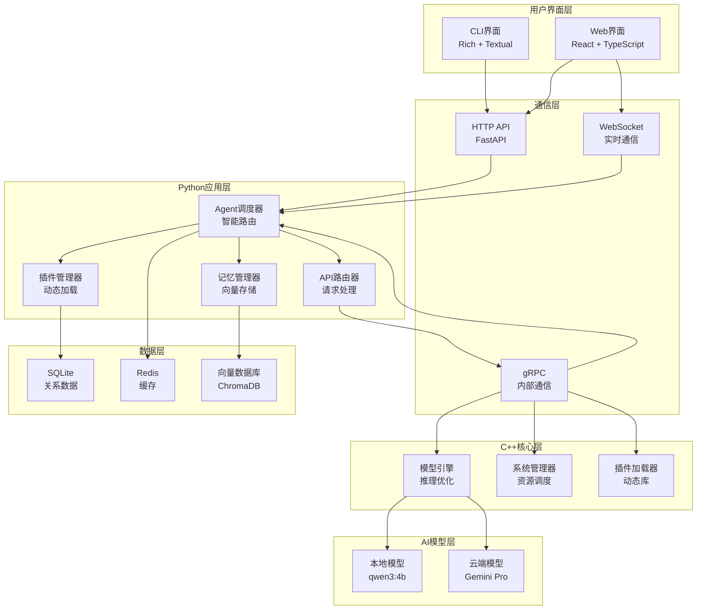
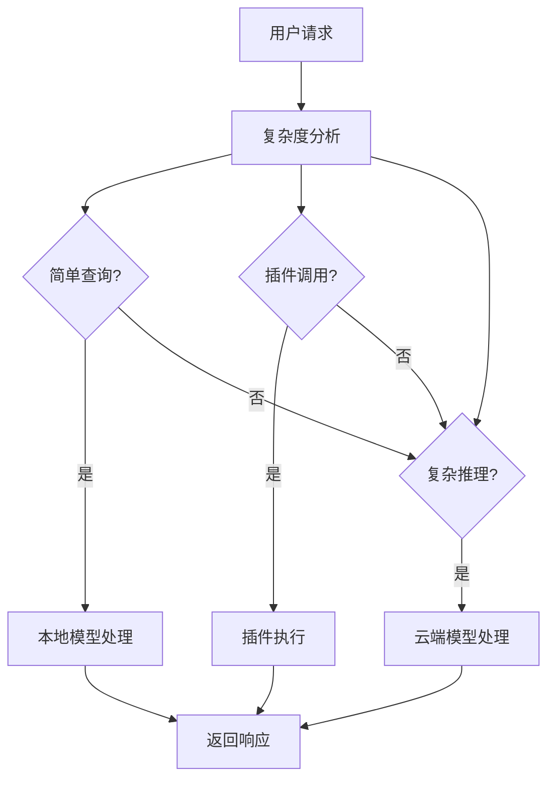
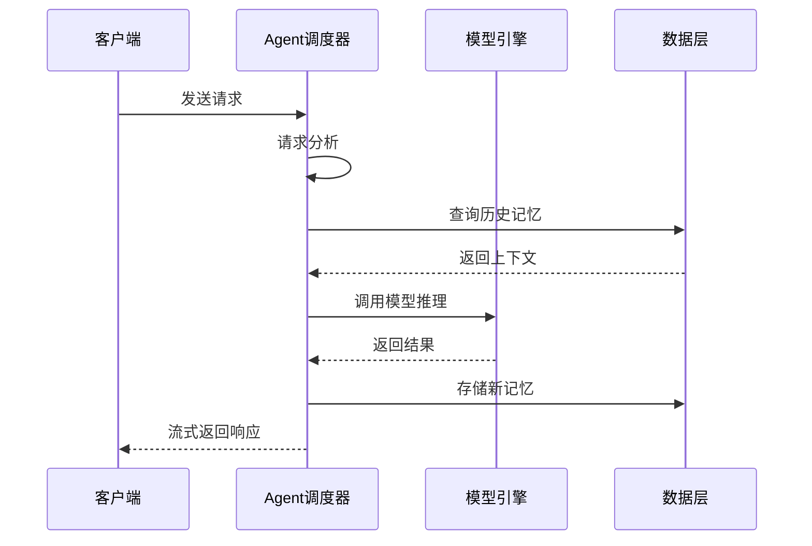
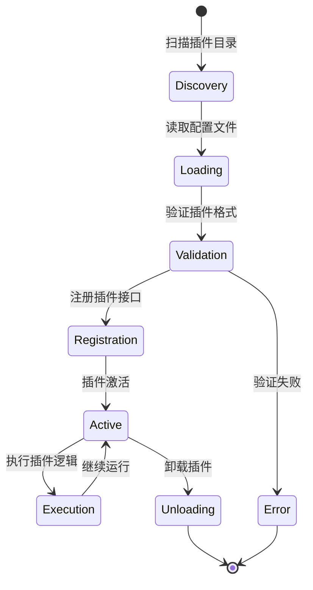
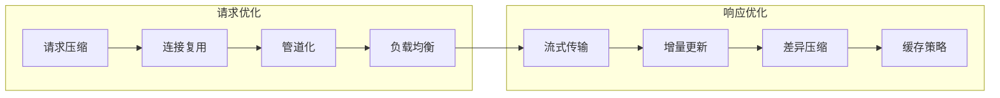
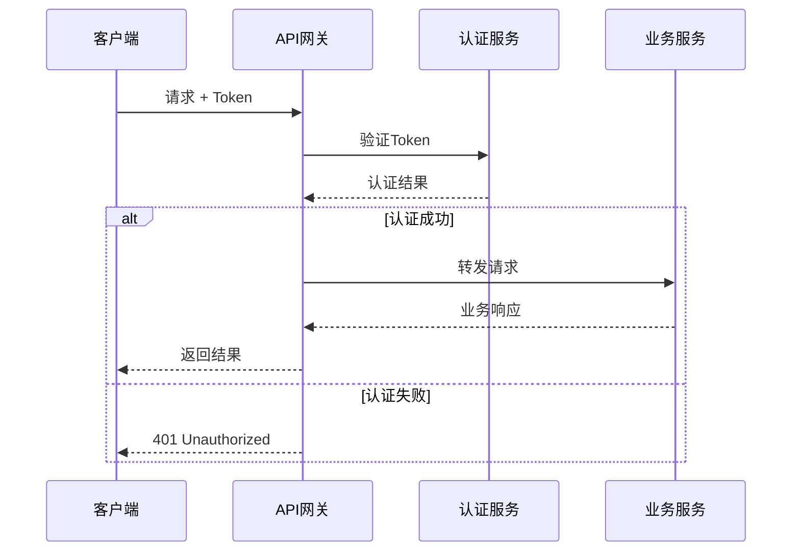
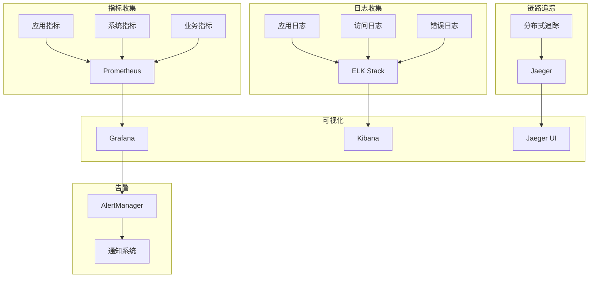
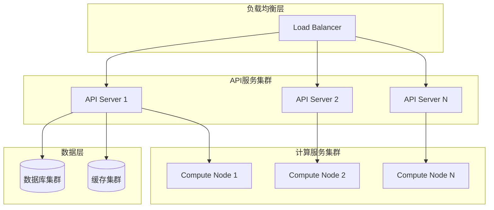

# AI Assistant 架构设计文档

## 概述

AI Assistant采用现代化的分层架构设计，结合C++的高性能计算能力和Python的快速开发优势，构建了一个可扩展、高可用的智能助手系统。

## 系统架构

### 总体架构图



## 核心组件设计

### 1. Agent调度器 (Orchestrator)

Agent调度器是系统的智能大脑，负责请求路由和资源调度。

```python
class AgentOrchestrator:
    def __init__(self):
        self.routing_strategy = IntelligentRouting()
        self.resource_manager = ResourceManager()
        self.plugin_manager = PluginManager()
    
    async def process_request(self, request: ChatRequest) -> Response:
        # 1. 分析请求复杂度
        complexity = await self.analyze_complexity(request)
        
        # 2. 选择处理策略
        strategy = self.routing_strategy.decide(complexity)
        
        # 3. 分配资源
        resources = await self.resource_manager.allocate(strategy)
        
        # 4. 执行处理
        return await self.execute(request, strategy, resources)
```

#### 智能路由策略



### 2. 通信架构

系统采用多层通信机制确保高效可靠的数据传输。

#### HTTP API层
- **技术栈**: FastAPI + Uvicorn
- **功能**: RESTful API, 自动文档生成
- **特性**: 异步处理, 数据验证, 错误处理

#### WebSocket层
- **技术栈**: FastAPI WebSocket
- **功能**: 实时双向通信
- **应用**: 流式响应, 实时状态更新

#### gRPC层
- **技术栈**: gRPC + Protocol Buffers
- **功能**: 高性能内部通信
- **优势**: 类型安全, 跨语言支持

### 3. 数据架构

#### 数据流设计



#### 存储策略

| 数据类型 | 存储方案 | 技术选型 | 用途 |
|---------|---------|---------|------|
| 结构化数据 | 关系数据库 | SQLite | 用户信息, 会话管理 |
| 缓存数据 | 内存数据库 | Redis | 热点数据, 会话状态 |
| 向量数据 | 向量数据库 | ChromaDB | 语义搜索, 记忆检索 |
| 配置数据 | 文件系统 | JSON/YAML | 系统配置, 插件配置 |

## 插件架构

### 插件生命周期



### 插件接口设计

```python
class PluginBase:
    def __init__(self, config: PluginConfig):
        self.config = config
        self.logger = self.setup_logger()
    
    async def initialize(self) -> bool:
        """插件初始化"""
        pass
    
    async def execute(self, context: ExecutionContext) -> PluginResult:
        """执行插件逻辑"""
        pass
    
    async def cleanup(self) -> None:
        """清理资源"""
        pass
    
    def get_metadata(self) -> PluginMetadata:
        """获取插件元数据"""
        pass
```

## 性能优化策略

### 1. 计算性能优化

#### C++核心优化
- **SIMD指令**: 向量化计算加速
- **内存池**: 减少内存分配开销
- **异步I/O**: 非阻塞操作
- **缓存友好**: 优化数据访问模式

#### Python层优化
- **异步编程**: asyncio协程
- **连接池**: 数据库连接复用
- **缓存策略**: 多层缓存机制
- **批处理**: 请求批量处理

### 2. 网络性能优化



### 3. 内存管理

#### 内存分配策略
- **对象池**: 预分配常用对象
- **引用计数**: 智能内存管理
- **垃圾回收**: 定期清理无用对象
- **内存映射**: 大文件处理优化

## 安全架构

### 1. 认证授权



### 2. 数据安全

#### 加密策略
- **传输加密**: TLS 1.3
- **存储加密**: AES-256
- **密钥管理**: 分层密钥体系
- **数据脱敏**: 敏感信息处理

#### 访问控制
- **最小权限**: 基于角色的访问控制
- **资源隔离**: 多租户数据隔离
- **审计日志**: 完整的操作记录

## 可观测性设计

### 1. 监控体系



### 2. 关键指标

#### 系统指标
- **CPU使用率**: 计算资源监控
- **内存使用率**: 内存资源监控
- **磁盘I/O**: 存储性能监控
- **网络吞吐**: 网络性能监控

#### 业务指标
- **请求延迟**: 响应时间分布
- **成功率**: 请求成功比例
- **并发量**: 同时处理请求数
- **错误率**: 异常请求比例

## 扩展性设计

### 1. 水平扩展



### 2. 微服务架构演进

随着业务发展，系统可以逐步演进为微服务架构：

#### 服务拆分策略
- **用户服务**: 用户管理和认证
- **对话服务**: 聊天会话处理
- **模型服务**: AI模型推理
- **插件服务**: 插件管理和执行
- **监控服务**: 系统监控和告警

## 技术选型理由

### 1. 编程语言选择

| 语言 | 使用场景 | 优势 | 考虑因素 |
|------|---------|------|---------|
| C++ | 核心计算引擎 | 高性能, 内存控制 | 开发复杂度 |
| Python | 业务逻辑层 | 开发效率, 生态丰富 | 执行性能 |
| TypeScript | Web前端 | 类型安全, 现代化 | 学习成本 |

### 2. 框架选择

#### 后端框架
- **FastAPI**: 高性能, 自动文档, 类型检查
- **gRPC**: 高效通信, 类型安全, 跨语言

#### 前端框架
- **React**: 组件化, 生态成熟, 开发效率
- **Ant Design**: 企业级UI, 组件丰富

#### 数据存储
- **SQLite**: 轻量级, 零配置, 事务支持
- **Redis**: 高性能缓存, 数据结构丰富
- **ChromaDB**: 向量搜索, AI友好

## 部署架构

### 1. 容器化部署

```dockerfile
# 多阶段构建示例
FROM ubuntu:22.04 AS builder
# 构建依赖和编译
...

FROM ubuntu:22.04 AS runtime  
# 运行时环境
COPY --from=builder /app/build /app/
...
```

### 2. 编排方案

#### Docker Compose (单机)
```yaml
version: '3.8'
services:
  ai-assistant:
    build: .
    ports:
      - "8000:8000"
    depends_on:
      - redis
      - prometheus
```

#### Kubernetes (集群)
```yaml
apiVersion: apps/v1
kind: Deployment
metadata:
  name: ai-assistant
spec:
  replicas: 3
  selector:
    matchLabels:
      app: ai-assistant
  template:
    spec:
      containers:
      - name: ai-assistant
        image: ai-assistant:latest
        ports:
        - containerPort: 8000
```

## 总结

AI Assistant的架构设计充分考虑了性能、可扩展性、安全性和可维护性等关键因素。通过分层架构、模块化设计和现代化技术栈的运用，构建了一个健壮、高效的智能助手系统。

随着业务的发展和需求的变化，架构将持续演进和优化，以适应更大规模的部署和更复杂的应用场景。