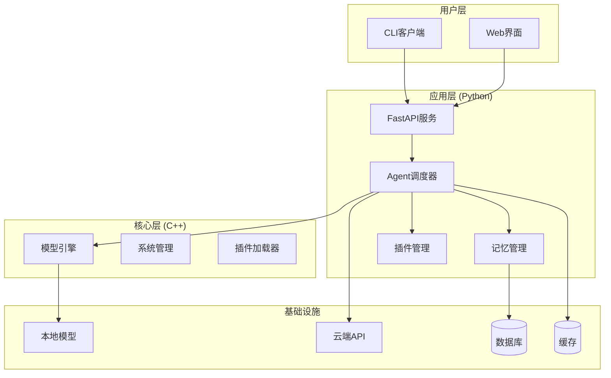
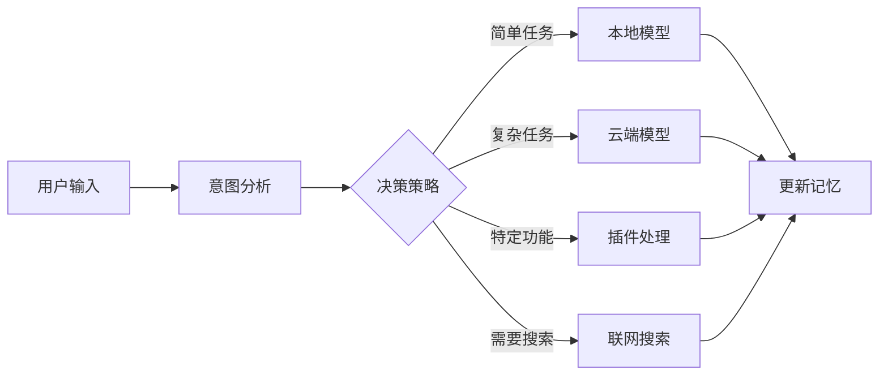

# AI Assistant 架构设计文档

## 项目概述

AI Assistant是一个基于C++和Python混合架构的智能助手系统，支持本地小模型推理、云端大模型调用、插件扩展和记忆功能，通过CLI命令行形式提供交互。

## 架构设计

### 整体架构



### 核心组件

#### 1. Agent调度器 (AgentOrchestrator)

**职责:**
- 用户意图分析
- 执行策略决策
- 任务编排和调度
- 性能监控和统计

**决策流程:**


#### 2. 模型引擎 (ModelEngine)

**支持的模型类型:**
- 本地小模型 (llama.cpp)
- 云端大模型 (OpenAI, Claude等)
- 自动选择模式

**特性:**
- 异步推理
- 流式响应
- 负载均衡
- 故障转移

#### 3. 插件系统

**插件类型:**
- Python插件 (基于SDK)
- C++插件 (动态库)

**插件能力:**
- 天气查询
- 文件操作
- 邮件管理
- 音乐播放
- 日历管理
- 更多...

#### 4. 记忆系统

**记忆类型:**
- 短期记忆 (会话级别)
- 长期记忆 (用户级别)
- 语义记忆 (知识图谱)

**存储方式:**
- 关系数据库 (SQLite/PostgreSQL)
- 向量数据库 (ChromaDB)
- Redis缓存

## 技术栈详解

### C++ 核心层

**依赖库:**
- llama.cpp - 本地模型推理
- gRPC - 跨语言通信
- Protobuf - 数据序列化
- CMake - 构建系统

**编译要求:**
- C++20标准
- CMake 3.20+
- GCC 9+ 或 Clang 10+

### Python 应用层

**核心框架:**
- FastAPI - 异步Web框架
- Pydantic - 数据验证
- AsyncIO - 异步编程

**AI相关:**
- Transformers - 模型加载
- Sentence-Transformers - 文本嵌入
- ChromaDB - 向量数据库

**数据存储:**
- SQLAlchemy - ORM
- Alembic - 数据库迁移
- Redis - 缓存和会话

## 性能优化

### 1. 异步处理
- 全异步架构设计
- 非阻塞I/O操作
- 并发请求处理

### 2. 缓存策略
- 多级缓存设计
- 智能缓存失效
- 预加载机制

### 3. 负载均衡
- 模型选择策略
- 资源使用监控
- 动态负载调整

### 4. 内存管理
- 智能垃圾回收
- 内存池技术
- 资源释放策略

## 扩展性设计

### 1. 插件系统
- 标准化插件接口
- 动态加载机制
- 权限管理系统
- 配置热更新

### 2. 模型扩展
- 多模型支持
- 模型热切换
- 自定义模型接入

### 3. 协议扩展
- gRPC服务接口
- RESTful API
- WebSocket支持
- 自定义协议

## 安全设计

### 1. 权限控制
- 基于角色的访问控制
- API密钥管理
- 插件权限隔离

### 2. 数据安全
- 敏感数据加密
- 通信加密 (TLS)
- 数据脱敏处理

### 3. 输入验证
- 参数类型检查
- SQL注入防护
- XSS攻击防护

## 监控和运维

### 1. 健康检查
- 组件状态监控
- 自动故障检测
- 服务自愈机制

### 2. 日志管理
- 结构化日志
- 日志级别控制
- 日志轮转和归档

### 3. 性能监控
- 响应时间统计
- 资源使用监控
- 错误率追踪

## 部署方案

### 1. 单机部署
- Docker容器化
- 一键安装脚本
- 配置文件管理

### 2. 分布式部署
- 微服务架构
- 负载均衡器
- 服务发现机制

### 3. 云原生部署
- Kubernetes支持
- 弹性伸缩
- 滚动更新

## 开发指南

### 1. 环境搭建
```bash
# 克隆项目
git clone <repository>
cd ai-assistant

# 安装依赖
./scripts/install_deps.sh

# 构建项目
./scripts/build.sh

# 启动服务
./scripts/run_server.sh
```

### 2. 插件开发
```python
from sdk.plugin_base import PluginBase

class MyPlugin(PluginBase):
    async def initialize(self, config):
        # 初始化逻辑
        return True
    
    async def execute(self, command, params):
        # 执行逻辑
        return {"success": True, "data": "result"}
```

### 3. API使用
```python
import aiohttp

async def chat_with_ai(message):
    async with aiohttp.ClientSession() as session:
        async with session.post(
            "http://localhost:8000/api/v1/chat",
            json={"message": message}
        ) as response:
            return await response.json()
```

## 未来规划

### 短期目标 (1-3个月)
- [ ] 完善核心功能
- [ ] 增加更多插件
- [ ] 优化性能
- [ ] 完善文档

### 中期目标 (3-6个月)
- [ ] 多模态支持
- [ ] 知识图谱集成
- [ ] 分布式部署
- [ ] 可视化界面

### 长期目标 (6-12个月)
- [ ] 自学习能力
- [ ] 推理链优化
- [ ] 企业级特性
- [ ] 生态系统建设