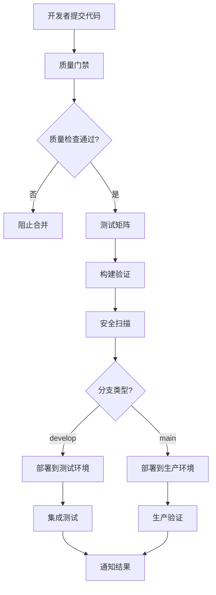
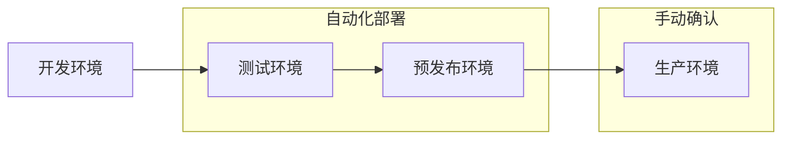

# NEX AI Assistant CI/CD 指南

## 概述

本文档描述了NEX AI Assistant项目的持续集成和持续部署(CI/CD)流程，包括工作流配置、部署策略和最佳实践。

## 目录

1. [CI/CD架构](#cicd架构)
2. [工作流说明](#工作流说明)
3. [分支策略](#分支策略)
4. [质量门禁](#质量门禁)
5. [测试策略](#测试策略)
6. [部署流程](#部署流程)
7. [监控与告警](#监控与告警)
8. [故障排除](#故障排除)
9. [最佳实践](#最佳实践)

## CI/CD架构

### 整体流程



### 工作流文件结构

```
.github/workflows/
├── quality-gate.yml      # 质量门禁
├── ci-cd.yml            # 主CI/CD流水线
├── testing.yml          # 综合测试工作流
├── release.yml          # 发布工作流
└── security.yml         # 安全扫描工作流
```

## 工作流说明

### 1. 质量门禁 (quality-gate.yml)

**触发条件**: Pull Request 和 Push 到主要分支

**功能**:
- 快速代码质量检查
- 依赖安全扫描
- 基础测试验证
- 构建验证
- 文档检查
- 变更影响分析

**执行时间**: 通常 2-5 分钟

```yaml
# 主要检查项
jobs:
  quick-checks:          # 代码格式、类型检查、安全扫描
  dependency-check:      # 依赖漏洞扫描
  quick-test:           # 快速测试套件
  build-check:          # 构建验证
  docs-check:           # 文档完整性检查
  change-analysis:      # 变更影响分析
  quality-gate-result:  # 汇总结果
```

### 2. CI/CD主流水线 (ci-cd.yml)

**触发条件**: Push 到主要分支, 手动触发

**功能**:
- 全面测试矩阵
- 多平台构建
- 容器化构建
- 自动部署
- 性能测试

**执行时间**: 通常 15-30 分钟

```yaml
# 主要阶段
jobs:
  quality-gate:         # 质量门禁
  test-matrix:          # 测试矩阵 (多OS/Python版本)
  build-test:           # 构建测试
  performance-test:     # 性能测试
  container-build:      # 容器构建
  deploy-staging:       # 测试环境部署
  deploy-production:    # 生产环境部署
  notify:              # 结果通知
```

### 3. 综合测试工作流 (testing.yml)

**触发条件**: 定时执行 (每日), 手动触发

**功能**:
- 全面测试覆盖
- 压力测试
- 兼容性测试
- 安全测试
- 性能基准测试

### 4. 发布工作流 (release.yml)

**触发条件**: 版本标签推送, Release创建

**功能**:
- 完整构建验证
- 多架构容器构建
- 生产部署
- 版本文档生成
- 发布通知

## 分支策略

### Git Flow变体

```
main           ←── 生产分支
├── develop    ←── 开发分支
├── feature/*  ←── 功能分支
├── bugfix/*   ←── 错误修复分支
├── hotfix/*   ←── 热修复分支
└── release/*  ←── 发布分支
```

### 分支保护规则

#### main分支
- 要求Pull Request
- 要求状态检查通过
- 要求分支最新
- 要求管理员审查
- 限制推送权限

#### develop分支
- 要求Pull Request
- 要求状态检查通过
- 要求代码审查

#### 工作流触发规则

| 分支类型 | 质量门禁 | 完整CI/CD | 部署目标 |
|---------|---------|----------|----------|
| feature/* | ✅ | ❌ | 无 |
| develop | ✅ | ✅ | 测试环境 |
| main | ✅ | ✅ | 生产环境 |
| release/* | ✅ | ✅ | 预发布环境 |
| hotfix/* | ✅ | ✅ | 紧急修复流程 |

## 质量门禁

### 检查项目

1. **代码质量**
   ```bash
   # 格式检查
   black --check --diff .
   isort --check-only --diff .
   flake8 . --max-line-length=120
   
   # 类型检查
   mypy core/ services/ interfaces/ python/
   ```

2. **安全检查**
   ```bash
   # 代码安全扫描
   bandit -r core/ services/ interfaces/ python/
   
   # 依赖漏洞扫描
   safety check
   pip-audit
   ```

3. **测试验证**
   ```bash
   # 快速测试
   pytest tests/test_basic.py
   pytest tests/unit/ -m "not slow and not network" --maxfail=10
   ```

4. **构建验证**
   ```bash
   # 包构建测试
   python -m build --wheel
   pip install dist/*.whl
   ```

### 质量标准

| 检查项 | 要求 | 权重 |
|-------|------|------|
| 代码格式 | 必须通过 | 阻断 |
| 类型检查 | 警告允许 | 非阻断 |
| 安全扫描 | 高危必须修复 | 阻断 |
| 快速测试 | 80%通过率 | 阻断 |
| 构建验证 | 必须通过 | 阻断 |
| 文档检查 | 必须通过 | 阻断 |

### 门禁评分

- 5分: 所有检查通过 ✅
- 4分: 允许非关键警告 ⚠️
- 3分: 最低通过标准 🟡
- <3分: 不允许合并 ❌

## 测试策略

### 测试金字塔

```
      E2E (5%)
     ↗        ↖
Integration (20%)  Security (5%)
    ↗       ↖         ↗
Unit Tests (60%)   Performance (10%)
```

### 测试触发策略

| 测试类型 | 触发条件 | 执行环境 | 超时时间 |
|---------|---------|----------|---------|
| 单元测试 | 每次提交 | 多平台矩阵 | 5分钟 |
| 集成测试 | PR + 主分支 | Ubuntu Latest | 10分钟 |
| E2E测试 | 主分支 + 发布 | Ubuntu Latest | 15分钟 |
| 性能测试 | 主分支 + 定时 | 专用环境 | 30分钟 |
| 安全测试 | 每次提交 | Ubuntu Latest | 5分钟 |

### 测试环境管理

```yaml
# 测试环境配置
test_environments:
  unit:
    dependencies: minimal
    database: sqlite_memory
    redis: mock
    external_services: mock
    
  integration:
    dependencies: full
    database: postgresql_test
    redis: redis_test
    external_services: testcontainers
    
  e2e:
    dependencies: full
    database: postgresql_e2e
    redis: redis_e2e
    external_services: real_or_mock
```

### 测试数据管理

1. **数据隔离**
   - 每个测试使用独立数据
   - 自动清理测试数据
   - 避免测试间干扰

2. **数据工厂**
   ```python
   # 使用数据工厂模式
   test_data = TestDataFactory.create_chat_request(
       message="test message",
       session_id=generate_test_session_id()
   )
   ```

3. **环境变量**
   ```bash
   # 测试环境变量
   ENVIRONMENT=test
   LOG_LEVEL=DEBUG
   DATABASE_URL=sqlite:///:memory:
   REDIS_URL=redis://localhost:6379/15
   DISABLE_TELEMETRY=true
   ```

## 部署流程

### 部署环境



### 部署策略

#### 1. 滚动部署 (生产环境)

```yaml
deployment:
  strategy:
    type: RollingUpdate
    rollingUpdate:
      maxUnavailable: 1
      maxSurge: 1
  
  steps:
    - name: Pre-deployment checks
    - name: Deploy to 25% instances
    - name: Health check
    - name: Deploy to 50% instances
    - name: Health check
    - name: Deploy to 100% instances
    - name: Post-deployment validation
```

#### 2. 蓝绿部署 (重大发布)

```yaml
blue_green_deployment:
  blue_environment:    # 当前生产环境
    instances: current_production
    status: active
    
  green_environment:   # 新版本环境
    instances: new_version
    status: staging
    
  switch_strategy:
    validation_required: true
    rollback_timeout: 300s
```

#### 3. 金丝雀部署 (实验性功能)

```yaml
canary_deployment:
  traffic_split:
    stable: 90%        # 稳定版本流量
    canary: 10%        # 金丝雀版本流量
    
  success_criteria:
    error_rate: < 1%
    response_time: < 500ms
    duration: 30m
    
  auto_promote: true   # 自动推广成功的版本
  auto_rollback: true  # 自动回滚失败的版本
```

### 部署检查清单

#### 部署前检查

- [ ] 所有测试通过
- [ ] 代码审查完成
- [ ] 安全扫描通过
- [ ] 性能测试达标
- [ ] 数据库迁移就绪
- [ ] 配置文件更新
- [ ] 依赖版本兼容
- [ ] 回滚计划准备

#### 部署后验证

- [ ] 健康检查通过
- [ ] 关键功能验证
- [ ] 性能指标正常
- [ ] 错误率在阈值内
- [ ] 日志无异常
- [ ] 监控告警正常
- [ ] 用户反馈收集

### 环境配置

#### 测试环境

```yaml
# configs/environments/staging.yaml
app:
  name: "nex-ai-staging"
  debug: true
  
database:
  url: "postgresql://staging_db"
  pool_size: 5
  
redis:
  url: "redis://staging-redis:6379"
  
models:
  local:
    provider: "ollama"
    model_name: "qwen:4b"
  cloud:
    provider: "openai"
    api_key: "${OPENAI_API_KEY_STAGING}"
```

#### 生产环境

```yaml
# configs/environments/production.yaml
app:
  name: "nex-ai-production"
  debug: false
  
database:
  url: "postgresql://prod_db"
  pool_size: 20
  ssl_required: true
  
redis:
  url: "redis://prod-redis:6379"
  sentinel_enabled: true
  
models:
  local:
    provider: "vllm"
    model_name: "qwen:7b"
  cloud:
    provider: "openai"
    api_key: "${OPENAI_API_KEY_PROD}"
```

## 监控与告警

### 监控指标

#### 应用指标

- 请求响应时间 (P50, P95, P99)
- 请求成功率
- API调用次数
- 错误率和错误类型
- 活跃用户数
- 会话数量

#### 系统指标

- CPU使用率
- 内存使用率
- 磁盘I/O
- 网络流量
- 数据库连接数
- 缓存命中率

#### 业务指标

- AI推理次数
- 插件调用次数
- 用户满意度
- 功能使用统计

### 告警规则

```yaml
# prometheus/alert_rules.yml
alerts:
  - name: HighErrorRate
    condition: error_rate > 5%
    duration: 5m
    severity: critical
    
  - name: SlowResponse
    condition: response_time_p95 > 2s
    duration: 10m
    severity: warning
    
  - name: HighMemoryUsage
    condition: memory_usage > 85%
    duration: 15m
    severity: warning
    
  - name: DatabaseConnectionLow
    condition: db_connections_available < 5
    duration: 5m
    severity: critical
```

### 告警通道

1. **即时通知**
   - Slack集成
   - 邮件通知
   - 短信告警 (关键告警)

2. **值班管理**
   - PagerDuty集成
   - 值班排班
   - 升级策略

3. **状态页面**
   - 公开状态页面
   - 服务可用性展示
   - 历史事件记录

## 故障排除

### 常见CI/CD问题

#### 1. 测试失败

**问题**: 测试在CI环境中失败，但本地正常

**排查步骤**:
```bash
# 1. 检查环境差异
echo "Python version: $(python --version)"
echo "Pip packages: $(pip list)"
echo "Environment variables: $(env | grep TEST)"

# 2. 重现CI环境
docker run -it python:3.11 /bin/bash
pip install -r requirements-dev.txt
pytest tests/ -v

# 3. 检查并发问题
pytest tests/ -n 1  # 单进程运行
pytest tests/ -x    # 第一个失败时停止
```

**解决方案**:
- 检查测试数据竞争
- 验证环境变量配置
- 增加测试稳定性
- 添加重试机制

#### 2. 构建超时

**问题**: 构建或测试超时

**排查步骤**:
```bash
# 检查最耗时的操作
pytest --durations=10
time make test-unit

# 优化构建缓存
# 使用GitHub Actions cache
# 优化Docker层缓存
```

**解决方案**:
- 使用缓存加速构建
- 并行执行独立任务
- 拆分大型测试
- 优化依赖安装

#### 3. 部署失败

**问题**: 部署过程中出现错误

**排查步骤**:
```bash
# 检查部署日志
kubectl logs deployment/nex-ai-production
kubectl describe deployment nex-ai-production

# 检查健康检查
curl http://service-endpoint/health

# 检查配置
kubectl get configmap app-config -o yaml
```

**解决方案**:
- 验证配置正确性
- 检查资源限制
- 确认依赖服务可用
- 实施渐进式部署

### 调试工具

#### 1. 本地调试

```bash
# 重现CI环境
act -j quality-gate

# 本地运行工作流
gh workflow run ci-cd.yml

# 调试特定步骤
make ci-test
make pre-commit
```

#### 2. 远程调试

```bash
# SSH到CI机器 (如果支持)
gh workflow debug

# 添加调试输出
echo "Debug: variable value = $VAR"
env | sort
```

#### 3. 日志分析

```bash
# 下载工作流日志
gh run download $RUN_ID

# 分析失败原因
grep -n "FAILED\|ERROR" workflow.log
```

## 最佳实践

### 1. CI/CD性能优化

#### 缓存策略

```yaml
# 有效的缓存配置
- name: Cache dependencies
  uses: actions/cache@v3
  with:
    path: |
      ~/.cache/pip
      .venv
    key: ${{ runner.os }}-py${{ matrix.python-version }}-${{ hashFiles('requirements*.txt') }}
    restore-keys: |
      ${{ runner.os }}-py${{ matrix.python-version }}-
```

#### 并行执行

```yaml
# 合理的并行策略
strategy:
  matrix:
    include:
      - os: ubuntu-latest
        python: '3.11'
        test-type: 'unit+integration'
      - os: ubuntu-latest
        python: '3.10'
        test-type: 'unit'
      - os: macos-latest
        python: '3.11'
        test-type: 'unit'
```

### 2. 安全最佳实践

#### 密钥管理

```yaml
# 使用GitHub Secrets
env:
  DATABASE_URL: ${{ secrets.DATABASE_URL }}
  API_KEY: ${{ secrets.API_KEY }}

# 避免在日志中暴露密钥
- name: Deploy
  run: |
    echo "Deploying with masked credentials"
    # 不要 echo $SECRET_VALUE
```

#### 权限控制

```yaml
# 最小权限原则
permissions:
  contents: read
  packages: write
  security-events: write
```

### 3. 测试优化

#### 测试分层

```python
# 快速失败策略
@pytest.mark.smoke
def test_basic_functionality():
    """冒烟测试 - 最快失败"""
    pass

@pytest.mark.unit
def test_unit_logic():
    """单元测试 - 快速反馈"""
    pass

@pytest.mark.integration  
def test_integration():
    """集成测试 - 中等耗时"""
    pass

@pytest.mark.e2e
def test_end_to_end():
    """端到端测试 - 较慢但全面"""
    pass
```

#### 测试数据管理

```python
# 测试数据隔离
@pytest.fixture(scope="function")
def isolated_database():
    """每个测试使用独立数据库"""
    db = create_test_database()
    yield db
    cleanup_database(db)

# 并发安全
@pytest.fixture(scope="session")
def session_config():
    """会话级别的配置，避免竞争"""
    return {
        "test_id": uuid.uuid4(),
        "base_port": get_free_port()
    }
```

### 4. 部署最佳实践

#### 健康检查

```python
# 完善的健康检查
@app.get("/health")
async def health_check():
    checks = {
        "database": await check_database(),
        "redis": await check_redis(),
        "external_api": await check_external_apis(),
        "disk_space": check_disk_space(),
        "memory": check_memory_usage()
    }
    
    all_healthy = all(checks.values())
    status_code = 200 if all_healthy else 503
    
    return {"status": "healthy" if all_healthy else "unhealthy", "checks": checks}
```

#### 渐进式部署

```yaml
# Kubernetes渐进式部署
apiVersion: argoproj.io/v1alpha1
kind: Rollout
spec:
  strategy:
    canary:
      steps:
      - setWeight: 10    # 10%流量
      - pause: {duration: 30s}
      - setWeight: 50    # 50%流量  
      - pause: {duration: 60s}
      - setWeight: 100   # 100%流量
      
      analysis:
        successCondition: result[0] >= 0.95
        failureCondition: result[0] < 0.90
```

### 5. 监控集成

#### 指标收集

```python
# 应用指标收集
from prometheus_client import Counter, Histogram, Gauge

request_count = Counter('http_requests_total', 'Total HTTP requests', ['method', 'endpoint'])
request_duration = Histogram('http_request_duration_seconds', 'HTTP request duration')
active_connections = Gauge('active_connections', 'Active connections')

@app.middleware("http")
async def metrics