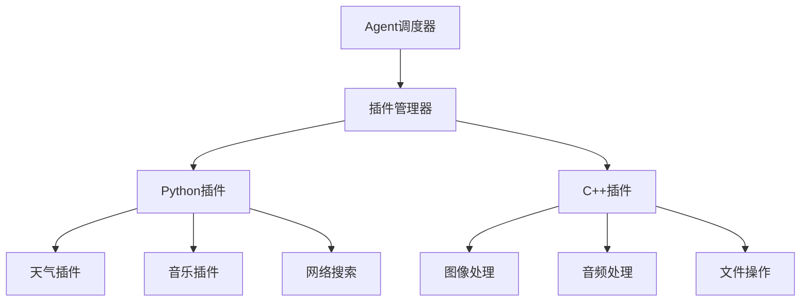

# 插件开发指南

## 概述

AI Assistant 支持 Python 和 C++ 双语言插件开发，提供灵活的扩展机制。插件可以扩展AI助手的功能，如天气查询、音乐播放、文件操作等。

## 插件架构



## Python 插件开发

### 1. 基础插件结构

```
plugins/my_plugin/
├── plugin.json          # 插件元信息
├── main.py             # 插件主文件
├── requirements.txt    # 依赖列表
└── README.md          # 插件说明
```

### 2. 插件元信息 (plugin.json)

```json
{
  "name": "weather_plugin",
  "version": "1.0.0",
  "description": "天气查询插件",
  "author": "AI Assistant Team",
  "license": "MIT",
  "homepage": "https://github.com/ai-assistant/weather-plugin",
  "language": "python",
  "entry_point": "main.py",
  "capabilities": [
    "weather_query",
    "weather_forecast",
    "air_quality"
  ],
  "dependencies": [
    "requests>=2.25.0",
    "python-dateutil>=2.8.0"
  ],
  "configuration": {
    "api_key": {
      "type": "string",
      "required": true,
      "description": "天气API密钥"
    },
    "default_city": {
      "type": "string",
      "required": false,
      "default": "北京",
      "description": "默认城市"
    }
  },
  "commands": [
    {
      "name": "get_weather",
      "description": "获取指定城市的当前天气",
      "parameters": {
        "city": {"type": "string", "required": true},
        "unit": {"type": "string", "default": "metric"}
      }
    },
    {
      "name": "get_forecast",
      "description": "获取天气预报",
      "parameters": {
        "city": {"type": "string", "required": true},
        "days": {"type": "integer", "default": 3, "min": 1, "max": 7}
      }
    }
  ]
}
```

### 3. 插件主文件 (main.py)

```python
from sdk.plugin_base import PluginBase
from typing import Dict, Any
import requests
import json

class WeatherPlugin(PluginBase):
    """天气查询插件"""
    
    def __init__(self, config: Dict[str, Any]):
        super().__init__(config)
        self.api_key = config.get('api_key')
        self.default_city = config.get('default_city', '北京')
        self.base_url = "http://api.openweathermap.org/data/2.5"
    
    def get_capabilities(self) -> list:
        """返回插件能力列表"""
        return ['weather_query', 'weather_forecast', 'air_quality']
    
    def execute(self, command: str, parameters: Dict[str, Any]) -> Dict[str, Any]:
        """执行插件命令"""
        try:
            if command == "get_weather":
                return self._get_current_weather(parameters)
            elif command == "get_forecast":
                return self._get_forecast(parameters)
            else:
                return {
                    "success": False,
                    "error": f"未知命令: {command}"
                }
        except Exception as e:
            return {
                "success": False,
                "error": str(e)
            }
    
    def _get_current_weather(self, params: Dict[str, Any]) -> Dict[str, Any]:
        """获取当前天气"""
        city = params.get('city', self.default_city)
        unit = params.get('unit', 'metric')
        
        url = f"{self.base_url}/weather"
        response = requests.get(url, params={
            'q': city,
            'appid': self.api_key,
            'units': unit,
            'lang': 'zh_cn'
        })
        
        if response.status_code == 200:
            data = response.json()
            return {
                "success": True,
                "result": {
                    "city": data['name'],
                    "temperature": data['main']['temp'],
                    "description": data['weather'][0]['description'],
                    "humidity": data['main']['humidity'],
                    "wind_speed": data['wind']['speed']
                }
            }
        else:
            return {
                "success": False,
                "error": f"API调用失败: {response.status_code}"
            }
    
    def _get_forecast(self, params: Dict[str, Any]) -> Dict[str, Any]:
        """获取天气预报"""
        city = params.get('city', self.default_city)
        days = min(params.get('days', 3), 7)
        
        url = f"{self.base_url}/forecast"
        response = requests.get(url, params={
            'q': city,
            'appid': self.api_key,
            'cnt': days * 8,  # 每天8个时段
            'units': 'metric',
            'lang': 'zh_cn'
        })
        
        if response.status_code == 200:
            data = response.json()
            forecasts = []
            
            for item in data['list'][::8]:  # 每天一个预报
                forecasts.append({
                    "date": item['dt_txt'][:10],
                    "temperature": item['main']['temp'],
                    "description": item['weather'][0]['description'],
                    "humidity": item['main']['humidity']
                })
            
            return {
                "success": True,
                "result": {
                    "city": data['city']['name'],
                    "forecasts": forecasts
                }
            }
        else:
            return {
                "success": False,
                "error": f"API调用失败: {response.status_code}"
            }
    
    def validate_config(self, config: Dict[str, Any]) -> bool:
        """验证配置"""
        return 'api_key' in config and bool(config['api_key'])

# 插件入口函数
def create_plugin(config: Dict[str, Any]) -> WeatherPlugin:
    """创建插件实例"""
    return WeatherPlugin(config)
```

### 4. 插件基类 (sdk/plugin_base.py)

```python
from abc import ABC, abstractmethod
from typing import Dict, Any, List
import logging

class PluginBase(ABC):
    """插件基类"""
    
    def __init__(self, config: Dict[str, Any]):
        self.config = config
        self.logger = logging.getLogger(f"plugin.{self.__class__.__name__}")
    
    @abstractmethod
    def get_capabilities(self) -> List[str]:
        """返回插件能力列表"""
        pass
    
    @abstractmethod
    def execute(self, command: str, parameters: Dict[str, Any]) -> Dict[str, Any]:
        """执行插件命令"""
        pass
    
    def validate_config(self, config: Dict[str, Any]) -> bool:
        """验证插件配置"""
        return True
    
    def initialize(self) -> bool:
        """插件初始化"""
        return True
    
    def cleanup(self):
        """插件清理"""
        pass
    
    def get_info(self) -> Dict[str, Any]:
        """获取插件信息"""
        return {
            "name": self.__class__.__name__,
            "capabilities": self.get_capabilities(),
            "config": self.config
        }
```

## C++ 插件开发

### 1. 插件接口定义

```cpp
// plugin_interface.hpp
#pragma once
#include <string>
#include <map>
#include <vector>
#include <memory>

namespace ai_assistant {
namespace plugins {

class PluginInterface {
public:
    virtual ~PluginInterface() = default;
    
    // 获取插件信息
    virtual std::string getName() const = 0;
    virtual std::string getVersion() const = 0;
    virtual std::string getDescription() const = 0;
    virtual std::vector<std::string> getCapabilities() const = 0;
    
    // 插件生命周期
    virtual bool initialize(const std::map<std::string, std::string>& config) = 0;
    virtual void cleanup() = 0;
    
    // 执行命令
    virtual std::string execute(
        const std::string& command,
        const std::map<std::string, std::string>& parameters
    ) = 0;
    
    // 验证配置
    virtual bool validateConfig(const std::map<std::string, std::string>& config) = 0;
};

// 插件创建函数类型
typedef std::unique_ptr<PluginInterface> (*CreatePluginFunc)();

} // namespace plugins
} // namespace ai_assistant

// 插件导出宏
#define EXPORT_PLUGIN(ClassName) \
    extern "C" { \
        std::unique_ptr<ai_assistant::plugins::PluginInterface> createPlugin() { \
            return std::make_unique<ClassName>(); \
        } \
    }
```

### 2. 示例插件实现

```cpp
// image_processor_plugin.cpp
#include "plugin_interface.hpp"
#include <opencv2/opencv.hpp>
#include <json/json.h>

class ImageProcessorPlugin : public ai_assistant::plugins::PluginInterface {
private:
    std::string config_path_;
    bool initialized_;
    
public:
    ImageProcessorPlugin() : initialized_(false) {}
    
    std::string getName() const override {
        return "ImageProcessor";
    }
    
    std::string getVersion() const override {
        return "1.0.0";
    }
    
    std::string getDescription() const override {
        return "图像处理插件，支持格式转换、缩放、滤镜等功能";
    }
    
    std::vector<std::string> getCapabilities() const override {
        return {"resize", "convert", "filter", "detect"};
    }
    
    bool initialize(const std::map<std::string, std::string>& config) override {
        try {
            auto it = config.find("config_path");
            if (it != config.end()) {
                config_path_ = it->second;
            }
            
            // 初始化OpenCV
            initialized_ = true;
            return true;
        } catch (const std::exception& e) {
            return false;
        }
    }
    
    void cleanup() override {
        initialized_ = false;
    }
    
    std::string execute(
        const std::string& command,
        const std::map<std::string, std::string>& parameters
    ) override {
        Json::Value result;
        
        try {
            if (!initialized_) {
                result["success"] = false;
                result["error"] = "插件未初始化";
                return jsonToString(result);
            }
            
            if (command == "resize") {
                return executeResize(parameters);
            } else if (command == "convert") {
                return executeConvert(parameters);
            } else if (command == "filter") {
                return executeFilter(parameters);
            } else {
                result["success"] = false;
                result["error"] = "未知命令: " + command;
            }
        } catch (const std::exception& e) {
            result["success"] = false;
            result["error"] = e.what();
        }
        
        return jsonToString(result);
    }
    
    bool validateConfig(const std::map<std::string, std::string>& config) override {
        // 验证必要的配置项
        return true;
    }

private:
    std::string executeResize(const std::map<std::string, std::string>& params) {
        Json::Value result;
        
        auto input_it = params.find("input_path");
        auto output_it = params.find("output_path");
        auto width_it = params.find("width");
        auto height_it = params.find("height");
        
        if (input_it == params.end() || output_it == params.end() ||
            width_it == params.end() || height_it == params.end()) {
            result["success"] = false;
            result["error"] = "缺少必要参数";
            return jsonToString(result);
        }
        
        try {
            cv::Mat image = cv::imread(input_it->second);
            if (image.empty()) {
                result["success"] = false;
                result["error"] = "无法读取图像文件";
                return jsonToString(result);
            }
            
            int width = std::stoi(width_it->second);
            int height = std::stoi(height_it->second);
            
            cv::Mat resized;
            cv::resize(image, resized, cv::Size(width, height));
            
            bool saved = cv::imwrite(output_it->second, resized);
            if (saved) {
                result["success"] = true;
                result["result"]["output_path"] = output_it->second;
                result["result"]["new_width"] = width;
                result["result"]["new_height"] = height;
            } else {
                result["success"] = false;
                result["error"] = "保存图像失败";
            }
        } catch (const std::exception& e) {
            result["success"] = false;
            result["error"] = e.what();
        }
        
        return jsonToString(result);
    }
    
    std::string executeConvert(const std::map<std::string, std::string>& params) {
        // 实现格式转换逻辑
        Json::Value result;
        result["success"] = true;
        result["message"] = "格式转换功能待实现";
        return jsonToString(result);
    }
    
    std::string executeFilter(const std::map<std::string, std::string>& params) {
        // 实现滤镜效果逻辑
        Json::Value result;
        result["success"] = true;
        result["message"] = "滤镜功能待实现";
        return jsonToString(result);
    }
    
    std::string jsonToString(const Json::Value& json) {
        Json::StreamWriterBuilder builder;
        return Json::writeString(builder, json);
    }
};

// 导出插件
EXPORT_PLUGIN(ImageProcessorPlugin)
```

### 3. CMakeLists.txt

```cmake
cmake_minimum_required(VERSION 3.15)
project(ImageProcessorPlugin)

set(CMAKE_CXX_STANDARD 17)

# 查找依赖
find_package(OpenCV REQUIRED)
find_package(PkgConfig REQUIRED)
pkg_check_modules(JSONCPP jsoncpp)

# 创建共享库
add_library(image_processor_plugin SHARED
    image_processor_plugin.cpp
)

# 链接库
target_link_libraries(image_processor_plugin
    ${OpenCV_LIBS}
    ${JSONCPP_LIBRARIES}
)

# 设置输出目录
set_target_properties(image_processor_plugin PROPERTIES
    LIBRARY_OUTPUT_DIRECTORY ${CMAKE_BINARY_DIR}/plugins
)
```

## 插件管理

### 1. 插件注册

插件开发完成后，需要在插件管理器中注册：

```python
# python/core/plugin_manager.py
class PluginManager:
    def register_plugin(self, plugin_path: str):
        """注册插件"""
        plugin_info = self._load_plugin_info(plugin_path)
        
        if plugin_info['language'] == 'python':
            self._register_python_plugin(plugin_path, plugin_info)
        elif plugin_info['language'] == 'cpp':
            self._register_cpp_plugin(plugin_path, plugin_info)
```

### 2. 插件配置

在 `.env` 文件中配置插件：

```env
# 插件配置
PLUGIN_DIR=./plugins
ENABLE_PLUGINS=weather,music,image_processor
WEATHER_API_KEY=your_weather_api_key
```

### 3. 插件使用

通过API调用插件：

```bash
curl -X POST http://localhost:8000/api/v1/plugins/weather/execute \
  -H "Content-Type: application/json" \
  -d '{
    "command": "get_weather",
    "parameters": {
      "city": "北京"
    }
  }'
```

## 最佳实践

### 1. 错误处理
- 始终返回包含 `success` 字段的结果
- 提供详细的错误信息
- 实现合理的重试机制

### 2. 配置管理
- 使用 `plugin.json` 声明所有配置项
- 实现配置验证逻辑
- 支持环境变量覆盖

### 3. 性能优化
- 避免在插件初始化时进行耗时操作
- 实现异步操作支持
- 合理使用缓存机制

### 4. 安全考虑
- 验证所有输入参数
- 限制文件系统访问权限
- 避免执行外部命令

### 5. 测试
- 为每个命令编写单元测试
- 测试错误处理路径
- 进行集成测试

## 插件示例

项目提供了以下示例插件：

1. **天气插件** (`plugins/weather/`) - 天气查询和预报
2. **音乐插件** (`plugins/music/`) - 音乐播放控制
3. **文件插件** (`plugins/file/`) - 文件操作管理
4. **搜索插件** (`plugins/search/`) - 网络搜索功能

## 故障排查

### 常见问题

1. **插件加载失败**
   - 检查 `plugin.json` 格式
   - 验证依赖是否安装
   - 查看插件日志

2. **命令执行失败**
   - 验证参数格式
   - 检查权限设置
   - 查看详细错误信息

3. **性能问题**
   - 检查是否有内存泄漏
   - 优化算法复杂度
   - 使用性能分析工具

更多详细信息请参考 [故障排查指南](troubleshooting.md)。